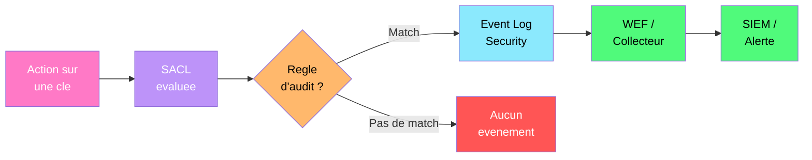
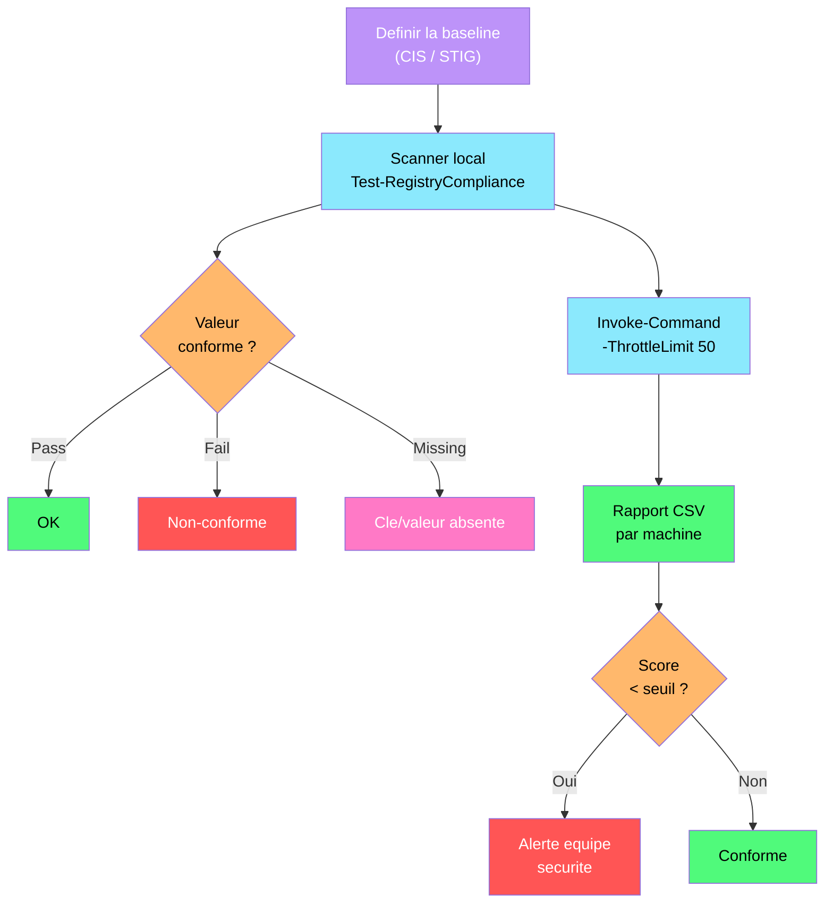

---
tags:
  - registre
  - audit
  - conformite
  - securite
  - sacl
  - cis-benchmark
---

# Audit et conformite du registre

!!! abstract "Ce que vous allez apprendre"
    - Configurer les SACL pour surveiller l'acces aux cles de registre sensibles
    - Analyser les evenements de securite lies au registre (Event IDs 4656, 4657, 4663)
    - Verifier la conformite aux referentiels CIS Benchmarks et STIG
    - Construire un scanner de conformite PowerShell automatise
    - Enqueter sur une modification non autorisee d'une cle de registre critique

---

## Configuration des SACL sur les cles de registre



Lundi matin, votre antivirus d'entreprise est desactive sur trois postes. Personne ne sait qui a modifie la cle `DisableAntiSpyware`. Pour que cela ne se reproduise pas, vous devez mettre en place un audit : une SACL (System Access Control List) sur les cles critiques.

### Qu'est-ce qu'une SACL ?

Une SACL est une liste de controle d'acces qui genere des evenements de securite quand quelqu'un accede a une ressource. C'est la camera de surveillance du registre : elle ne bloque rien, mais elle enregistre tout.

Deux prerequis sont necessaires pour que l'audit fonctionne :

| Prerequis | Configuration |
|-----------|---------------|
| Strategie d'audit | Activer "Audit Object Access" dans la GPO ou la strategie locale |
| SACL sur la cle | Definir les entrees d'audit sur la cle de registre cible |

### Activer la strategie d'audit

```powershell
# Enable Object Access auditing via local security policy
auditpol /set /subcategory:"Registry" /success:enable /failure:enable

# Verify the current audit configuration
auditpol /get /subcategory:"Registry"
```

```title="Resultat attendu"
System audit policy
Category/Subcategory                      Setting
Object Access
  Registry                                Success and Failure
```

!!! tip "Preferez la GPO pour activer l'audit"
    Utilisez `Computer Configuration > Policies > Windows Settings > Security Settings > Advanced Audit Policy Configuration > Object Access > Audit Registry` pour deployer l'audit via GPO sur tout le parc.

### Configurer une SACL via PowerShell

```powershell
# Set a SACL on a critical registry key to audit all modifications
$regKey = "HKLM:\SOFTWARE\Policies\Microsoft\Windows Defender"

# Get the current ACL
$acl = Get-Acl -Path $regKey

# Create an audit rule: audit SetValue and Delete for Everyone
$auditRule = New-Object System.Security.AccessControl.RegistryAuditRule(
    "Everyone",                                              # Identity
    "SetValue,Delete,WriteKey",                              # Registry rights to audit
    "ContainerInherit,ObjectInherit",                        # Inheritance flags
    "None",                                                  # Propagation flags
    "Success,Failure"                                        # Audit flags
)

# Add the audit rule to the ACL
$acl.AddAuditRule($auditRule)

# Apply the modified ACL
Set-Acl -Path $regKey -AclObject $acl

# Verify the SACL
(Get-Acl $regKey -Audit).Audit | Format-List
```

```title="Resultat attendu"
RegistryRights  : SetValue, Delete, WriteKey
AuditFlags      : Success, Failure
IdentityReference : Everyone
IsInherited     : False
InheritanceFlags : ContainerInherit, ObjectInherit
PropagationFlags : None
```

### Configurer une SACL via regedit (methode graphique)

Pour les administrateurs qui preferent l'interface graphique :

1. Ouvrir `regedit.exe` en tant qu'administrateur
2. Naviguer vers la cle cible (ex: `HKLM\SOFTWARE\Policies\Microsoft\Windows Defender`)
3. Clic droit > **Autorisations** > **Avancees** > onglet **Audit**
4. Cliquer **Ajouter** > **Selectionner un principal** > `Everyone`
5. Cocher les operations a auditer : **Definir la valeur**, **Supprimer**, **Ecrire la cle**
6. Type : **Succes** et **Echec**
7. Appliquer a : **Cette cle et les sous-cles**

### Deployer les SACL via GPO

Pour un deploiement a grande echelle, configurez les SACL directement dans la GPO :

`Computer Configuration > Policies > Windows Settings > Security Settings > Registry`

Ajoutez la cle a surveiller et definissez les entrees d'audit. La GPO appliquera automatiquement la SACL sur tous les postes cibles.

!!! warning "L'audit genere du volume"
    Auditer `Everyone` sur des cles tres sollicitees (comme `HKLM\SOFTWARE`) genere un volume d'evenements considerable. Ciblez uniquement les cles critiques et limitez les operations auditees aux ecritures et suppressions.

!!! info "En resume"
    - Une SACL genere des evenements de securite quand une cle de registre est accedee
    - Deux prerequis : strategie d'audit activee + SACL configuree sur la cle
    - Utilisez `Set-Acl` avec `RegistryAuditRule` pour configurer les SACL par script
    - Deployez les SACL via GPO pour couvrir tout le parc de maniere coherente

---

## Analyse des evenements de securite du registre

Vos SACL sont en place. Trois jours plus tard, la valeur `DisableAntiSpyware` est de nouveau modifiee sur un poste. Il est temps d'analyser les journaux pour identifier le coupable.

### Les Event IDs cles pour le registre

| Event ID | Nom | Description |
|:--------:|-----|-------------|
| 4656 | Handle Requested | Un processus a demande un handle sur une cle de registre |
| 4657 | Value Modified | Une valeur de registre a ete creee, modifiee ou supprimee |
| 4658 | Handle Closed | Le handle sur l'objet a ete ferme |
| 4660 | Object Deleted | L'objet (cle) a ete supprime |
| 4663 | Object Access | Un acces a ete tente sur un objet (lecture, ecriture) |

L'evenement le plus utile est le **4657** : il indique exactement quelle valeur a ete modifiee, par qui, et avec quelle nouvelle donnee.

### Rechercher les modifications d'une cle specifique

```powershell
# Search for registry modification events (Event ID 4657)
$events = Get-WinEvent -FilterHashtable @{
    LogName   = "Security"
    Id        = 4657
    StartTime = (Get-Date).AddDays(-7)
} -ErrorAction SilentlyContinue

# Filter for our specific key
$defenderEvents = $events | Where-Object {
    $_.Message -like "*Windows Defender*" -and
    $_.Message -like "*DisableAntiSpyware*"
}

$defenderEvents | ForEach-Object {
    [PSCustomObject]@{
        Time       = $_.TimeCreated
        User       = ($_.Properties[1].Value)  # SubjectUserName
        Process    = ($_.Properties[11].Value) # ProcessName
        OldValue   = ($_.Properties[10].Value) # OldValueType + OldValue
        NewValue   = ($_.Properties[12].Value) # NewValueType + NewValue
        Operation  = ($_.Properties[8].Value)  # OperationType
    }
} | Format-Table -AutoSize
```

```title="Resultat attendu"
Time                    User          Process                           OldValue NewValue Operation
----                    ----          -------                           -------- -------- ---------
04/01/2026 14:23:45     admin.dupont  C:\Windows\regedit.exe            0        1        Existing value modified
04/01/2026 14:23:40     admin.dupont  C:\Windows\regedit.exe            (empty)  0        New value created
```

### Anatomie d'un evenement 4657

```powershell
# Display the full detail of a 4657 event
$event = $defenderEvents | Select-Object -First 1
$event | Format-List *
```

```title="Resultat attendu"
TimeCreated  : 04/01/2026 14:23:45
ProviderName : Microsoft-Windows-Security-Auditing
Id           : 4657
Message      :
  A registry value was modified.

  Subject:
    Security ID:    S-1-5-21-...-1234
    Account Name:   admin.dupont
    Account Domain: ENTREPRISE
    Logon ID:       0x3E7

  Object:
    Object Name:    \REGISTRY\MACHINE\SOFTWARE\Policies\Microsoft\Windows Defender
    Object Value Name: DisableAntiSpyware
    Handle ID:      0x1a4
    Operation Type: Existing value modified

  Process Information:
    Process ID:     0x1f40
    Process Name:   C:\Windows\regedit.exe

  Change Information:
    Old Value Type: REG_DWORD
    Old Value:      0x00000000
    New Value Type: REG_DWORD
    New Value:      0x00000001
```

Cet evenement nous dit tout : **admin.dupont** a utilise **regedit.exe** pour changer `DisableAntiSpyware` de `0` a `1` le 1er avril a 14h23.

### Rechercher les tentatives d'acces refusees

```powershell
# Search for failed registry access attempts (Event ID 4656 with failure)
Get-WinEvent -FilterHashtable @{
    LogName   = "Security"
    Id        = 4656
    StartTime = (Get-Date).AddDays(-1)
} -ErrorAction SilentlyContinue |
Where-Object {
    $_.Message -like "*REGISTRY*" -and
    $_.Message -like "*Failure*"
} | Select-Object TimeCreated,
    @{N="User";E={$_.Properties[1].Value}},
    @{N="Key";E={$_.Properties[6].Value}} |
Format-Table -AutoSize
```

```title="Resultat attendu"
TimeCreated              User            Key
-----------              ----            ---
04/04/2026 09:12:33      user.martin     \REGISTRY\MACHINE\SOFTWARE\Policies\Microsoft\Windows Defender
04/04/2026 09:12:35      user.martin     \REGISTRY\MACHINE\SOFTWARE\Policies\Microsoft\Windows Defender
```

### Centraliser les evenements avec Windows Event Forwarding

Pour un parc de machines, collectez les evenements sur un serveur central :

```powershell
# On the collector server: create a subscription for registry audit events
$subscriptionXml = @"
<Subscription xmlns="http://schemas.microsoft.com/2006/03/windows/events/subscription">
    <SubscriptionId>RegistryAudit</SubscriptionId>
    <SubscriptionType>SourceInitiated</SubscriptionType>
    <Description>Collect registry modification events</Description>
    <Enabled>true</Enabled>
    <Uri>http://schemas.microsoft.com/wbem/wsman/1/windows/EventLog</Uri>
    <Query>
        <![CDATA[
            <QueryList>
                <Query Id="0" Path="Security">
                    <Select Path="Security">
                        *[System[(EventID=4657 or EventID=4656)]]
                    </Select>
                </Query>
            </QueryList>
        ]]>
    </Query>
    <ReadExistingEvents>false</ReadExistingEvents>
    <ContentFormat>Events</ContentFormat>
</Subscription>
"@

$subscriptionXml | Out-File "C:\Admin\RegistryAudit-Sub.xml" -Encoding UTF8
wecutil cs "C:\Admin\RegistryAudit-Sub.xml"
```

```title="Resultat attendu"
The subscription is created successfully.
```

!!! info "En resume"
    - L'Event ID 4657 est le plus precieux : il montre qui a modifie quoi, quand et avec quelle valeur
    - L'Event ID 4656 capture les demandes d'acces (y compris les echecs)
    - Les proprietes de l'evenement contiennent le nom d'utilisateur, le processus et les anciennes/nouvelles valeurs
    - Windows Event Forwarding (WEF) centralise les evenements de tout le parc sur un collecteur

---

## CIS Benchmarks pour le registre

Le RSSI vous demande un etat des lieux de la conformite de votre parc par rapport au referentiel CIS (Center for Internet Security). Les CIS Benchmarks definissent des valeurs de registre precises pour durcir Windows. C'est la liste de controle du mecanicien avant le depart.

### Exemples de recommandations CIS pour Windows 11

| Recommandation CIS | Chemin registre | Valeur attendue | Objectif |
|---------------------|-----------------|:---------------:|----------|
| 2.3.1.1 | `HKLM\SYSTEM\CurrentControlSet\Control\Lsa\LimitBlankPasswordUse` | `1` | Bloquer les mots de passe vides |
| 2.3.7.1 | `HKLM\SYSTEM\CurrentControlSet\Services\LanmanServer\Parameters\RequireSecuritySignature` | `1` | Forcer la signature SMB serveur |
| 2.3.7.2 | `HKLM\SYSTEM\CurrentControlSet\Services\LanManWorkstation\Parameters\RequireSecuritySignature` | `1` | Forcer la signature SMB client |
| 18.4.1 | `HKLM\SOFTWARE\Policies\Microsoft\Windows\Installer\AlwaysInstallElevated` | `0` | Interdire l'installation elevee |
| 18.5.4.1 | `HKLM\SOFTWARE\Policies\Microsoft\Windows\NetworkProvider\HardenedPaths` | (voir detail) | Chemins UNC durcis |
| 18.9.4.1 | `HKLM\SOFTWARE\Policies\Microsoft\Windows\System\EnableSmartScreen` | `1` | Activer SmartScreen |
| 18.9.25.1 | `HKLM\SOFTWARE\Policies\Microsoft\Windows\EventLog\Application\MaxSize` | `>=32768` | Taille min du journal Application |
| 18.10.42.1 | `HKLM\SOFTWARE\Policies\Microsoft\Windows\WinRM\Service\AllowBasic` | `0` | Interdire l'auth basique WinRM |

### Verifier un parametre CIS manuellement

```powershell
# CIS 2.3.1.1 - Limit blank password use
$path = "HKLM:\SYSTEM\CurrentControlSet\Control\Lsa"
$value = (Get-ItemProperty -Path $path -Name "LimitBlankPasswordUse" -ErrorAction SilentlyContinue).LimitBlankPasswordUse

if ($value -eq 1) {
    Write-Host "[PASS] LimitBlankPasswordUse = 1 (blank passwords blocked)" -ForegroundColor Green
} else {
    Write-Host "[FAIL] LimitBlankPasswordUse = $value (expected: 1)" -ForegroundColor Red
}
```

```title="Resultat attendu"
[PASS] LimitBlankPasswordUse = 1 (blank passwords blocked)
```

### Verifications STIG (Security Technical Implementation Guide)

Les STIG du DoD (Department of Defense) sont encore plus stricts que les CIS Benchmarks. Voici quelques verifications critiques :

| STIG ID | Chemin registre | Valeur attendue | Risque |
|---------|-----------------|:---------------:|--------|
| V-220929 | `HKLM\SOFTWARE\Policies\Microsoft\Windows\System\DontDisplayNetworkSelectionUI` | `1` | Empecher le changement de reseau sur l'ecran de verrouillage |
| V-220930 | `HKLM\SOFTWARE\Policies\Microsoft\Windows\Personalization\NoLockScreenCamera` | `1` | Desactiver la camera sur l'ecran de verrouillage |
| V-220942 | `HKLM\SOFTWARE\Microsoft\Windows\CurrentVersion\Policies\System\LegalNoticeText` | `(non vide)` | Banniere legale au login |
| V-220945 | `HKLM\SYSTEM\CurrentControlSet\Control\Lsa\RestrictAnonymous` | `1` | Restreindre l'acces anonyme SAM |
| V-220960 | `HKLM\SYSTEM\CurrentControlSet\Control\Lsa\UseMachineId` | `1` | Identite machine pour NTLM |
| V-220972 | `HKLM\SYSTEM\CurrentControlSet\Control\SecurityProviders\WDigest\UseLogonCredential` | `0` | Interdire le stockage WDigest en clair |

```powershell
# STIG V-220972 - WDigest must not store credentials in memory
$path = "HKLM:\SYSTEM\CurrentControlSet\Control\SecurityProviders\WDigest"
$value = (Get-ItemProperty -Path $path -Name "UseLogonCredential" -ErrorAction SilentlyContinue).UseLogonCredential

if ($value -eq 0) {
    Write-Host "[PASS] WDigest credential caching disabled" -ForegroundColor Green
} elseif ($null -eq $value) {
    Write-Host "[PASS] UseLogonCredential not set (default: disabled on Win 8.1+)" -ForegroundColor Yellow
} else {
    Write-Host "[FAIL] WDigest stores credentials in memory (UseLogonCredential = $value)" -ForegroundColor Red
}
```

```title="Resultat attendu"
[PASS] WDigest credential caching disabled
```

!!! danger "WDigest en clair = credentials volees en memoire"
    Si `UseLogonCredential` est a `1`, les mots de passe sont stockes en clair dans la memoire du processus lsass.exe. Un attaquant avec des privileges admin peut les extraire avec Mimikatz. Cette valeur doit TOUJOURS etre a `0` en production.

!!! info "En resume"
    - Les CIS Benchmarks et les STIG definissent des valeurs de registre precises pour le durcissement
    - Chaque recommandation cible une cle et une valeur specifiques avec un resultat attendu
    - Les CIS Benchmarks sont adaptes aux entreprises, les STIG sont plus stricts (environnement defense)
    - La verification manuelle est utile pour comprendre, mais l'automatisation est necessaire a grande echelle

---

## Construire un scanner de conformite PowerShell



Verifier manuellement 50 parametres CIS sur 200 machines n'est pas viable. Construisons un scanner automatise qui produit un rapport de conformite exploitable.

### Definir la baseline de conformite

```powershell
# Define the compliance baseline as a structured array
$baseline = @(
    @{
        Id          = "CIS-2.3.1.1"
        Description = "Limit blank password use"
        Path        = "HKLM:\SYSTEM\CurrentControlSet\Control\Lsa"
        Name        = "LimitBlankPasswordUse"
        Expected    = 1
        Type        = "DWord"
        Severity    = "Critical"
    },
    @{
        Id          = "CIS-2.3.7.1"
        Description = "SMB server signing required"
        Path        = "HKLM:\SYSTEM\CurrentControlSet\Services\LanmanServer\Parameters"
        Name        = "RequireSecuritySignature"
        Expected    = 1
        Type        = "DWord"
        Severity    = "High"
    },
    @{
        Id          = "CIS-2.3.7.2"
        Description = "SMB client signing required"
        Path        = "HKLM:\SYSTEM\CurrentControlSet\Services\LanManWorkstation\Parameters"
        Name        = "RequireSecuritySignature"
        Expected    = 1
        Type        = "DWord"
        Severity    = "High"
    },
    @{
        Id          = "CIS-18.4.1"
        Description = "Always install elevated disabled"
        Path        = "HKLM:\SOFTWARE\Policies\Microsoft\Windows\Installer"
        Name        = "AlwaysInstallElevated"
        Expected    = 0
        Type        = "DWord"
        Severity    = "Critical"
    },
    @{
        Id          = "CIS-18.9.4.1"
        Description = "SmartScreen enabled"
        Path        = "HKLM:\SOFTWARE\Policies\Microsoft\Windows\System"
        Name        = "EnableSmartScreen"
        Expected    = 1
        Type        = "DWord"
        Severity    = "High"
    },
    @{
        Id          = "STIG-V-220972"
        Description = "WDigest credential caching disabled"
        Path        = "HKLM:\SYSTEM\CurrentControlSet\Control\SecurityProviders\WDigest"
        Name        = "UseLogonCredential"
        Expected    = 0
        Type        = "DWord"
        Severity    = "Critical"
    },
    @{
        Id          = "CIS-18.10.42.1"
        Description = "WinRM basic auth disabled"
        Path        = "HKLM:\SOFTWARE\Policies\Microsoft\Windows\WinRM\Service"
        Name        = "AllowBasic"
        Expected    = 0
        Type        = "DWord"
        Severity    = "High"
    },
    @{
        Id          = "CIS-2.3.10.1"
        Description = "Anonymous SID/Name translation disabled"
        Path        = "HKLM:\SYSTEM\CurrentControlSet\Control\Lsa"
        Name        = "RestrictAnonymousSAM"
        Expected    = 1
        Type        = "DWord"
        Severity    = "Medium"
    }
)
```

### Fonction de scan locale

```powershell
# Function to evaluate a single compliance check
function Test-RegistryCompliance {
    param(
        [hashtable]$Check
    )

    $result = [PSCustomObject]@{
        Id          = $Check.Id
        Description = $Check.Description
        Path        = $Check.Path
        ValueName   = $Check.Name
        Expected    = $Check.Expected
        Actual      = $null
        Status      = "Unknown"
        Severity    = $Check.Severity
    }

    try {
        if (-not (Test-Path $Check.Path)) {
            $result.Status = "KeyMissing"
            return $result
        }

        $prop = Get-ItemProperty -Path $Check.Path -Name $Check.Name -ErrorAction Stop
        $result.Actual = $prop.($Check.Name)

        if ($result.Actual -eq $Check.Expected) {
            $result.Status = "Pass"
        } else {
            $result.Status = "Fail"
        }
    } catch {
        $result.Status = "ValueMissing"
    }

    return $result
}

# Run the compliance scan locally
$localResults = $baseline | ForEach-Object { Test-RegistryCompliance -Check $_ }

# Display results with color coding
$localResults | ForEach-Object {
    $color = switch ($_.Status) {
        "Pass"         { "Green" }
        "Fail"         { "Red" }
        "KeyMissing"   { "Yellow" }
        "ValueMissing" { "Yellow" }
        default        { "Gray" }
    }
    Write-Host "[$($_.Status.PadRight(12))] $($_.Id) - $($_.Description)" -ForegroundColor $color
}
```

```title="Resultat attendu"
[Pass        ] CIS-2.3.1.1 - Limit blank password use
[Pass        ] CIS-2.3.7.1 - SMB server signing required
[Fail        ] CIS-2.3.7.2 - SMB client signing required
[ValueMissing] CIS-18.4.1 - Always install elevated disabled
[Pass        ] CIS-18.9.4.1 - SmartScreen enabled
[Pass        ] STIG-V-220972 - WDigest credential caching disabled
[KeyMissing  ] CIS-18.10.42.1 - WinRM basic auth disabled
[Pass        ] CIS-2.3.10.1 - Anonymous SID/Name translation disabled
```

### Scanner a grande echelle via Remoting

```powershell
# Run the compliance scan across multiple machines
$computers = Get-ADComputer -Filter "OperatingSystem -like '*Windows*'" `
    -SearchBase "OU=Workstations,DC=entreprise,DC=local" |
    Select-Object -ExpandProperty Name

$remoteResults = Invoke-Command -ComputerName $computers -ScriptBlock {
    param($baselineData)

    $baselineData | ForEach-Object {
        $check = $_
        $result = [PSCustomObject]@{
            Computer  = $env:COMPUTERNAME
            Id        = $check.Id
            Severity  = $check.Severity
            Status    = "Unknown"
            Expected  = $check.Expected
            Actual    = $null
        }

        try {
            if (-not (Test-Path $check.Path)) {
                $result.Status = "KeyMissing"
            } else {
                $prop = Get-ItemProperty -Path $check.Path -Name $check.Name -ErrorAction Stop
                $result.Actual = $prop.($check.Name)
                $result.Status = if ($result.Actual -eq $check.Expected) { "Pass" } else { "Fail" }
            }
        } catch {
            $result.Status = "ValueMissing"
        }

        $result
    }
} -ArgumentList (,$baseline) -ThrottleLimit 50 -ErrorAction SilentlyContinue
```

### Generer le rapport de conformite

```powershell
# Generate a compliance summary
$summary = $remoteResults | Group-Object Computer | ForEach-Object {
    $machineResults = $_.Group
    $total   = $machineResults.Count
    $passed  = ($machineResults | Where-Object Status -eq "Pass").Count
    $failed  = ($machineResults | Where-Object Status -eq "Fail").Count
    $missing = ($machineResults | Where-Object Status -in "KeyMissing","ValueMissing").Count

    [PSCustomObject]@{
        Computer        = $_.Name
        Total           = $total
        Passed          = $passed
        Failed          = $failed
        Missing         = $missing
        ComplianceScore = [math]::Round(($passed / $total) * 100, 1)
    }
}

# Display the summary
$summary | Sort-Object ComplianceScore |
    Format-Table Computer, Passed, Failed, Missing, @{
        N="Score"; E={"$($_.ComplianceScore)%"}; A="Right"
    } -AutoSize

# Export detailed results
$timestamp = Get-Date -Format "yyyyMMdd-HHmmss"
$remoteResults | Export-Csv "C:\Admin\Reports\compliance-$timestamp.csv" -NoTypeInformation

# Critical failures only
$criticalFails = $remoteResults |
    Where-Object { $_.Status -eq "Fail" -and $_.Severity -eq "Critical" }

if ($criticalFails) {
    Write-Host "`nCRITICAL FAILURES:" -ForegroundColor Red
    $criticalFails | Format-Table Computer, Id, Expected, Actual -AutoSize
}
```

```title="Resultat attendu"
Computer      Passed Failed Missing Score
--------      ------ ------ ------- -----
PC-COMPTA-05       4      3       1 50.0%
PC-RH-02           5      2       1 62.5%
PC-DEV-01          6      1       1 75.0%
SRV-APP01          7      1       0 87.5%
SRV-DC01           8      0       0 100.0%

CRITICAL FAILURES:
Computer      Id            Expected Actual
--------      --            -------- ------
PC-COMPTA-05  CIS-2.3.1.1         1      0
PC-COMPTA-05  STIG-V-220972       0      1
PC-RH-02      STIG-V-220972       0      1
```

!!! tip "Automatisez le scan avec une tache planifiee"
    Planifiez ce scanner en execution hebdomadaire. Envoyez le rapport par email a l'equipe securite. Couplez-le avec une alerte quand le score de conformite tombe sous un seuil defini (ex: 80%).

!!! info "En resume"
    - Definissez la baseline dans un tableau structure avec ID, chemin, valeur attendue et severite
    - La fonction `Test-RegistryCompliance` evalue chaque verification et retourne un statut clair
    - `Invoke-Command` avec `-ThrottleLimit` permet de scanner des centaines de machines en parallele
    - Le rapport de conformite doit inclure un score par machine et mettre en evidence les echecs critiques

---

## Scenario reel : enqueter sur une modification non autorisee

Mercredi 15h, l'equipe securite detecte que la valeur `UseLogonCredential` sous `WDigest` est passee a `1` sur le serveur SRV-APP03. C'est une alerte critique : quelqu'un a active le stockage en clair des mots de passe en memoire. Voici la procedure d'investigation complete.

### Etape 1 : Confirmer la modification

```powershell
# Verify the current value on the affected server
Invoke-Command -ComputerName SRV-APP03 -ScriptBlock {
    $path = "HKLM:\SYSTEM\CurrentControlSet\Control\SecurityProviders\WDigest"
    Get-ItemProperty -Path $path -Name "UseLogonCredential"
}
```

```title="Resultat attendu"
UseLogonCredential : 1
PSComputerName     : SRV-APP03
```

### Etape 2 : Rechercher l'evenement 4657 correspondant

```powershell
# Search for the modification event on the affected server
Invoke-Command -ComputerName SRV-APP03 -ScriptBlock {
    Get-WinEvent -FilterHashtable @{
        LogName   = "Security"
        Id        = 4657
        StartTime = (Get-Date).AddDays(-7)
    } -ErrorAction SilentlyContinue |
    Where-Object { $_.Message -like "*WDigest*" -and $_.Message -like "*UseLogonCredential*" } |
    ForEach-Object {
        [PSCustomObject]@{
            Time      = $_.TimeCreated
            User      = $_.Properties[1].Value   # SubjectUserName
            Domain    = $_.Properties[2].Value   # SubjectDomainName
            LogonId   = $_.Properties[3].Value   # SubjectLogonId
            Process   = $_.Properties[11].Value  # ProcessName
            OldValue  = $_.Properties[10].Value  # OldValue
            NewValue  = $_.Properties[12].Value  # NewValue
        }
    }
}
```

```title="Resultat attendu"
Time     : 04/02/2026 14:47:12
User     : svc.backup
Domain   : ENTREPRISE
LogonId  : 0x1A3F7B2
Process  : C:\Windows\System32\reg.exe
OldValue : 0
NewValue : 1
```

Le compte `svc.backup` a utilise `reg.exe` pour modifier la valeur. C'est un compte de service, pas un administrateur humain.

### Etape 3 : Tracer l'origine de la session

```powershell
# Find the logon event for this LogonId
Invoke-Command -ComputerName SRV-APP03 -ScriptBlock {
    Get-WinEvent -FilterHashtable @{
        LogName   = "Security"
        Id        = 4624  # Successful logon
        StartTime = (Get-Date).AddDays(-7)
    } -ErrorAction SilentlyContinue |
    Where-Object { $_.Properties[1].Value -eq "svc.backup" } |
    Select-Object -First 5 |
    ForEach-Object {
        [PSCustomObject]@{
            Time       = $_.TimeCreated
            User       = $_.Properties[5].Value
            LogonType  = $_.Properties[8].Value
            SourceIP   = $_.Properties[18].Value
            SourceHost = $_.Properties[11].Value
        }
    }
}
```

```title="Resultat attendu"
Time                    User        LogonType SourceIP       SourceHost
----                    ----        --------- --------       ----------
04/02/2026 14:46:55     svc.backup         3  192.168.1.45   PC-ADMIN-07
04/02/2026 08:00:01     svc.backup        10  -              -
```

Le `LogonType 3` (reseau) depuis `PC-ADMIN-07` a 14h46 correspond a notre evenement. Le type 10 (RemoteInteractive) a 8h est une session RDP normale.

### Etape 4 : Corriger et securiser

```powershell
# Step 1: Fix the value immediately
Invoke-Command -ComputerName SRV-APP03 -ScriptBlock {
    Set-ItemProperty -Path "HKLM:\SYSTEM\CurrentControlSet\Control\SecurityProviders\WDigest" `
                     -Name "UseLogonCredential" -Value 0 -Force
}

# Step 2: Verify the fix
Invoke-Command -ComputerName SRV-APP03 -ScriptBlock {
    (Get-ItemProperty "HKLM:\SYSTEM\CurrentControlSet\Control\SecurityProviders\WDigest").UseLogonCredential
}

# Step 3: Check all other servers for the same issue
$allServers = Get-ADComputer -Filter "OperatingSystem -like '*Server*'" |
    Select-Object -ExpandProperty Name

$wdigestCheck = Invoke-Command -ComputerName $allServers -ScriptBlock {
    $val = (Get-ItemProperty "HKLM:\SYSTEM\CurrentControlSet\Control\SecurityProviders\WDigest" `
        -Name "UseLogonCredential" -ErrorAction SilentlyContinue).UseLogonCredential
    [PSCustomObject]@{
        Computer = $env:COMPUTERNAME
        Value    = $val
        Status   = if ($val -eq 0 -or $null -eq $val) { "OK" } else { "COMPROMISED" }
    }
} -ThrottleLimit 50 -ErrorAction SilentlyContinue

$wdigestCheck | Where-Object Status -eq "COMPROMISED" | Format-Table -AutoSize
```

```title="Resultat attendu"
0

Computer   Value Status
--------   ----- ------
(aucun resultat = aucun autre serveur compromis)
```

### Etape 5 : Documenter et prevenir

```powershell
# Add a protective SACL and GPO to prevent recurrence
# 1. Deploy a GPO that enforces UseLogonCredential = 0
# 2. Add a SACL on the WDigest key to detect future modifications
# 3. Reset the password of svc.backup (it may be compromised)
# 4. Investigate PC-ADMIN-07 for signs of compromise

# Generate the incident report
$report = @"
INCIDENT REPORT - WDigest Credential Caching
=============================================
Date detected : $(Get-Date -Format "yyyy-MM-dd HH:mm")
Affected server : SRV-APP03
Modified value  : HKLM\SYSTEM\...\WDigest\UseLogonCredential
Changed from    : 0 to 1
Changed by      : ENTREPRISE\svc.backup
Source machine  : PC-ADMIN-07 (192.168.1.45)
Tool used       : reg.exe
Time of change  : 2026-04-02 14:47:12
Remediation     : Value restored to 0, svc.backup password reset
Status          : Under investigation
"@

$report | Out-File "C:\Admin\Incidents\INC-20260404-WDigest.txt" -Encoding UTF8
```

```title="Resultat attendu"
(fichier d'incident cree)
```

!!! danger "Un WDigest active est un indicateur de compromission"
    Dans la quasi-totalite des cas, `UseLogonCredential = 1` est le signe qu'un attaquant prepare l'extraction de credentials via Mimikatz. Traitez cette modification comme un incident de securite majeur et suivez votre procedure de reponse aux incidents.

!!! info "En resume"
    - L'Event ID 4657 identifie le qui, le quoi, le quand et le comment d'une modification de registre
    - L'Event ID 4624 permet de remonter a l'origine de la session (machine source, IP, type de connexion)
    - La correction immediate doit etre suivie d'un scan de tout le parc pour detecter d'autres compromissions
    - Documentez chaque incident et mettez en place des protections (GPO + SACL) pour eviter la recidive
