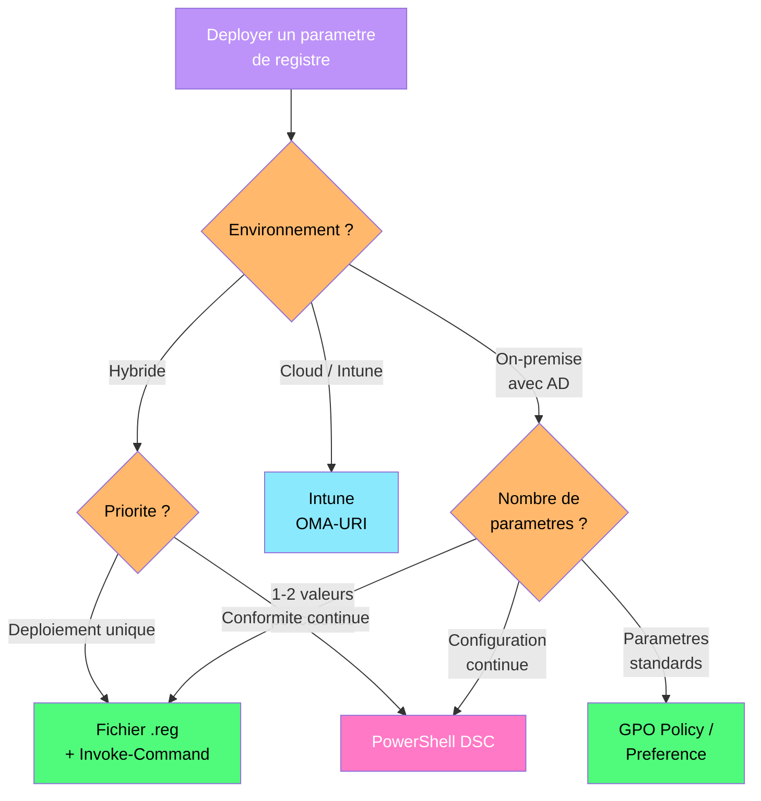

---
tags:
  - registre
  - deploiement
  - dsc
  - intune
  - industrialisation
  - pester
---

# Deploiement et industrialisation

!!! abstract "Ce que vous allez apprendre"
    - Deployer des fichiers .reg de maniere industrielle avec signature, validation et journalisation
    - Utiliser PowerShell DSC pour imposer et maintenir l'etat du registre en continu
    - Configurer le monitoring de conformite DSC pour detecter les derives
    - Deployer des parametres de registre via Intune OMA-URI pour les postes cloud-managed
    - Integrer des tests Pester dans un pipeline CI/CD pour valider l'etat du registre

---

## Deploiement massif via fichiers .reg



Votre fournisseur logiciel vous envoie un fichier `.reg` qui corrige un bug de configuration sur les 150 postes qui utilisent son application. Avant de le deployer en masse, il faut le valider, le signer et tracer son application.

### Anatomie d'un fichier .reg

```reg
Windows Registry Editor Version 5.00

; Fix for FactuPro connection timeout issue
; Vendor reference: KB-2026-0042

[HKEY_LOCAL_MACHINE\SOFTWARE\MonEntreprise\FactuPro\Network]
"ConnectionTimeout"=dword:0000ea60
"RetryCount"=dword:00000003
"RetryDelay"=dword:00001388
"UseSSL"=dword:00000001
"ApiEndpoint"="factuapi-v2.entreprise.local"

; Remove deprecated setting
[HKEY_LOCAL_MACHINE\SOFTWARE\MonEntreprise\FactuPro\Legacy]
"OldEndpoint"=-
```

Quelques regles de syntaxe importantes :

| Syntaxe | Signification |
|---------|---------------|
| `"Nom"=dword:00000001` | Valeur DWORD (hexadecimal) |
| `"Nom"="texte"` | Valeur String (REG_SZ) |
| `"Nom"=hex:01,02,03` | Valeur binaire |
| `"Nom"=-` | Supprimer cette valeur |
| `[-HKLM\...\Key]` | Supprimer la cle entiere (avec le tiret devant) |

### Valider un fichier .reg avant deploiement

Ne faites jamais confiance a un fichier `.reg` sans l'avoir inspecte. Le script suivant parse et valide le contenu avant application.

```powershell
# Validate a .reg file before deployment
function Test-RegFile {
    param(
        [Parameter(Mandatory)]
        [string]$Path
    )

    if (-not (Test-Path $Path)) {
        Write-Error "File not found: $Path"
        return $false
    }

    $content = Get-Content -Path $Path -Raw -Encoding Unicode
    $issues = @()

    # Check header
    if ($content -notmatch "^Windows Registry Editor Version 5\.00") {
        $issues += "Missing or invalid header (expected 'Windows Registry Editor Version 5.00')"
    }

    # Check for dangerous paths
    $dangerousPaths = @(
        "HKEY_LOCAL_MACHINE\\SYSTEM\\CurrentControlSet\\Control\\Lsa",
        "HKEY_LOCAL_MACHINE\\SAM",
        "HKEY_LOCAL_MACHINE\\SECURITY",
        "HKEY_LOCAL_MACHINE\\SYSTEM\\CurrentControlSet\\Services"
    )

    foreach ($dangerousPath in $dangerousPaths) {
        if ($content -match [regex]::Escape($dangerousPath)) {
            $issues += "WARNING: Modifies sensitive path: $dangerousPath"
        }
    }

    # Check for key deletions
    $deletions = [regex]::Matches($content, '\[-[^\]]+\]')
    if ($deletions.Count -gt 0) {
        $issues += "Contains $($deletions.Count) key deletion(s): $($deletions.Value -join ', ')"
    }

    # Summary
    if ($issues.Count -eq 0) {
        Write-Host "[PASS] $Path - No issues found" -ForegroundColor Green
        return $true
    } else {
        Write-Host "[WARN] $Path - $($issues.Count) issue(s) found:" -ForegroundColor Yellow
        $issues | ForEach-Object { Write-Host "  - $_" -ForegroundColor Yellow }
        return $false
    }
}

# Usage
Test-RegFile -Path "C:\Admin\Deploy\factupro-fix.reg"
```

```title="Resultat attendu"
[WARN] C:\Admin\Deploy\factupro-fix.reg - 1 issue(s) found:
  - Contains 1 key deletion(s): [-HKEY_LOCAL_MACHINE\SOFTWARE\MonEntreprise\FactuPro\Legacy]
```

### Deployer avec journalisation

```powershell
# Deploy a .reg file with logging and rollback capability
function Deploy-RegFile {
    param(
        [Parameter(Mandatory)]
        [string]$RegFilePath,

        [Parameter(Mandatory)]
        [string]$LogDirectory
    )

    $timestamp = Get-Date -Format "yyyyMMdd-HHmmss"
    $computerName = $env:COMPUTERNAME
    $logFile = Join-Path $LogDirectory "regdeploy-$computerName-$timestamp.log"

    # Create backup of affected keys before applying
    $content = Get-Content $RegFilePath -Raw -Encoding Unicode
    $keys = [regex]::Matches($content, '\[(?!-)([^\]]+)\]') |
        ForEach-Object { $_.Groups[1].Value }

    $backupFile = Join-Path $LogDirectory "backup-$computerName-$timestamp.reg"

    foreach ($key in $keys) {
        $regPath = $key -replace "HKEY_LOCAL_MACHINE", "HKLM" -replace "HKEY_CURRENT_USER", "HKCU"
        reg export $regPath $backupFile /y 2>&1 | Out-Null
    }

    # Apply the .reg file
    $result = Start-Process -FilePath "reg.exe" -ArgumentList "import `"$RegFilePath`"" `
        -Wait -PassThru -NoNewWindow

    # Log the result
    $logEntry = @"
Timestamp  : $timestamp
Computer   : $computerName
RegFile    : $RegFilePath
BackupFile : $backupFile
ExitCode   : $($result.ExitCode)
Status     : $(if ($result.ExitCode -eq 0) { "Success" } else { "Failed" })
"@

    $logEntry | Out-File -FilePath $logFile -Encoding UTF8
    return $result.ExitCode -eq 0
}

# Usage
Deploy-RegFile -RegFilePath "C:\Admin\Deploy\factupro-fix.reg" `
               -LogDirectory "C:\Admin\Logs\RegDeploy"
```

```title="Resultat attendu"
True
```

### Deploiement a distance sur un parc de machines

```powershell
# Mass deployment of a .reg file via PowerShell Remoting
$computers = Get-ADComputer -Filter "Name -like 'PC-FINANCE-*'" |
    Select-Object -ExpandProperty Name

$regContent = Get-Content "C:\Admin\Deploy\factupro-fix.reg" -Raw -Encoding Unicode

$deployResults = Invoke-Command -ComputerName $computers -ScriptBlock {
    param($regData, $timestamp)

    $tempFile = Join-Path $env:TEMP "deploy-$timestamp.reg"
    $logFile  = "C:\Windows\Logs\RegDeploy\deploy-$timestamp.log"

    try {
        # Ensure log directory exists
        $logDir = Split-Path $logFile -Parent
        if (-not (Test-Path $logDir)) { New-Item -Path $logDir -ItemType Directory -Force | Out-Null }

        # Write .reg file to temp
        $regData | Out-File -FilePath $tempFile -Encoding Unicode -Force

        # Apply
        $proc = Start-Process -FilePath "reg.exe" -ArgumentList "import `"$tempFile`"" `
            -Wait -PassThru -NoNewWindow

        # Log
        "$(Get-Date -Format 'yyyy-MM-dd HH:mm:ss') | ExitCode: $($proc.ExitCode)" |
            Out-File $logFile -Encoding UTF8

        # Cleanup temp file
        Remove-Item $tempFile -Force -ErrorAction SilentlyContinue

        [PSCustomObject]@{
            Computer = $env:COMPUTERNAME
            Status   = if ($proc.ExitCode -eq 0) { "Success" } else { "Failed" }
            ExitCode = $proc.ExitCode
        }
    } catch {
        [PSCustomObject]@{
            Computer = $env:COMPUTERNAME
            Status   = "Error"
            ExitCode = -1
        }
    }
} -ArgumentList $regContent, (Get-Date -Format "yyyyMMdd-HHmmss") `
  -ThrottleLimit 50 -ErrorAction SilentlyContinue

# Summary
$deployResults | Group-Object Status | Select-Object Name, Count | Format-Table -AutoSize
```

```title="Resultat attendu"
Name    Count
----    -----
Success   143
Failed      4
Error       3
```

!!! warning "Toujours sauvegarder avant d'importer"
    Avant d'appliquer un fichier `.reg`, exportez les cles affectees avec `reg export`. C'est votre filet de securite en cas de probleme. Le script de deploiement ci-dessus cree automatiquement une sauvegarde.

!!! info "En resume"
    - Validez tout fichier `.reg` avant deploiement (chemins dangereux, suppressions, syntaxe)
    - Sauvegardez les cles affectees avant chaque importation pour pouvoir rollback
    - Journalisez chaque deploiement avec horodatage, machine et code de retour
    - Utilisez PowerShell Remoting pour deployer en masse avec `-ThrottleLimit`

---

## PowerShell DSC pour la configuration du registre

Les fichiers `.reg` et les scripts ponctuels corrigent un etat a un instant T. Si quelqu'un modifie la valeur apres votre deploiement, vous ne le saurez pas. PowerShell DSC (Desired State Configuration) resout ce probleme : il definit l'etat souhaite et le maintient en permanence. C'est le pilote automatique du registre.

### Principe de DSC

DSC fonctionne en trois temps :

| Phase | Description |
|-------|-------------|
| **Authoring** | Vous ecrivez une configuration declarative (ce que le registre doit contenir) |
| **Enacting** | DSC applique la configuration sur la machine cible |
| **Monitoring** | DSC verifie periodiquement que l'etat reel correspond a l'etat souhaite |

### Configuration DSC pour le registre

```powershell
# DSC configuration for security baseline registry settings
Configuration SecurityBaseline {

    param(
        [Parameter(Mandatory)]
        [string[]]$ComputerName
    )

    Import-DscResource -ModuleName PSDesiredStateConfiguration

    Node $ComputerName {

        # CIS 2.3.1.1 - Limit blank password use
        Registry LimitBlankPasswordUse {
            Ensure    = "Present"
            Key       = "HKEY_LOCAL_MACHINE\SYSTEM\CurrentControlSet\Control\Lsa"
            ValueName = "LimitBlankPasswordUse"
            ValueData = "1"
            ValueType = "Dword"
        }

        # CIS 2.3.7.1 - SMB server signing required
        Registry SMBServerSigning {
            Ensure    = "Present"
            Key       = "HKEY_LOCAL_MACHINE\SYSTEM\CurrentControlSet\Services\LanmanServer\Parameters"
            ValueName = "RequireSecuritySignature"
            ValueData = "1"
            ValueType = "Dword"
        }

        # CIS 2.3.7.2 - SMB client signing required
        Registry SMBClientSigning {
            Ensure    = "Present"
            Key       = "HKEY_LOCAL_MACHINE\SYSTEM\CurrentControlSet\Services\LanManWorkstation\Parameters"
            ValueName = "RequireSecuritySignature"
            ValueData = "1"
            ValueType = "Dword"
        }

        # STIG V-220972 - Disable WDigest credential caching
        Registry WDigestDisabled {
            Ensure    = "Present"
            Key       = "HKEY_LOCAL_MACHINE\SYSTEM\CurrentControlSet\Control\SecurityProviders\WDigest"
            ValueName = "UseLogonCredential"
            ValueData = "0"
            ValueType = "Dword"
        }

        # CIS 18.10.42.1 - Disable WinRM basic authentication
        Registry WinRMNoBasic {
            Ensure    = "Present"
            Key       = "HKEY_LOCAL_MACHINE\SOFTWARE\Policies\Microsoft\Windows\WinRM\Service"
            ValueName = "AllowBasic"
            ValueData = "0"
            ValueType = "Dword"
        }

        # Application-specific setting
        Registry FactuProEndpoint {
            Ensure    = "Present"
            Key       = "HKEY_LOCAL_MACHINE\SOFTWARE\MonEntreprise\FactuPro"
            ValueName = "ApiEndpoint"
            ValueData = "factuapi-v2.entreprise.local"
            ValueType = "String"
        }

        # Remove a deprecated value
        Registry RemoveOldEndpoint {
            Ensure    = "Absent"
            Key       = "HKEY_LOCAL_MACHINE\SOFTWARE\MonEntreprise\FactuPro\Legacy"
            ValueName = "OldEndpoint"
        }
    }
}
```

### Compiler et appliquer la configuration

```powershell
# Compile the DSC configuration (generates .mof files)
SecurityBaseline -ComputerName "SRV-APP01", "SRV-APP02", "SRV-APP03" `
    -OutputPath "C:\Admin\DSC\SecurityBaseline"

# List the generated MOF files
Get-ChildItem "C:\Admin\DSC\SecurityBaseline" -Filter "*.mof"
```

```title="Resultat attendu"
    Directory: C:\Admin\DSC\SecurityBaseline

Mode                 LastWriteTime         Length Name
----                 -------------         ------ ----
-a----         04/04/2026    11:00           4532 SRV-APP01.mof
-a----         04/04/2026    11:00           4532 SRV-APP02.mof
-a----         04/04/2026    11:00           4532 SRV-APP03.mof
```

```powershell
# Apply the configuration in Push mode
Start-DscConfiguration -Path "C:\Admin\DSC\SecurityBaseline" -Wait -Verbose -Force
```

```title="Resultat attendu"
VERBOSE: Perform operation 'Invoke CimMethod' with following parameters, ''methodName' = SendConfigurationApply...
VERBOSE: [SRV-APP01]: LCM:  [ Start  Set      ]
VERBOSE: [SRV-APP01]:                            [[Registry]LimitBlankPasswordUse] Registry value already present.
VERBOSE: [SRV-APP01]:                            [[Registry]SMBServerSigning] Setting registry value.
VERBOSE: [SRV-APP01]:                            [[Registry]WDigestDisabled] Registry value already present.
VERBOSE: [SRV-APP01]:                            [[Registry]FactuProEndpoint] Setting registry value.
VERBOSE: [SRV-APP01]:                            [[Registry]RemoveOldEndpoint] Removing registry value.
VERBOSE: [SRV-APP01]: LCM:  [ End    Set      ]
VERBOSE: Operation 'Invoke CimMethod' complete.
```

### Mode Push vs mode Pull

| Critere | Push | Pull |
|---------|------|------|
| Initiation | L'admin pousse la config vers les machines | Les machines tirent la config d'un serveur |
| Infrastructure | Aucun serveur supplementaire | Necessite un Pull Server (DSC ou Azure Automation) |
| Echelle | Dizaines de machines | Centaines/milliers de machines |
| Monitoring | Ponctuel | Continu (intervalle configurable) |
| Cas d'usage | Tests, petits environnements | Production, conformite continue |

```powershell
# Configure LCM (Local Configuration Manager) for Pull mode with monitoring
[DSCLocalConfigurationManager()]
Configuration LCMConfig {

    param(
        [Parameter(Mandatory)]
        [string[]]$ComputerName
    )

    Node $ComputerName {
        Settings {
            RefreshMode                    = "Pull"
            ConfigurationMode              = "ApplyAndAutoCorrect"
            ConfigurationModeFrequencyMins = 30
            RefreshFrequencyMins           = 30
            RebootNodeIfNeeded             = $false
            AllowModuleOverwrite           = $true
            StatusRetentionTimeInDays      = 7
        }
    }
}

# Compile and apply the LCM configuration
LCMConfig -ComputerName "SRV-APP01" -OutputPath "C:\Admin\DSC\LCMConfig"
Set-DscLocalConfigurationManager -Path "C:\Admin\DSC\LCMConfig" -Verbose
```

```title="Resultat attendu"
VERBOSE: Performing the operation "Start-DscConfiguration: SendMetaConfigurationApply" on target "SRV-APP01".
VERBOSE: [SRV-APP01]: LCM:  [ Start  Set      ]
VERBOSE: [SRV-APP01]: LCM:  [ End    Set      ]
```

Le mode `ApplyAndAutoCorrect` est le plus puissant : si quelqu'un modifie manuellement une valeur de registre, DSC la remet automatiquement a l'etat souhaite lors du prochain cycle de verification (toutes les 30 minutes dans cet exemple).

!!! tip "ApplyAndAutoCorrect vs ApplyAndMonitor"
    Utilisez `ApplyAndAutoCorrect` pour les parametres de securite critiques (ex: WDigest). Utilisez `ApplyAndMonitor` quand vous voulez detecter les derives sans les corriger automatiquement (utile en phase de test).

!!! info "En resume"
    - DSC utilise des configurations declaratives : vous definissez l'etat souhaite, pas les etapes
    - La ressource `Registry` gere la creation (`Present`) et la suppression (`Absent`) de valeurs
    - Le mode Push est simple mais ponctuel ; le mode Pull assure la conformite continue
    - `ApplyAndAutoCorrect` corrige automatiquement les derives de configuration

---

## Monitoring de conformite DSC

DSC ne se contente pas d'appliquer des configurations : il surveille en permanence l'etat reel du registre et signale les derives. C'est le systeme d'alarme qui vous previent quand une porte est ouverte.

### Verifier l'etat de conformite

```powershell
# Check DSC compliance status on a remote machine
Invoke-Command -ComputerName "SRV-APP01" -ScriptBlock {
    $status = Get-DscConfigurationStatus
    [PSCustomObject]@{
        Computer         = $env:COMPUTERNAME
        Status           = $status.Status
        Type             = $status.Type
        StartDate        = $status.StartDate
        DurationInSeconds = $status.DurationInSeconds
        RebootRequested  = $status.RebootRequested
        ResourcesInDesiredState    = $status.ResourcesInDesiredState.Count
        ResourcesNotInDesiredState = $status.ResourcesNotInDesiredState.Count
    }
}
```

```title="Resultat attendu"
Computer                    : SRV-APP01
Status                      : Success
Type                        : Consistency
StartDate                   : 04/04/2026 14:30:00
DurationInSeconds           : 2.45
RebootRequested             : False
ResourcesInDesiredState     : 6
ResourcesNotInDesiredState  : 1
```

### Identifier les ressources non conformes

```powershell
# Get details about non-compliant resources
Invoke-Command -ComputerName "SRV-APP01" -ScriptBlock {
    $status = Get-DscConfigurationStatus
    $status.ResourcesNotInDesiredState | ForEach-Object {
        [PSCustomObject]@{
            ResourceId   = $_.ResourceId
            ResourceName = $_.ResourceName
            InDesiredState = $_.InDesiredState
            StartDate    = $_.StartDate
            DurationInSeconds = $_.DurationInSeconds
        }
    }
}
```

```title="Resultat attendu"
ResourceId        : [Registry]SMBServerSigning
ResourceName      : Registry
InDesiredState    : False
StartDate         : 04/04/2026 14:30:01
DurationInSeconds : 0.12
```

### Surveiller la conformite sur tout le parc

```powershell
# Monitor DSC compliance across all servers
$servers = Get-ADComputer -Filter "OperatingSystem -like '*Server*'" |
    Select-Object -ExpandProperty Name

$complianceReport = Invoke-Command -ComputerName $servers -ScriptBlock {
    try {
        $status = Get-DscConfigurationStatus -ErrorAction Stop
        [PSCustomObject]@{
            Computer    = $env:COMPUTERNAME
            Status      = $status.Status
            LastRun     = $status.StartDate
            InDesired   = $status.ResourcesInDesiredState.Count
            NotDesired  = $status.ResourcesNotInDesiredState.Count
            Compliant   = ($status.ResourcesNotInDesiredState.Count -eq 0)
        }
    } catch {
        [PSCustomObject]@{
            Computer    = $env:COMPUTERNAME
            Status      = "NoDSC"
            LastRun     = $null
            InDesired   = 0
            NotDesired  = 0
            Compliant   = $false
        }
    }
} -ThrottleLimit 50 -ErrorAction SilentlyContinue

# Summary
$complianceReport | Sort-Object Compliant, Computer |
    Format-Table Computer, Status, LastRun, InDesired, NotDesired,
        @{N="Compliance";E={if ($_.Compliant) {"OK"} else {"DRIFT"}}} -AutoSize
```

```title="Resultat attendu"
Computer   Status  LastRun                  InDesired NotDesired Compliance
--------   ------  -------                  --------- ---------- ----------
SRV-APP01  Success 04/04/2026 14:30:00              6          1 DRIFT
SRV-DB01   NoDSC                                    0          0 DRIFT
SRV-APP02  Success 04/04/2026 14:30:05              7          0 OK
SRV-APP03  Success 04/04/2026 14:30:02              7          0 OK
SRV-DC01   Success 04/04/2026 14:30:01              7          0 OK
```

!!! info "En resume"
    - `Get-DscConfigurationStatus` indique l'etat de conformite global et par ressource
    - Le champ `ResourcesNotInDesiredState` liste les valeurs de registre en derive
    - Un scan periodique du parc detecte les machines en derive ou sans DSC configure
    - Couplez le monitoring avec des alertes pour reagir rapidement aux ecarts de conformite

---

## Intune OMA-URI pour les postes cloud-managed

Les postes geres par Intune (Azure AD join, sans domaine AD) ne recoivent pas de GPO. Pour deployer des parametres de registre sur ces machines, utilisez les profils OMA-URI (Open Mobile Alliance - Uniform Resource Identifier).

### Principe d'OMA-URI

OMA-URI est le langage universel des MDM (Mobile Device Management). Chaque parametre Windows est accessible via un chemin URI structure. Quand Intune envoie un OMA-URI a un poste, le CSP (Configuration Service Provider) traduit l'instruction en modification de registre.

```
./Device/Vendor/MSFT/Policy/Config/Area/PolicyName
                  │           │         │       │
                  │           │         │       └─ Nom du parametre
                  │           │         └─ Categorie fonctionnelle
                  │           └─ Type (Policy, Registry direct, etc.)
                  └─ Fournisseur Microsoft
```

### Deployer une valeur de registre directe via OMA-URI

Pour ecrire directement dans le registre (hors des Policy CSPs predefinies), utilisez le Registry CSP :

| Champ | Valeur |
|-------|--------|
| Name | FactuPro API Endpoint |
| OMA-URI | `./Device/Vendor/MSFT/Registry/HKLM/SOFTWARE/MonEntreprise/FactuPro/ApiEndpoint` |
| Data type | String |
| Value | `factuapi-v2.entreprise.local` |

### Exemples de CSP courants pour le registre

| Objectif | OMA-URI | Type | Valeur |
|----------|---------|------|--------|
| Desactiver la camera ecran verrouillage | `./Device/Vendor/MSFT/Policy/Config/DeviceLock/PreventLockScreenCamera` | Integer | `1` |
| Forcer BitLocker | `./Device/Vendor/MSFT/Policy/Config/BitLocker/RequireDeviceEncryption` | Integer | `1` |
| Taille min mot de passe | `./Device/Vendor/MSFT/Policy/Config/DeviceLock/MinDevicePasswordLength` | Integer | `12` |
| Bloquer USB storage | `./Device/Vendor/MSFT/Policy/Config/Storage/RemovableDiskDenyWriteAccess` | Integer | `1` |
| Activer SmartScreen | `./Device/Vendor/MSFT/Policy/Config/SmartScreen/EnableSmartScreenInShell` | Integer | `1` |

### Creer un profil OMA-URI personnalise dans Intune

La procedure dans le portail Intune :

1. **Devices** > **Configuration profiles** > **Create profile**
2. Platform : **Windows 10 and later**
3. Profile type : **Templates** > **Custom**
4. Nom : **SEC - Registry Hardening Baseline**
5. Ajouter les parametres OMA-URI un par un

### Script PowerShell pour generer les OMA-URI

Plutot que de les saisir manuellement dans le portail, generez un fichier CSV importable :

```powershell
# Generate OMA-URI definitions for Intune import
$omaSettings = @(
    [PSCustomObject]@{
        Name     = "Disable WDigest"
        OmaUri   = "./Device/Vendor/MSFT/Registry/HKLM/SYSTEM/CurrentControlSet/Control/SecurityProviders/WDigest/UseLogonCredential"
        DataType = "Integer"
        Value    = "0"
    },
    [PSCustomObject]@{
        Name     = "SMB Server Signing"
        OmaUri   = "./Device/Vendor/MSFT/Registry/HKLM/SYSTEM/CurrentControlSet/Services/LanmanServer/Parameters/RequireSecuritySignature"
        DataType = "Integer"
        Value    = "1"
    },
    [PSCustomObject]@{
        Name     = "Limit Blank Passwords"
        OmaUri   = "./Device/Vendor/MSFT/Registry/HKLM/SYSTEM/CurrentControlSet/Control/Lsa/LimitBlankPasswordUse"
        DataType = "Integer"
        Value    = "1"
    },
    [PSCustomObject]@{
        Name     = "FactuPro Endpoint"
        OmaUri   = "./Device/Vendor/MSFT/Registry/HKLM/SOFTWARE/MonEntreprise/FactuPro/ApiEndpoint"
        DataType = "String"
        Value    = "factuapi-v2.entreprise.local"
    }
)

$omaSettings | Export-Csv "C:\Admin\Intune\oma-uri-baseline.csv" -NoTypeInformation
$omaSettings | Format-Table -AutoSize
```

```title="Resultat attendu"
Name                    OmaUri                                                                DataType Value
----                    ------                                                                -------- -----
Disable WDigest         ./Device/Vendor/MSFT/Registry/HKLM/SYSTEM/.../UseLogonCredential      Integer  0
SMB Server Signing      ./Device/Vendor/MSFT/Registry/HKLM/SYSTEM/.../RequireSecuritySignature Integer  1
Limit Blank Passwords   ./Device/Vendor/MSFT/Registry/HKLM/SYSTEM/.../LimitBlankPasswordUse   Integer  1
FactuPro Endpoint       ./Device/Vendor/MSFT/Registry/HKLM/SOFTWARE/.../ApiEndpoint            String   factuapi-v2.entreprise.local
```

### Verifier l'application sur le poste client

```powershell
# On the Intune-managed device: verify MDM applied registry settings
# Check the MDM diagnostic log
$mdmDiagPath = "$env:ProgramData\Microsoft\IntuneManagementExtension\Logs"
Get-ChildItem $mdmDiagPath -Filter "*.log" | Sort-Object LastWriteTime -Descending | Select-Object -First 3

# Verify a specific registry value set by Intune
Get-ItemProperty "HKLM:\SYSTEM\CurrentControlSet\Control\SecurityProviders\WDigest" `
    -Name "UseLogonCredential"

# Check MDM enrollment status
dsregcmd /status | Select-String "AzureAdJoined|MdmUrl|TenantName"
```

```title="Resultat attendu"
AzureAdJoined : YES
MdmUrl : https://enrollment.manage.microsoft.com/enrollmentserver/discovery.svc
TenantName : entreprise.onmicrosoft.com

UseLogonCredential : 0
```

!!! warning "OMA-URI et CSP : attention aux chemins"
    Les chemins OMA-URI utilisent des slashs (`/`), pas des antislashs. Le chemin registre `HKLM\SOFTWARE\MonApp` devient `HKLM/SOFTWARE/MonApp` dans l'URI. Une erreur de syntaxe entraine un echec silencieux.

!!! info "En resume"
    - OMA-URI est le mecanisme de deploiement de registre pour les postes geres par Intune
    - Le Registry CSP permet d'ecrire directement dans n'importe quelle cle de registre
    - Les Policy CSPs couvrent les parametres les plus courants avec des chemins predocumentes
    - Verifiez l'application via `dsregcmd /status` et les journaux Intune sur le poste client

---

## Integration CI/CD avec tests Pester

Votre equipe Infrastructure-as-Code versionne les configurations de registre dans Git. Avant chaque deploiement, des tests automatises doivent valider que l'etat du registre est conforme. Pester est le framework de test PowerShell qui rend cela possible.

### Ecrire des tests Pester pour le registre

```powershell
# SecurityBaseline.Tests.ps1 - Pester tests for registry compliance

Describe "Security Baseline - Registry Compliance" {

    Context "Authentication hardening" {

        It "CIS 2.3.1.1 - Blank passwords should be blocked" {
            $value = Get-ItemProperty "HKLM:\SYSTEM\CurrentControlSet\Control\Lsa" `
                -Name "LimitBlankPasswordUse" -ErrorAction SilentlyContinue
            $value.LimitBlankPasswordUse | Should -Be 1
        }

        It "STIG V-220972 - WDigest credential caching should be disabled" {
            $value = Get-ItemProperty `
                "HKLM:\SYSTEM\CurrentControlSet\Control\SecurityProviders\WDigest" `
                -Name "UseLogonCredential" -ErrorAction SilentlyContinue
            $value.UseLogonCredential | Should -Be 0
        }

        It "WinRM basic authentication should be disabled" {
            $value = Get-ItemProperty `
                "HKLM:\SOFTWARE\Policies\Microsoft\Windows\WinRM\Service" `
                -Name "AllowBasic" -ErrorAction SilentlyContinue
            $value.AllowBasic | Should -Be 0
        }
    }

    Context "Network hardening" {

        It "CIS 2.3.7.1 - SMB server signing should be required" {
            $value = Get-ItemProperty `
                "HKLM:\SYSTEM\CurrentControlSet\Services\LanmanServer\Parameters" `
                -Name "RequireSecuritySignature" -ErrorAction SilentlyContinue
            $value.RequireSecuritySignature | Should -Be 1
        }

        It "CIS 2.3.7.2 - SMB client signing should be required" {
            $value = Get-ItemProperty `
                "HKLM:\SYSTEM\CurrentControlSet\Services\LanManWorkstation\Parameters" `
                -Name "RequireSecuritySignature" -ErrorAction SilentlyContinue
            $value.RequireSecuritySignature | Should -Be 1
        }
    }

    Context "Application configuration" {

        It "FactuPro API endpoint should be set to v2" {
            $value = Get-ItemProperty "HKLM:\SOFTWARE\MonEntreprise\FactuPro" `
                -Name "ApiEndpoint" -ErrorAction SilentlyContinue
            $value.ApiEndpoint | Should -Be "factuapi-v2.entreprise.local"
        }

        It "Legacy FactuPro endpoint should be removed" {
            $path = "HKLM:\SOFTWARE\MonEntreprise\FactuPro\Legacy"
            $value = Get-ItemProperty $path -Name "OldEndpoint" -ErrorAction SilentlyContinue
            $value | Should -BeNullOrEmpty
        }
    }
}
```

### Executer les tests

```powershell
# Run Pester tests
Invoke-Pester -Path "C:\Admin\Tests\SecurityBaseline.Tests.ps1" -Output Detailed
```

```title="Resultat attendu"
Describing Security Baseline - Registry Compliance
  Context Authentication hardening
    [+] CIS 2.3.1.1 - Blank passwords should be blocked 45ms (30ms|15ms)
    [+] STIG V-220972 - WDigest credential caching should be disabled 22ms (12ms|10ms)
    [-] WinRM basic authentication should be disabled 38ms (28ms|10ms)
        Expected 0, but got $null.
        at $value.AllowBasic | Should -Be 0, C:\Admin\Tests\SecurityBaseline.Tests.ps1:22
  Context Network hardening
    [+] CIS 2.3.7.1 - SMB server signing should be required 18ms (10ms|8ms)
    [+] CIS 2.3.7.2 - SMB client signing should be required 15ms (8ms|7ms)
  Context Application configuration
    [+] FactuPro API endpoint should be set to v2 12ms (6ms|6ms)
    [+] Legacy FactuPro endpoint should be removed 10ms (5ms|5ms)
Tests completed in 1.2s
Tests Passed: 6, Failed: 1, Skipped: 0
```

### Executer les tests a distance

```powershell
# Run Pester tests on remote machines
$computers = @("SRV-APP01", "SRV-APP02", "SRV-APP03")
$testScript = Get-Content "C:\Admin\Tests\SecurityBaseline.Tests.ps1" -Raw

$remoteResults = Invoke-Command -ComputerName $computers -ScriptBlock {
    param($script)

    # Write test script to temp
    $tempTest = Join-Path $env:TEMP "SecurityBaseline.Tests.ps1"
    $script | Out-File $tempTest -Encoding UTF8

    # Run Pester and return results
    $pesterResult = Invoke-Pester -Path $tempTest -PassThru -Output None

    # Clean up
    Remove-Item $tempTest -Force

    [PSCustomObject]@{
        Computer = $env:COMPUTERNAME
        Total    = $pesterResult.TotalCount
        Passed   = $pesterResult.PassedCount
        Failed   = $pesterResult.FailedCount
        Score    = if ($pesterResult.TotalCount -gt 0) {
            [math]::Round(($pesterResult.PassedCount / $pesterResult.TotalCount) * 100, 1)
        } else { 0 }
        FailedTests = ($pesterResult.Failed | ForEach-Object { $_.Name }) -join "; "
    }
} -ArgumentList $testScript -ThrottleLimit 50

$remoteResults | Format-Table Computer, Passed, Failed, Score, FailedTests -AutoSize
```

```title="Resultat attendu"
Computer  Passed Failed Score FailedTests
--------  ------ ------ ----- -----------
SRV-APP01      6      1  85.7 WinRM basic authentication should be disabled
SRV-APP02      7      0 100.0
SRV-APP03      6      1  85.7 WinRM basic authentication should be disabled
```

### Integrer dans un pipeline CI/CD

Voici un exemple de pipeline Azure DevOps qui execute les tests Pester apres un deploiement DSC :

```yaml
# azure-pipelines.yml - Registry compliance pipeline
trigger:
  branches:
    include:
      - main
  paths:
    include:
      - dsc/configurations/*
      - tests/*

pool:
  name: 'SelfHosted-Windows'

stages:
  - stage: Deploy
    displayName: 'Deploy DSC Configuration'
    jobs:
      - job: ApplyDSC
        steps:
          - powershell: |
              # Compile and push DSC configuration
              . .\dsc\configurations\SecurityBaseline.ps1
              $targets = Get-Content .\config\target-servers.txt
              SecurityBaseline -ComputerName $targets -OutputPath .\output\mof
              Start-DscConfiguration -Path .\output\mof -Wait -Force
            displayName: 'Apply DSC Configuration'

  - stage: Validate
    displayName: 'Validate Registry Compliance'
    dependsOn: Deploy
    jobs:
      - job: RunPester
        steps:
          - powershell: |
              # Run Pester tests against all target machines
              $targets = Get-Content .\config\target-servers.txt
              $testScript = Get-Content .\tests\SecurityBaseline.Tests.ps1 -Raw

              $results = Invoke-Command -ComputerName $targets -ScriptBlock {
                  param($s)
                  $tmp = Join-Path $env:TEMP "test.ps1"
                  $s | Out-File $tmp -Encoding UTF8
                  $r = Invoke-Pester -Path $tmp -PassThru -Output None
                  Remove-Item $tmp -Force
                  [PSCustomObject]@{
                      Computer = $env:COMPUTERNAME
                      Passed   = $r.PassedCount
                      Failed   = $r.FailedCount
                  }
              } -ArgumentList $testScript

              # Export results in NUnit format for Azure DevOps
              $results | Export-Csv .\test-results.csv -NoTypeInformation

              # Fail the pipeline if any test failed
              $totalFailed = ($results | Measure-Object -Property Failed -Sum).Sum
              if ($totalFailed -gt 0) {
                  Write-Error "$totalFailed compliance test(s) failed across the fleet."
                  exit 1
              }
            displayName: 'Run Compliance Tests'

          - task: PublishTestResults@2
            inputs:
              testResultsFormat: 'NUnit'
              testResultsFiles: '**/*.xml'
            condition: always()
            displayName: 'Publish Test Results'
```

!!! tip "Pester comme filet de securite dans le pipeline"
    En integrant les tests Pester dans le pipeline CI/CD, tout deploiement qui echoue a la validation est automatiquement bloque. Le rapport de test indique exactement quelles machines et quels parametres sont non conformes.

!!! info "En resume"
    - Pester permet d'ecrire des tests declaratifs pour valider l'etat du registre
    - Les tests peuvent s'executer localement ou a distance via `Invoke-Command`
    - L'integration CI/CD (Azure DevOps, GitHub Actions) bloque les deploiements non conformes
    - Le format NUnit permet de publier les resultats dans les tableaux de bord de pipeline

---

## Scenario reel : standardiser le registre d'un nouveau site

Votre entreprise ouvre un nouveau site de 80 postes de travail et 10 serveurs. Tout doit etre configure de maniere identique au site principal. Voici le plan de deploiement complet, de la definition de la baseline a la validation finale.

### Etape 1 : Definir la baseline dans un fichier de configuration

```powershell
# baseline-config.psd1 - Registry baseline definition (versionable in Git)
@{
    Version     = "2026.04.01"
    Author      = "Infrastructure Team"
    Description = "Standard registry baseline for enterprise workstations"

    Settings = @(
        # Security hardening
        @{
            Category = "Security"
            Name     = "LimitBlankPasswordUse"
            Key      = "HKLM:\SYSTEM\CurrentControlSet\Control\Lsa"
            Value    = 1
            Type     = "DWord"
        },
        @{
            Category = "Security"
            Name     = "UseLogonCredential"
            Key      = "HKLM:\SYSTEM\CurrentControlSet\Control\SecurityProviders\WDigest"
            Value    = 0
            Type     = "DWord"
        },
        @{
            Category = "Security"
            Name     = "RequireSecuritySignature"
            Key      = "HKLM:\SYSTEM\CurrentControlSet\Services\LanmanServer\Parameters"
            Value    = 1
            Type     = "DWord"
        },

        # Network configuration
        @{
            Category = "Network"
            Name     = "NtpServer"
            Key      = "HKLM:\SYSTEM\CurrentControlSet\Services\W32Time\Parameters"
            Value    = "ntp.entreprise.local,0x9"
            Type     = "String"
        },

        # Application configuration
        @{
            Category = "Application"
            Name     = "ApiEndpoint"
            Key      = "HKLM:\SOFTWARE\MonEntreprise\FactuPro"
            Value    = "factuapi-v2.entreprise.local"
            Type     = "String"
        },
        @{
            Category = "Application"
            Name     = "SyncIntervalMinutes"
            Key      = "HKLM:\SOFTWARE\MonEntreprise\FactuPro"
            Value    = 60
            Type     = "DWord"
        }
    )
}
```

### Etape 2 : Deployer via un script universel

```powershell
# Deploy-Baseline.ps1 - Universal baseline deployment script

param(
    [Parameter(Mandatory)]
    [string]$BaselineFile,

    [Parameter(Mandatory)]
    [string[]]$ComputerName,

    [int]$ThrottleLimit = 50
)

# Load the baseline
$baseline = Import-PowerShellDataFile -Path $BaselineFile
Write-Host "Baseline version: $($baseline.Version)"
Write-Host "Settings count : $($baseline.Settings.Count)"
Write-Host "Target machines : $($ComputerName.Count)"

# Deploy to all machines
$results = Invoke-Command -ComputerName $ComputerName -ScriptBlock {
    param($settings)

    $machineResults = @()

    foreach ($setting in $settings) {
        $result = [PSCustomObject]@{
            Computer = $env:COMPUTERNAME
            Category = $setting.Category
            Name     = $setting.Name
            Status   = "Unknown"
        }

        try {
            # Create key if it does not exist
            if (-not (Test-Path $setting.Key)) {
                New-Item -Path $setting.Key -Force | Out-Null
            }

            # Set the value
            $params = @{
                Path  = $setting.Key
                Name  = $setting.Name
                Value = $setting.Value
                Force = $true
            }

            if ($setting.Type -eq "DWord") {
                $params["PropertyType"] = "DWord"
            } elseif ($setting.Type -eq "String") {
                $params["PropertyType"] = "String"
            }

            # Check if value already exists
            $existing = Get-ItemProperty -Path $setting.Key -Name $setting.Name -ErrorAction SilentlyContinue
            if ($existing) {
                Set-ItemProperty -Path $setting.Key -Name $setting.Name -Value $setting.Value -Force
            } else {
                New-ItemProperty @params | Out-Null
            }

            $result.Status = "Applied"
        } catch {
            $result.Status = "Failed: $($_.Exception.Message)"
        }

        $machineResults += $result
    }

    $machineResults
} -ArgumentList (,$baseline.Settings) -ThrottleLimit $ThrottleLimit -ErrorAction SilentlyContinue `
  -ErrorVariable deployErrors

# Display results
$results | Group-Object Status | Select-Object Name, Count | Format-Table -AutoSize

# Show unreachable machines
if ($deployErrors) {
    Write-Host "`nUnreachable machines:" -ForegroundColor Yellow
    $deployErrors | ForEach-Object { Write-Host "  - $($_.TargetObject)" -ForegroundColor Yellow }
}
```

```title="Resultat attendu"
Baseline version: 2026.04.01
Settings count : 6
Target machines : 90

Name               Count
----               -----
Applied              528
Failed: Access...      6
Failed: The pro...     6

Unreachable machines:
  - PC-SITE2-78
  - PC-SITE2-79
```

### Etape 3 : Valider avec Pester

```powershell
# Run validation tests against all new site machines
$newSiteMachines = Get-ADComputer -SearchBase "OU=Site2,OU=Workstations,DC=entreprise,DC=local" `
    -Filter * | Select-Object -ExpandProperty Name

# Generate Pester tests dynamically from the baseline
$baseline = Import-PowerShellDataFile "C:\Admin\Baselines\baseline-config.psd1"

$testScript = @"
Describe "Site 2 Baseline Compliance" {
$(foreach ($s in $baseline.Settings) {
    $expected = if ($s.Type -eq "String") { "'$($s.Value)'" } else { $s.Value }
@"

    It "$($s.Category) - $($s.Name) should be $expected" {
        `$value = Get-ItemProperty "$($s.Key)" -Name "$($s.Name)" -ErrorAction SilentlyContinue
        `$value.$($s.Name) | Should -Be $expected
    }
"@
})
}
"@

# Run on all machines
$testResults = Invoke-Command -ComputerName $newSiteMachines -ScriptBlock {
    param($script)
    $tmp = Join-Path $env:TEMP "baseline-test.ps1"
    $script | Out-File $tmp -Encoding UTF8
    $r = Invoke-Pester -Path $tmp -PassThru -Output None
    Remove-Item $tmp -Force
    [PSCustomObject]@{
        Computer = $env:COMPUTERNAME
        Passed   = $r.PassedCount
        Failed   = $r.FailedCount
        Score    = [math]::Round(($r.PassedCount / $r.TotalCount) * 100, 1)
    }
} -ArgumentList $testScript -ThrottleLimit 50

# Final report
$testResults | Sort-Object Score |
    Format-Table Computer, Passed, Failed, @{N="Score";E={"$($_.Score)%"}} -AutoSize

$avgScore = ($testResults | Measure-Object -Property Score -Average).Average
Write-Host "`nAverage compliance score: $([math]::Round($avgScore, 1))%"
```

```title="Resultat attendu"
Computer      Passed Failed Score
--------      ------ ------ -----
PC-SITE2-78        4      2 66.7%
PC-SITE2-79        4      2 66.7%
PC-SITE2-01        6      0 100.0%
PC-SITE2-02        6      0 100.0%
...
SRV-SITE2-01       6      0 100.0%
SRV-SITE2-10       6      0 100.0%

Average compliance score: 98.5%
```

### Etape 4 : Configurer DSC pour le maintien continu

```powershell
# Set up DSC to maintain the baseline continuously on all Site 2 machines
# This ensures any future drift is automatically corrected

# Generate DSC configuration from the same baseline file
$baseline = Import-PowerShellDataFile "C:\Admin\Baselines\baseline-config.psd1"

Configuration Site2Baseline {
    param([string[]]$ComputerName)

    Import-DscResource -ModuleName PSDesiredStateConfiguration

    Node $ComputerName {
        foreach ($setting in $using:baseline.Settings) {
            $resourceName = "$($setting.Category)_$($setting.Name)" -replace '[^a-zA-Z0-9_]', ''

            Registry $resourceName {
                Ensure    = "Present"
                Key       = $setting.Key -replace "HKLM:", "HKEY_LOCAL_MACHINE"
                ValueName = $setting.Name
                ValueData = [string]$setting.Value
                ValueType = $setting.Type
            }
        }
    }
}

# Compile and deploy
$allSite2 = $newSiteMachines
Site2Baseline -ComputerName $allSite2 -OutputPath "C:\Admin\DSC\Site2Baseline"
Start-DscConfiguration -Path "C:\Admin\DSC\Site2Baseline" -Wait -Force
```

```title="Resultat attendu"
VERBOSE: [PC-SITE2-01]: LCM:  [ Start  Set      ]
VERBOSE: [PC-SITE2-01]:                            [[Registry]Security_LimitBlankPasswordUse] Registry value already present.
VERBOSE: [PC-SITE2-01]:                            [[Registry]Security_UseLogonCredential] Registry value already present.
...
VERBOSE: [PC-SITE2-01]: LCM:  [ End    Set      ]
```

!!! tip "Baseline-as-Code : un seul fichier source de verite"
    Le fichier `.psd1` de baseline est versionne dans Git, utilise pour le deploiement, les tests Pester et la configuration DSC. Modifier la baseline a un seul endroit la met a jour partout. C'est le principe du Single Source of Truth applique a l'infrastructure.

!!! info "En resume"
    - Definissez la baseline dans un fichier de donnees PowerShell (`.psd1`) versionne dans Git
    - Le script de deploiement universel applique la baseline sur n'importe quel parc de machines
    - Les tests Pester generes dynamiquement valident la conformite apres deploiement
    - DSC assure le maintien continu de la baseline en corrigeant automatiquement les derives
