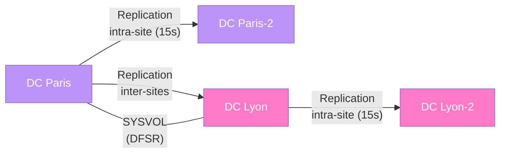
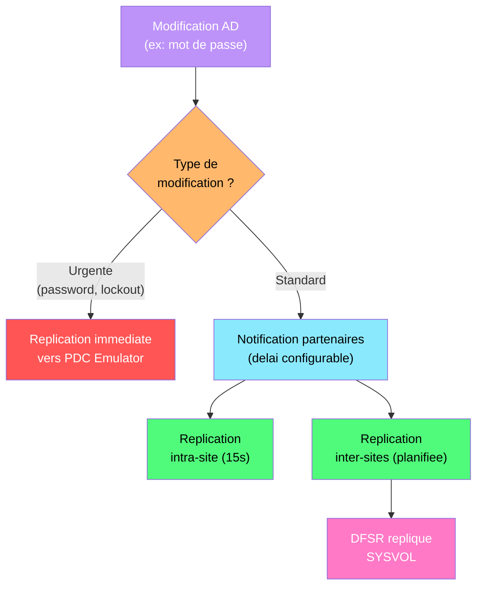

---
tags:
  - registre
  - active-directory
  - ad-ds
  - replication
  - domaine
---

# Active Directory Domain Services

!!! abstract "Ce que vous allez apprendre"
    - Localiser et modifier les parametres NTDS dans le registre
    - Ajuster les intervalles de replication et les couts de liaison de site
    - Configurer SYSVOL/DFSR via les cles de registre
    - Detecter la version du schema AD et gerer le tombstone lifetime
    - Diagnostiquer les echecs de replication AD par l'analyse du registre

---

## Parametres NTDS dans le registre





Un controleur de domaine qui refuse de repliquer, un annuaire qui repond lentement, un schema dont on ne connait plus la version : tous ces problemes se diagnostiquent et se corrigent via le registre. Le service NTDS (NT Directory Services) stocke sa configuration principale sous une cle unique.

### Emplacement de la base de donnees

```
HKLM\SYSTEM\CurrentControlSet\Services\NTDS\Parameters
```

Cette cle contient les chemins vers les fichiers critiques de la base Active Directory.

| Valeur | Type | Description | Defaut |
|--------|------|-------------|--------|
| `DSA Database file` | REG_SZ | Chemin vers le fichier `ntds.dit` | `%SystemRoot%\NTDS\ntds.dit` |
| `Database backup path` | REG_SZ | Chemin de sauvegarde de la base | `%SystemRoot%\NTDS\dsadata.bak` |
| `Database log files path` | REG_SZ | Repertoire des journaux de transactions | `%SystemRoot%\NTDS` |
| `DSA Working Directory` | REG_SZ | Repertoire de travail du moteur ESE | `%SystemRoot%\NTDS` |

```powershell
# Read the NTDS database path on the local DC
Get-ItemProperty -Path "HKLM:\SYSTEM\CurrentControlSet\Services\NTDS\Parameters" |
    Select-Object "DSA Database file", "Database log files path"
```

```title="Resultat attendu"
DSA Database file      : C:\Windows\NTDS\ntds.dit
Database log files path : C:\Windows\NTDS
```

### Diagnostic Integrity Checking

Le service NTDS dispose de parametres de verification d'integrite que l'on peut activer pour le depannage.

| Valeur | Type | Description |
|--------|------|-------------|
| `Strict Replication Consistency` | REG_DWORD | `1` = rejette les objets lingering, `0` = les accepte |
| `Repl Perform Initial Synchronizations` | REG_DWORD | `1` = synchronisation initiale obligatoire au demarrage, `0` = facultative |
| `Global Catalog Promotion Complete` | REG_DWORD | `1` = promotion GC terminee |

!!! warning "Repl Perform Initial Synchronizations"
    La valeur `Repl Perform Initial Synchronizations` a `0` permet a un DC de demarrer meme s'il ne peut pas joindre ses partenaires de replication. C'est utile en mode de recuperation, mais **dangereux en production** car le DC pourrait servir des donnees obsoletes.

```powershell
# Check strict replication consistency
$path = "HKLM:\SYSTEM\CurrentControlSet\Services\NTDS\Parameters"
Get-ItemPropertyValue -Path $path -Name "Strict Replication Consistency"
```

```title="Resultat attendu"
1
```

!!! info "En resume"
    - La cle `NTDS\Parameters` contient les chemins vers `ntds.dit` et les journaux de transactions
    - `Strict Replication Consistency` a `1` protege contre les objets lingering
    - `Repl Perform Initial Synchronizations` a `0` ne doit etre utilise qu'en recuperation d'urgence

---

## Replication : intervalles et parametres

Imaginez un DC parisien qui met 6 heures a recevoir un changement de mot de passe effectue a Lyon. En ajustant les parametres de replication dans le registre, on controle la frequence, la priorite et le comportement de la replication inter-sites.

### Intervalles de replication intra-site

La replication intra-site est geree par le KCC (Knowledge Consistency Checker). Par defaut, les partenaires de replication se synchronisent toutes les 15 secondes au sein du meme site.

```
HKLM\SYSTEM\CurrentControlSet\Services\NTDS\Parameters
```

| Valeur | Type | Description | Defaut |
|--------|------|-------------|--------|
| `Repl topology update period (secs)` | REG_DWORD | Frequence de recalcul de la topologie KCC (en secondes) | 900 (15 min) |
| `Repl topology update delay (secs)` | REG_DWORD | Delai avant le premier calcul apres demarrage | 300 (5 min) |

### Replication inter-sites

La replication inter-sites est configuree principalement via Active Directory Sites and Services, mais certains parametres du registre influencent le comportement global.

```powershell
# Check current site link replication interval
Get-ADReplicationSiteLink -Filter * |
    Select-Object Name, Cost, ReplicationFrequencyInMinutes
```

```title="Resultat attendu"
Name                          Cost ReplicationFrequencyInMinutes
----                          ---- ----------------------------
DEFAULTIPSITELINK              100                          180
PARIS-LYON                      50                           15
```

### Replication urgente

Certaines modifications declenchent une replication **immediate** sans attendre l'intervalle normal. Ces declencheurs sont definis dans le protocole AD et ne se configurent pas directement, mais il est essentiel de les connaitre.

| Evenement | Declenchement |
|-----------|---------------|
| Changement de mot de passe | Replication urgente vers le PDC Emulator |
| Verrouillage de compte | Replication urgente vers le PDC Emulator |
| Changement de secret LSA | Replication urgente intra-site |
| Changement du RID Manager | Replication urgente intra-site |

```powershell
# Force immediate replication with all partners
repadmin /syncall /AdeP
```

```title="Resultat attendu"
Syncing all NC's held on DC01.corp.local.
Syncing partition: DC=corp,DC=local
CALLBACK MESSAGE: The following replication completed successfully:
From: CN=NTDS Settings,CN=DC02,CN=Servers,CN=Paris,...
To:   CN=NTDS Settings,CN=DC01,CN=Servers,CN=Paris,...
```

### Compression de la replication

La replication inter-sites compresse les donnees par defaut. On peut desactiver ce comportement pour reduire la charge CPU au prix de plus de bande passante.

```
HKLM\SYSTEM\CurrentControlSet\Services\NTDS\Parameters
```

| Valeur | Type | Description | Defaut |
|--------|------|-------------|--------|
| `Replicator notify pause after modify (secs)` | REG_DWORD | Delai avant notification des partenaires apres modification | 300 |
| `Replicator notify pause between DSAs (secs)` | REG_DWORD | Delai entre les notifications successives | 30 |

```powershell
# Set a shorter notification delay for faster intra-site replication
Set-ItemProperty -Path "HKLM:\SYSTEM\CurrentControlSet\Services\NTDS\Parameters" `
    -Name "Replicator notify pause after modify (secs)" -Value 15 -Type DWord
```

```title="Resultat attendu"
aucune sortie si la commande reussit.
```

!!! tip "Replication monitoring"
    Utilisez `repadmin /showrepl` et `repadmin /replsummary` regulierement pour surveiller l'etat de la replication. Combinez-les avec les parametres du registre pour un diagnostic complet.

!!! info "En resume"
    - La replication intra-site se produit toutes les 15 secondes par defaut
    - Les changements de mot de passe et verrouillages de comptes declenchent une replication urgente
    - Les delais de notification sont configurables via `Replicator notify pause` dans le registre
    - `repadmin /syncall /AdeP` force une synchronisation immediate avec tous les partenaires

---

## SYSVOL et DFSR

SYSVOL est le repertoire partage qui distribue les scripts de connexion et les fichiers de strategie de groupe a travers le domaine. Depuis Windows Server 2008 R2, DFSR (Distributed File System Replication) a remplace FRS pour la replication de SYSVOL.

### Cles DFSR principales

```
HKLM\SYSTEM\CurrentControlSet\Services\DFSR\Parameters
```

| Valeur | Type | Description | Defaut |
|--------|------|-------------|--------|
| `StopReplicationOnAutoRecovery` | REG_DWORD | `1` = arrete la replication en cas de dirty shutdown, `0` = auto-recovery | 1 |
| `DebugLogSeverity` | REG_DWORD | Niveau de journalisation (1-5) | 4 |
| `DebugLogMessages` | REG_DWORD | Nombre maximal de messages dans le journal | 200000 |
| `ConflictHighWatermarkPercent` | REG_DWORD | Seuil de nettoyage du dossier ConflictAndDeleted (%) | 90 |
| `ConflictLowWatermarkPercent` | REG_DWORD | Seuil bas de nettoyage (%) | 60 |

### Migration FRS vers DFSR

La migration de FRS vers DFSR se fait en quatre etapes. L'etat courant est stocke dans Active Directory, mais les parametres locaux du service DFSR sont dans le registre.

```powershell
# Check DFSR migration state
dfsrmig /getmigrationstate
```

```title="Resultat attendu"
All Domain Controllers have migrated successfully to Global State ('Eliminated').
Migration has reached a consistent state on all Domain Controllers.
Succeeded.
```

### Diagnostic DFSR : auto-recovery

Lorsqu'un DC subit un arret non propre (crash, coupure de courant), DFSR peut detecter un etat inconsistant et arreter la replication. Le comportement est controle par `StopReplicationOnAutoRecovery`.

```powershell
# Check current auto-recovery setting
Get-ItemPropertyValue -Path "HKLM:\SYSTEM\CurrentControlSet\Services\DFSR\Parameters" `
    -Name "StopReplicationOnAutoRecovery"
```

```title="Resultat attendu"
1
```

!!! danger "Ne pas desactiver StopReplicationOnAutoRecovery en permanence"
    Mettre cette valeur a `0` permet au DFSR de reprendre automatiquement apres un dirty shutdown, mais cela peut entrainer une **divergence des donnees** entre les controleurs. Utilisez cette option uniquement pour debloquer un DC isole, puis revenez a `1`.

```powershell
# Temporarily allow auto-recovery (use with caution)
Set-ItemProperty -Path "HKLM:\SYSTEM\CurrentControlSet\Services\DFSR\Parameters" `
    -Name "StopReplicationOnAutoRecovery" -Value 0 -Type DWord
Restart-Service DFSR
```

```title="Resultat attendu"
aucune sortie si la commande reussit. Le service DFSR redemarrera et tentera un auto-recovery.
```

### Journalisation DFSR avancee

```powershell
# Increase DFSR debug logging for troubleshooting
Set-ItemProperty -Path "HKLM:\SYSTEM\CurrentControlSet\Services\DFSR\Parameters" `
    -Name "DebugLogSeverity" -Value 5 -Type DWord
Set-ItemProperty -Path "HKLM:\SYSTEM\CurrentControlSet\Services\DFSR\Parameters" `
    -Name "DebugLogMessages" -Value 500000 -Type DWord
Restart-Service DFSR
```

```title="Resultat attendu"
aucune sortie. Les journaux DFSR detailles seront disponibles dans %SystemRoot%\debug\dfsr*.log.
```

!!! info "En resume"
    - DFSR est le mecanisme de replication de SYSVOL depuis Windows Server 2008 R2
    - `StopReplicationOnAutoRecovery` protege contre la divergence de donnees apres un crash
    - Les journaux DFSR (`DebugLogSeverity` 5) sont essentiels pour le depannage avance
    - Verifiez l'etat de migration FRS/DFSR avec `dfsrmig /getmigrationstate`

---

## Schema AD : version et compatibilite

Avant d'introduire un nouveau DC dans la foret ou de preparer une mise a niveau, il faut connaitre la version du schema. Un schema incompatible bloque la promotion d'un controleur.

### Detecter la version du schema

La version du schema est stockee dans l'attribut `objectVersion` de l'objet Schema dans Active Directory, mais on peut aussi la retrouver dans le registre.

```powershell
# Get the AD schema version from Active Directory
Get-ADObject "CN=Schema,CN=Configuration,DC=corp,DC=local" -Property objectVersion |
    Select-Object objectVersion
```

```title="Resultat attendu"
objectVersion
-------------
           88
```

| Version du schema | Systeme d'exploitation |
|-------------------|----------------------|
| 13 | Windows 2000 |
| 30 | Windows Server 2003 |
| 31 | Windows Server 2003 R2 |
| 44 | Windows Server 2008 |
| 47 | Windows Server 2008 R2 |
| 56 | Windows Server 2012 |
| 69 | Windows Server 2012 R2 |
| 87 | Windows Server 2016 |
| 88 | Windows Server 2019/2022 |
| 90 | Windows Server 2025 |

### Niveau fonctionnel du domaine et de la foret

```powershell
# Check domain and forest functional levels
Get-ADDomain | Select-Object DomainMode
Get-ADForest | Select-Object ForestMode
```

```title="Resultat attendu"
DomainMode
----------
Windows2016Domain

ForestMode
----------
Windows2016Forest
```

### Preparation du schema

Avant une montee de version, il faut executer `adprep /forestprep` et `adprep /domainprep`. La version resultante est visible dans le registre du DC qui heberge le role Schema Master.

```powershell
# Verify schema FSMO role holder
netdom query fsmo | Select-String "Schema"
```

```title="Resultat attendu"
Schema master               DC01.corp.local
```

!!! info "En resume"
    - La version du schema AD determine les fonctionnalites disponibles et la compatibilite des DC
    - La version 88 correspond a Windows Server 2019/2022, la version 90 a Server 2025
    - Verifiez toujours la version du schema avant d'introduire un nouveau DC
    - `adprep /forestprep` met a jour le schema sur l'ensemble de la foret

---

## Tombstone lifetime et corbeille AD

Lorsqu'un objet est supprime dans AD, il n'est pas immediatement purge. Il entre dans un etat "tombstone" pendant une duree configurable, le temps que tous les DC recoivent l'information de suppression.

### Tombstone lifetime dans le registre

Le tombstone lifetime est stocke dans Active Directory (attribut `tombstoneLifetime` de l'objet Directory Service), mais sa valeur effective peut etre verifiee via PowerShell.

```powershell
# Check the current tombstone lifetime
Get-ADObject "CN=Directory Service,CN=Windows NT,CN=Services,CN=Configuration,DC=corp,DC=local" `
    -Property tombstoneLifetime | Select-Object tombstoneLifetime
```

```title="Resultat attendu"
tombstoneLifetime
-----------------
              180
```

| Valeur | Signification |
|--------|---------------|
| 60 | Defaut pour les forets creees avant Windows Server 2003 SP1 |
| 180 | Defaut pour les forets creees a partir de Windows Server 2003 SP1 |

!!! danger "Ne jamais reduire le tombstone lifetime en dessous de 60 jours"
    Un tombstone lifetime trop court peut provoquer l'apparition d'**objets lingering** si un DC est hors ligne plus longtemps que la duree configuree. Ces objets fantomes causent des incoherences majeures dans l'annuaire.

### Corbeille Active Directory

La corbeille AD (introduite avec Windows Server 2008 R2) permet de restaurer des objets supprimes avec tous leurs attributs, sans avoir besoin d'une restauration autoritaire.

```powershell
# Check if AD Recycle Bin is enabled
Get-ADOptionalFeature -Filter { Name -like "Recycle*" } |
    Select-Object Name, EnabledScopes
```

```title="Resultat attendu"
Name                                      EnabledScopes
----                                      -------------
Recycle Bin Feature                       {CN=Partitions,CN=Configuration,DC=corp,DC=local}
```

```powershell
# Enable AD Recycle Bin (irreversible)
Enable-ADOptionalFeature -Identity "Recycle Bin Feature" `
    -Scope ForestOrConfigurationSet `
    -Target "corp.local" -Confirm:$false
```

```title="Resultat attendu"
aucune sortie si la fonctionnalite est activee avec succes.
```

!!! warning "Activation irreversible"
    L'activation de la corbeille AD est **definitive**. Il est impossible de la desactiver une fois activee. Le niveau fonctionnel de la foret doit etre au minimum Windows Server 2008 R2.

### Deleted Objects Lifetime

Lorsque la corbeille AD est activee, un objet supprime passe par deux etapes :

| Etape | Duree | Etat |
|-------|-------|------|
| Deleted | `msDS-deletedObjectLifetime` (defaut : tombstoneLifetime) | Objet recuperable avec tous ses attributs |
| Recycled | tombstoneLifetime | Objet depouille de la plupart de ses attributs |

```powershell
# Check the deleted object lifetime
Get-ADObject "CN=Directory Service,CN=Windows NT,CN=Services,CN=Configuration,DC=corp,DC=local" `
    -Property "msDS-deletedObjectLifetime" | Select-Object "msDS-deletedObjectLifetime"
```

```title="Resultat attendu"
msDS-deletedObjectLifetime
--------------------------
                       180
```

!!! info "En resume"
    - Le tombstone lifetime par defaut est de 180 jours (forets modernes)
    - La corbeille AD permet une restauration complete des objets supprimes pendant la duree `msDS-deletedObjectLifetime`
    - L'activation de la corbeille est irreversible mais fortement recommandee
    - Ne jamais laisser un DC hors ligne plus longtemps que le tombstone lifetime

---

## Politiques LDAP et limites de connexion

Un serveur AD qui repond lentement aux requetes LDAP peut paralyser les applications et les scripts de gestion. Les politiques LDAP definissent les limites de connexion, de taille de resultats et de timeout.

### Politiques LDAP par defaut

Les politiques LDAP sont stockees dans l'objet `Default Query Policy` dans Active Directory, mais certains parametres sont aussi configurables via le registre.

```
HKLM\SYSTEM\CurrentControlSet\Services\NTDS\Parameters
```

| Valeur | Type | Description | Defaut |
|--------|------|-------------|--------|
| `LDAP Max Connections` | REG_DWORD | Nombre maximal de connexions LDAP simultanees | 5000 |
| `LDAP Max Data Returned` | REG_DWORD | Taille maximale des donnees retournees (octets) | non defini (illimite) |
| `LDAP Admin Limits` | REG_DWORD | Active les limites administratives | 1 |

### Visualiser les politiques LDAP actuelles

```powershell
# Display current LDAP policies using ntdsutil
$ntdsOutput = & ntdsutil "LDAP policies" "connections" "connect to server localhost" q "Show Values" q q
$ntdsOutput
```

```title="Resultat attendu"
Policy                          Current(New)
MaxPoolThreads                  4
MaxPercentDirSyncRequests        0
MaxDatagramRecv                 4096
MaxReceiveBuffer                10485760
InitRecvTimeout                 120
MaxConnections                  5000
MaxConnIdleTime                 900
MaxPageSize                     1000
MaxBatchReturnMessages          0
MaxQueryDuration                120
MaxTempTableSize                10000
MaxResultSetSize                262144
MinResultSets                   0
MaxResultSetsPerConn            0
MaxNotificationPerConn          5
MaxValRange                     1500
MaxValRangeTransitive           0
ThreadMemoryLimit               0
SystemMemoryLimitPercent        0
```

### Ajuster MaxPageSize

La valeur `MaxPageSize` (defaut 1000) limite le nombre de resultats retournes par page LDAP. Les applications qui interrogent de grands annuaires peuvent necessiter un ajustement.

```powershell
# Increase MaxPageSize via ntdsutil
ntdsutil "LDAP policies" "connections" "connect to server localhost" q `
    "Set MaxPageSize to 5000" "Commit Changes" q q
```

```title="Resultat attendu"
Policy                          Current(New)
MaxPageSize                     5000
```

!!! tip "MaxConnIdleTime pour les connexions zombies"
    Si des applications laissent des connexions LDAP ouvertes sans les utiliser, reduisez `MaxConnIdleTime` (defaut 900 secondes) pour les nettoyer plus rapidement. Attention : une valeur trop basse peut couper des connexions legitimes.

### Diagnostics LDAP

```powershell
# Check current LDAP connections on a DC
Get-Counter "\NTDS\LDAP Active Threads" -ComputerName DC01
Get-Counter "\NTDS\LDAP Searches/sec" -ComputerName DC01
```

```title="Resultat attendu"
Timestamp                 CounterSamples
---------                 --------------
04/04/2026 10:15:00       \\dc01\ntds\ldap active threads : 12
04/04/2026 10:15:00       \\dc01\ntds\ldap searches/sec : 245.3
```

!!! info "En resume"
    - Les politiques LDAP controlent les limites de connexion, de pagination et de timeout
    - `MaxPageSize` (defaut 1000) est le parametre le plus souvent ajuste
    - `MaxConnIdleTime` (defaut 900s) controle la duree de vie des connexions inactives
    - Utilisez `ntdsutil` pour visualiser et modifier les politiques LDAP

---

## Scenario : depanner un echec de replication AD

### Contexte

Un administrateur constate que les modifications (creation de comptes, changements de mot de passe) effectuees sur DC01 a Paris ne sont pas visibles sur DC02 a Lyon. L'ecart de replication depasse 24 heures.

### Etape 1 : etat global de la replication

```powershell
# Get a replication summary across all DCs
repadmin /replsummary
```

```title="Resultat attendu"
Replication Summary Start Time: 2026-04-04 10:00:00

Beginning data collection for replication summary, this may take awhile:
  .....

Source DSA          largest delta    fails/total %%   error
DC01                       00:15:00    0 /   5    0
DC02                       25:42:00    3 /   5   60  (8456) Source is...

Destination DSA     largest delta    fails/total %%   error
DC01                       00:15:00    0 /   5    0
DC02                       25:42:00    3 /   5   60  (8456) Source is...
```

### Etape 2 : identifier l'erreur exacte

```powershell
# Check replication status on the failing DC
repadmin /showrepl DC02
```

```title="Resultat attendu"
DC=corp,DC=local
    Paris\DC01 via RPC
        DC object GUID: a1b2c3d4-...
        Last attempt @ 2026-04-03 08:18:00 failed, result 8456 (0x2108):
            The source server is currently rejecting replication requests.
        1 consecutive failure(s).
        Last success @ 2026-04-02 10:00:00.
```

### Etape 3 : verifier les parametres NTDS dans le registre

L'erreur 8456 indique souvent un probleme de synchronisation initiale ou de strict replication consistency.

```powershell
# Check critical NTDS parameters on the failing DC
Invoke-Command -ComputerName DC02 -ScriptBlock {
    $path = "HKLM:\SYSTEM\CurrentControlSet\Services\NTDS\Parameters"
    [PSCustomObject]@{
        StrictReplication = (Get-ItemProperty -Path $path)."Strict Replication Consistency"
        InitialSync       = (Get-ItemProperty -Path $path)."Repl Perform Initial Synchronizations"
    }
}
```

```title="Resultat attendu"
StrictReplication InitialSync
----------------- -----------
                1           1
```

### Etape 4 : verifier DFSR / SYSVOL

```powershell
# Check DFSR service state and auto-recovery setting on DC02
Invoke-Command -ComputerName DC02 -ScriptBlock {
    $svc = Get-Service DFSR
    $autoRecovery = Get-ItemPropertyValue `
        -Path "HKLM:\SYSTEM\CurrentControlSet\Services\DFSR\Parameters" `
        -Name "StopReplicationOnAutoRecovery"
    [PSCustomObject]@{
        DFSRStatus   = $svc.Status
        AutoRecovery = $autoRecovery
    }
}
```

```title="Resultat attendu"
DFSRStatus AutoRecovery
---------- ------------
   Stopped            1
```

### Etape 5 : corriger le probleme

Le service DFSR est arrete a cause d'un dirty shutdown. On reactive temporairement l'auto-recovery, puis on relance la replication.

```powershell
# Fix: allow auto-recovery and restart DFSR on DC02
Invoke-Command -ComputerName DC02 -ScriptBlock {
    Set-ItemProperty -Path "HKLM:\SYSTEM\CurrentControlSet\Services\DFSR\Parameters" `
        -Name "StopReplicationOnAutoRecovery" -Value 0 -Type DWord
    Start-Service DFSR
}
```

```title="Resultat attendu"
aucune sortie si la commande reussit.
```

```powershell
# Force replication between DC01 and DC02
repadmin /replicate DC02 DC01 "DC=corp,DC=local"
```

```title="Resultat attendu"
DsReplicaSync() was successful.
```

### Etape 6 : verifier et securiser

```powershell
# Verify replication is working
repadmin /replsummary
```

```title="Resultat attendu"
Source DSA          largest delta    fails/total %%   error
DC01                       00:05:00    0 /   5    0
DC02                       00:05:00    0 /   5    0
```

```powershell
# Restore auto-recovery protection
Invoke-Command -ComputerName DC02 -ScriptBlock {
    Set-ItemProperty -Path "HKLM:\SYSTEM\CurrentControlSet\Services\DFSR\Parameters" `
        -Name "StopReplicationOnAutoRecovery" -Value 1 -Type DWord
}
```

```title="Resultat attendu"
aucune sortie si la commande reussit.
```

!!! tip "Checklist post-correction"
    Apres avoir corrige un echec de replication, verifiez systematiquement :

    - `repadmin /replsummary` ne montre plus d'erreurs
    - `dcdiag /test:replications` passe sans echec
    - Le partage SYSVOL est accessible : `dir \\DC02\SYSVOL`
    - Les event logs (DFS Replication, Directory Service) ne montrent plus d'erreurs

!!! info "En resume"
    - L'erreur 8456 indique que le DC source rejette les requetes de replication
    - Verifiez `StopReplicationOnAutoRecovery` dans les parametres DFSR apres un crash
    - Desactivez temporairement l'auto-recovery pour debloquer, puis reactivez-le
    - Validez avec `repadmin /replsummary` et `dcdiag /test:replications`
