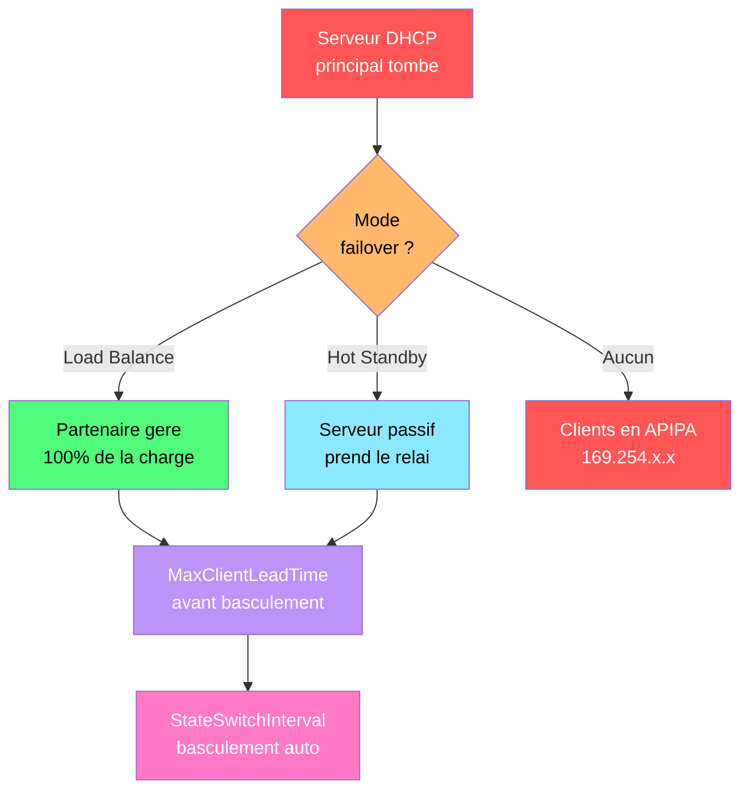

---
tags:
  - registre
  - dhcp
  - reseau
  - adressage
  - serveur
---

# DHCP Server

!!! abstract "Ce que vous allez apprendre"
    - Localiser et comprendre les cles de registre du service DHCP Server
    - Configurer les scopes, reservations et options DHCP via le registre
    - Gerer le failover, l'audit logging et la sauvegarde de la base DHCP
    - Recuperer une base DHCP corrompue en utilisant le registre

---

## Cles du service DHCP Server

```mermaid
sequenceDiagram
    participant C as Client
    participant S as Serveur DHCP
    C->>S: 1. DHCP Discover (broadcast)
    Note over C: "Y a-t-il un serveur DHCP ?"
    S-->>C: 2. DHCP Offer (IP proposee)
    Note over S: "Voici 192.168.1.105"
    C->>S: 3. DHCP Request (acceptation)
    Note over C: "J'accepte 192.168.1.105"
    S-->>C: 4. DHCP ACK (confirmation)
    Note over S: "Bail confirme pour 8h"
    style C fill:#bd93f9,color:#fff
    style S fill:#50fa7b,color:#000
```



Un serveur DHCP qui ne distribue plus d'adresses, un scope epuise, une base de donnees corrompue : ces problemes se diagnostiquent et se corrigent en examinant les cles de registre du service. Le service DHCP Server stocke sa configuration operationnelle sous deux emplacements principaux.

### Emplacement principal du service

```
HKLM\SYSTEM\CurrentControlSet\Services\DHCPServer\Parameters
```

| Valeur | Type | Description | Defaut |
|--------|------|-------------|--------|
| `DatabasePath` | REG_SZ | Chemin vers la base de donnees DHCP (`dhcp.mdb`) | `%SystemRoot%\System32\dhcp` |
| `DatabaseName` | REG_SZ | Nom du fichier de base de donnees | `dhcp.mdb` |
| `BackupDatabasePath` | REG_SZ | Chemin de sauvegarde automatique | `%SystemRoot%\System32\dhcp\backup` |
| `BackupInterval` | REG_DWORD | Intervalle de sauvegarde automatique (en minutes) | 60 |
| `DatabaseLoggingFlag` | REG_DWORD | `1` = journalisation de la base activee | 1 |
| `DatabaseCleanupInterval` | REG_DWORD | Intervalle de nettoyage de la base (en minutes) | 60 |
| `RestoreFlag` | REG_DWORD | `1` = restaurer la base au prochain demarrage du service | 0 |

```powershell
# Read DHCP Server parameters
Get-ItemProperty -Path "HKLM:\SYSTEM\CurrentControlSet\Services\DHCPServer\Parameters" |
    Select-Object DatabasePath, DatabaseName, BackupDatabasePath, BackupInterval
```

```title="Resultat attendu"
DatabasePath       : C:\Windows\System32\dhcp
DatabaseName       : dhcp.mdb
BackupDatabasePath : C:\Windows\System32\dhcp\backup
BackupInterval     : 60
```

### Detection de l'installation DHCP

L'etat d'installation du role DHCP est egalement visible dans le registre du gestionnaire de serveur.

```
HKLM\SOFTWARE\Microsoft\ServerManager\ServicingStorage\ServerComponentCache
```

```powershell
# Check if DHCP Server role is installed
Get-WindowsFeature -Name DHCP | Select-Object Name, InstallState
```

```title="Resultat attendu"
Name InstallState
---- ------------
DHCP    Installed
```

### Parametres du service

```
HKLM\SYSTEM\CurrentControlSet\Services\DHCPServer
```

| Valeur | Type | Description |
|--------|------|-------------|
| `Start` | REG_DWORD | Mode de demarrage : `2` = automatique, `3` = manuel, `4` = desactive |
| `Type` | REG_DWORD | Type de service : `0x10` = service independant |
| `ImagePath` | REG_EXPAND_SZ | Chemin vers l'executable du service |
| `DependOnService` | REG_MULTI_SZ | Services dont depend DHCP (ex : `Tcpip`, `Afd`) |

!!! info "En resume"
    - La configuration principale du DHCP est sous `DHCPServer\Parameters`
    - La base de donnees (`dhcp.mdb`) est sauvegardee automatiquement toutes les 60 minutes
    - `RestoreFlag = 1` declenche une restauration automatique au prochain demarrage du service
    - Le chemin de sauvegarde par defaut est `%SystemRoot%\System32\dhcp\backup`

---

## Scopes et reservations

Les scopes DHCP definissent les plages d'adresses IP distribuees aux clients. Chaque scope est configure dans la base DHCP, mais les parametres de configuration sont accessibles et modifiables via PowerShell et refleches dans le registre.

### Configuration des scopes

```
HKLM\SOFTWARE\Microsoft\DhcpServer\Configuration
```

Cette cle contient la configuration globale du serveur DHCP. Les scopes individuels sont principalement geres dans la base de donnees JET, mais certaines metadonnees apparaissent dans le registre.

```powershell
# List all DHCP scopes
Get-DhcpServerv4Scope | Select-Object ScopeId, Name, SubnetMask, StartRange, EndRange, State |
    Format-Table -AutoSize
```

```title="Resultat attendu"
ScopeId         Name           SubnetMask      StartRange      EndRange        State
-------         ----           ----------      ----------      --------        -----
192.168.1.0     LAN-Paris      255.255.255.0   192.168.1.100   192.168.1.250   Active
192.168.2.0     LAN-Lyon       255.255.255.0   192.168.2.100   192.168.2.250   Active
```

### Creer un scope

```powershell
# Create a new DHCP scope
Add-DhcpServerv4Scope -Name "LAN-Marseille" `
    -StartRange 192.168.3.100 -EndRange 192.168.3.250 `
    -SubnetMask 255.255.255.0 -LeaseDuration 8.00:00:00 `
    -State Active
```

```title="Resultat attendu"
aucune sortie si le scope est cree avec succes.
```

### Plages d'exclusion

Les exclusions reservent des adresses IP du scope pour un usage statique (serveurs, imprimantes).

```powershell
# Add an exclusion range
Add-DhcpServerv4ExclusionRange -ScopeId 192.168.3.0 `
    -StartRange 192.168.3.240 -EndRange 192.168.3.250
```

```title="Resultat attendu"
aucune sortie si l'exclusion est creee avec succes.
```

### Reservations

Les reservations garantissent qu'un client specifique recoit toujours la meme adresse IP, basee sur son adresse MAC.

```powershell
# Create a DHCP reservation
Add-DhcpServerv4Reservation -ScopeId 192.168.1.0 `
    -IPAddress 192.168.1.50 -ClientId "AA-BB-CC-DD-EE-FF" `
    -Name "PRINTER-RDC" -Description "Imprimante rez-de-chaussee"
```

```title="Resultat attendu"
aucune sortie si la reservation est creee avec succes.
```

```powershell
# List all reservations in a scope
Get-DhcpServerv4Reservation -ScopeId 192.168.1.0 |
    Select-Object IPAddress, ClientId, Name | Format-Table -AutoSize
```

```title="Resultat attendu"
IPAddress      ClientId           Name
---------      --------           ----
192.168.1.50   aa-bb-cc-dd-ee-ff  PRINTER-RDC
192.168.1.51   11-22-33-44-55-66  PRINTER-1ER
```

### Statistiques de scope

```powershell
# Check scope utilization
Get-DhcpServerv4ScopeStatistics -ScopeId 192.168.1.0
```

```title="Resultat attendu"
ScopeId            : 192.168.1.0
Free               : 45
InUse              : 106
Reserved           : 2
PercentageInUse    : 70.20
```

!!! warning "Surveiller le taux d'utilisation des scopes"
    Un scope a plus de 80% d'utilisation doit declencher une alerte. A 95%, les nouveaux clients ne recevront plus d'adresse et seront en APIPA (169.254.x.x). Planifiez l'extension du scope ou le nettoyage des baux expires.

!!! info "En resume"
    - Les scopes definissent les plages d'adresses IP distribuees aux clients DHCP
    - Les exclusions reservent des adresses pour un usage statique
    - Les reservations lient une adresse IP a une adresse MAC specifique
    - Surveillez le taux d'utilisation (`Get-DhcpServerv4ScopeStatistics`) pour eviter l'epuisement

---

## Failover et load balancing

Le failover DHCP permet a deux serveurs DHCP de se partager la charge ou de se remplacer mutuellement en cas de panne. Les parametres de failover sont stockes dans la base DHCP et certains sont configurables via le registre.

### Modes de failover

| Mode | Description | Usage typique |
|------|-------------|---------------|
| Load Balance | Les deux serveurs distribuent des adresses (ratio configurable) | Sites avec deux serveurs DHCP co-localises |
| Hot Standby | Un serveur actif, un serveur passif qui prend le relai en cas de panne | Sites distants avec un serveur central et un backup |

### Configurer le failover

```powershell
# Create a failover relationship (load balance mode)
Add-DhcpServerv4Failover -Name "Paris-Failover" `
    -PartnerServer "DHCP02.corp.local" `
    -ScopeId 192.168.1.0 `
    -SharedSecret "S3cur3P@ssw0rd!" `
    -LoadBalancePercent 50 `
    -MaxClientLeadTime 01:00:00 `
    -AutoStateTransition $true `
    -StateSwitchInterval 00:30:00
```

```title="Resultat attendu"
aucune sortie si la relation de failover est creee avec succes.
```

### Parametres de failover dans le registre

```
HKLM\SOFTWARE\Microsoft\DhcpServer\Configuration
```

| Parametre | Description | Defaut |
|-----------|-------------|--------|
| `MaxClientLeadTime` | Delai maximal avant qu'un serveur partenaire ne prenne le relai | 01:00:00 |
| `StateSwitchInterval` | Duree d'attente avant le basculement automatique | non defini |
| `AutoStateTransition` | `1` = basculement automatique active | 0 |

```powershell
# Check failover status
Get-DhcpServerv4Failover | Select-Object Name, Mode, State, PartnerServer,
    LoadBalancePercent | Format-Table -AutoSize
```

```title="Resultat attendu"
Name             Mode         State   PartnerServer        LoadBalancePercent
----             ----         -----   -------------        ------------------
Paris-Failover   LoadBalance  Normal  DHCP02.corp.local                    50
```

### Forcer la replication du failover

```powershell
# Force replication of failover scopes to partner
Invoke-DhcpServerv4FailoverReplication -Name "Paris-Failover" -Force
```

```title="Resultat attendu"
aucune sortie si la replication est effectuee avec succes.
```

!!! tip "Tester le failover"
    Arretez le service DHCP sur le serveur principal et verifiez que les clients recoivent des adresses depuis le partenaire. Utilisez `Get-DhcpServerv4Failover` pour surveiller l'etat de basculement.

!!! info "En resume"
    - Le mode Load Balance repartit la charge entre deux serveurs DHCP
    - Le mode Hot Standby offre un serveur de secours passif
    - `MaxClientLeadTime` et `StateSwitchInterval` controlent la vitesse du basculement
    - Forcez la replication avec `Invoke-DhcpServerv4FailoverReplication` apres modification

---

## Options DHCP

Les options DHCP fournissent aux clients des informations supplementaires : serveurs DNS, passerelle par defaut, duree de bail, serveur NTP, etc.

### Options au niveau du serveur

```powershell
# Set server-level DNS options
Set-DhcpServerv4OptionValue -OptionId 6 -Value "192.168.1.10","192.168.1.11"
Set-DhcpServerv4OptionValue -OptionId 15 -Value "corp.local"
```

```title="Resultat attendu"
aucune sortie si les options sont definies avec succes.
```

### Options au niveau du scope

```powershell
# Set scope-level options (override server-level)
Set-DhcpServerv4OptionValue -ScopeId 192.168.1.0 -OptionId 3 -Value "192.168.1.1"
Set-DhcpServerv4OptionValue -ScopeId 192.168.1.0 -OptionId 6 -Value "192.168.1.10","192.168.1.11"
Set-DhcpServerv4OptionValue -ScopeId 192.168.1.0 -OptionId 51 -Value 691200
```

```title="Resultat attendu"
aucune sortie si les options sont definies avec succes.
```

### Reference des options DHCP courantes

| Option ID | Nom | Type | Description |
|-----------|-----|------|-------------|
| 3 | Router | IP | Passerelle par defaut |
| 6 | DNS Servers | IP | Serveurs DNS |
| 15 | Domain Name | String | Suffixe DNS |
| 42 | NTP Servers | IP | Serveurs de temps |
| 44 | WINS/NBNS | IP | Serveurs WINS |
| 51 | Lease Time | DWORD | Duree du bail (en secondes) |
| 66 | Boot Server Host Name | String | Serveur TFTP pour PXE |
| 67 | Bootfile Name | String | Fichier de boot PXE |
| 119 | Domain Search | String | Liste de suffixes DNS pour la recherche |
| 121 | Classless Static Routes | Binary | Routes statiques CIDR |

### Duree de bail (lease duration)

La duree du bail controle combien de temps un client conserve son adresse IP avant de devoir la renouveler.

| Duree | Usage typique |
|-------|---------------|
| 1 heure | Reseaux Wi-Fi publics, hotspots |
| 8 heures | Postes de travail de bureau |
| 1 jour | Serveurs et equipements fixes |
| 8 jours | Defaut Windows DHCP Server |

```powershell
# Set lease duration to 8 hours for a scope
Set-DhcpServerv4Scope -ScopeId 192.168.1.0 -LeaseDuration 08:00:00
```

```title="Resultat attendu"
aucune sortie si la duree est modifiee avec succes.
```

!!! tip "Baux courts vs baux longs"
    Des baux courts recyclent les adresses plus vite (utile pour les reseaux a forte rotation), mais generent plus de trafic DHCP. Des baux longs reduisent le trafic mais risquent d'epuiser le pool d'adresses si des machines partent sans liberer leur bail.

!!! info "En resume"
    - Les options DHCP au niveau du scope ecrasent les options au niveau du serveur
    - Les options 3 (gateway), 6 (DNS) et 15 (domaine) sont les plus courantes
    - La duree du bail doit etre adaptee au type de reseau et a la rotation des clients
    - Les options 66/67 sont utilisees pour le boot PXE

---

## Audit logging

L'audit logging DHCP enregistre chaque operation (attribution, renouvellement, liberation d'adresse) dans des fichiers journaux. C'est essentiel pour le depannage et la conformite.

### Activer l'audit logging

```
HKLM\SYSTEM\CurrentControlSet\Services\DHCPServer\Parameters
```

| Valeur | Type | Description | Defaut |
|--------|------|-------------|--------|
| `ActivityLogFlag` | REG_DWORD | `1` = audit logging active | 1 |
| `DhcpLogFilesMaxSize` | REG_DWORD | Taille maximale des logs (en Mo) | 70 |
| `AuditLogDir` | REG_SZ | Repertoire des fichiers d'audit | `%SystemRoot%\System32\dhcp` |

```powershell
# Check audit logging status
Get-DhcpServerAuditLog
```

```title="Resultat attendu"
Path             : C:\Windows\System32\dhcp
Enable           : True
MaxMBFileSize    : 70
DiskCheckInterval: 50
MinMBDiskSpace   : 20
```

### Format des journaux d'audit

Les fichiers d'audit portent des noms du type `DhcpSrvLog-Mon.log` (un par jour de la semaine). Chaque ligne contient les champs suivants :

| Champ | Description |
|-------|-------------|
| ID | Code de l'evenement |
| Date | Date de l'evenement |
| Time | Heure de l'evenement |
| Description | Action effectuee |
| IP Address | Adresse attribuee/liberee |
| Host Name | Nom du client |
| MAC Address | Adresse MAC du client |

### Codes d'evenement DHCP courants

| ID | Evenement |
|----|-----------|
| 10 | New lease |
| 11 | Lease renewed |
| 12 | Lease released |
| 13 | Duplicate IP found |
| 14 | Lease expired |
| 15 | Lease deleted |
| 20 | BOOTP lease |
| 30 | DNS update request |
| 31 | DNS update failed |
| 32 | DNS update successful |
| 50+ | Rogue server detection |

```powershell
# Read today's DHCP audit log
$day = (Get-Date).ToString("ddd", [System.Globalization.CultureInfo]::InvariantCulture)
$logFile = "C:\Windows\System32\dhcp\DhcpSrvLog-$day.log"
Get-Content $logFile -Tail 20
```

```title="Resultat attendu"
10,04/04/2026,10:15:22,Assign,192.168.1.105,PC-COMPTA01,AA-BB-CC-DD-EE-01,,0,6,,,,,,,,,0
11,04/04/2026,10:30:45,Renew,192.168.1.110,PC-RH02,AA-BB-CC-DD-EE-02,,0,6,,,,,,,,,0
12,04/04/2026,10:45:12,Release,192.168.1.115,PC-TEMP01,AA-BB-CC-DD-EE-03,,0,6,,,,,,,,,0
```

!!! info "En resume"
    - L'audit logging est active par defaut (`ActivityLogFlag = 1`)
    - Les journaux sont rotatifs sur 7 jours (un fichier par jour)
    - Les codes 10-15 couvrent le cycle de vie complet des baux
    - Les codes 30-32 tracent les mises a jour DNS dynamiques

---

## Sauvegarde et restauration

Le service DHCP Server effectue une sauvegarde automatique de sa base de donnees toutes les 60 minutes. En cas de corruption, la restauration peut se faire via le registre ou les commandes PowerShell.

### Sauvegarde automatique

La sauvegarde automatique est configuree via le registre :

```
HKLM\SYSTEM\CurrentControlSet\Services\DHCPServer\Parameters
```

| Valeur | Type | Description | Defaut |
|--------|------|-------------|--------|
| `BackupDatabasePath` | REG_SZ | Repertoire de sauvegarde | `%SystemRoot%\System32\dhcp\backup` |
| `BackupInterval` | REG_DWORD | Intervalle de sauvegarde (en minutes) | 60 |

```powershell
# Verify backup exists
Get-ChildItem -Path "C:\Windows\System32\dhcp\backup" -Recurse |
    Select-Object Name, LastWriteTime, Length | Format-Table -AutoSize
```

```title="Resultat attendu"
Name                    LastWriteTime           Length
----                    -------------           ------
DhcpCfg                 04/04/2026 10:00:00     262144
dhcp.mdb                04/04/2026 10:00:00    1048576
```

### Sauvegarde manuelle

```powershell
# Create a manual backup
Backup-DhcpServer -Path "D:\DHCP-Backup\$(Get-Date -Format 'yyyy-MM-dd')"
```

```title="Resultat attendu"
aucune sortie si la sauvegarde est creee avec succes.
```

### Exporter la configuration complete

```powershell
# Export full DHCP configuration (scopes, reservations, options)
Export-DhcpServer -File "D:\DHCP-Backup\dhcp-export.xml" -Leases
```

```title="Resultat attendu"
aucune sortie si l'export est termine avec succes.
```

!!! tip "Sauvegardes hors serveur"
    La sauvegarde automatique ecrit dans le meme disque que la base. Configurez `BackupDatabasePath` vers un lecteur different ou ajoutez une tache planifiee pour copier les backups vers un partage reseau.

!!! info "En resume"
    - La sauvegarde automatique se fait toutes les 60 minutes vers `dhcp\backup`
    - `Export-DhcpServer` avec `-Leases` exporte la configuration complete en XML
    - Changez `BackupDatabasePath` pour stocker les sauvegardes sur un autre disque
    - Testez regulierement la restauration pour valider vos sauvegardes

---

## Scenario : recuperer une base DHCP corrompue

### Contexte

Apres une coupure de courant, le serveur DHCP principal ne demarre plus. L'Event Log affiche l'erreur suivante :

```
Event ID 1014: The DHCP service is shutting down because the JET database
returned the following error: -1022 (JET_errDiskIO).
```

Les clients du reseau n'obtiennent plus d'adresse IP et sont en APIPA (169.254.x.x).

### Etape 1 : verifier l'etat du service

```powershell
# Check DHCP service status
Get-Service DHCPServer | Select-Object Name, Status, StartType
```

```title="Resultat attendu"
Name        Status StartType
----        ------ ---------
DHCPServer Stopped Automatic
```

### Etape 2 : verifier la base de donnees

```powershell
# Check database file integrity
$dbPath = (Get-ItemPropertyValue -Path "HKLM:\SYSTEM\CurrentControlSet\Services\DHCPServer\Parameters" `
    -Name "DatabasePath")
$dbFile = Join-Path $dbPath "dhcp.mdb"

[PSCustomObject]@{
    Path   = $dbFile
    Exists = Test-Path $dbFile
    Size   = if (Test-Path $dbFile) { (Get-Item $dbFile).Length } else { "N/A" }
}
```

```title="Resultat attendu"
Path                                Exists    Size
----                                ------    ----
C:\Windows\System32\dhcp\dhcp.mdb     True       0
```

La base fait 0 octets : elle est corrompue.

### Etape 3 : restaurer via le registre (RestoreFlag)

La methode la plus fiable est de declencher une restauration automatique via le flag de registre.

```powershell
# Step 1: Stop the DHCP service (if not already stopped)
Stop-Service DHCPServer -Force -ErrorAction SilentlyContinue

# Step 2: Verify that the backup exists
$backupPath = Get-ItemPropertyValue `
    -Path "HKLM:\SYSTEM\CurrentControlSet\Services\DHCPServer\Parameters" `
    -Name "BackupDatabasePath"
Get-ChildItem -Path $backupPath -Recurse | Select-Object Name, LastWriteTime, Length
```

```title="Resultat attendu"
Name                    LastWriteTime           Length
----                    -------------           ------
DhcpCfg                 04/04/2026 09:00:00     262144
dhcp.mdb                04/04/2026 09:00:00    1048576
```

```powershell
# Step 3: Set the restore flag in registry
Set-ItemProperty -Path "HKLM:\SYSTEM\CurrentControlSet\Services\DHCPServer\Parameters" `
    -Name "RestoreFlag" -Value 1 -Type DWord

# Verify the flag is set
Get-ItemPropertyValue -Path "HKLM:\SYSTEM\CurrentControlSet\Services\DHCPServer\Parameters" `
    -Name "RestoreFlag"
```

```title="Resultat attendu"
1
```

```powershell
# Step 4: Start the DHCP service (it will restore from backup automatically)
Start-Service DHCPServer
```

```title="Resultat attendu"
aucune sortie si le service demarre avec succes. Le service lit le flag RestoreFlag, 
copie la base depuis le repertoire de sauvegarde, puis remet RestoreFlag a 0.
```

### Etape 4 : verifier la restauration

```powershell
# Verify service is running
Get-Service DHCPServer | Select-Object Name, Status
```

```title="Resultat attendu"
Name        Status
----        ------
DHCPServer Running
```

```powershell
# Verify RestoreFlag is back to 0
Get-ItemPropertyValue -Path "HKLM:\SYSTEM\CurrentControlSet\Services\DHCPServer\Parameters" `
    -Name "RestoreFlag"
```

```title="Resultat attendu"
0
```

```powershell
# Verify scopes are back
Get-DhcpServerv4Scope | Select-Object ScopeId, Name, State | Format-Table -AutoSize
```

```title="Resultat attendu"
ScopeId         Name           State
-------         ----           -----
192.168.1.0     LAN-Paris      Active
192.168.2.0     LAN-Lyon       Active
```

### Etape 5 : restauration manuelle (si le backup automatique est absent)

Si le repertoire de backup est egalement corrompu, utilisez un export XML precedent.

```powershell
# Restore from XML export
Import-DhcpServer -File "D:\DHCP-Backup\dhcp-export.xml" -BackupPath "D:\DHCP-Backup\pre-import" `
    -Leases -ScopeOverwrite -Force
```

```title="Resultat attendu"
aucune sortie si l'import est termine avec succes.
```

### Etape 6 : actions post-restauration

```powershell
# Authorize the DHCP server in AD (if needed after rebuild)
Add-DhcpServerInDC -DnsName "DHCP01.corp.local" -IPAddress "192.168.1.5"

# Verify authorization
Get-DhcpServerInDC
```

```title="Resultat attendu"
IPAddress       DnsName
---------       -------
192.168.1.5     DHCP01.corp.local
```

```powershell
# Force a scope reconcile to fix inconsistencies
Repair-DhcpServerv4IPRecord -ScopeId 192.168.1.0 -Force
```

```title="Resultat attendu"
aucune sortie si la reconciliation est terminee sans erreur.
```

!!! danger "Prevention : sauvegardez regulierement sur un support externe"
    La sauvegarde automatique est ecrite sur le meme serveur que la base. Si le disque est corrompu, vous perdez les deux. Mettez en place :

    - Un export XML quotidien vers un partage reseau
    - Une copie des fichiers de backup vers un stockage distant
    - Un test de restauration mensuel

!!! tip "Checklist post-restauration"
    Apres avoir restaure une base DHCP, verifiez systematiquement :

    - Le service est en etat `Running`
    - `RestoreFlag` est revenu a `0`
    - Tous les scopes sont actifs (`Get-DhcpServerv4Scope`)
    - Le serveur est autorise dans AD (`Get-DhcpServerInDC`)
    - Les clients obtiennent des adresses (`ipconfig /renew` sur un poste test)
    - L'audit logging est actif (`Get-DhcpServerAuditLog`)

!!! info "En resume"
    - `RestoreFlag = 1` declenche une restauration automatique de la base au prochain demarrage du service
    - Le service remet `RestoreFlag` a `0` apres une restauration reussie
    - Si le backup automatique est absent, utilisez `Import-DhcpServer` avec un export XML
    - Apres toute restauration, verifiez l'autorisation AD et reconciliez les scopes
