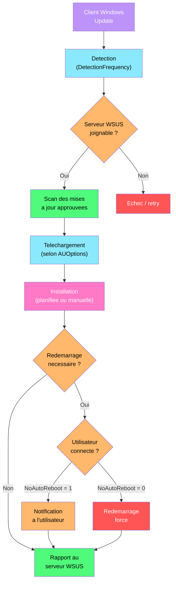

---
tags:
  - registre
  - wsus
  - mises-a-jour
  - windows-update
  - deploiement
---

# WSUS

!!! abstract "Ce que vous allez apprendre"
    - Configurer les clients WSUS via les cles de registre
    - Gerer le ciblage de groupe, les deferrals et le comportement des mises a jour automatiques
    - Comprendre les cles cote serveur WSUS (IIS, base, contenu)
    - Diagnostiquer et forcer la resynchronisation d'un client WSUS

---

## Configuration client WSUS



Un poste qui ne remonte plus dans la console WSUS, des mises a jour qui ne s'installent pas, un client qui ignore le serveur WSUS et va directement sur Microsoft Update : ces problemes viennent presque toujours de la configuration du registre client. Les parametres WSUS cote client sont centralises sous une seule cle.

### Emplacement principal

```
HKLM\SOFTWARE\Policies\Microsoft\Windows\WindowsUpdate
```

Cette cle contient les parametres qui pointent le client vers le serveur WSUS et definissent le comportement des mises a jour.

| Valeur | Type | Description | Defaut |
|--------|------|-------------|--------|
| `WUServer` | REG_SZ | URL du serveur WSUS (ex : `http://wsus01.corp.local:8530`) | (vide) |
| `WUStatusServer` | REG_SZ | URL du serveur de rapports (generalement identique a `WUServer`) | (vide) |
| `ElevateNonAdmins` | REG_DWORD | `1` = les non-administrateurs peuvent approuver les mises a jour | 0 |
| `TargetGroupEnabled` | REG_DWORD | `1` = ciblage cote client active | 0 |
| `TargetGroup` | REG_SZ | Nom du groupe cible (ex : `Servers-Production`) | (vide) |
| `AcceptTrustedPublisherCerts` | REG_DWORD | `1` = accepte les certificats d'editeurs approuves | 0 |

```powershell
# Read WSUS client configuration
Get-ItemProperty -Path "HKLM:\SOFTWARE\Policies\Microsoft\Windows\WindowsUpdate" |
    Select-Object WUServer, WUStatusServer, TargetGroupEnabled, TargetGroup
```

```title="Resultat attendu"
WUServer           : http://wsus01.corp.local:8530
WUStatusServer     : http://wsus01.corp.local:8530
TargetGroupEnabled : 1
TargetGroup        : Desktops-Paris
```

!!! warning "WUServer et WUStatusServer doivent etre identiques"
    Si `WUServer` et `WUStatusServer` pointent vers des URLs differentes (ou si l'un est manquant), le client ne remontera pas correctement dans la console WSUS. Les deux valeurs doivent contenir **exactement** la meme URL, port inclus.

### Configurer un client WSUS manuellement

```powershell
# Set WSUS server URL (usually deployed via GPO)
$wuPath = "HKLM:\SOFTWARE\Policies\Microsoft\Windows\WindowsUpdate"
if (-not (Test-Path $wuPath)) { New-Item -Path $wuPath -Force | Out-Null }

Set-ItemProperty -Path $wuPath -Name "WUServer" -Value "http://wsus01.corp.local:8530"
Set-ItemProperty -Path $wuPath -Name "WUStatusServer" -Value "http://wsus01.corp.local:8530"
Set-ItemProperty -Path $wuPath -Name "TargetGroupEnabled" -Value 1 -Type DWord
Set-ItemProperty -Path $wuPath -Name "TargetGroup" -Value "Desktops-Paris"
```

```title="Resultat attendu"
aucune sortie si les valeurs sont definies avec succes.
```

!!! info "En resume"
    - `WUServer` pointe le client vers le serveur WSUS
    - `WUStatusServer` doit etre identique a `WUServer`
    - `TargetGroupEnabled = 1` + `TargetGroup` permettent le ciblage cote client
    - Ces valeurs sont normalement deployees par GPO, pas manuellement

---

## Comportement des mises a jour automatiques

Le comportement du client Windows Update (telechargement, installation, redemarrage) est controle par la sous-cle `AU` (Automatic Updates).

### Parametres AU

```
HKLM\SOFTWARE\Policies\Microsoft\Windows\WindowsUpdate\AU
```

| Valeur | Type | Description | Defaut |
|--------|------|-------------|--------|
| `NoAutoUpdate` | REG_DWORD | `1` = desactive les mises a jour automatiques | 0 |
| `AUOptions` | REG_DWORD | Comportement des mises a jour (voir tableau ci-dessous) | 3 |
| `ScheduledInstallDay` | REG_DWORD | Jour d'installation : `0` = tous les jours, `1` = dimanche ... `7` = samedi | 0 |
| `ScheduledInstallTime` | REG_DWORD | Heure d'installation (0-23) | 3 |
| `ScheduledInstallEveryWeek` | REG_DWORD | `1` = toutes les semaines | 1 |
| `UseWUServer` | REG_DWORD | `1` = utilise le serveur WSUS, `0` = Microsoft Update | 0 |
| `NoAutoRebootWithLoggedOnUsers` | REG_DWORD | `1` = pas de redemarrage automatique si un utilisateur est connecte | 0 |
| `AlwaysAutoRebootAtScheduledTime` | REG_DWORD | `1` = force le redemarrage a l'heure planifiee | 0 |
| `AlwaysAutoRebootAtScheduledTimeMinutes` | REG_DWORD | Delai (en minutes) avant le redemarrage force | 15 |
| `DetectionFrequency` | REG_DWORD | Intervalle de detection des mises a jour (en heures, 1-22) | 22 |
| `DetectionFrequencyEnabled` | REG_DWORD | `1` = intervalle de detection personnalise active | 0 |
| `RebootRelaunchTimeout` | REG_DWORD | Delai (en minutes) avant de re-proposer le redemarrage | 10 |
| `RebootRelaunchTimeoutEnabled` | REG_DWORD | `1` = delai de re-proposition active | 0 |

### Options AUOptions

| Valeur | Comportement |
|--------|-------------|
| 2 | Notifier avant le telechargement et l'installation |
| 3 | Telecharger automatiquement, notifier avant l'installation |
| 4 | Telecharger et installer automatiquement selon la planification |
| 5 | Permettre a l'administrateur local de choisir |

```powershell
# Read current AU settings
$auPath = "HKLM:\SOFTWARE\Policies\Microsoft\Windows\WindowsUpdate\AU"
Get-ItemProperty -Path $auPath |
    Select-Object AUOptions, UseWUServer, ScheduledInstallDay, ScheduledInstallTime,
        NoAutoRebootWithLoggedOnUsers
```

```title="Resultat attendu"
AUOptions                      : 4
UseWUServer                    : 1
ScheduledInstallDay            : 0
ScheduledInstallTime           : 3
NoAutoRebootWithLoggedOnUsers  : 1
```

### Configuration type pour un parc de postes de travail

```powershell
# Configure automatic download + scheduled install at 3 AM every day
$auPath = "HKLM:\SOFTWARE\Policies\Microsoft\Windows\WindowsUpdate\AU"
if (-not (Test-Path $auPath)) { New-Item -Path $auPath -Force | Out-Null }

Set-ItemProperty -Path $auPath -Name "NoAutoUpdate" -Value 0 -Type DWord
Set-ItemProperty -Path $auPath -Name "AUOptions" -Value 4 -Type DWord
Set-ItemProperty -Path $auPath -Name "UseWUServer" -Value 1 -Type DWord
Set-ItemProperty -Path $auPath -Name "ScheduledInstallDay" -Value 0 -Type DWord
Set-ItemProperty -Path $auPath -Name "ScheduledInstallTime" -Value 3 -Type DWord
Set-ItemProperty -Path $auPath -Name "NoAutoRebootWithLoggedOnUsers" -Value 1 -Type DWord
```

```title="Resultat attendu"
aucune sortie si les valeurs sont definies avec succes.
```

### Configuration type pour des serveurs de production

```powershell
# Configure notify-only mode for production servers
$auPath = "HKLM:\SOFTWARE\Policies\Microsoft\Windows\WindowsUpdate\AU"
if (-not (Test-Path $auPath)) { New-Item -Path $auPath -Force | Out-Null }

Set-ItemProperty -Path $auPath -Name "NoAutoUpdate" -Value 0 -Type DWord
Set-ItemProperty -Path $auPath -Name "AUOptions" -Value 2 -Type DWord
Set-ItemProperty -Path $auPath -Name "UseWUServer" -Value 1 -Type DWord
Set-ItemProperty -Path $auPath -Name "NoAutoRebootWithLoggedOnUsers" -Value 1 -Type DWord
Set-ItemProperty -Path $auPath -Name "AlwaysAutoRebootAtScheduledTime" -Value 0 -Type DWord
```

```title="Resultat attendu"
aucune sortie si les valeurs sont definies avec succes.
```

!!! danger "UseWUServer = 1 est obligatoire"
    Meme si `WUServer` et `WUStatusServer` sont definis, le client ignorera le serveur WSUS si `UseWUServer` n'est pas a `1`. C'est l'erreur de configuration la plus frequente.

!!! info "En resume"
    - `AUOptions` controle le niveau d'automatisation (notification, telechargement, installation)
    - `UseWUServer = 1` est **indispensable** pour que le client utilise le serveur WSUS
    - `NoAutoRebootWithLoggedOnUsers = 1` empeche les redemarrages intempestifs
    - Adaptez `AUOptions` selon le type de machine : `4` pour les postes, `2` pour les serveurs

---

## Prevention du Dual Scan

A partir de Windows 10 1607, le mecanisme de "dual scan" permet aux clients de verifier les mises a jour a la fois sur WSUS **et** sur Microsoft Update. Cela pose probleme en entreprise car les clients peuvent installer des mises a jour non approuvees.

### Le probleme du Dual Scan

Lorsque le dual scan est actif, le client Windows :

1. Verifie les mises a jour sur le serveur WSUS (mises a jour approuvees)
2. Verifie **aussi** sur Microsoft Update (toutes les mises a jour disponibles)
3. Installe potentiellement des mises a jour non testees et non approuvees

### Desactiver le Dual Scan

```
HKLM\SOFTWARE\Policies\Microsoft\Windows\WindowsUpdate
```

| Valeur | Type | Description | Defaut |
|--------|------|-------------|--------|
| `DisableDualScan` | REG_DWORD | `1` = desactive le dual scan | 0 |
| `DoNotConnectToWindowsUpdateInternetLocations` | REG_DWORD | `1` = interdit les connexions a Microsoft Update | 0 |

```powershell
# Disable dual scan
$wuPath = "HKLM:\SOFTWARE\Policies\Microsoft\Windows\WindowsUpdate"
Set-ItemProperty -Path $wuPath -Name "DisableDualScan" -Value 1 -Type DWord
Set-ItemProperty -Path $wuPath -Name "DoNotConnectToWindowsUpdateInternetLocations" `
    -Value 1 -Type DWord
```

```title="Resultat attendu"
aucune sortie si les valeurs sont definies avec succes.
```

!!! warning "Impact sur les feature updates"
    `DoNotConnectToWindowsUpdateInternetLocations = 1` empeche egalement le telechargement des feature updates depuis Microsoft Update. Si vous utilisez WSUS pour les quality updates mais Microsoft Update pour les feature updates, ne definissez **pas** cette valeur.

### Verifier l'etat du Dual Scan

```powershell
# Check dual scan configuration
$wuPath = "HKLM:\SOFTWARE\Policies\Microsoft\Windows\WindowsUpdate"
[PSCustomObject]@{
    DisableDualScan = (Get-ItemProperty -Path $wuPath -ErrorAction SilentlyContinue).DisableDualScan
    DoNotConnect    = (Get-ItemProperty -Path $wuPath -ErrorAction SilentlyContinue).DoNotConnectToWindowsUpdateInternetLocations
}
```

```title="Resultat attendu"
DisableDualScan DoNotConnect
--------------- ------------
              1            1
```

!!! info "En resume"
    - Le dual scan est un piege courant : les clients installent des mises a jour non approuvees
    - `DisableDualScan = 1` force le client a n'utiliser que le serveur WSUS
    - `DoNotConnectToWindowsUpdateInternetLocations = 1` bloque les connexions a Microsoft Update
    - Attention : ces parametres bloquent aussi les feature updates depuis Microsoft Update

---

## Deferral des mises a jour

Les deferrals (reports) permettent de retarder l'installation des feature updates et des quality updates. C'est essentiel pour les environnements qui necessitent des tests avant deploiement.

### Feature update deferral

```
HKLM\SOFTWARE\Policies\Microsoft\Windows\WindowsUpdate
```

| Valeur | Type | Description | Defaut |
|--------|------|-------------|--------|
| `DeferFeatureUpdates` | REG_DWORD | `1` = active le report des feature updates | 0 |
| `DeferFeatureUpdatesPeriodInDays` | REG_DWORD | Nombre de jours de report (0-365) | 0 |
| `BranchReadinessLevel` | REG_DWORD | Canal de servicing (voir tableau) | 16 |
| `PauseFeatureUpdatesStartTime` | REG_SZ | Date de debut de pause (format ISO 8601) | (vide) |

### Quality update deferral

| Valeur | Type | Description | Defaut |
|--------|------|-------------|--------|
| `DeferQualityUpdates` | REG_DWORD | `1` = active le report des quality updates | 0 |
| `DeferQualityUpdatesPeriodInDays` | REG_DWORD | Nombre de jours de report (0-30) | 0 |
| `PauseQualityUpdatesStartTime` | REG_SZ | Date de debut de pause (format ISO 8601) | (vide) |

### Branch Readiness Level

| Valeur | Canal |
|--------|-------|
| 2 | Windows Insider - Fast |
| 4 | Windows Insider - Slow |
| 8 | Windows Insider - Release Preview |
| 16 | Semi-Annual Channel (defaut) |
| 32 | General Availability Channel |

### Configuration type pour un deploiement progressif

```powershell
# Defer feature updates by 90 days and quality updates by 14 days
$wuPath = "HKLM:\SOFTWARE\Policies\Microsoft\Windows\WindowsUpdate"

Set-ItemProperty -Path $wuPath -Name "DeferFeatureUpdates" -Value 1 -Type DWord
Set-ItemProperty -Path $wuPath -Name "DeferFeatureUpdatesPeriodInDays" -Value 90 -Type DWord
Set-ItemProperty -Path $wuPath -Name "DeferQualityUpdates" -Value 1 -Type DWord
Set-ItemProperty -Path $wuPath -Name "DeferQualityUpdatesPeriodInDays" -Value 14 -Type DWord
Set-ItemProperty -Path $wuPath -Name "BranchReadinessLevel" -Value 32 -Type DWord
```

```title="Resultat attendu"
aucune sortie si les valeurs sont definies avec succes.
```

### Strategie de deploiement en vagues

| Vague | Groupe WSUS | Feature Deferral | Quality Deferral |
|-------|-------------|------------------|------------------|
| 1 - Pilotes | `Pilot-IT` | 0 jours | 0 jours |
| 2 - Early Adopters | `Early-Adopters` | 14 jours | 3 jours |
| 3 - Production | `Production` | 90 jours | 14 jours |
| 4 - Critique | `Critical-Servers` | 180 jours | 30 jours |

!!! tip "Combiner deferrals et approbations WSUS"
    Les deferrals fonctionnent **en complement** des approbations WSUS, pas en remplacement. Un quality update approuve dans WSUS sera quand meme reporte si un deferral est configure. Utilisez les deux mecanismes ensemble pour un controle maximal.

!!! info "En resume"
    - Les feature updates peuvent etre reportees jusqu'a 365 jours
    - Les quality updates peuvent etre reportees jusqu'a 30 jours
    - `BranchReadinessLevel` determine le canal de servicing
    - Deployez en vagues progressives : pilotes, early adopters, production, critique

---

## Ciblage de groupe via le registre

Le ciblage cote client (client-side targeting) permet d'assigner automatiquement un client a un groupe WSUS via le registre, sans intervention manuelle dans la console WSUS.

### Activer le ciblage cote client

```
HKLM\SOFTWARE\Policies\Microsoft\Windows\WindowsUpdate
```

| Valeur | Type | Description |
|--------|------|-------------|
| `TargetGroupEnabled` | REG_DWORD | `1` = ciblage cote client active |
| `TargetGroup` | REG_SZ | Nom exact du groupe cible dans WSUS |

```powershell
# Enable client-side targeting
$wuPath = "HKLM:\SOFTWARE\Policies\Microsoft\Windows\WindowsUpdate"
Set-ItemProperty -Path $wuPath -Name "TargetGroupEnabled" -Value 1 -Type DWord
Set-ItemProperty -Path $wuPath -Name "TargetGroup" -Value "Desktops-Paris"
```

```title="Resultat attendu"
aucune sortie si les valeurs sont definies avec succes.
```

### Deploiement par GPO

En environnement AD, le ciblage de groupe est generalement deploye via GPO avec des filtres WMI ou des groupes de securite.

| Methode | Avantage | Inconvenient |
|---------|----------|-------------|
| GPO avec filtre WMI | Ciblage automatique par OS, modele, site | Complexite des requetes WMI |
| GPO avec groupe de securite | Controle granulaire par machine | Maintenance manuelle des groupes |
| GPO par OU | Simple et hierarchique | Necessite une OU dediee par groupe |
| Script de deploiement | Flexible, logique conditionnelle | Necessite un mecanisme de distribution |

### Verifier le groupe cible d'un client

```powershell
# Check target group assignment
$wuPath = "HKLM:\SOFTWARE\Policies\Microsoft\Windows\WindowsUpdate"
[PSCustomObject]@{
    TargetGroupEnabled = (Get-ItemProperty -Path $wuPath).TargetGroupEnabled
    TargetGroup        = (Get-ItemProperty -Path $wuPath).TargetGroup
    WUServer           = (Get-ItemProperty -Path $wuPath).WUServer
}
```

```title="Resultat attendu"
TargetGroupEnabled TargetGroup      WUServer
------------------ -----------      --------
                 1 Desktops-Paris   http://wsus01.corp.local:8530
```

!!! warning "Le groupe doit exister dans WSUS"
    Le nom specifie dans `TargetGroup` doit correspondre **exactement** a un groupe existant dans la console WSUS. Si le groupe n'existe pas, le client apparaitra dans le groupe "Unassigned Computers".

!!! info "En resume"
    - `TargetGroupEnabled = 1` + `TargetGroup` permettent l'auto-assignation des clients
    - Le nom du groupe doit correspondre exactement a celui configure dans WSUS
    - Le deploiement par GPO est la methode recommandee en environnement AD
    - Combinez filtres WMI et groupes de securite pour un ciblage precis

---

## Cles cote serveur WSUS

Le serveur WSUS lui-meme possede des cles de registre qui definissent son fonctionnement : bindings IIS, chemin du contenu, base de donnees, etc.

### Configuration IIS et port

```
HKLM\SOFTWARE\Microsoft\Update Services\Server\Setup
```

| Valeur | Type | Description | Defaut |
|--------|------|-------------|--------|
| `PortNumber` | REG_DWORD | Port HTTP du site WSUS | 8530 |
| `UsingSSL` | REG_DWORD | `1` = HTTPS active | 0 |
| `ContentDir` | REG_SZ | Repertoire de stockage du contenu des mises a jour | `C:\WSUS` |
| `SqlServerName` | REG_SZ | Nom de l'instance SQL (WID ou SQL Server) | `\\.\pipe\Microsoft##WID\tsql\query` |
| `SqlDatabaseName` | REG_SZ | Nom de la base de donnees | `SUSDB` |
| `ContentLocal` | REG_DWORD | `1` = contenu stocke localement, `0` = telechargement direct | 1 |

```powershell
# Read WSUS server configuration
$wsusPath = "HKLM:\SOFTWARE\Microsoft\Update Services\Server\Setup"
Get-ItemProperty -Path $wsusPath |
    Select-Object PortNumber, UsingSSL, ContentDir, SqlServerName, SqlDatabaseName
```

```title="Resultat attendu"
PortNumber    : 8530
UsingSSL      : 0
ContentDir    : D:\WSUS
SqlServerName : \\.\pipe\Microsoft##WID\tsql\query
SqlDatabaseName : SUSDB
```

### Chemin du contenu

Le contenu des mises a jour (fichiers `.cab`, `.msu`, `.exe`) est stocke dans le repertoire defini par `ContentDir`. Ce repertoire peut atteindre plusieurs centaines de Go.

```powershell
# Check content directory size
$contentDir = (Get-ItemPropertyValue `
    -Path "HKLM:\SOFTWARE\Microsoft\Update Services\Server\Setup" `
    -Name "ContentDir")
$size = (Get-ChildItem -Path $contentDir -Recurse -ErrorAction SilentlyContinue |
    Measure-Object -Property Length -Sum).Sum / 1GB
[PSCustomObject]@{
    Path    = $contentDir
    SizeGB  = [math]::Round($size, 2)
}
```

```title="Resultat attendu"
Path       SizeGB
----       ------
D:\WSUS    127.45
```

### Base de donnees WSUS (WID vs SQL Server)

| Configuration | SqlServerName | Usage |
|---------------|---------------|-------|
| WID (Windows Internal Database) | `\\.\pipe\Microsoft##WID\tsql\query` | Petits a moyens deploiements (< 25000 clients) |
| SQL Server | `SQLSERVER01\WSUS` | Grands deploiements, reporting avance |

```powershell
# Check WSUS database type
$sqlServer = Get-ItemPropertyValue `
    -Path "HKLM:\SOFTWARE\Microsoft\Update Services\Server\Setup" `
    -Name "SqlServerName"

if ($sqlServer -like "*WID*") {
    Write-Output "WSUS uses Windows Internal Database (WID)"
} else {
    Write-Output "WSUS uses SQL Server: $sqlServer"
}
```

```title="Resultat attendu"
WSUS uses Windows Internal Database (WID)
```

!!! tip "Espace disque pour le contenu"
    Surveillez regulierement l'espace disque du repertoire de contenu. Utilisez le "Server Cleanup Wizard" dans la console WSUS ou la commande `Invoke-WsusServerCleanup` pour liberer de l'espace en supprimant les mises a jour expirees et remplacees.

```powershell
# Clean up WSUS content
Invoke-WsusServerCleanup -CleanupObsoleteUpdates -CleanupUnneededContentFiles `
    -DeclineSupersededUpdates -DeclineExpiredUpdates
```

```title="Resultat attendu"
Obsolete Updates Deleted: 342
Obsolete Revisions Deleted: 1205
Declined Expired Updates: 28
Superseded Updates Declined: 156
Disk Space Freed: 12.4 GB
```

!!! info "En resume"
    - Les parametres serveur WSUS sont sous `Update Services\Server\Setup`
    - WID est adapte aux deploiements de moins de 25 000 clients
    - Le repertoire de contenu (`ContentDir`) doit etre surveille et nettoye regulierement
    - `Invoke-WsusServerCleanup` libere de l'espace disque en supprimant le contenu obsolete

---

## Scenario : forcer la resynchronisation d'un client WSUS

### Contexte

Un poste de travail n'apparait plus dans la console WSUS depuis 30 jours. L'administrateur a verifie que le poste est allume et connecte au reseau, mais il ne remonte pas dans le groupe cible.

### Etape 1 : verifier la configuration client

```powershell
# Check WSUS client configuration
$wuPath = "HKLM:\SOFTWARE\Policies\Microsoft\Windows\WindowsUpdate"
$auPath = "$wuPath\AU"

[PSCustomObject]@{
    WUServer           = (Get-ItemProperty -Path $wuPath -ErrorAction SilentlyContinue).WUServer
    WUStatusServer     = (Get-ItemProperty -Path $wuPath -ErrorAction SilentlyContinue).WUStatusServer
    UseWUServer        = (Get-ItemProperty -Path $auPath -ErrorAction SilentlyContinue).UseWUServer
    TargetGroupEnabled = (Get-ItemProperty -Path $wuPath -ErrorAction SilentlyContinue).TargetGroupEnabled
    TargetGroup        = (Get-ItemProperty -Path $wuPath -ErrorAction SilentlyContinue).TargetGroup
}
```

```title="Resultat attendu"
WUServer           : http://wsus01.corp.local:8530
WUStatusServer     : http://wsus01.corp.local:8530
UseWUServer        : 1
TargetGroupEnabled : 1
TargetGroup        : Desktops-Paris
```

La configuration semble correcte. Passons a l'etat du service Windows Update.

### Etape 2 : verifier le service Windows Update

```powershell
# Check Windows Update service status
Get-Service wuauserv | Select-Object Name, Status, StartType
```

```title="Resultat attendu"
Name     Status  StartType
----     ------  ---------
wuauserv Running    Manual
```

### Etape 3 : verifier la connectivite au serveur WSUS

```powershell
# Test connectivity to WSUS server
$wsusUrl = (Get-ItemPropertyValue `
    -Path "HKLM:\SOFTWARE\Policies\Microsoft\Windows\WindowsUpdate" `
    -Name "WUServer")
try {
    $response = Invoke-WebRequest -Uri "$wsusUrl/ClientWebService/client.asmx" `
        -UseBasicParsing -TimeoutSec 10
    Write-Output "WSUS reachable - Status: $($response.StatusCode)"
} catch {
    Write-Output "WSUS unreachable - Error: $($_.Exception.Message)"
}
```

```title="Resultat attendu"
WSUS reachable - Status: 200
```

### Etape 4 : reinitialiser l'identifiant client

Le probleme le plus frequent est un identifiant client duplique (SusClientId). Cela arrive souvent apres un clonage de machine.

```powershell
# Check current SusClientId
$suPath = "HKLM:\SOFTWARE\Microsoft\Windows\CurrentVersion\WindowsUpdate"
[PSCustomObject]@{
    SusClientId       = (Get-ItemProperty -Path $suPath).SusClientId
    SusClientIdValidation = (Get-ItemProperty -Path $suPath).SusClientIdValidation
    AccountDomainSid  = (Get-ItemProperty -Path $suPath).AccountDomainSid
}
```

```title="Resultat attendu"
SusClientId             : a1b2c3d4-e5f6-7890-abcd-ef1234567890
SusClientIdValidation   : {binary data}
AccountDomainSid        : S-1-5-21-...
```

```powershell
# Reset the WSUS client identity
Stop-Service wuauserv -Force

# Remove the SusClientId (will be regenerated)
$suPath = "HKLM:\SOFTWARE\Microsoft\Windows\CurrentVersion\WindowsUpdate"
Remove-ItemProperty -Path $suPath -Name "SusClientId" -ErrorAction SilentlyContinue
Remove-ItemProperty -Path $suPath -Name "SusClientIdValidation" -ErrorAction SilentlyContinue
Remove-ItemProperty -Path $suPath -Name "AccountDomainSid" -ErrorAction SilentlyContinue
Remove-ItemProperty -Path $suPath -Name "PingID" -ErrorAction SilentlyContinue

Start-Service wuauserv
```

```title="Resultat attendu"
aucune sortie si les operations reussissent. Le service Windows Update regenerera un nouvel identifiant au prochain cycle de detection.
```

### Etape 5 : forcer la detection et le rapport

```powershell
# Force an immediate detection cycle
wuauclt /detectnow

# Force a reporting cycle to WSUS
wuauclt /reportnow
```

```title="Resultat attendu"
aucune sortie. Les commandes lancent les cycles en arriere-plan.
```

```powershell
# Alternative: use the modern UsoClient command (Windows 10+)
UsoClient StartScan
UsoClient RefreshSettings
```

```title="Resultat attendu"
aucune sortie. Les operations sont lancees en arriere-plan.
```

### Etape 6 : verifier dans les logs

```powershell
# Check Windows Update log for WSUS communication
Get-WindowsUpdateLog -LogPath "$env:USERPROFILE\Desktop\WU.log"
# Then search for WSUS-related entries
Select-String -Path "$env:USERPROFILE\Desktop\WU.log" -Pattern "WSUS|ServiceId|Server" `
    -Context 0,2 | Select-Object -Last 20
```

```title="Resultat attendu"
WU.log:1234: Agent         * ServiceId = {3DA21691-E39D-4DA6-8A4B-B43877BCB1B7} (WSUS)
WU.log:1235: Agent         * Server = http://wsus01.corp.local:8530
WU.log:1236: Agent         * Search completed successfully
```

### Etape 7 : verifier cote serveur

```powershell
# On the WSUS server: check if the client appeared
Get-WsusComputer -NameIncludes "PC-COMPTA01" |
    Select-Object FullDomainName, LastReportedStatusTime, RequestedTargetGroupName
```

```title="Resultat attendu"
FullDomainName            LastReportedStatusTime    RequestedTargetGroupName
--------------            ----------------------    ------------------------
PC-COMPTA01.corp.local    04/04/2026 11:00:00       Desktops-Paris
```

!!! tip "Script de reinitialisation complet"
    Pour les cas recurrents (clonage de VM, master images), creez un script de reinitialisation WSUS a executer apres chaque deploiement :

    1. Arretez le service `wuauserv`
    2. Supprimez `SusClientId`, `SusClientIdValidation`, `AccountDomainSid`, `PingID`
    3. Demarrez le service `wuauserv`
    4. Executez `wuauclt /detectnow` et `wuauclt /reportnow`

!!! danger "SusClientId duplique = probleme garanti"
    Si deux machines partagent le meme `SusClientId` (courant apres un clonage), elles apparaissent comme **une seule machine** dans la console WSUS. Les mises a jour sont distribuees de maniere aleatoire a l'une ou l'autre. Reinitialiser le `SusClientId` est la seule solution.

!!! info "En resume"
    - Un client WSUS invisible est souvent cause par un `SusClientId` duplique ou corrompu
    - La suppression du `SusClientId` force sa regeneration au prochain cycle
    - `wuauclt /detectnow` et `/reportnow` forcent les cycles de detection et de rapport
    - Verifiez toujours `UseWUServer = 1` dans la sous-cle `AU` : c'est l'oubli le plus frequent
