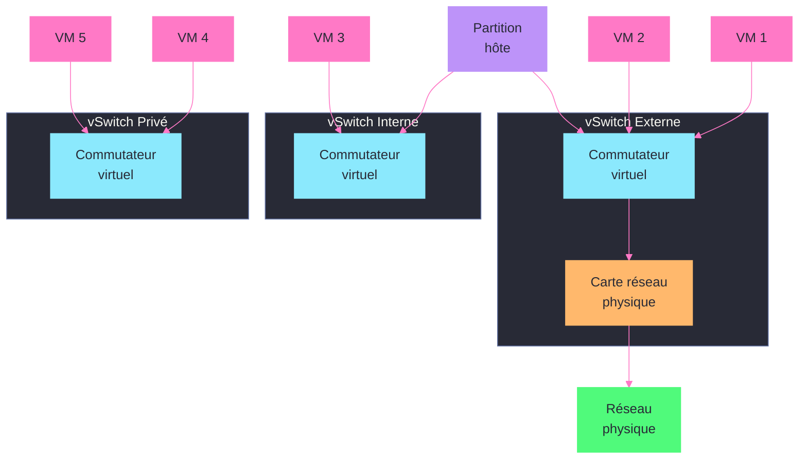
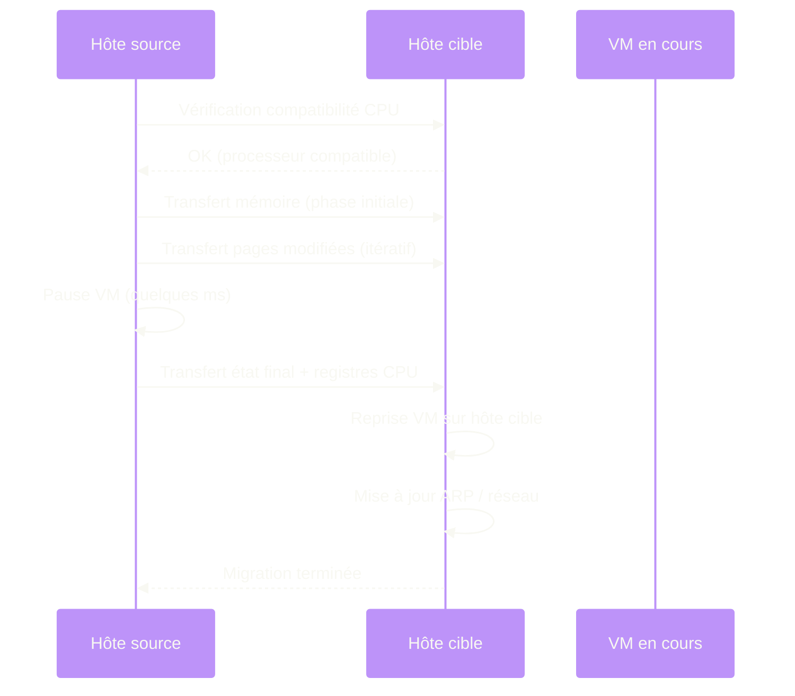

---
tags:
  - registre
  - hyper-v
  - virtualisation
  - reseau-virtuel
---

# Hyper-V

!!! abstract "Ce que vous allez apprendre"
    - Les cles registre qui controlent la configuration de l'hote Hyper-V
    - Comment modifier les chemins par defaut des VM et disques virtuels via le registre
    - La configuration reseau des commutateurs virtuels dans le registre
    - Les parametres des services d'integration par VM
    - La configuration de la migration dynamique (Live Migration) et de la virtualisation imbriquee
    - Comment diagnostiquer et corriger des problemes reseau Hyper-V en reinitialisant le commutateur virtuel

---

## Configuration de l'hote Hyper-V

La configuration principale de l'hote Hyper-V est stockee sous :

```
HKLM\SOFTWARE\Microsoft\Windows NT\CurrentVersion\Virtualization
```

Cette cle contient les parametres globaux du service de gestion des machines virtuelles (VMMS — Virtual Machine Management Service).

```powershell
# Read Hyper-V host configuration
Get-ItemProperty "HKLM:\SOFTWARE\Microsoft\Windows NT\CurrentVersion\Virtualization"
```

```title="Resultat attendu"
DefaultExternalDataRoot  : C:\ProgramData\Microsoft\Windows\Hyper-V
DefaultVirtualHardDiskPath : C:\Users\Public\Documents\Hyper-V\Virtual Hard Disks
MinimumMacAddress        : 00155D7A4000
MaximumMacAddress        : 00155D7AFFFF
MinimumWWPNAddress       : C003FFA1CE000000
MaximumWWPNAddress       : C003FFA1CE00FFFF
```

### Cles registre principales de l'hote

| Valeur | Type | Description |
|--------|------|-------------|
| `DefaultExternalDataRoot` | `REG_SZ` | Repertoire racine pour les fichiers de configuration des VM |
| `DefaultVirtualHardDiskPath` | `REG_SZ` | Repertoire par defaut pour les disques virtuels (VHD/VHDX) |
| `MinimumMacAddress` | `REG_SZ` | Debut de la plage d'adresses MAC generees automatiquement |
| `MaximumMacAddress` | `REG_SZ` | Fin de la plage d'adresses MAC generees automatiquement |

### Verifier l'etat du service VMMS

Le service de gestion Hyper-V est enregistre comme un service Windows classique :

```powershell
# Check VMMS service status and configuration
Get-ItemProperty "HKLM:\SYSTEM\CurrentControlSet\Services\vmms" |
    Select-Object DisplayName, ImagePath, Start, Type, ObjectName
```

```title="Resultat attendu"
DisplayName : Hyper-V Virtual Machine Management
ImagePath   : C:\Windows\system32\vmms.exe
Start       : 2
Type        : 16
ObjectName  : LocalSystem
```

### Verifier si Hyper-V est installe

Avant toute manipulation, confirmez que le role Hyper-V est bien installe en verifiant la presence de ses composants dans le registre :

```powershell
# Check if Hyper-V role is installed
$hvFeature = Get-ItemProperty "HKLM:\SOFTWARE\Microsoft\Windows NT\CurrentVersion\Virtualization" `
    -ErrorAction SilentlyContinue

if ($hvFeature) {
    Write-Output "Hyper-V is installed"
    Write-Output "Data root: $($hvFeature.DefaultExternalDataRoot)"
} else {
    Write-Output "Hyper-V is NOT installed"
}
```

```title="Resultat attendu"
Hyper-V is installed
Data root: C:\ProgramData\Microsoft\Windows\Hyper-V
```

!!! info "En resume"
    - La configuration globale Hyper-V est sous `HKLM\SOFTWARE\Microsoft\Windows NT\CurrentVersion\Virtualization`
    - `DefaultExternalDataRoot` et `DefaultVirtualHardDiskPath` controlent les emplacements par defaut
    - Le service VMMS (`vmms`) gere le cycle de vie de toutes les VM sur l'hote
    - La plage d'adresses MAC est definie par `MinimumMacAddress` et `MaximumMacAddress`

---

## Chemins par defaut et parametres des VM

### Modifier les chemins par defaut

En production, les chemins par defaut doivent pointer vers des volumes dedies a hautes performances, pas vers le disque systeme.

```powershell
# Change default VM and VHD paths via Hyper-V Manager cmdlet (recommended)
Set-VMHost -VirtualMachinePath "D:\Hyper-V\VMs" -VirtualHardDiskPath "E:\Hyper-V\VHDs"
```

```title="Resultat attendu"
Aucune sortie. Les chemins sont mis a jour dans le registre et dans la configuration Hyper-V.
```

```powershell
# Verify the change in the registry
Get-ItemProperty "HKLM:\SOFTWARE\Microsoft\Windows NT\CurrentVersion\Virtualization" |
    Select-Object DefaultExternalDataRoot, DefaultVirtualHardDiskPath
```

```title="Resultat attendu"
DefaultExternalDataRoot      : D:\Hyper-V\VMs
DefaultVirtualHardDiskPath   : E:\Hyper-V\VHDs
```

Si vous devez forcer la modification directement dans le registre (par exemple sur un hote ou le service VMMS ne demarre pas) :

```powershell
# Direct registry modification (use only if VMMS is not running)
$hvPath = "HKLM:\SOFTWARE\Microsoft\Windows NT\CurrentVersion\Virtualization"
Set-ItemProperty -Path $hvPath -Name "DefaultExternalDataRoot" -Value "D:\Hyper-V\VMs" -Type String
Set-ItemProperty -Path $hvPath -Name "DefaultVirtualHardDiskPath" -Value "E:\Hyper-V\VHDs" -Type String
```

```title="Resultat attendu"
Aucune sortie. Redemarrer le service vmms pour prise en compte.
```

### Configuration memoire par defaut

Les parametres de memoire par defaut pour les nouvelles VM sont geres par Hyper-V Manager, mais certains seuils systeme sont dans le registre :

```powershell
# Check Hyper-V memory reservation settings
$hvPath = "HKLM:\SOFTWARE\Microsoft\Windows NT\CurrentVersion\Virtualization"
Get-ItemProperty $hvPath -Name "MemoryReserve" -ErrorAction SilentlyContinue
```

```title="Resultat attendu"
MemoryReserve : 512
```

La valeur `MemoryReserve` definit la quantite de memoire (en Mo) reservee pour la partition root (l'hote). Si ce seuil est trop bas, l'hote peut devenir instable sous charge.

### Plage d'adresses MAC

Chaque hote Hyper-V genere des adresses MAC dans une plage definie. En environnement cluster, eviter les collisions est critique :

```powershell
# View current MAC address range
$hvPath = "HKLM:\SOFTWARE\Microsoft\Windows NT\CurrentVersion\Virtualization"
$props = Get-ItemProperty $hvPath
Write-Output "MAC range: $($props.MinimumMacAddress) - $($props.MaximumMacAddress)"
```

```title="Resultat attendu"
MAC range: 00155D7A4000 - 00155D7AFFFF
```

```powershell
# Change MAC address range (useful to avoid collisions in a cluster)
Set-ItemProperty -Path $hvPath -Name "MinimumMacAddress" -Value "00155D100000" -Type String
Set-ItemProperty -Path $hvPath -Name "MaximumMacAddress" -Value "00155D10FFFF" -Type String
```

```title="Resultat attendu"
Aucune sortie. La nouvelle plage est utilisee pour les futures cartes reseau virtuelles.
```

!!! info "En resume"
    - Modifiez les chemins par defaut via `Set-VMHost` ou directement dans le registre si VMMS est hors service
    - `MemoryReserve` definit la RAM reservee pour l'hote (a ne pas sous-dimensionner)
    - La plage d'adresses MAC doit etre unique par hote dans un cluster pour eviter les conflits

---

## Commutateurs virtuels et configuration reseau



La configuration reseau de Hyper-V est l'un des domaines ou le registre joue un role essentiel, notamment pour les pilotes du commutateur virtuel extensible (vSwitch).

### Emplacement des cles reseau Hyper-V

Les commutateurs virtuels sont geres par le pilote de liaison du commutateur virtuel Hyper-V. Les parametres reseau se trouvent a plusieurs endroits :

```
HKLM\SYSTEM\CurrentControlSet\Services\VMSMP\Parameters
HKLM\SYSTEM\CurrentControlSet\Services\vmsnetworkadapter
HKLM\SYSTEM\CurrentControlSet\Control\Class\{4d36e972-e325-11ce-bfc1-08002be10318}
```

```powershell
# List Hyper-V virtual switch related services
Get-ItemProperty "HKLM:\SYSTEM\CurrentControlSet\Services\VMSMP" -ErrorAction SilentlyContinue |
    Select-Object DisplayName, ImagePath, Start
```

```title="Resultat attendu"
DisplayName : Hyper-V Virtual Switch Extension Protocol
ImagePath   : system32\drivers\VMSMP.sys
Start       : 1
```

### Parametres du protocole de commutateur virtuel

```powershell
# Check virtual switch extension protocol parameters
$vmspPath = "HKLM:\SYSTEM\CurrentControlSet\Services\VMSMP\Parameters"
Get-ItemProperty $vmspPath -ErrorAction SilentlyContinue
```

```title="Resultat attendu"
SwitchList           : {guid1, guid2}
BridgeEnabled        : 0
```

### Lister les commutateurs virtuels enregistres

```powershell
# List virtual switches via Hyper-V cmdlet
Get-VMSwitch | Select-Object Name, SwitchType, NetAdapterInterfaceDescription | Format-Table -AutoSize
```

```title="Resultat attendu"
Name            SwitchType NetAdapterInterfaceDescription
----            ---------- ------------------------------
vSwitch-Extern  External   Intel(R) I350 Gigabit Network Connection
vSwitch-Interne Internal
vSwitch-Prive   Private
```

### Configuration des cartes reseau virtuelles dans le registre

Chaque carte reseau virtuelle est enregistree comme un adaptateur reseau dans la classe des peripheriques reseau :

```
HKLM\SYSTEM\CurrentControlSet\Control\Class\{4d36e972-e325-11ce-bfc1-08002be10318}
```

```powershell
# Find Hyper-V virtual network adapters in the network class registry
$classPath = "HKLM:\SYSTEM\CurrentControlSet\Control\Class\{4d36e972-e325-11ce-bfc1-08002be10318}"

Get-ChildItem $classPath -ErrorAction SilentlyContinue |
    Where-Object {
        $props = Get-ItemProperty $_.PSPath -ErrorAction SilentlyContinue
        $props.DriverDesc -like "*Hyper-V*"
    } |
    ForEach-Object {
        $props = Get-ItemProperty $_.PSPath
        [PSCustomObject]@{
            Key        = $_.PSChildName
            DriverDesc = $props.DriverDesc
            NetCfgInstanceId = $props.NetCfgInstanceId
        }
    } | Format-Table -AutoSize
```

```title="Resultat attendu"
Key  DriverDesc                                NetCfgInstanceId
---  ----------                                ----------------
0012 Hyper-V Virtual Ethernet Adapter          {a1b2c3d4-...}
0015 Hyper-V Virtual Ethernet Adapter #2       {e5f6a7b8-...}
```

### Parametres de performance reseau

Certains parametres de performance reseau impactent directement les VM Hyper-V :

```powershell
# Check VMQ (Virtual Machine Queue) settings on the physical adapter
$nicPath = "HKLM:\SYSTEM\CurrentControlSet\Control\Class\{4d36e972-e325-11ce-bfc1-08002be10318}"

Get-ChildItem $nicPath -ErrorAction SilentlyContinue |
    ForEach-Object {
        $props = Get-ItemProperty $_.PSPath -ErrorAction SilentlyContinue
        if ($props.'*VMQEnable' -ne $null -or $props.VMQEnable -ne $null) {
            [PSCustomObject]@{
                Adapter = $props.DriverDesc
                VMQ     = if ($props.'*VMQEnable') { $props.'*VMQEnable' } else { $props.VMQEnable }
                RSS     = $props.'*RSS'
            }
        }
    } | Format-Table -AutoSize
```

```title="Resultat attendu"
Adapter                                  VMQ  RSS
-------                                  ---  ---
Intel(R) I350 Gigabit Network Connection 1    1
```

| Parametre | Valeur | Description |
|-----------|--------|-------------|
| `*VMQEnable` | `1` | Activer Virtual Machine Queue (decharge le traitement reseau sur le materiel) |
| `*RSS` | `1` | Activer Receive Side Scaling (repartir le trafic sur plusieurs processeurs) |
| `*RSC` | `1` | Activer Receive Segment Coalescing (reduire les interruptions CPU) |
| `*JumboPacket` | `9014` | Activer les trames Jumbo (9014 octets) |

!!! info "En resume"
    - Les commutateurs virtuels Hyper-V sont geres par le pilote VMSMP sous `HKLM\SYSTEM\CurrentControlSet\Services\VMSMP`
    - Les cartes reseau virtuelles sont enregistrees dans la classe `{4d36e972-e325-11ce-bfc1-08002be10318}`
    - VMQ et RSS sont des parametres de performance critiques pour les hotes Hyper-V avec beaucoup de VM
    - Utilisez `Get-VMSwitch` pour une vue simplifiee, le registre pour un diagnostic approfondi

---

## Services d'integration par VM

Les services d'integration (Integration Services) sont les composants qui permettent la communication entre l'hote et les VM : synchronisation de l'heure, battement de coeur (heartbeat), echange de donnees, arret propre, etc.

### Configuration des services d'integration dans le registre

Les services d'integration sont enregistres comme des services dans le registre de **chaque VM** (dans le registre du systeme d'exploitation invite). Cote hote, la configuration est stockee dans les fichiers de configuration XML des VM, mais certains parametres sont aussi dans le registre de l'hote :

```
HKLM\SOFTWARE\Microsoft\Windows NT\CurrentVersion\Virtualization\GuestInstaller
```

```powershell
# Check integration services version on the host
Get-ItemProperty "HKLM:\SOFTWARE\Microsoft\Windows NT\CurrentVersion\Virtualization\GuestInstaller\Version" `
    -ErrorAction SilentlyContinue
```

```title="Resultat attendu"
Microsoft-Hyper-V-Guest-Installer : 10.0.20348.1
```

### Services d'integration cote VM (dans le registre de la VM)

A l'interieur de la VM, les services d'integration sont des services Windows enregistres sous :

```
HKLM\SYSTEM\CurrentControlSet\Services\
```

| Service | Nom registre | Description |
|---------|-------------|-------------|
| Heartbeat | `vmicheartbeat` | Battement de coeur pour la detection de panne |
| Time Sync | `vmictimesync` | Synchronisation de l'heure avec l'hote |
| Data Exchange | `vmickvpexchange` | Echange de paires cle/valeur entre hote et VM |
| Shutdown | `vmicshutdown` | Arret propre de la VM depuis l'hote |
| VSS | `vmicvss` | Integration des sauvegardes VSS |
| Guest Service Interface | `vmicguestinterface` | Copie de fichiers entre hote et VM |

```powershell
# Check integration services status inside a VM
$services = @("vmicheartbeat", "vmictimesync", "vmickvpexchange", "vmicshutdown", "vmicvss", "vmicguestinterface")

foreach ($svc in $services) {
    $props = Get-ItemProperty "HKLM:\SYSTEM\CurrentControlSet\Services\$svc" -ErrorAction SilentlyContinue
    if ($props) {
        [PSCustomObject]@{
            Service     = $svc
            DisplayName = $props.DisplayName
            Start       = $props.Start
            Status      = switch ($props.Start) { 2 { "Auto" } 3 { "Manual" } 4 { "Disabled" } default { $props.Start } }
        }
    }
} | Format-Table -AutoSize
```

```title="Resultat attendu"
Service              DisplayName                                          Start Status
-------              -----------                                          ----- ------
vmicheartbeat        Hyper-V Heartbeat Service                                3 Manual
vmictimesync         Hyper-V Time Synchronization Service                     3 Manual
vmickvpexchange      Hyper-V Data Exchange Service                            3 Manual
vmicshutdown         Hyper-V Guest Shutdown Service                           3 Manual
vmicvss              Hyper-V Volume Shadow Copy Requestor                     3 Manual
vmicguestinterface   Hyper-V Guest Service Interface                          4 Disabled
```

### Echange de donnees cle/valeur (KVP)

Le service Data Exchange permet de passer des informations entre l'hote et la VM via des paires cle/valeur stockees dans le registre de la VM :

```
HKLM\SOFTWARE\Microsoft\Virtual Machine\External
HKLM\SOFTWARE\Microsoft\Virtual Machine\Guest\Parameters
```

```powershell
# Read KVP data pushed from the host
Get-ItemProperty "HKLM:\SOFTWARE\Microsoft\Virtual Machine\External" -ErrorAction SilentlyContinue
```

```title="Resultat attendu"
MyCustomKey : MyCustomValue
DeploymentTag : Production
```

```powershell
# From the host: push a KVP pair to a VM
$vm = Get-VM "VM-PROD-01"
$kvpComponent = $vm | Get-VMIntegrationService -Name "Key-Value Pair Exchange"

# Create the KVP data item
$kvpData = [System.Management.ManagementObject]::new("root\virtualization\v2:Msvm_KvpExchangeDataItem")
$kvpData.Name = "DeploymentTag"
$kvpData.Data = "Production"
$kvpData.Source = 0

# Add via WMI
$vmMgmt = Get-WmiObject -Namespace "root\virtualization\v2" -Class "Msvm_VirtualSystemManagementService"
$vmObj = Get-WmiObject -Namespace "root\virtualization\v2" -Class "Msvm_ComputerSystem" |
    Where-Object { $_.ElementName -eq "VM-PROD-01" }
$vmMgmt.AddKvpItems($vmObj, @($kvpData.GetText(1)))
```

```title="Resultat attendu"
ReturnValue : 0
```

!!! info "En resume"
    - Les services d'integration (heartbeat, time sync, shutdown, VSS) sont des services Windows dans la VM
    - Le Data Exchange (KVP) permet de passer des informations entre hote et VM via le registre
    - Les cles KVP de la VM sont sous `HKLM\SOFTWARE\Microsoft\Virtual Machine\External`
    - Le service `vmicguestinterface` (copie de fichiers) est desactive par defaut — activez-le si necessaire

---

## Migration dynamique (Live Migration)



La migration dynamique permet de deplacer une VM en cours d'execution d'un hote a un autre sans interruption de service. Sa configuration est stockee dans le registre de l'hote.

### Cles de configuration Live Migration

```
HKLM\SOFTWARE\Microsoft\Windows NT\CurrentVersion\Virtualization
```

```powershell
# Check Live Migration configuration
Get-VMHost | Select-Object VirtualMachineMigrationEnabled,
    VirtualMachineMigrationAuthenticationType,
    VirtualMachineMigrationPerformanceOption,
    MaximumVirtualMachineMigrations,
    MaximumStorageMigrations |
    Format-List
```

```title="Resultat attendu"
VirtualMachineMigrationEnabled            : True
VirtualMachineMigrationAuthenticationType : Kerberos
VirtualMachineMigrationPerformanceOption  : SMB
MaximumVirtualMachineMigrations           : 2
MaximumStorageMigrations                  : 2
```

### Parametres d'authentification

| Type d'authentification | Valeur | Description |
|------------------------|--------|-------------|
| CredSSP | `0` | Delegation d'identifiants (plus simple, moins securise) |
| Kerberos | `1` | Delegation contrainte Kerberos (recommande en production) |

```powershell
# Switch to Kerberos authentication for Live Migration
Set-VMHost -VirtualMachineMigrationAuthenticationType Kerberos
```

```title="Resultat attendu"
Aucune sortie. L'authentification Kerberos necessite la delegation contrainte configuree dans AD.
```

### Options de performance

| Option | Valeur | Description |
|--------|--------|-------------|
| TCP/IP | `0` | Migration par le reseau TCP standard |
| Compression | `1` | Compresse la memoire avant transfert (utilise plus de CPU) |
| SMB | `2` | Utilise SMB Direct / RDMA si disponible (meilleure performance) |

```powershell
# Set Live Migration to use SMB (best performance with RDMA)
Set-VMHost -VirtualMachineMigrationPerformanceOption SMB
```

```title="Resultat attendu"
Aucune sortie.
```

### Reseaux autorises pour la migration

La liste des reseaux autorises pour la migration dynamique est stockee dans le registre :

```powershell
# Check which networks are allowed for Live Migration
(Get-VMHost).VirtualMachineMigrationEnabled
Get-VMMigrationNetwork | Format-Table Subnet, Priority -AutoSize
```

```title="Resultat attendu"
Subnet          Priority
------          --------
10.0.100.0/24   1
```

```powershell
# Add a dedicated migration network
Add-VMMigrationNetwork -Subnet "10.0.100.0/24" -Priority 1
```

```title="Resultat attendu"
Aucune sortie.
```

### Nombre maximal de migrations simultanees

```powershell
# Increase simultaneous live migrations (default is 2)
Set-VMHost -MaximumVirtualMachineMigrations 4
Set-VMHost -MaximumStorageMigrations 4
```

```title="Resultat attendu"
Aucune sortie. Prenez en compte la bande passante disponible avant d'augmenter cette valeur.
```

!!! info "En resume"
    - La migration dynamique est configuree via `Set-VMHost` qui ecrit dans le registre Hyper-V
    - L'authentification Kerberos (delegation contrainte) est recommandee en production
    - SMB/RDMA offre les meilleures performances pour la migration
    - Limitez le nombre de migrations simultanees en fonction de la bande passante reseau disponible

---

## Virtualisation imbriquee (Nested Virtualization)

La virtualisation imbriquee permet d'executer Hyper-V a l'interieur d'une VM Hyper-V. Ce n'est pas un parametre registre a proprement parler, mais il est active via des extensions de processeur virtuel configurees sur l'hote.

### Activer la virtualisation imbriquee

```powershell
# Enable nested virtualization on a VM (VM must be stopped)
$vmName = "VM-DEVTEST-01"
Stop-VM $vmName -Force
Set-VMProcessor -VMName $vmName -ExposeVirtualizationExtensions $true
Start-VM $vmName
```

```title="Resultat attendu"
Aucune sortie. La VM peut maintenant installer et executer Hyper-V en son sein.
```

### Verifier la virtualisation imbriquee

```powershell
# Verify nested virtualization is enabled
Get-VMProcessor -VMName "VM-DEVTEST-01" |
    Select-Object VMName, ExposeVirtualizationExtensions
```

```title="Resultat attendu"
VMName          ExposeVirtualizationExtensions
------          ------------------------------
VM-DEVTEST-01   True
```

### Prerequis et limitations

Pour que la virtualisation imbriquee fonctionne, plusieurs conditions doivent etre reunies :

| Prerequis | Detail |
|-----------|--------|
| Processeur | Extensions de virtualisation Intel VT-x ou AMD-V |
| Systeme hote | Windows Server 2016 ou superieur |
| Systeme VM | Windows Server 2016 ou superieur / Windows 10 ou superieur |
| Memoire dynamique | Doit etre desactivee sur la VM |
| MAC address spoofing | Doit etre active si la VM imbriquee doit communiquer sur le reseau |

```powershell
# Disable dynamic memory and enable MAC spoofing (required for nested VMs)
$vmName = "VM-DEVTEST-01"
Stop-VM $vmName -Force
Set-VMMemory -VMName $vmName -DynamicMemoryEnabled $false
Get-VMNetworkAdapter -VMName $vmName | Set-VMNetworkAdapter -MacAddressSpoofing On
Start-VM $vmName
```

```title="Resultat attendu"
Aucune sortie. La VM est prete pour la virtualisation imbriquee avec acces reseau.
```

### Verifier cote VM que Hyper-V est disponible

A l'interieur de la VM, verifiez que les extensions de virtualisation sont exposees :

```powershell
# Inside the nested VM: check if virtualization extensions are available
$hvCheck = Get-ItemProperty "HKLM:\SOFTWARE\Microsoft\Windows NT\CurrentVersion\Virtualization" `
    -ErrorAction SilentlyContinue

if ($hvCheck) {
    Write-Output "Hyper-V components detected in the nested VM"
} else {
    # Check via systeminfo
    systeminfo | Select-String "Hyper-V Requirements"
}
```

```title="Resultat attendu"
Hyper-V Requirements:      VM Monitor Mode Extensions: Yes
                           Virtualization Enabled In Firmware: Yes
                           Second Level Address Translation: Yes
                           Data Execution Prevention Available: Yes
```

!!! info "En resume"
    - La virtualisation imbriquee est activee par `Set-VMProcessor -ExposeVirtualizationExtensions $true`
    - La memoire dynamique doit etre desactivee et le MAC spoofing active pour le reseau
    - Uniquement supporte sur Windows Server 2016+ / Windows 10+ avec processeurs Intel ou AMD recents
    - Utile pour les environnements de test, les labs et les scenarios DevOps

---

## Scenario reel : corriger des problemes reseau Hyper-V en reinitialisant le commutateur virtuel

### Contexte

Apres une mise a jour cumulative de Windows Server 2022, vos VM sur l'hote `HVSRV03` perdent leur connectivite reseau. Le commutateur virtuel externe `vSwitch-Prod` existe toujours dans Hyper-V Manager, mais les VM affichent "Network cable unplugged". L'hote lui-meme a toujours acces au reseau. Le probleme affecte 12 VM de production.

### Etape 1 : diagnostiquer l'etat du commutateur virtuel

```powershell
# Check virtual switch status
Get-VMSwitch | Select-Object Name, SwitchType, NetAdapterInterfaceDescription, Id | Format-Table -AutoSize
```

```title="Resultat attendu"
Name         SwitchType NetAdapterInterfaceDescription               Id
----         ---------- ------------------------------               --
vSwitch-Prod External   Intel(R) I350 Gigabit Network Connection     a1b2c3d4-...
```

```powershell
# Check if the physical adapter is properly bound to the virtual switch
Get-NetAdapter | Where-Object { $_.InterfaceDescription -like "*Hyper-V*" -or $_.InterfaceDescription -like "*I350*" } |
    Select-Object Name, InterfaceDescription, Status, LinkSpeed | Format-Table -AutoSize
```

```title="Resultat attendu"
Name                    InterfaceDescription                         Status LinkSpeed
----                    --------------------                         ------ ---------
vEthernet (vSwitch-Prod) Hyper-V Virtual Ethernet Adapter            Up     1 Gbps
Ethernet 2              Intel(R) I350 Gigabit Network Connection     Up     1 Gbps
```

```powershell
# Check VM network adapter status
Get-VM | Get-VMNetworkAdapter |
    Select-Object VMName, SwitchName, Status, IPAddresses | Format-Table -AutoSize
```

```title="Resultat attendu"
VMName       SwitchName   Status                  IPAddresses
------       ----------   ------                  -----------
VM-SQL-01    vSwitch-Prod {Degraded}              {}
VM-APP-01    vSwitch-Prod {Degraded}              {}
VM-WEB-01    vSwitch-Prod {Degraded}              {}
...
```

Le statut "Degraded" confirme un probleme de liaison entre le commutateur virtuel et le pilote reseau physique.

### Etape 2 : verifier les pilotes reseau dans le registre

```powershell
# Check network binding order and Hyper-V switch extension driver
$classPath = "HKLM:\SYSTEM\CurrentControlSet\Control\Class\{4d36e972-e325-11ce-bfc1-08002be10318}"

Get-ChildItem $classPath -ErrorAction SilentlyContinue |
    ForEach-Object {
        $props = Get-ItemProperty $_.PSPath -ErrorAction SilentlyContinue
        if ($props.DriverDesc -like "*Hyper-V*" -or $props.DriverDesc -like "*I350*") {
            [PSCustomObject]@{
                Key          = $_.PSChildName
                DriverDesc   = $props.DriverDesc
                DriverVersion = $props.DriverVersion
                ComponentId  = $props.ComponentId
            }
        }
    } | Format-Table -AutoSize
```

```title="Resultat attendu"
Key  DriverDesc                                DriverVersion  ComponentId
---  ----------                                -------------  -----------
0005 Intel(R) I350 Gigabit Network Connection  12.18.9.23     PCI\VEN_8086...
0012 Hyper-V Virtual Ethernet Adapter          10.0.20348.1   {...}
```

### Etape 3 : verifier l'integrite du pilote VMSMP

```powershell
# Check the Virtual Machine Switch Protocol driver
Get-ItemProperty "HKLM:\SYSTEM\CurrentControlSet\Services\VMSMP" -ErrorAction SilentlyContinue |
    Select-Object DisplayName, ImagePath, Start, ErrorControl
```

```title="Resultat attendu"
DisplayName  : Hyper-V Virtual Switch Extension Protocol
ImagePath    : system32\drivers\VMSMP.sys
Start        : 1
ErrorControl : 1
```

```powershell
# Check the virtual switch parameters
$vmspParams = "HKLM:\SYSTEM\CurrentControlSet\Services\VMSMP\Parameters"
Get-ItemProperty $vmspParams -ErrorAction SilentlyContinue
```

```title="Resultat attendu"
SwitchList : {a1b2c3d4-e5f6-...}
```

### Etape 4 : reinitialiser le commutateur virtuel

La solution la plus fiable consiste a supprimer et recreer le commutateur virtuel. Sauvegardez d'abord la configuration :

```powershell
# Save current switch configuration before reset
$switchName = "vSwitch-Prod"
$switch = Get-VMSwitch $switchName
$adapterName = (Get-NetAdapter |
    Where-Object { $_.InterfaceDescription -eq $switch.NetAdapterInterfaceDescription }).Name

# Save VM-to-switch mapping
$vmNics = Get-VM | Get-VMNetworkAdapter | Where-Object { $_.SwitchName -eq $switchName }
$vmNics | Select-Object VMName, SwitchName, MacAddress |
    Export-Csv "C:\Admin\vm-nic-backup.csv" -NoTypeInformation

Write-Output "Backup saved. Adapter: $adapterName, VMs connected: $($vmNics.Count)"
```

```title="Resultat attendu"
Backup saved. Adapter: Ethernet 2, VMs connected: 12
```

```powershell
# Remove the broken virtual switch
Remove-VMSwitch "vSwitch-Prod" -Force
```

```title="Resultat attendu"
Aucune sortie. Toutes les VM sont maintenant deconnectees du reseau.
```

```powershell
# Clean orphaned registry entries from the switch protocol driver
$vmspParams = "HKLM:\SYSTEM\CurrentControlSet\Services\VMSMP\Parameters"
$switchList = (Get-ItemProperty $vmspParams -Name "SwitchList" -ErrorAction SilentlyContinue).SwitchList

if ($switchList) {
    Write-Output "Orphaned switch entries found: $($switchList.Count)"
    # The Remove-VMSwitch should have cleaned these, but verify
    Get-ItemProperty $vmspParams
}
```

```title="Resultat attendu"
Orphaned switch entries found: 0
```

```powershell
# Recreate the virtual switch
New-VMSwitch -Name "vSwitch-Prod" -NetAdapterName "Ethernet 2" -AllowManagementOS $true
```

```title="Resultat attendu"
Name         SwitchType NetAdapterInterfaceDescription
----         ---------- ------------------------------
vSwitch-Prod External   Intel(R) I350 Gigabit Network Connection
```

### Etape 5 : reconnecter les VM

```powershell
# Reconnect all VMs to the new switch
$vmNics = Import-Csv "C:\Admin\vm-nic-backup.csv"

foreach ($nic in $vmNics) {
    Get-VM $nic.VMName | Get-VMNetworkAdapter | Connect-VMNetworkAdapter -SwitchName "vSwitch-Prod"
    Write-Output "$($nic.VMName) : Reconnected to vSwitch-Prod"
}
```

```title="Resultat attendu"
VM-SQL-01 : Reconnected to vSwitch-Prod
VM-APP-01 : Reconnected to vSwitch-Prod
VM-WEB-01 : Reconnected to vSwitch-Prod
...
```

### Etape 6 : valider la connectivite

```powershell
# Verify network connectivity for all VMs
Get-VM | Where-Object { $_.State -eq "Running" } | Get-VMNetworkAdapter |
    Select-Object VMName, SwitchName, Status, IPAddresses | Format-Table -AutoSize
```

```title="Resultat attendu"
VMName       SwitchName   Status IPAddresses
------       ----------   ------ -----------
VM-SQL-01    vSwitch-Prod {Ok}   {10.0.1.50, fe80::...}
VM-APP-01    vSwitch-Prod {Ok}   {10.0.1.51, fe80::...}
VM-WEB-01    vSwitch-Prod {Ok}   {10.0.1.52, fe80::...}
...
```

!!! tip "Prevention"
    Avant d'appliquer des mises a jour cumulatives sur un hote Hyper-V, exportez toujours la configuration des commutateurs virtuels et des cartes reseau des VM. Un script de sauvegarde planifie evite de devoir reconstruire la configuration a chaud.

!!! info "En resume"
    - Un commutateur virtuel en etat "Degraded" indique un probleme de liaison entre le pilote physique et VMSMP
    - La reinitialisation consiste a supprimer et recreer le commutateur, puis reconnecter les VM
    - Sauvegardez la correspondance VM/commutateur avant toute operation destructive
    - Les cles registre VMSMP sous `Services\VMSMP\Parameters` peuvent contenir des references orphelines apres une corruption
    - Planifiez une sauvegarde de la configuration reseau avant les mises a jour cumulatives
