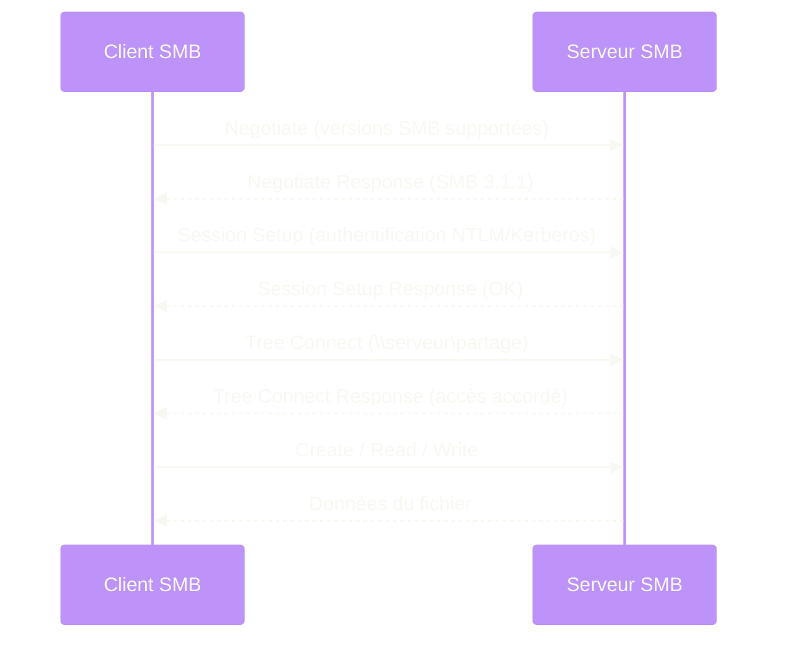
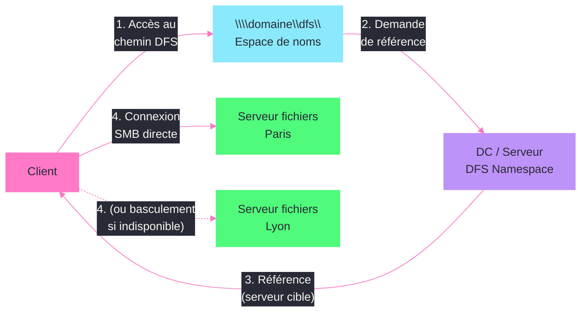

---
tags:
  - registre
  - smb
  - dfs
  - serveur-fichiers
  - securite
---

# File Server / DFS

!!! abstract "Ce que vous allez apprendre"
    - Les cles registre qui controlent le serveur SMB (LanmanServer) et le client SMB (LanmanWorkstation)
    - La configuration DFS Namespace dans le registre
    - Les parametres FSRM, Shadow Copies et VSS accessibles via le registre
    - La configuration des fichiers hors connexion (Offline Files) et BranchCache
    - Le durcissement SMB : signature, chiffrement et desactivation de SMBv1
    - Comment proteger un parc contre le mouvement lateral des ransomwares via les parametres SMB

---

## Configuration du serveur SMB (LanmanServer)



Le service serveur SMB est le composant qui partage les fichiers et les imprimantes sur le reseau. Tous ses parametres de performance et de securite sont sous :

```
HKLM\SYSTEM\CurrentControlSet\Services\LanmanServer\Parameters
```

```powershell
# Read SMB server configuration
Get-ItemProperty "HKLM:\SYSTEM\CurrentControlSet\Services\LanmanServer\Parameters"
```

```title="Resultat attendu"
AutoShareServer         : 1
AutoShareWks            : 1
NullSessionPipes        :
NullSessionShares       :
RestrictNullSessAccess  : 1
EnableSecuritySignature : 1
RequireSecuritySignature : 0
Lmannounce              : 0
Size                    : 3
```

### Parametres cles du serveur SMB

| Valeur | Type | Defaut | Description |
|--------|------|--------|-------------|
| `AutoShareServer` | `REG_DWORD` | `1` | Creer automatiquement les partages admin (C$, D$, ADMIN$) |
| `AutoShareWks` | `REG_DWORD` | `1` | Idem pour les stations de travail |
| `EnableSecuritySignature` | `REG_DWORD` | `0` | Accepter la signature SMB si le client la propose |
| `RequireSecuritySignature` | `REG_DWORD` | `0` | Exiger la signature SMB pour toute connexion |
| `RestrictNullSessAccess` | `REG_DWORD` | `1` | Bloquer les sessions nulles (anonymes) |
| `NullSessionPipes` | `REG_MULTI_SZ` | vide | Pipes nommes accessibles sans authentification |
| `NullSessionShares` | `REG_MULTI_SZ` | vide | Partages accessibles sans authentification |
| `Size` | `REG_DWORD` | `3` | Profil de performance : 1=Petit, 2=Moyen, 3=Grand (serveur dedie) |
| `MaxWorkItems` | `REG_DWORD` | variable | Nombre maximal d'operations simultanees |
| `MaxMpxCt` | `REG_DWORD` | `50` | Nombre maximal de requetes multiplexees par client |
| `SMB2Credits` | `REG_DWORD` | variable | Nombre de credits SMB2/3 alloues par connexion |

### Optimiser pour un serveur de fichiers dedie

```powershell
# Optimize SMB server for a dedicated file server role
$smbPath = "HKLM:\SYSTEM\CurrentControlSet\Services\LanmanServer\Parameters"

# Set server profile to "maximize throughput for file sharing"
Set-ItemProperty -Path $smbPath -Name "Size" -Value 3 -Type DWord

# Increase maximum worker items for heavy workloads
Set-ItemProperty -Path $smbPath -Name "MaxWorkItems" -Value 8192 -Type DWord

# Increase max multiplexed requests per client
Set-ItemProperty -Path $smbPath -Name "MaxMpxCt" -Value 255 -Type DWord
```

```title="Resultat attendu"
Aucune sortie. Redemarrer le service LanmanServer pour appliquer.
```

```powershell
# Restart the Server service to apply changes
Restart-Service LanmanServer -Force
```

```title="Resultat attendu"
WARNING: Waiting for service 'Server (LanmanServer)' to stop...
WARNING: Waiting for service 'Server (LanmanServer)' to start...
```

!!! warning "Impact du redemarrage LanmanServer"
    Redemarrer le service Server deconnecte **tous** les utilisateurs connectes aux partages. Planifiez cette operation pendant une fenetre de maintenance.

### Desactiver les partages administratifs

Dans certains environnements securises, les partages admin (C$, ADMIN$) sont consideres comme un vecteur d'attaque pour le mouvement lateral :

```powershell
# Disable automatic administrative shares
$smbPath = "HKLM:\SYSTEM\CurrentControlSet\Services\LanmanServer\Parameters"
Set-ItemProperty -Path $smbPath -Name "AutoShareServer" -Value 0 -Type DWord
```

```title="Resultat attendu"
Aucune sortie. Les partages admin ne seront plus crees au prochain redemarrage du service.
```

!!! info "En resume"
    - Le serveur SMB est configure sous `HKLM\SYSTEM\CurrentControlSet\Services\LanmanServer\Parameters`
    - `Size` = 3 optimise le serveur pour le partage de fichiers (allocation memoire maximale)
    - `AutoShareServer` = 0 desactive les partages administratifs (C$, ADMIN$)
    - `RequireSecuritySignature` = 1 force la signature SMB (recommande mais impacte les performances)

---

## Configuration du client SMB (LanmanWorkstation)

Le client SMB est le composant qui se connecte aux partages distants. Ses parametres sont sous :

```
HKLM\SYSTEM\CurrentControlSet\Services\LanmanWorkstation\Parameters
```

```powershell
# Read SMB client configuration
Get-ItemProperty "HKLM:\SYSTEM\CurrentControlSet\Services\LanmanWorkstation\Parameters"
```

```title="Resultat attendu"
EnableSecuritySignature  : 1
RequireSecuritySignature : 0
EnablePlainTextPassword  : 0
AllowInsecureGuestAuth   : 0
```

### Parametres cles du client SMB

| Valeur | Type | Defaut | Description |
|--------|------|--------|-------------|
| `EnableSecuritySignature` | `REG_DWORD` | `1` | Accepter la signature SMB si le serveur la propose |
| `RequireSecuritySignature` | `REG_DWORD` | `0` | Exiger la signature SMB |
| `EnablePlainTextPassword` | `REG_DWORD` | `0` | Autoriser les mots de passe en clair (a proscrire) |
| `AllowInsecureGuestAuth` | `REG_DWORD` | `0` | Autoriser l'authentification invitee (a proscrire) |
| `SessionTimeout` | `REG_DWORD` | `60` | Timeout de session en secondes |
| `KeepConn` | `REG_DWORD` | `600` | Duree de maintien d'une connexion inactive (secondes) |
| `MaxCmds` | `REG_DWORD` | `50` | Nombre maximal de commandes en attente |

### Durcir le client SMB

```powershell
# Harden SMB client configuration
$clientPath = "HKLM:\SYSTEM\CurrentControlSet\Services\LanmanWorkstation\Parameters"

# Require SMB signing on all connections
Set-ItemProperty -Path $clientPath -Name "RequireSecuritySignature" -Value 1 -Type DWord

# Disable plain text passwords (should already be 0)
Set-ItemProperty -Path $clientPath -Name "EnablePlainTextPassword" -Value 0 -Type DWord

# Disable insecure guest authentication (prevents fallback to guest on misconfigured shares)
Set-ItemProperty -Path $clientPath -Name "AllowInsecureGuestAuth" -Value 0 -Type DWord
```

```title="Resultat attendu"
Aucune sortie. Prend effet apres redemarrage du service Workstation.
```

### Comparer la configuration client et serveur

```powershell
# Compare SMB signing settings between server and client
$serverPath = "HKLM:\SYSTEM\CurrentControlSet\Services\LanmanServer\Parameters"
$clientPath = "HKLM:\SYSTEM\CurrentControlSet\Services\LanmanWorkstation\Parameters"

$server = Get-ItemProperty $serverPath
$client = Get-ItemProperty $clientPath

[PSCustomObject]@{
    Component = "Server (LanmanServer)"
    EnableSigning  = $server.EnableSecuritySignature
    RequireSigning = $server.RequireSecuritySignature
},
[PSCustomObject]@{
    Component = "Client (LanmanWorkstation)"
    EnableSigning  = $client.EnableSecuritySignature
    RequireSigning = $client.RequireSecuritySignature
} | Format-Table -AutoSize
```

```title="Resultat attendu"
Component               EnableSigning RequireSigning
---------               ------------- --------------
Server (LanmanServer)               1              1
Client (LanmanWorkstation)          1              1
```

!!! info "En resume"
    - Le client SMB est configure sous `HKLM\SYSTEM\CurrentControlSet\Services\LanmanWorkstation\Parameters`
    - `AllowInsecureGuestAuth` = 0 empeche le fallback vers l'authentification invitee (vecteur d'attaque)
    - `EnablePlainTextPassword` doit toujours etre a 0 (jamais de mots de passe en clair sur le reseau)
    - La signature SMB doit etre exigee (`RequireSecuritySignature` = 1) des deux cotes (client et serveur)

---

## DFS Namespace dans le registre



DFS (Distributed File System) fournit un espace de noms unifie pour les partages de fichiers. La configuration cote serveur est stockee dans Active Directory et dans le registre local.

### Emplacement des cles DFS

```
HKLM\SYSTEM\CurrentControlSet\Services\Dfs\Parameters
HKLM\SOFTWARE\Microsoft\Dfs
```

```powershell
# Check DFS service configuration
Get-ItemProperty "HKLM:\SYSTEM\CurrentControlSet\Services\Dfs" -ErrorAction SilentlyContinue |
    Select-Object DisplayName, ImagePath, Start
```

```title="Resultat attendu"
DisplayName : DFS Namespace
ImagePath   : %SystemRoot%\system32\dfssvc.exe
Start       : 2
```

### Parametres DFS Namespace

```powershell
# Read DFS parameters
$dfsPath = "HKLM\SYSTEM\CurrentControlSet\Services\Dfs\Parameters"
Get-ItemProperty "HKLM:\SYSTEM\CurrentControlSet\Services\Dfs\Parameters" -ErrorAction SilentlyContinue
```

```title="Resultat attendu"
SyncInterval       : 3600
RootShareAcquireTimeout : 30
```

| Valeur | Type | Defaut | Description |
|--------|------|--------|-------------|
| `SyncInterval` | `REG_DWORD` | `3600` | Intervalle de synchronisation du namespace DFS avec AD (secondes) |
| `RootShareAcquireTimeout` | `REG_DWORD` | `30` | Timeout pour l'acquisition de la racine DFS (secondes) |
| `LdapTimeoutValue` | `REG_DWORD` | `30` | Timeout des requetes LDAP pour DFS (secondes) |

### DFS Replication

DFS-R (DFS Replication) utilise ses propres cles registre pour la configuration de la replication :

```
HKLM\SYSTEM\CurrentControlSet\Services\DFSR\Parameters
```

```powershell
# Check DFS-R service and parameters
Get-ItemProperty "HKLM:\SYSTEM\CurrentControlSet\Services\DFSR" -ErrorAction SilentlyContinue |
    Select-Object DisplayName, ImagePath, Start

Get-ItemProperty "HKLM:\SYSTEM\CurrentControlSet\Services\DFSR\Parameters" -ErrorAction SilentlyContinue
```

```title="Resultat attendu"
DisplayName : DFS Replication
ImagePath   : %SystemRoot%\system32\DFSRs.exe
Start       : 2

StopReplicationOnAutoRecovery : 0
```

| Valeur | Type | Description |
|--------|------|-------------|
| `StopReplicationOnAutoRecovery` | `REG_DWORD` | 0 = Auto-recovery automatique, 1 = Stopper la replication et attendre une intervention manuelle |

### Diagnostiquer les problemes de referral DFS

```powershell
# Check DFS referral cache on a client
$dfsClientPath = "HKLM:\SOFTWARE\Microsoft\Dfs"
Get-ChildItem $dfsClientPath -Recurse -ErrorAction SilentlyContinue

# Force a DFS referral refresh
dfsutil /pktflush
dfsutil /spcflush
```

```title="Resultat attendu"
DFS referral cache flushed successfully.
DFS server/domain cache flushed successfully.
```

!!! info "En resume"
    - Le service DFS Namespace est configure sous `HKLM\SYSTEM\CurrentControlSet\Services\Dfs\Parameters`
    - DFS Replication (DFSR) a ses propres parametres sous `HKLM\SYSTEM\CurrentControlSet\Services\DFSR\Parameters`
    - `SyncInterval` controle la frequence de synchronisation du namespace avec AD
    - `dfsutil /pktflush` vide le cache DFS cote client en cas de probleme de resolution de referral

---

## FSRM, Shadow Copies et VSS

### FSRM (File Server Resource Manager)

FSRM permet de gerer les quotas, le filtrage de fichiers et la generation de rapports sur les serveurs de fichiers. Ses parametres sont sous :

```
HKLM\SYSTEM\CurrentControlSet\Services\SrmSvc
HKLM\SOFTWARE\Microsoft\FileServerResourceManager
```

```powershell
# Check FSRM service status
Get-ItemProperty "HKLM:\SYSTEM\CurrentControlSet\Services\SrmSvc" -ErrorAction SilentlyContinue |
    Select-Object DisplayName, Start
```

```title="Resultat attendu"
DisplayName : File Server Resource Manager
Start       : 2
```

```powershell
# Check FSRM configuration in the registry
$fsrmPath = "HKLM:\SOFTWARE\Microsoft\FileServerResourceManager"
Get-ItemProperty $fsrmPath -ErrorAction SilentlyContinue
```

```title="Resultat attendu"
SmtpServer           : smtp.contoso.com
AdminEmailAddress    : admin@contoso.com
FromEmailAddress     : fsrm@contoso.com
```

| Valeur | Type | Description |
|--------|------|-------------|
| `SmtpServer` | `REG_SZ` | Serveur SMTP pour les notifications FSRM |
| `AdminEmailAddress` | `REG_SZ` | Adresse e-mail de l'administrateur (notifications) |
| `FromEmailAddress` | `REG_SZ` | Adresse expediteur pour les e-mails FSRM |

### Shadow Copies (Volume Shadow Copy Service)

Les Shadow Copies permettent aux utilisateurs de restaurer des versions precedentes de leurs fichiers. La configuration VSS est sous :

```
HKLM\SYSTEM\CurrentControlSet\Services\VSS
```

```powershell
# Check VSS service configuration
Get-ItemProperty "HKLM:\SYSTEM\CurrentControlSet\Services\VSS" -ErrorAction SilentlyContinue |
    Select-Object DisplayName, ImagePath, Start
```

```title="Resultat attendu"
DisplayName : Volume Shadow Copy
ImagePath   : %SystemRoot%\system32\vssvc.exe
Start       : 3
```

### Parametres VSS avances

```
HKLM\SYSTEM\CurrentControlSet\Services\VolSnap
```

```powershell
# Check VolSnap driver (kernel-level shadow copy management)
Get-ItemProperty "HKLM:\SYSTEM\CurrentControlSet\Services\VolSnap" -ErrorAction SilentlyContinue |
    Select-Object DisplayName, ImagePath, Start
```

```title="Resultat attendu"
DisplayName : Volume Snapshot Driver
ImagePath   : system32\drivers\volsnap.sys
Start       : 0
```

```powershell
# List current shadow copies and their sizes
vssadmin list shadowstorage
```

```title="Resultat attendu"
vssadmin 1.1 - Volume Shadow Copy Service administrative command-line tool

Shadow Copy Storage association
   For volume: (D:)\
   Shadow Copy Storage volume: (D:)\
   Used Shadow Copy Storage space: 5.234 GB
   Allocated Shadow Copy Storage space: 6.000 GB
   Maximum Shadow Copy Storage space: 20.000 GB
```

### Configurer la taille maximale des Shadow Copies

```powershell
# Set maximum shadow copy storage to 20% of volume D:
vssadmin resize shadowstorage /For=D: /On=D: /MaxSize=20%
```

```title="Resultat attendu"
vssadmin 1.1 - Volume Shadow Copy Service administrative command-line tool
Successfully resized the shadow copy storage association
```

!!! info "En resume"
    - FSRM est configure sous `HKLM\SOFTWARE\Microsoft\FileServerResourceManager` (SMTP, notifications)
    - VSS est gere par le service `VSS` et le pilote `VolSnap` sous `CurrentControlSet\Services`
    - `vssadmin` est l'outil principal pour gerer les Shadow Copies (taille, planification)
    - Les Shadow Copies ne remplacent pas une vraie sauvegarde : elles sont sur le meme volume

---

## Fichiers hors connexion et BranchCache

### Fichiers hors connexion (Offline Files / CSC)

Les fichiers hors connexion permettent aux utilisateurs de travailler sur des fichiers partages meme sans connexion reseau. Cote serveur, la configuration est sous :

```
HKLM\SYSTEM\CurrentControlSet\Services\CscService
HKLM\SOFTWARE\Microsoft\Windows\CurrentVersion\NetCache
```

```powershell
# Check CSC (Client-Side Caching) service
Get-ItemProperty "HKLM:\SYSTEM\CurrentControlSet\Services\CscService" -ErrorAction SilentlyContinue |
    Select-Object DisplayName, Start
```

```title="Resultat attendu"
DisplayName : Offline Files
Start       : 2
```

```powershell
# Check Offline Files policy configuration
$netCachePath = "HKLM:\SOFTWARE\Microsoft\Windows\CurrentVersion\NetCache"
Get-ItemProperty $netCachePath -ErrorAction SilentlyContinue
```

```title="Resultat attendu"
Enabled          : 1
SilentForcedAutoReconnect : 0
```

| Valeur | Cle | Type | Description |
|--------|-----|------|-------------|
| `Enabled` | `NetCache` | `REG_DWORD` | 1 = Fichiers hors connexion actives |
| `SilentForcedAutoReconnect` | `NetCache` | `REG_DWORD` | 1 = Reconnexion automatique silencieuse |

### Desactiver les fichiers hors connexion cote serveur

Pour empecher la mise en cache hors connexion sur un partage, configurez le parametre CSC (Client-Side Caching) du partage. Cote registre, la configuration globale est :

```powershell
# Disable Offline Files globally on a server
$netCachePath = "HKLM:\SOFTWARE\Microsoft\Windows\CurrentVersion\NetCache"
Set-ItemProperty -Path $netCachePath -Name "Enabled" -Value 0 -Type DWord
```

```title="Resultat attendu"
Aucune sortie. Redemarrage necessaire.
```

### BranchCache

BranchCache met en cache le contenu des partages de fichiers (et d'autres sources) dans les succursales pour reduire la consommation de bande passante WAN. Sa configuration est sous :

```
HKLM\SOFTWARE\Microsoft\Windows NT\CurrentVersion\PeerDist\Service\Configuration
HKLM\SYSTEM\CurrentControlSet\Services\PeerDistSvc
```

```powershell
# Check BranchCache service status
Get-ItemProperty "HKLM:\SYSTEM\CurrentControlSet\Services\PeerDistSvc" -ErrorAction SilentlyContinue |
    Select-Object DisplayName, Start
```

```title="Resultat attendu"
DisplayName : BranchCache
Start       : 3
```

```powershell
# Check BranchCache configuration
Get-BCStatus | Select-Object -ExpandProperty ClientConfiguration
```

```title="Resultat attendu"
CurrentClientMode              : DistributedCache
PolicyClientMode               : NotConfigured
MaxCacheSizeAsPercentageOfDisk : 5
MaxCacheSizeAsNumberOfBytes    : 0
```

### Configurer BranchCache cote serveur de fichiers

```powershell
# Enable BranchCache for file server role
$bcPath = "HKLM:\SOFTWARE\Microsoft\Windows NT\CurrentVersion\PeerDist\Service\Configuration"

if (-not (Test-Path $bcPath)) {
    New-Item -Path $bcPath -Force | Out-Null
}

# Enable the BranchCache hash publication service
Enable-BCHostedServer -RegisterSCP
```

```title="Resultat attendu"
Aucune sortie. Le serveur de fichiers publie maintenant les hashes pour BranchCache.
```

```powershell
# Enable BranchCache on a specific SMB share
Set-SmbShare -Name "SharedData" -CachingMode BranchCache -Force
```

```title="Resultat attendu"
Aucune sortie. Le partage utilise maintenant BranchCache pour le caching WAN.
```

!!! info "En resume"
    - Les fichiers hors connexion (CSC) sont configures sous `HKLM\SOFTWARE\Microsoft\Windows\CurrentVersion\NetCache`
    - BranchCache est configure via le service `PeerDistSvc` et les cles sous `PeerDist\Service\Configuration`
    - Desactivez les fichiers hors connexion sur les serveurs de fichiers si vous ne les utilisez pas (surface d'attaque)
    - BranchCache reduit la bande passante WAN en mettant en cache le contenu des partages dans les sites distants

---

## Signature et chiffrement SMB

La signature et le chiffrement SMB sont les deux mecanismes de protection du protocole SMB contre les attaques reseau (interception, modification, replay).

### Signature SMB

La signature SMB garantit l'integrite des paquets SMB. Elle est configuree des deux cotes (client et serveur) :

```powershell
# Audit SMB signing configuration
$serverPath = "HKLM:\SYSTEM\CurrentControlSet\Services\LanmanServer\Parameters"
$clientPath = "HKLM:\SYSTEM\CurrentControlSet\Services\LanmanWorkstation\Parameters"

[PSCustomObject]@{
    Side = "Server"
    EnableSigning = (Get-ItemProperty $serverPath).EnableSecuritySignature
    RequireSigning = (Get-ItemProperty $serverPath).RequireSecuritySignature
},
[PSCustomObject]@{
    Side = "Client"
    EnableSigning = (Get-ItemProperty $clientPath).EnableSecuritySignature
    RequireSigning = (Get-ItemProperty $clientPath).RequireSecuritySignature
} | Format-Table -AutoSize
```

```title="Resultat attendu"
Side   EnableSigning RequireSigning
----   ------------- --------------
Server             1              1
Client             1              1
```

### Forcer la signature SMB

```powershell
# Enforce SMB signing on both server and client
$serverPath = "HKLM:\SYSTEM\CurrentControlSet\Services\LanmanServer\Parameters"
$clientPath = "HKLM:\SYSTEM\CurrentControlSet\Services\LanmanWorkstation\Parameters"

# Server side
Set-ItemProperty -Path $serverPath -Name "EnableSecuritySignature" -Value 1 -Type DWord
Set-ItemProperty -Path $serverPath -Name "RequireSecuritySignature" -Value 1 -Type DWord

# Client side
Set-ItemProperty -Path $clientPath -Name "EnableSecuritySignature" -Value 1 -Type DWord
Set-ItemProperty -Path $clientPath -Name "RequireSecuritySignature" -Value 1 -Type DWord
```

```title="Resultat attendu"
Aucune sortie. Prend effet immediatement pour les nouvelles connexions.
```

### Chiffrement SMB 3.0+

Le chiffrement SMB (disponible a partir de SMB 3.0 sur Windows Server 2012+) chiffre l'integralite du trafic SMB, pas seulement la signature :

```powershell
# Check if SMB encryption is enabled server-wide
Get-SmbServerConfiguration | Select-Object EncryptData, RejectUnencryptedAccess
```

```title="Resultat attendu"
EncryptData            : False
RejectUnencryptedAccess : True
```

```powershell
# Enable SMB encryption server-wide
Set-SmbServerConfiguration -EncryptData $true -Force
```

```title="Resultat attendu"
Aucune sortie. Toutes les nouvelles connexions SMB seront chiffrees.
```

```powershell
# Enable encryption on a specific share only
Set-SmbShare -Name "ConfidentialData" -EncryptData $true -Force
```

```title="Resultat attendu"
Aucune sortie. Seul ce partage exige le chiffrement.
```

### Desactiver SMBv1

SMBv1 est un protocole obsolete avec des vulnerabilites critiques (EternalBlue, WannaCry). Il doit etre desactive sur tous les systemes :

```powershell
# Check if SMBv1 is enabled
Get-SmbServerConfiguration | Select-Object EnableSMB1Protocol
```

```title="Resultat attendu"
EnableSMB1Protocol : False
```

```powershell
# Disable SMBv1 server-side
Set-SmbServerConfiguration -EnableSMB1Protocol $false -Force

# Disable SMBv1 client-side via registry
$smbClientPath = "HKLM:\SYSTEM\CurrentControlSet\Services\mrxsmb10"
Set-ItemProperty -Path $smbClientPath -Name "Start" -Value 4 -Type DWord

# Remove SMBv1 dependencies from LanmanWorkstation
$depPath = "HKLM:\SYSTEM\CurrentControlSet\Services\LanmanWorkstation"
$currentDeps = (Get-ItemProperty $depPath).DependOnService | Where-Object { $_ -ne "mrxsmb10" }
Set-ItemProperty -Path $depPath -Name "DependOnService" -Value $currentDeps -Type MultiString
```

```title="Resultat attendu"
Aucune sortie. Un redemarrage est recommande pour s'assurer que SMBv1 est completement decharge.
```

!!! warning "Impact de la desactivation SMBv1"
    Certains peripheriques anciens (copieurs, NAS, imprimantes) ne supportent que SMBv1. Auditez d'abord les connexions SMBv1 actives avec `Get-SmbSession | Where-Object Dialect -eq "1.0"` avant de desactiver.

!!! info "En resume"
    - La signature SMB est configuree par `EnableSecuritySignature` et `RequireSecuritySignature` cote client et serveur
    - Le chiffrement SMB 3.0+ est active via `Set-SmbServerConfiguration -EncryptData $true`
    - SMBv1 doit etre desactive : service `mrxsmb10` a Start=4 et retrait de la dependance dans LanmanWorkstation
    - Auditez les connexions SMBv1 existantes avant desactivation pour eviter de casser des peripheriques anciens

---

## Scenario reel : durcir SMB contre le mouvement lateral des ransomwares

### Contexte

Apres un incident de securite ou un ransomware s'est propage via les partages administratifs (C$, ADMIN$) et les sessions SMB non signees, la direction demande un durcissement complet du protocole SMB sur les 200 serveurs du parc. L'objectif est de bloquer le mouvement lateral tout en maintenant le fonctionnement des partages de fichiers legitimes.

### Etape 1 : auditer la configuration SMB actuelle

```powershell
# Audit SMB configuration across all servers
$servers = Get-ADComputer -Filter { OperatingSystem -like "*Server*" } |
    Select-Object -ExpandProperty Name

$results = Invoke-Command -ComputerName $servers -ScriptBlock {
    $serverPath = "HKLM:\SYSTEM\CurrentControlSet\Services\LanmanServer\Parameters"
    $server = Get-ItemProperty $serverPath -ErrorAction SilentlyContinue

    $smbv1 = (Get-SmbServerConfiguration).EnableSMB1Protocol

    [PSCustomObject]@{
        Server              = $env:COMPUTERNAME
        SMBv1Enabled        = $smbv1
        AutoShareServer     = $server.AutoShareServer
        RequireSigning      = $server.RequireSecuritySignature
        EncryptData         = (Get-SmbServerConfiguration).EncryptData
    }
} -ErrorAction SilentlyContinue

$results | Export-Csv "C:\Admin\smb-audit.csv" -NoTypeInformation
$results | Format-Table -AutoSize
```

```title="Resultat attendu"
Server    SMBv1Enabled AutoShareServer RequireSigning EncryptData
------    ------------ --------------- -------------- -----------
FILESRV01         True               1              0       False
FILESRV02         True               1              0       False
APPSRV01         False               1              1        True
DCSRV01          False               1              1       False
...
```

### Etape 2 : detecter les connexions SMBv1 actives

Avant de desactiver SMBv1, identifiez les clients qui l'utilisent encore :

```powershell
# Enable SMBv1 auditing to detect legacy clients
Invoke-Command -ComputerName $servers -ScriptBlock {
    # Enable SMB1 audit logging
    Set-SmbServerConfiguration -AuditSmb1Access $true -Force
    Write-Output "$env:COMPUTERNAME : SMB1 auditing enabled"
}
```

```title="Resultat attendu"
FILESRV01 : SMB1 auditing enabled
FILESRV02 : SMB1 auditing enabled
...
```

```powershell
# After a few days, collect SMBv1 connection events (Event ID 3000)
Invoke-Command -ComputerName $servers -ScriptBlock {
    $events = Get-WinEvent -FilterHashtable @{
        LogName = 'Microsoft-Windows-SMBServer/Audit'
        Id = 3000
    } -MaxEvents 50 -ErrorAction SilentlyContinue

    foreach ($event in $events) {
        [PSCustomObject]@{
            Server    = $env:COMPUTERNAME
            Time      = $event.TimeCreated
            Client    = $event.Properties[0].Value
        }
    }
} | Sort-Object Client -Unique | Format-Table -AutoSize
```

```title="Resultat attendu"
Server    Time                Client
------    ----                ------
FILESRV01 04/01/2026 09:15:23 10.0.1.45
FILESRV01 04/02/2026 14:32:11 10.0.2.78
FILESRV02 04/01/2026 11:05:44 10.0.1.45
```

### Etape 3 : appliquer le durcissement SMB sur tous les serveurs

```powershell
# Apply SMB hardening to all servers
$servers = Get-Content "C:\Admin\server-list.txt"

Invoke-Command -ComputerName $servers -ScriptBlock {
    $serverPath = "HKLM:\SYSTEM\CurrentControlSet\Services\LanmanServer\Parameters"
    $clientPath = "HKLM:\SYSTEM\CurrentControlSet\Services\LanmanWorkstation\Parameters"

    # 1. Disable SMBv1
    Set-SmbServerConfiguration -EnableSMB1Protocol $false -Force
    Set-ItemProperty -Path "HKLM:\SYSTEM\CurrentControlSet\Services\mrxsmb10" -Name "Start" -Value 4 -Type DWord

    # 2. Require SMB signing (server and client)
    Set-ItemProperty -Path $serverPath -Name "RequireSecuritySignature" -Value 1 -Type DWord
    Set-ItemProperty -Path $serverPath -Name "EnableSecuritySignature" -Value 1 -Type DWord
    Set-ItemProperty -Path $clientPath -Name "RequireSecuritySignature" -Value 1 -Type DWord
    Set-ItemProperty -Path $clientPath -Name "EnableSecuritySignature" -Value 1 -Type DWord

    # 3. Disable administrative shares (except on domain controllers)
    $isDC = (Get-WmiObject Win32_ComputerSystem).DomainRole -ge 4
    if (-not $isDC) {
        Set-ItemProperty -Path $serverPath -Name "AutoShareServer" -Value 0 -Type DWord
    }

    # 4. Restrict null sessions
    Set-ItemProperty -Path $serverPath -Name "RestrictNullSessAccess" -Value 1 -Type DWord
    Set-ItemProperty -Path $serverPath -Name "NullSessionPipes" -Value @() -Type MultiString
    Set-ItemProperty -Path $serverPath -Name "NullSessionShares" -Value @() -Type MultiString

    # 5. Disable insecure guest authentication
    Set-ItemProperty -Path $clientPath -Name "AllowInsecureGuestAuth" -Value 0 -Type DWord
    Set-ItemProperty -Path $clientPath -Name "EnablePlainTextPassword" -Value 0 -Type DWord

    # 6. Enable SMB encryption on file servers
    $isFileServer = (Get-WindowsFeature FS-FileServer -ErrorAction SilentlyContinue).Installed
    if ($isFileServer) {
        Set-SmbServerConfiguration -EncryptData $true -Force
    }

    Write-Output "$env:COMPUTERNAME : SMB hardening applied (DC=$isDC, FileServer=$isFileServer)"
}
```

```title="Resultat attendu"
FILESRV01 : SMB hardening applied (DC=False, FileServer=True)
FILESRV02 : SMB hardening applied (DC=False, FileServer=True)
APPSRV01 : SMB hardening applied (DC=False, FileServer=False)
DCSRV01 : SMB hardening applied (DC=True, FileServer=False)
...
```

### Etape 4 : bloquer le port 445 entre stations de travail

Le mouvement lateral via SMB necessite que les stations puissent communiquer entre elles sur le port 445. Bloquez ce flux :

```powershell
# Deploy firewall rule to block SMB between workstations (via GPO or direct)
$workstations = Get-ADComputer -Filter { OperatingSystem -like "*Windows 10*" -or OperatingSystem -like "*Windows 11*" } |
    Select-Object -ExpandProperty Name

Invoke-Command -ComputerName $workstations -ScriptBlock {
    # Block inbound SMB from other workstations (allow from servers only)
    New-NetFirewallRule -DisplayName "Block SMB Lateral Movement" `
        -Direction Inbound `
        -Protocol TCP `
        -LocalPort 445 `
        -RemoteAddress "10.0.0.0/24" `
        -Action Block `
        -Profile Domain

    Write-Output "$env:COMPUTERNAME : SMB lateral movement blocked"
} -ErrorAction SilentlyContinue
```

```title="Resultat attendu"
WKS001 : SMB lateral movement blocked
WKS002 : SMB lateral movement blocked
...
```

!!! tip "Approche recommandee : segmentation reseau"
    Plutot que des regles de pare-feu individuelles, utilisez la segmentation reseau (VLANs) et des regles de pare-feu centralisees pour interdire le trafic SMB entre stations de travail. Les regles locales peuvent etre contournees par un attaquant avec des privileges administrateur.

### Etape 5 : valider le durcissement

```powershell
# Validate SMB hardening across all servers
$servers = Get-Content "C:\Admin\server-list.txt"

Invoke-Command -ComputerName $servers -ScriptBlock {
    $cfg = Get-SmbServerConfiguration
    $serverPath = "HKLM:\SYSTEM\CurrentControlSet\Services\LanmanServer\Parameters"
    $server = Get-ItemProperty $serverPath

    [PSCustomObject]@{
        Server           = $env:COMPUTERNAME
        SMBv1            = $cfg.EnableSMB1Protocol
        RequireSigning   = [bool]$server.RequireSecuritySignature
        EncryptData      = $cfg.EncryptData
        AdminShares      = [bool]$server.AutoShareServer
        NullSessions     = -not [bool]$server.RestrictNullSessAccess
    }
} | Format-Table -AutoSize
```

```title="Resultat attendu"
Server    SMBv1 RequireSigning EncryptData AdminShares NullSessions
------    ----- -------------- ----------- ----------- ------------
FILESRV01 False           True        True       False        False
FILESRV02 False           True        True       False        False
APPSRV01  False           True       False       False        False
DCSRV01   False           True       False        True        False
```

### Resume des mesures appliquees

| Mesure | Cle registre | Valeur | Impact |
|--------|-------------|--------|--------|
| Desactiver SMBv1 | `Services\mrxsmb10\Start` | `4` | Bloque l'exploitation d'EternalBlue |
| Forcer la signature | `LanmanServer\Parameters\RequireSecuritySignature` | `1` | Empeche le relais SMB (relay attacks) |
| Chiffrer SMB | via `Set-SmbServerConfiguration` | `$true` | Protege contre l'interception reseau |
| Supprimer les partages admin | `LanmanServer\Parameters\AutoShareServer` | `0` | Bloque PsExec et les outils de mouvement lateral |
| Bloquer les sessions nulles | `LanmanServer\Parameters\RestrictNullSessAccess` | `1` | Empeche l'enumeration anonyme |
| Bloquer l'auth invitee | `LanmanWorkstation\Parameters\AllowInsecureGuestAuth` | `0` | Empeche le fallback non authentifie |

!!! info "En resume"
    - Le durcissement SMB repose sur six mesures cles : desactivation SMBv1, signature, chiffrement, suppression des partages admin, blocage des sessions nulles et de l'authentification invitee
    - Auditez les connexions SMBv1 (Event ID 3000) avant desactivation pour identifier les peripheriques anciens
    - Les controleurs de domaine doivent conserver leurs partages administratifs (SYSVOL, NETLOGON)
    - Combinez le durcissement SMB avec la segmentation reseau pour une defense en profondeur efficace
    - Deployez ces parametres via GPO pour garantir la coherence et empecher les retours en arriere
