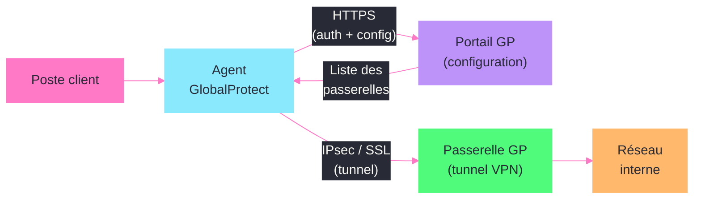
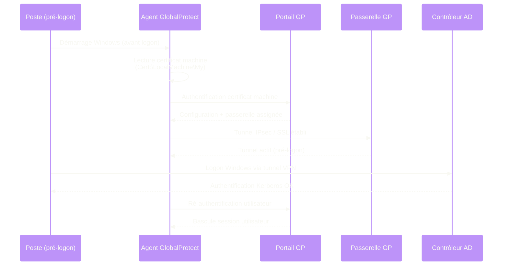

---
tags:
  - registre
  - vpn
  - globalprotect
  - palo-alto
  - securite
---

# GlobalProtect (Palo Alto)

!!! abstract "Ce que vous allez apprendre"
    - Les cles de registre principales du client GlobalProtect et leur emplacement
    - La configuration pre-logon pour le VPN avant authentification Windows
    - Les parametres de certificats, portails et passerelles dans le registre
    - Le split tunneling et le routage applicatif via le registre
    - Le controle des mises a jour automatiques et le verrouillage de version
    - Le depannage des problemes courants (echecs de connexion, erreurs de certificat)
    - Un scenario reel de deploiement pre-logon sur 500 postes via GPO

---

## Arborescence du registre GlobalProtect



Le client GlobalProtect stocke sa configuration sous deux emplacements principaux. Commencons par explorer ce qui existe sur un poste ou le client est installe.

```powershell
# List all subkeys under the main GlobalProtect hive
Get-ChildItem "HKLM:\SOFTWARE\Palo Alto Networks\GlobalProtect" -Recurse |
    Select-Object PSChildName, PSPath
```

```title="Resultat attendu"
PSChildName            PSPath
-----------            ------
Settings               ...Palo Alto Networks\GlobalProtect\Settings
PanSetup               ...Palo Alto Networks\GlobalProtect\PanSetup
PanGPS                 ...Palo Alto Networks\GlobalProtect\PanGPS
PanGPHip               ...Palo Alto Networks\GlobalProtect\PanGPHip
```

Le second emplacement contient les parametres de politique pousse par le portail :

```powershell
# Portal-pushed configuration
Get-ChildItem "HKLM:\SOFTWARE\Palo Alto Networks\GlobalProtect\PanGPS" |
    Select-Object PSChildName
```

```title="Resultat attendu"
PSChildName
-----------
AgentConfig
PortalConfig
```

| Cle de registre | Contenu |
|-----------------|---------|
| `HKLM\SOFTWARE\Palo Alto Networks\GlobalProtect\Settings` | Parametres generaux du client |
| `HKLM\SOFTWARE\Palo Alto Networks\GlobalProtect\PanSetup` | Configuration initiale (portail, methode de connexion) |
| `HKLM\SOFTWARE\Palo Alto Networks\GlobalProtect\PanGPS` | Configuration poussee par le portail |
| `HKLM\SOFTWARE\Palo Alto Networks\GlobalProtect\PanGPHip` | Donnees HIP (Host Information Profile) |

!!! info "En resume"
    - GlobalProtect utilise `HKLM\SOFTWARE\Palo Alto Networks\GlobalProtect` comme racine
    - Les sous-cles `PanSetup`, `PanGPS`, `PanGPHip` et `Settings` structurent la configuration
    - La configuration poussee par le portail se retrouve dans `PanGPS\PortalConfig`

---

## Configuration Pre-Logon



Le mode pre-logon permet d'etablir le tunnel VPN avant meme que l'utilisateur se connecte a Windows. C'est essentiel pour les postes joints au domaine qui doivent atteindre un controleur de domaine distant.

### Cles de base du pre-logon

```powershell
# Configure pre-logon connection via registry
$path = "HKLM:\SOFTWARE\Palo Alto Networks\GlobalProtect\PanSetup\GlobalProtect"

# Portal address
Set-ItemProperty -Path $path -Name "PanGPPortal" -Value "vpn.entreprise.com" -Type String

# Connection method: pre-logon
Set-ItemProperty -Path $path -Name "prelogon" -Value 1 -Type DWord

# Connect method: pre-logon then on-demand
Set-ItemProperty -Path $path -Name "connect-method" -Value "pre-logon-then-on-demand" -Type String
```

```title="Resultat attendu"
# No output (successful write operations)
```

### Valeurs de configuration PanSetup

| Valeur | Type | Description | Exemple |
|--------|------|-------------|---------|
| `PanGPPortal` | `REG_SZ` | Adresse FQDN du portail GP | `vpn.entreprise.com` |
| `prelogon` | `REG_DWORD` | Activer le mode pre-logon | `1` |
| `connect-method` | `REG_SZ` | Methode de connexion | `pre-logon-then-on-demand` |
| `agent-user-override-key` | `REG_SZ` | Cle de contournement pour l'utilisateur | `SecretKey123` |
| `default-browser` | `REG_SZ` | Navigateur pour l'authentification SAML | `default` |

### Methodes de connexion disponibles

La valeur `connect-method` accepte quatre modes :

| Methode | Comportement |
|---------|-------------|
| `pre-logon` | Tunnel etabli avant la connexion Windows, maintenu ensuite |
| `on-demand` | L'utilisateur lance manuellement la connexion |
| `user-logon` | Tunnel etabli automatiquement a la connexion Windows |
| `pre-logon-then-on-demand` | Pre-logon puis passage en mode manuel apres authentification |

```powershell
# Verify the current connect method
$val = Get-ItemProperty "HKLM:\SOFTWARE\Palo Alto Networks\GlobalProtect\PanSetup\GlobalProtect" `
    -Name "connect-method" -ErrorAction SilentlyContinue
$val.'connect-method'
```

```title="Resultat attendu"
pre-logon-then-on-demand
```

### Certificat machine pour le pre-logon

En mode pre-logon, le client utilise un certificat machine (pas un certificat utilisateur). Le certificat doit se trouver dans le magasin machine local.

```powershell
# Check for machine certificates usable by GlobalProtect
Get-ChildItem Cert:\LocalMachine\My |
    Where-Object { $_.EnhancedKeyUsageList.FriendlyName -contains "Client Authentication" } |
    Select-Object Thumbprint, Subject, NotAfter |
    Format-Table -AutoSize
```

```title="Resultat attendu"
Thumbprint                               Subject                    NotAfter
----------                               -------                    --------
A1B2C3D4E5F6A1B2C3D4E5F6A1B2C3D4E5F6A1B2 CN=PC-001.entreprise.com   01/06/2027 00:00:00
```

!!! info "En resume"
    - Le pre-logon necessite `prelogon=1` et `connect-method` dans `PanSetup\GlobalProtect`
    - Quatre methodes de connexion existent : `pre-logon`, `on-demand`, `user-logon`, `pre-logon-then-on-demand`
    - Un certificat machine valide dans `Cert:\LocalMachine\My` est requis pour le pre-logon

---

## Authentification par certificat

GlobalProtect peut exiger un certificat client pour valider l'identite du poste ou de l'utilisateur. Les parametres lies aux certificats sont repartis entre le registre et le magasin de certificats Windows.

### Configuration du profil de certificat

```powershell
# Registry path for certificate settings
$certPath = "HKLM:\SOFTWARE\Palo Alto Networks\GlobalProtect\PanGPS\AgentConfig"

# View current certificate profile setting
Get-ItemProperty -Path $certPath -Name "CertificateStoreLocation" -ErrorAction SilentlyContinue
```

```title="Resultat attendu"
CertificateStoreLocation : Machine
```

### Importer un certificat racine du portail

Le portail GlobalProtect pousse generalement son certificat racine dans le magasin de confiance. Si ce mecanisme echoue, il faut l'importer manuellement.

```powershell
# Import the portal root CA into Trusted Root store
$cert = "C:\Temp\PaloAlto-RootCA.cer"
Import-Certificate -FilePath $cert -CertStoreLocation Cert:\LocalMachine\Root
```

```title="Resultat attendu"
Thumbprint                                Subject
----------                                -------
F1E2D3C4B5A6F1E2D3C4B5A6F1E2D3C4B5A6F1E2  CN=PaloAlto-RootCA, O=Entreprise
```

### Valeurs de registre liees aux certificats

| Valeur | Emplacement | Description |
|--------|-------------|-------------|
| `CertificateStoreLocation` | `PanGPS\AgentConfig` | `Machine` ou `User` — magasin de certificats a interroger |
| `CertificateStoreName` | `PanGPS\AgentConfig` | Nom du magasin (`My`, `Root`, etc.) |
| `Certificate` | `PanGPS\PortalConfig` | Empreinte du certificat portail |
| `RootCACert` | `PanGPS\PortalConfig` | Certificat racine du portail (encode base64) |

### Forcer l'utilisation d'un certificat specifique

```powershell
# Pin a specific client certificate by thumbprint
$gpPath = "HKLM:\SOFTWARE\Palo Alto Networks\GlobalProtect\PanGPS\AgentConfig"
Set-ItemProperty -Path $gpPath -Name "ClientCertThumbprint" `
    -Value "A1B2C3D4E5F6A1B2C3D4E5F6A1B2C3D4E5F6A1B2" -Type String
```

```title="Resultat attendu"
# No output (successful write operation)
```

!!! info "En resume"
    - `CertificateStoreLocation` et `CertificateStoreName` controlent ou GlobalProtect cherche les certificats
    - Le certificat racine du portail est stocke dans `PanGPS\PortalConfig`
    - On peut forcer un certificat client precis via `ClientCertThumbprint`

---

## Configuration du portail et des passerelles

Le portail (portal) distribue la configuration et les passerelles (gateways) fournissent le tunnel VPN. Leurs parametres se retrouvent dans le registre apres la premiere connexion reussie.

### Adresse du portail

```powershell
# Read the portal address configured on the client
$setupPath = "HKLM:\SOFTWARE\Palo Alto Networks\GlobalProtect\PanSetup\GlobalProtect"
(Get-ItemProperty -Path $setupPath -Name "PanGPPortal").PanGPPortal
```

```title="Resultat attendu"
vpn.entreprise.com
```

### Configuration des passerelles

Apres connexion au portail, les passerelles disponibles sont mises en cache dans le registre :

```powershell
# List cached gateway configurations
$gwPath = "HKLM:\SOFTWARE\Palo Alto Networks\GlobalProtect\PanGPS\PortalConfig"
Get-ItemProperty -Path $gwPath -Name "Gateways" -ErrorAction SilentlyContinue
```

```title="Resultat attendu"
Gateways : gw-paris.entreprise.com;gw-lyon.entreprise.com;gw-remote.entreprise.com
```

### Parametres de passerelle importants

| Valeur | Type | Description |
|--------|------|-------------|
| `Gateways` | `REG_SZ` | Liste des passerelles separees par `;` |
| `PreferredGateway` | `REG_SZ` | Passerelle preferee pour la reconnexion |
| `PortalAddress` | `REG_SZ` | Adresse du portail (cache local) |
| `LastConnectedGateway` | `REG_SZ` | Derniere passerelle utilisee avec succes |

### Forcer une passerelle specifique

```powershell
# Force a specific gateway for all connections
$gwConfPath = "HKLM:\SOFTWARE\Palo Alto Networks\GlobalProtect\PanGPS\PortalConfig"
Set-ItemProperty -Path $gwConfPath -Name "PreferredGateway" `
    -Value "gw-paris.entreprise.com" -Type String
```

```title="Resultat attendu"
# No output (successful write operation)
```

### Version de l'agent

Le portail peut exiger une version minimale du client. Cette information est stockee localement :

```powershell
# Check the installed agent version
$verPath = "HKLM:\SOFTWARE\Palo Alto Networks\GlobalProtect\PanSetup\GlobalProtect"
(Get-ItemProperty -Path $verPath -Name "agent-version" -ErrorAction SilentlyContinue).'agent-version'
```

```title="Resultat attendu"
6.2.1-120
```

!!! info "En resume"
    - L'adresse du portail est dans `PanSetup\GlobalProtect\PanGPPortal`
    - Les passerelles sont mises en cache dans `PanGPS\PortalConfig\Gateways`
    - `PreferredGateway` et `LastConnectedGateway` controlent la selection de passerelle

---

## Split tunnel et tunnel applicatif

Le split tunneling permet de router seulement une partie du trafic dans le tunnel VPN. Le tunnel applicatif (app-based) route le trafic en fonction de l'application source.

### Lecture de la configuration split tunnel

```powershell
# Read split tunnel settings from the portal configuration
$splitPath = "HKLM:\SOFTWARE\Palo Alto Networks\GlobalProtect\PanGPS\PortalConfig"
Get-ItemProperty -Path $splitPath -Name "SplitTunnelEnabled", "SplitTunnelDomains", `
    "SplitTunnelIncludes", "SplitTunnelExcludes" -ErrorAction SilentlyContinue
```

```title="Resultat attendu"
SplitTunnelEnabled  : 1
SplitTunnelDomains  : entreprise.com;intranet.local
SplitTunnelIncludes : 10.0.0.0/8;172.16.0.0/12
SplitTunnelExcludes : 10.99.0.0/16
```

### Parametres de split tunnel

| Valeur | Type | Description |
|--------|------|-------------|
| `SplitTunnelEnabled` | `REG_DWORD` | `1` = split tunnel actif, `0` = tout dans le tunnel |
| `SplitTunnelIncludes` | `REG_SZ` | Sous-reseaux routes dans le tunnel (separes par `;`) |
| `SplitTunnelExcludes` | `REG_SZ` | Sous-reseaux exclus du tunnel |
| `SplitTunnelDomains` | `REG_SZ` | Domaines DNS resolus via le tunnel |
| `DisableAccessToLocalNetwork` | `REG_DWORD` | `1` = bloquer l'acces au reseau local |

### Tunnel applicatif (App-Based VPN)

Le tunnel applicatif est configure cote portail mais ses parametres sont mis en cache localement :

```powershell
# Check app-based tunnel configuration
$appPath = "HKLM:\SOFTWARE\Palo Alto Networks\GlobalProtect\PanGPS\PortalConfig"
Get-ItemProperty -Path $appPath -Name "AppBasedVPN", "AppBasedVPNApps" -ErrorAction SilentlyContinue
```

```title="Resultat attendu"
AppBasedVPN     : 1
AppBasedVPNApps : outlook.exe;teams.exe;onedrive.exe
```

### Verification du routage actif

Pour verifier que le split tunnel fonctionne correctement, examinez la table de routage pendant une connexion active :

```powershell
# Check routes added by GlobalProtect
Get-NetRoute -InterfaceAlias "PANGP Virtual Ethernet Adapter*" |
    Select-Object DestinationPrefix, NextHop, RouteMetric |
    Format-Table -AutoSize
```

```title="Resultat attendu"
DestinationPrefix  NextHop       RouteMetric
-----------------  -------       -----------
10.0.0.0/8         10.100.0.1    1
172.16.0.0/12      10.100.0.1    1
0.0.0.0/0          10.100.0.1    9999
```

!!! info "En resume"
    - Le split tunnel est controle par `SplitTunnelEnabled`, `SplitTunnelIncludes` et `SplitTunnelExcludes`
    - Le tunnel applicatif route le trafic par processus via `AppBasedVPN` et `AppBasedVPNApps`
    - Verifiez le routage actif avec `Get-NetRoute` sur l'interface PANGP

---

## Mises a jour et verrouillage de version

GlobalProtect peut se mettre a jour automatiquement via le portail. En entreprise, il est souvent necessaire de controler les versions deployees.

### Controler les mises a jour automatiques

```powershell
# Disable automatic agent upgrades
$upgradePath = "HKLM:\SOFTWARE\Palo Alto Networks\GlobalProtect\PanSetup\GlobalProtect"
Set-ItemProperty -Path $upgradePath -Name "allow-auto-upgrade" -Value "no" -Type String

# Verify
(Get-ItemProperty -Path $upgradePath -Name "allow-auto-upgrade").'allow-auto-upgrade'
```

```title="Resultat attendu"
no
```

### Parametres de mise a jour

| Valeur | Type | Description |
|--------|------|-------------|
| `allow-auto-upgrade` | `REG_SZ` | `yes` ou `no` — autoriser la mise a jour automatique |
| `agent-version` | `REG_SZ` | Version actuelle installee |
| `minimum-agent-version` | `REG_SZ` | Version minimale requise par le portail |
| `upgrade-mode` | `REG_SZ` | `prompt`, `transparent`, `disable` |

### Verrouiller sur une version specifique

```powershell
# Pin to a specific version — prevent upgrades beyond this version
$setupPath = "HKLM:\SOFTWARE\Palo Alto Networks\GlobalProtect\PanSetup\GlobalProtect"

Set-ItemProperty -Path $setupPath -Name "allow-auto-upgrade" -Value "no" -Type String
Set-ItemProperty -Path $setupPath -Name "upgrade-mode" -Value "disable" -Type String

# Confirm current installed version
$version = (Get-ItemProperty -Path $setupPath -Name "agent-version" `
    -ErrorAction SilentlyContinue).'agent-version'
Write-Output "Version verrouillee : $version"
```

```title="Resultat attendu"
Version verrouillee : 6.2.1-120
```

### Deployer le verrouillage en masse via GPO

```powershell
# GPO registry preference — apply to all workstations
# Path: Computer Configuration > Preferences > Windows Settings > Registry
# Action: Update
# Hive: HKEY_LOCAL_MACHINE
# Key: SOFTWARE\Palo Alto Networks\GlobalProtect\PanSetup\GlobalProtect
# Value: allow-auto-upgrade = no (REG_SZ)
# Value: upgrade-mode = disable (REG_SZ)
```

!!! info "En resume"
    - `allow-auto-upgrade` et `upgrade-mode` controlent le comportement de mise a jour
    - Le mode `disable` empeche toute mise a jour, `prompt` demande a l'utilisateur, `transparent` applique sans interaction
    - Deployer ces valeurs via GPO Registry Preferences pour un controle a l'echelle du parc

---

## Depannage via le registre

Les problemes GlobalProtect les plus courants laissent des traces dans le registre. Voici comment les diagnostiquer systematiquement.

### Echec de connexion au portail

Le premier reflexe est de verifier la configuration de base :

```powershell
# Quick diagnostic — check all critical settings
$setupPath = "HKLM:\SOFTWARE\Palo Alto Networks\GlobalProtect\PanSetup\GlobalProtect"
$gpsPath = "HKLM:\SOFTWARE\Palo Alto Networks\GlobalProtect\PanGPS"

Write-Output "=== Configuration de base ==="
$setup = Get-ItemProperty -Path $setupPath -ErrorAction SilentlyContinue
Write-Output "Portal      : $($setup.PanGPPortal)"
Write-Output "Connect     : $($setup.'connect-method')"
Write-Output "Pre-logon   : $($setup.prelogon)"
Write-Output "Version     : $($setup.'agent-version')"

Write-Output "`n=== Etat de la connexion ==="
$status = Get-ItemProperty -Path $gpsPath -ErrorAction SilentlyContinue
Write-Output "Status      : $($status.ConnectionStatus)"
Write-Output "Gateway     : $($status.ConnectedGateway)"
```

```title="Resultat attendu"
=== Configuration de base ===
Portal      : vpn.entreprise.com
Connect     : pre-logon-then-on-demand
Pre-logon   : 1
Version     : 6.2.1-120

=== Etat de la connexion ===
Status      : Disconnected
Gateway     :
```

### Erreurs de certificat

Si le client refuse de se connecter avec une erreur de certificat :

```powershell
# Check 1: Verify the portal certificate trust chain
$portalFQDN = "vpn.entreprise.com"
$result = Test-NetConnection -ComputerName $portalFQDN -Port 443
Write-Output "Connectivite : $($result.TcpTestSucceeded)"

# Check 2: Verify machine certificate is present and valid
$machCerts = Get-ChildItem Cert:\LocalMachine\My |
    Where-Object {
        $_.NotAfter -gt (Get-Date) -and
        $_.EnhancedKeyUsageList.FriendlyName -contains "Client Authentication"
    }
Write-Output "Certificats machine valides : $($machCerts.Count)"
$machCerts | Select-Object Thumbprint, Subject, NotAfter | Format-Table -AutoSize

# Check 3: Verify root CA is in Trusted Root store
$rootCerts = Get-ChildItem Cert:\LocalMachine\Root |
    Where-Object { $_.Subject -match "PaloAlto|GlobalProtect|Entreprise" }
Write-Output "Certificats racine pertinents : $($rootCerts.Count)"
```

```title="Resultat attendu"
Connectivite : True
Certificats machine valides : 1

Thumbprint                               Subject                    NotAfter
----------                               -------                    --------
A1B2C3D4E5F6A1B2C3D4E5F6A1B2C3D4E5F6A1B2 CN=PC-001.entreprise.com   01/06/2027 00:00:00

Certificats racine pertinents : 1
```

### Reinitialiser la configuration du client

Quand tout le reste echoue, une reinitialisation propre du registre peut resoudre les problemes de configuration corrompue :

```powershell
# Reset GlobalProtect client configuration
# WARNING: This removes all cached portal/gateway config
Stop-Service PanGPS -Force -ErrorAction SilentlyContinue

# Back up current configuration
reg export "HKLM\SOFTWARE\Palo Alto Networks\GlobalProtect" C:\Temp\gp-backup.reg /y

# Remove cached portal configuration
Remove-Item "HKLM:\SOFTWARE\Palo Alto Networks\GlobalProtect\PanGPS\PortalConfig" `
    -Recurse -ErrorAction SilentlyContinue
Remove-Item "HKLM:\SOFTWARE\Palo Alto Networks\GlobalProtect\PanGPS\AgentConfig" `
    -Recurse -ErrorAction SilentlyContinue

# Restart the service
Start-Service PanGPS
Write-Output "Configuration reintialisee. Le client va re-telecharger la config du portail."
```

```title="Resultat attendu"
Configuration reintialisee. Le client va re-telecharger la config du portail.
```

### Fichiers de logs associes

En complement du registre, les logs GlobalProtect se trouvent ici :

| Emplacement | Contenu |
|-------------|---------|
| `C:\Program Files\Palo Alto Networks\GlobalProtect\PanGPA.log` | Log de l'agent utilisateur |
| `C:\Program Files\Palo Alto Networks\GlobalProtect\PanGPS.log` | Log du service systeme |
| `C:\ProgramData\Palo Alto Networks\GlobalProtect\Logs\` | Logs complementaires (HIP, connexion) |

```powershell
# Search for connection errors in the last 100 lines
Get-Content "C:\Program Files\Palo Alto Networks\GlobalProtect\PanGPS.log" -Tail 100 |
    Select-String -Pattern "Error|Failed|Timeout"
```

```title="Resultat attendu"
[2026-04-03 14:22:01] Error: Portal authentication failed - certificate not found
[2026-04-03 14:22:01] Failed to establish pre-logon tunnel
```

!!! info "En resume"
    - Verifiez d'abord `PanGPPortal`, `connect-method` et `prelogon` dans `PanSetup`
    - Les erreurs de certificat se diagnostiquent via `Cert:\LocalMachine\My` et `Cert:\LocalMachine\Root`
    - En dernier recours, sauvegardez puis supprimez `PanGPS\PortalConfig` pour forcer le re-telechargement
    - Les logs `PanGPA.log` et `PanGPS.log` completent le diagnostic registre

---

## Scenario reel : deployer GlobalProtect pre-logon sur 500 postes via GPO

### Contexte

Une entreprise de 500 postes nomades doit activer le VPN GlobalProtect en mode pre-logon. Les utilisateurs doivent pouvoir ouvrir leur session Windows via un controleur de domaine accessible uniquement a travers le tunnel VPN.

### Etape 1 : preparer le certificat machine

Chaque poste doit posseder un certificat machine emis par l'autorite de certification interne. Deployez-le via GPO d'auto-enrollment ou via un script :

```powershell
# Verify auto-enrollment is working on a sample machine
$certs = Get-ChildItem Cert:\LocalMachine\My |
    Where-Object {
        $_.Issuer -match "CA-Interne" -and
        $_.EnhancedKeyUsageList.FriendlyName -contains "Client Authentication" -and
        $_.NotAfter -gt (Get-Date)
    }

if ($certs.Count -ge 1) {
    Write-Output "OK : $($certs.Count) certificat(s) machine valide(s) trouve(s)"
    $certs | Select-Object Thumbprint, Subject, NotAfter | Format-Table -AutoSize
} else {
    Write-Output "ERREUR : aucun certificat machine valide. Verifiez l'auto-enrollment."
}
```

```title="Resultat attendu"
OK : 1 certificat(s) machine valide(s) trouve(s)

Thumbprint                               Subject                    NotAfter
----------                               -------                    --------
A1B2C3D4E5F6A1B2C3D4E5F6A1B2C3D4E5F6A1B2 CN=PC-NOM-001.corp.local   15/03/2027 00:00:00
```

### Etape 2 : creer la GPO de configuration registre

Creez une GPO contenant les preferences de registre suivantes :

```powershell
# Script to create the registry values (run on each workstation via GPO startup script)
$basePath = "HKLM:\SOFTWARE\Palo Alto Networks\GlobalProtect\PanSetup\GlobalProtect"

# Ensure the key exists
if (-not (Test-Path $basePath)) {
    New-Item -Path $basePath -Force | Out-Null
}

# Portal address
Set-ItemProperty -Path $basePath -Name "PanGPPortal" -Value "vpn.entreprise.com" -Type String

# Pre-logon mode
Set-ItemProperty -Path $basePath -Name "prelogon" -Value 1 -Type DWord
Set-ItemProperty -Path $basePath -Name "connect-method" -Value "pre-logon" -Type String

# Prevent users from disconnecting
Set-ItemProperty -Path $basePath -Name "allow-user-disconnect" -Value "no" -Type String

# Lock the upgrade version
Set-ItemProperty -Path $basePath -Name "allow-auto-upgrade" -Value "no" -Type String
Set-ItemProperty -Path $basePath -Name "upgrade-mode" -Value "disable" -Type String

Write-Output "GlobalProtect pre-logon configure avec succes."
```

```title="Resultat attendu"
GlobalProtect pre-logon configure avec succes.
```

### Etape 3 : valeurs GPO Registry Preferences equivalentes

Pour utiliser les preferences de registre integrables directement dans la GPO (sans script) :

| Action | Hive | Cle | Valeur | Type | Donnee |
|--------|------|-----|--------|------|--------|
| Update | HKLM | `SOFTWARE\Palo Alto Networks\GlobalProtect\PanSetup\GlobalProtect` | `PanGPPortal` | REG_SZ | `vpn.entreprise.com` |
| Update | HKLM | (idem) | `prelogon` | REG_DWORD | `1` |
| Update | HKLM | (idem) | `connect-method` | REG_SZ | `pre-logon` |
| Update | HKLM | (idem) | `allow-user-disconnect` | REG_SZ | `no` |
| Update | HKLM | (idem) | `allow-auto-upgrade` | REG_SZ | `no` |
| Update | HKLM | (idem) | `upgrade-mode` | REG_SZ | `disable` |

### Etape 4 : deployer le MSI GlobalProtect

```powershell
# Silent install of GlobalProtect via GPO software deployment or startup script
$msiPath = "\\serveur-fichiers\Deploiement\GlobalProtect\GlobalProtect64-6.2.1.msi"
$logFile = "C:\Windows\Temp\GP-Install.log"

Start-Process msiexec.exe -ArgumentList "/i `"$msiPath`" /qn /l*v `"$logFile`" PORTAL=vpn.entreprise.com" `
    -Wait -NoNewWindow

# Verify installation
$installed = Get-ItemProperty "HKLM:\SOFTWARE\Palo Alto Networks\GlobalProtect\PanSetup\GlobalProtect" `
    -Name "agent-version" -ErrorAction SilentlyContinue
Write-Output "Version installee : $($installed.'agent-version')"
```

```title="Resultat attendu"
Version installee : 6.2.1-120
```

### Etape 5 : validation post-deploiement

```powershell
# Post-deployment validation script (run on sample machines)
$checks = @()

# Check 1: Service running
$svc = Get-Service PanGPS -ErrorAction SilentlyContinue
$checks += [PSCustomObject]@{ Test = "Service PanGPS"; Result = $svc.Status }

# Check 2: Registry configuration
$reg = Get-ItemProperty "HKLM:\SOFTWARE\Palo Alto Networks\GlobalProtect\PanSetup\GlobalProtect" `
    -ErrorAction SilentlyContinue
$checks += [PSCustomObject]@{ Test = "Portal configure"; Result = $reg.PanGPPortal }
$checks += [PSCustomObject]@{ Test = "Pre-logon actif"; Result = $reg.prelogon }
$checks += [PSCustomObject]@{ Test = "Methode connexion"; Result = $reg.'connect-method' }

# Check 3: Machine certificate
$cert = Get-ChildItem Cert:\LocalMachine\My |
    Where-Object { $_.EnhancedKeyUsageList.FriendlyName -contains "Client Authentication" }
$checks += [PSCustomObject]@{ Test = "Certificat machine"; Result = "$(if($cert){'Present'}else{'ABSENT'})" }

# Check 4: Portal reachability
$net = Test-NetConnection -ComputerName $reg.PanGPPortal -Port 443 -WarningAction SilentlyContinue
$checks += [PSCustomObject]@{ Test = "Connectivite portail"; Result = $net.TcpTestSucceeded }

$checks | Format-Table -AutoSize
```

```title="Resultat attendu"
Test                 Result
----                 ------
Service PanGPS       Running
Portal configure     vpn.entreprise.com
Pre-logon actif      1
Methode connexion    pre-logon
Certificat machine   Present
Connectivite portail True
```

!!! info "En resume"
    - Deployer les certificats machine via auto-enrollment PKI avant d'activer le pre-logon
    - Utiliser les GPO Registry Preferences pour pousser les 6 valeurs cles de `PanSetup\GlobalProtect`
    - Le MSI accepte la propriete `PORTAL=` pour preconfigurer le portail a l'installation
    - Valider avec un script de verification couvrant service, registre, certificat et connectivite
