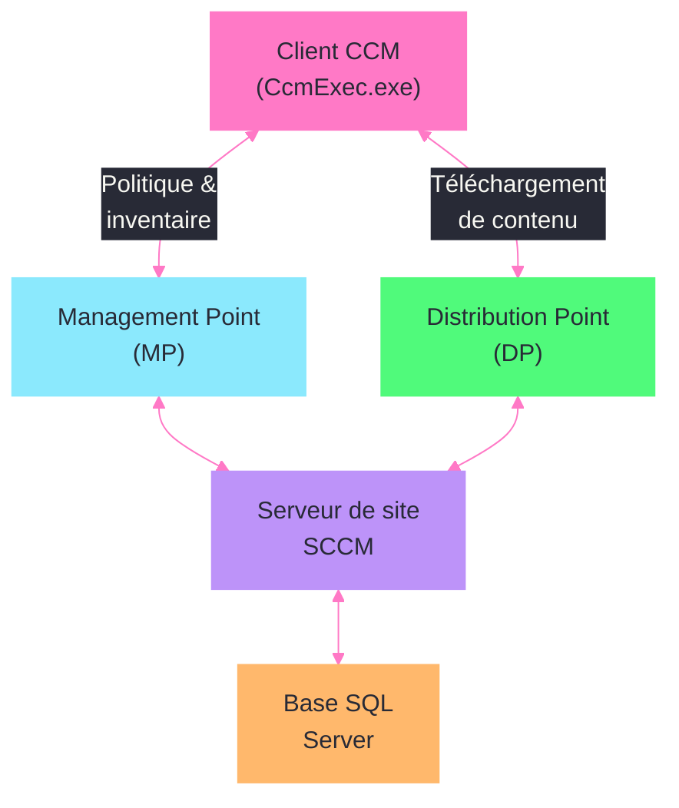
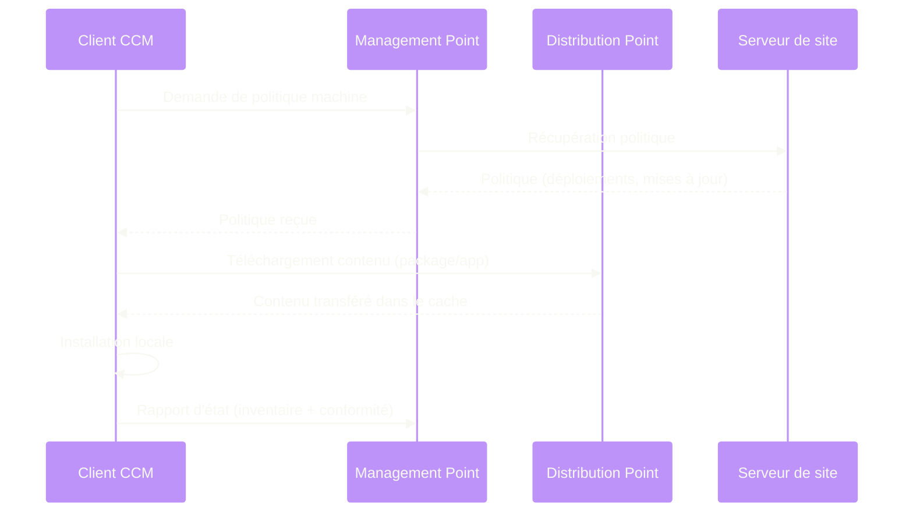

---
tags:
  - registre
  - sccm
  - mecm
  - configmgr
  - deploiement
---

# SCCM / MECM (ConfigMgr)

!!! abstract "Ce que vous allez apprendre"
    - Les cles de registre du client SCCM (CCM) et leur role dans la gestion du poste
    - L'assignation de site et la configuration des Management Points
    - Les parametres de cache client (taille, emplacement) modifiables dans le registre
    - Les regles de detection de deploiement basees sur le registre
    - L'extension de l'inventaire materiel et logiciel via le registre
    - La configuration des Distribution Points dans le registre
    - Le depannage de la sante du client (ccmrepair, ccmeval)
    - Un scenario reel de reparation d'un client qui ne remonte plus au Management Point

---

## Arborescence du registre SCCM Client



Le client Configuration Manager (anciennement SCCM, aujourd'hui MECM) utilise une arborescence etendue sous `HKLM\SOFTWARE\Microsoft\CCM`. Commencons par explorer sa structure.

```powershell
# List the main subkeys of the CCM hive
Get-ChildItem "HKLM:\SOFTWARE\Microsoft\CCM" |
    Select-Object PSChildName | Sort-Object PSChildName
```

```title="Resultat attendu"
PSChildName
-----------
CcmExec
ClientIdentificationInformation
ClientServicingData
ContentTransferManager
Logging
NetworkConfig
Policy
Security
SoftwareDistribution
StatusAgent
```

### Cles principales du client CCM

| Cle de registre | Role |
|-----------------|------|
| `HKLM\SOFTWARE\Microsoft\CCM` | Racine de la configuration client |
| `HKLM\SOFTWARE\Microsoft\CCM\CcmExec` | Parametres du processus principal `CcmExec.exe` |
| `HKLM\SOFTWARE\Microsoft\CCM\Security` | Certificats et identite du client |
| `HKLM\SOFTWARE\Microsoft\CCM\Policy` | Politiques recues du Management Point |
| `HKLM\SOFTWARE\Microsoft\CCM\SoftwareDistribution` | Deploiement d'applications et packages |
| `HKLM\SOFTWARE\Microsoft\CCM\Logging` | Configuration des logs client |
| `HKLM\SOFTWARE\Microsoft\SMS\Mobile Client` | Parametres d'installation du client |



### Informations d'identite du client

```powershell
# Read client identity information
$idPath = "HKLM:\SOFTWARE\Microsoft\CCM\ClientIdentificationInformation"
Get-ItemProperty -Path $idPath | Select-Object ClientId, PreviousClientId, ReservedUUID
```

```title="Resultat attendu"
ClientId       : GUID:{A1B2C3D4-E5F6-7890-A1B2-C3D4E5F6A1B2}
PreviousClientId :
ReservedUUID   : 0
```

!!! info "En resume"
    - La racine du client SCCM est `HKLM\SOFTWARE\Microsoft\CCM`
    - `CcmExec`, `Security`, `Policy`, `SoftwareDistribution` sont les sous-cles les plus importantes
    - `ClientIdentificationInformation\ClientId` contient l'identifiant unique du client dans la hierarchie SCCM

---

## Assignation de site et Management Point

L'assignation de site determine a quel serveur SCCM le client se rattache. Le Management Point (MP) est le point de contact principal pour la communication client-serveur.

### Lire l'assignation de site actuelle

```powershell
# Read current site assignment
$smsPath = "HKLM:\SOFTWARE\Microsoft\SMS\Mobile Client"
$ccmPath = "HKLM:\SOFTWARE\Microsoft\CCM"

$siteCode = (Get-ItemProperty -Path $smsPath -Name "AssignedSiteCode" -ErrorAction SilentlyContinue).AssignedSiteCode
$mp = (Get-ItemProperty -Path $ccmPath -Name "SMSSLP" -ErrorAction SilentlyContinue).SMSSLP

Write-Output "Site assigne : $siteCode"
Write-Output "Management Point : $mp"
```

```title="Resultat attendu"
Site assigne : PS1
Management Point : sccm-mp01.entreprise.com
```

### Valeurs d'assignation de site

| Valeur | Cle | Type | Description |
|--------|-----|------|-------------|
| `AssignedSiteCode` | `SMS\Mobile Client` | `REG_SZ` | Code du site SCCM assigne (ex: `PS1`) |
| `GPRequestedSiteAssignmentCode` | `SMS\Mobile Client` | `REG_SZ` | Code de site demande par GPO |
| `SMSSLP` | `CCM` | `REG_SZ` | FQDN du Server Locator Point (ancien) |
| `DNSSUFFIX` | `CCM` | `REG_SZ` | Suffixe DNS pour la decouverte du MP |
| `HttpPort` | `CCM` | `REG_DWORD` | Port HTTP du Management Point (defaut : `80`) |
| `HttpsPort` | `CCM` | `REG_DWORD` | Port HTTPS du Management Point (defaut : `443`) |

### Configuration du Management Point via le registre

```powershell
# View Management Point configuration
$mpPath = "HKLM:\SOFTWARE\Microsoft\CCM"
$props = Get-ItemProperty -Path $mpPath

Write-Output "MP actuel       : $($props.SMSSLP)"
Write-Output "DNS Suffix      : $($props.DNSSUFFIX)"
Write-Output "Port HTTP       : $($props.HttpPort)"
Write-Output "Port HTTPS      : $($props.HttpsPort)"
```

```title="Resultat attendu"
MP actuel       : sccm-mp01.entreprise.com
DNS Suffix      : entreprise.com
Port HTTP       : 80
Port HTTPS      : 443
```

### Forcer la reassignation de site

En cas de migration entre sites ou de mauvaise assignation :

```powershell
# Force site reassignment
$mobilePath = "HKLM:\SOFTWARE\Microsoft\SMS\Mobile Client"
Set-ItemProperty -Path $mobilePath -Name "AssignedSiteCode" -Value "PS2" -Type String

# Trigger a machine policy refresh to apply the change
Invoke-WmiMethod -Namespace "root\ccm" -Class "SMS_Client" `
    -Name "TriggerSchedule" -ArgumentList "{00000000-0000-0000-0000-000000000021}"

Write-Output "Reassignation au site PS2 declenchee."
```

```title="Resultat attendu"
Reassignation au site PS2 declenchee.
```

!!! info "En resume"
    - `AssignedSiteCode` dans `SMS\Mobile Client` controle le site SCCM du client
    - Le Management Point est identifie par `SMSSLP` dans la cle `CCM`
    - Pour forcer une reassignation, modifier `AssignedSiteCode` puis declencher un cycle de politique machine

---

## Cache client : taille et emplacement

Le cache du client SCCM stocke les packages et applications telecharges avant installation. Sa taille et son emplacement sont geres dans le registre.

### Lire la configuration actuelle du cache

```powershell
# Read cache settings
$cachePath = "HKLM:\SOFTWARE\Microsoft\CCM\SoftMgmtAgent"
$props = Get-ItemProperty -Path $cachePath -ErrorAction SilentlyContinue

Write-Output "Taille du cache (Mo)  : $($props.CacheSize)"
Write-Output "Emplacement du cache  : $($props.CacheLocation)"
Write-Output "Limite taille         : $($props.CacheSizeOverride)"
```

```title="Resultat attendu"
Taille du cache (Mo)  : 20480
Emplacement du cache  : C:\Windows\ccmcache
Limite taille         :
```

### Parametres de cache

| Valeur | Cle | Type | Description |
|--------|-----|------|-------------|
| `CacheSize` | `CCM\SoftMgmtAgent` | `REG_DWORD` | Taille maximale du cache en Mo |
| `CacheLocation` | `CCM\SoftMgmtAgent` | `REG_SZ` | Chemin du repertoire de cache |
| `CacheEnabled` | `CCM\SoftMgmtAgent` | `REG_DWORD` | `1` = cache actif |

### Modifier la taille du cache

```powershell
# Increase cache size to 30 GB
$cachePath = "HKLM:\SOFTWARE\Microsoft\CCM\SoftMgmtAgent"
Set-ItemProperty -Path $cachePath -Name "CacheSize" -Value 30720 -Type DWord

# Verify the change
$newSize = (Get-ItemProperty -Path $cachePath -Name "CacheSize").CacheSize
Write-Output "Nouvelle taille du cache : $($newSize) Mo ($([math]::Round($newSize/1024, 1)) Go)"
```

```title="Resultat attendu"
Nouvelle taille du cache : 30720 Mo (30 Go)
```

### Modifier l'emplacement du cache

Pour deplacer le cache sur un autre volume (par exemple un disque dedie) :

```powershell
# Change cache location to D: drive
$cachePath = "HKLM:\SOFTWARE\Microsoft\CCM\SoftMgmtAgent"

# Stop the SCCM client service
Stop-Service CcmExec -Force

# Update registry
Set-ItemProperty -Path $cachePath -Name "CacheLocation" -Value "D:\ccmcache" -Type String

# Create the new directory
New-Item -Path "D:\ccmcache" -ItemType Directory -Force | Out-Null

# Restart the service
Start-Service CcmExec

Write-Output "Cache deplace vers D:\ccmcache"
```

```title="Resultat attendu"
Cache deplace vers D:\ccmcache
```

### Methode WMI recommandee

La methode la plus fiable pour modifier le cache passe par WMI, qui met a jour le registre de maniere coherente :

```powershell
# Recommended: Use WMI to resize cache
$cache = Get-WmiObject -Namespace "root\ccm\SoftMgmtAgent" -Class "CacheConfig"
$cache.Size = 30720
$cache.Put()

# Verify via registry
(Get-ItemProperty "HKLM:\SOFTWARE\Microsoft\CCM\SoftMgmtAgent" -Name "CacheSize").CacheSize
```

```title="Resultat attendu"
30720
```

!!! info "En resume"
    - `CacheSize` et `CacheLocation` dans `CCM\SoftMgmtAgent` controlent le cache
    - L'emplacement par defaut est `C:\Windows\ccmcache` avec une taille de 5120 Mo
    - La methode WMI est preferee car elle assure la coherence entre registre et agent

---

## Regles de detection de deploiement

Les deploiements d'applications SCCM utilisent des regles de detection pour verifier si une application est deja installee. Les regles basees sur le registre sont les plus courantes.

### Principe des regles de detection

Une regle de detection par registre verifie l'existence d'une cle, d'une valeur ou la correspondance d'une donnee. Si la condition est remplie, l'application est consideree comme installee.

### Exemples de regles de detection courantes

```powershell
# Example 1: Detect if 7-Zip is installed (registry key exists)
$path = "HKLM:\SOFTWARE\Microsoft\Windows\CurrentVersion\Uninstall\7-Zip"
$detected = Test-Path $path
Write-Output "7-Zip detecte : $detected"
```

```title="Resultat attendu"
7-Zip detecte : True
```

```powershell
# Example 2: Detect by version comparison (value >= expected)
$path = "HKLM:\SOFTWARE\Microsoft\Windows\CurrentVersion\Uninstall\7-Zip"
$version = (Get-ItemProperty -Path $path -Name "DisplayVersion" -ErrorAction SilentlyContinue).DisplayVersion
$minVersion = "23.01"
$detected = [version]$version -ge [version]$minVersion
Write-Output "Version installee : $version | Minimum requis : $minVersion | Detecte : $detected"
```

```title="Resultat attendu"
Version installee : 24.08 | Minimum requis : 23.01 | Detecte : True
```

### Types de regles de detection

| Type | Configuration SCCM | Logique |
|------|-------------------|---------|
| Cle existe | Hive + Path | La cle de registre existe |
| Valeur existe | Hive + Path + ValueName | La valeur nommee existe |
| Egalite | Hive + Path + ValueName + Data | La donnee correspond exactement |
| Version >= | Hive + Path + ValueName + Version | La version est superieure ou egale |

### Registre 32 bits vs 64 bits

Sur les systemes 64 bits, les applications 32 bits ecrivent dans un emplacement redirige. Il faut en tenir compte dans les regles de detection.

```powershell
# 64-bit application: standard path
$path64 = "HKLM:\SOFTWARE\Microsoft\Windows\CurrentVersion\Uninstall\{APP-GUID}"

# 32-bit application on 64-bit OS: redirected path
$path32 = "HKLM:\SOFTWARE\WOW6432Node\Microsoft\Windows\CurrentVersion\Uninstall\{APP-GUID}"

# In SCCM detection rule: check the "This registry key is associated with a 32-bit application
# on 64-bit systems" checkbox to search in WOW6432Node
Write-Output "64-bit path exists : $(Test-Path $path64)"
Write-Output "32-bit path exists : $(Test-Path $path32)"
```

```title="Resultat attendu"
64-bit path exists : False
32-bit path exists : True
```

### Script de detection avance

Pour les cas complexes, un script PowerShell de detection peut interroger plusieurs cles :

```powershell
# Advanced detection script for SCCM deployment type
# Returns output to STDOUT if detected, nothing otherwise
$appKey = "HKLM:\SOFTWARE\VendorApp\Config"
$minVer = "4.2.0"

if (Test-Path $appKey) {
    $ver = (Get-ItemProperty $appKey -Name "Version" -ErrorAction SilentlyContinue).Version
    if ($ver -and [version]$ver -ge [version]$minVer) {
        Write-Output "Detected: $ver"
    }
}
# If nothing is output, SCCM considers the app NOT detected
```

```title="Resultat attendu"
Detected: 4.3.1
```

!!! info "En resume"
    - Les regles de detection par registre verifient l'existence d'une cle, d'une valeur ou une correspondance de donnee
    - Attention au WOW6432Node pour les applications 32 bits sur les OS 64 bits
    - Les scripts de detection renvoient du texte en sortie si l'application est detectee, rien sinon

---

## Extension de l'inventaire materiel et logiciel

SCCM peut collecter des valeurs de registre personnalisees dans son inventaire materiel grace au fichier MOF ou via les extensions d'inventaire.

### Principe de l'inventaire etendu

L'agent SCCM lit les classes WMI pour l'inventaire. Pour ajouter une valeur de registre, il faut creer un pont entre le registre et WMI via le provider `RegProv`.

### Ajouter une cle personnalisee a l'inventaire

La methode moderne utilise le fichier `configuration.mof` sur le serveur de site :

```powershell
# Step 1: Verify that the registry key to inventory exists
$customKey = "HKLM:\SOFTWARE\CustomApp\Settings"
Get-ItemProperty -Path $customKey -ErrorAction SilentlyContinue |
    Select-Object Version, LicenseType, InstallDate
```

```title="Resultat attendu"
Version      LicenseType  InstallDate
-------      -----------  -----------
3.5.2        Enterprise   2025-11-15
```

### Verification de l'inventaire client

Cote client, les parametres d'inventaire sont caches dans le registre :

```powershell
# Check hardware inventory schedule and last run
$invPath = "HKLM:\SOFTWARE\Microsoft\CCM\Scheduler"
$hwInv = Get-ChildItem $invPath -Recurse -ErrorAction SilentlyContinue |
    Where-Object { $_.PSChildName -match "HardwareInventory" }

if ($hwInv) {
    Get-ItemProperty $hwInv.PSPath | Select-Object ScheduledMessageID, TriggerState
}
```

```title="Resultat attendu"
ScheduledMessageID                          TriggerState
------------------                          ------------
{00000000-0000-0000-0000-000000000001}      Active
```

### Inventaire logiciel via le registre

L'inventaire logiciel SCCM scanne les cles `Uninstall` par defaut :

```powershell
# Keys scanned by SCCM software inventory
$paths = @(
    "HKLM:\SOFTWARE\Microsoft\Windows\CurrentVersion\Uninstall",
    "HKLM:\SOFTWARE\WOW6432Node\Microsoft\Windows\CurrentVersion\Uninstall",
    "HKCU:\SOFTWARE\Microsoft\Windows\CurrentVersion\Uninstall"
)

foreach ($p in $paths) {
    $count = (Get-ChildItem $p -ErrorAction SilentlyContinue).Count
    Write-Output "$p : $count applications"
}
```

```title="Resultat attendu"
HKLM:\SOFTWARE\Microsoft\Windows\CurrentVersion\Uninstall : 42
HKLM:\SOFTWARE\WOW6432Node\Microsoft\Windows\CurrentVersion\Uninstall : 18
HKCU:\SOFTWARE\Microsoft\Windows\CurrentVersion\Uninstall : 5
```

!!! info "En resume"
    - L'inventaire materiel SCCM peut etre etendu pour collecter des valeurs de registre personnalisees
    - Le pont entre registre et WMI passe par le provider `RegProv` et les fichiers MOF
    - L'inventaire logiciel scanne automatiquement les trois emplacements `Uninstall`

---

## Distribution Point et transfert de contenu

Les Distribution Points (DP) sont les serveurs qui hebergent le contenu a deployer. Le client SCCM gere la decouverte et le telechargement via des parametres registre.

### Configuration du transfert de contenu

```powershell
# Content transfer settings
$ctmPath = "HKLM:\SOFTWARE\Microsoft\CCM\ContentTransferManager"
Get-ItemProperty -Path $ctmPath -ErrorAction SilentlyContinue |
    Select-Object MaxRetryCount, RetryDelay, MaxBandwidthPercentage
```

```title="Resultat attendu"
MaxRetryCount        : 3
RetryDelay           : 60
MaxBandwidthPercentage : 0
```

### Parametres de transfert

| Valeur | Cle | Type | Description |
|--------|-----|------|-------------|
| `MaxRetryCount` | `CCM\ContentTransferManager` | `REG_DWORD` | Nombre max de tentatives de telechargement |
| `RetryDelay` | `CCM\ContentTransferManager` | `REG_DWORD` | Delai entre les tentatives (secondes) |
| `MaxBandwidthPercentage` | `CCM\ContentTransferManager` | `REG_DWORD` | Limite de bande passante (`0` = illimite) |

### Parametres reseau du client

```powershell
# Network configuration for SCCM client
$netPath = "HKLM:\SOFTWARE\Microsoft\CCM\NetworkConfig"
Get-ItemProperty -Path $netPath -ErrorAction SilentlyContinue |
    Select-Object BoundaryGroupID, ContentLocation, ManagementPointUrl
```

```title="Resultat attendu"
BoundaryGroupID    : BG-Paris-01
ContentLocation    : https://sccm-dp01.entreprise.com
ManagementPointUrl : https://sccm-mp01.entreprise.com
```

### Forcer un Distribution Point specifique

Dans certains cas de depannage, il est utile de verifier quel DP est utilise :

```powershell
# Check content locations cached by the client
$locPath = "HKLM:\SOFTWARE\Microsoft\CCM\ContentTransferManager\ContentLocations"
Get-ChildItem $locPath -ErrorAction SilentlyContinue |
    ForEach-Object {
        Get-ItemProperty $_.PSPath | Select-Object ContentId, ContentVersion, LocationPath
    } | Format-Table -AutoSize
```

```title="Resultat attendu"
ContentId                              ContentVersion LocationPath
---------                              -------------- ------------
PS100001                               2              https://sccm-dp01.entreprise.com/SMS_DP...
PS100042                               1              https://sccm-dp02.entreprise.com/SMS_DP...
```

!!! info "En resume"
    - `ContentTransferManager` gere les tentatives de telechargement et la bande passante
    - `NetworkConfig` contient les Boundary Groups et le DP affecte au client
    - Les emplacements de contenu sont mis en cache sous `ContentTransferManager\ContentLocations`

---

## Sante du client : ccmrepair et ccmeval

La sante du client SCCM est critique. Un client defaillant ne recoit plus de politiques, ne deploie plus d'applications et ne remonte plus d'inventaire.

### Verifier la sante du client via le registre

```powershell
# Read client health evaluation results
$evalPath = "HKLM:\SOFTWARE\Microsoft\CCM\CcmEval"
$props = Get-ItemProperty -Path $evalPath -ErrorAction SilentlyContinue

Write-Output "Derniere evaluation  : $($props.LastEvalTime)"
Write-Output "Resultat             : $($props.LastEvalResult)"
Write-Output "Reparation necessaire: $($props.NeedRemediation)"
```

```title="Resultat attendu"
Derniere evaluation  : 2026-04-03T06:00:00
Resultat             : Passed
Reparation necessaire: False
```

### Valeurs de sante du client

| Valeur | Cle | Description |
|--------|-----|-------------|
| `LastEvalTime` | `CCM\CcmEval` | Date/heure de la derniere evaluation |
| `LastEvalResult` | `CCM\CcmEval` | `Passed`, `Failed`, ou `Not Yet Evaluated` |
| `NeedRemediation` | `CCM\CcmEval` | `True` si une reparation est necessaire |
| `LastRemediation` | `CCM\CcmEval` | Date/heure de la derniere reparation |

### Declencher une evaluation de sante

```powershell
# Trigger client health evaluation manually
$ccmEvalExe = "C:\Windows\CCM\CcmEval.exe"
if (Test-Path $ccmEvalExe) {
    Start-Process $ccmEvalExe -Wait
    $result = (Get-ItemProperty "HKLM:\SOFTWARE\Microsoft\CCM\CcmEval" `
        -Name "LastEvalResult").LastEvalResult
    Write-Output "Resultat de l'evaluation : $result"
} else {
    Write-Output "CcmEval.exe introuvable — le client SCCM n'est peut-etre pas installe."
}
```

```title="Resultat attendu"
Resultat de l'evaluation : Passed
```

### Reparer le client SCCM

Si l'evaluation echoue, la reparation peut etre declenchee :

```powershell
# Repair the SCCM client
$ccmRepairExe = "C:\Windows\CCM\CcmRepair.exe"
if (Test-Path $ccmRepairExe) {
    Write-Output "Lancement de la reparation du client CCM..."
    Start-Process $ccmRepairExe -Wait
    Write-Output "Reparation terminee. Redemarrage du service..."
    Restart-Service CcmExec -Force
    Write-Output "Service CcmExec redemarre."
} else {
    # Alternative: reinstall client
    Write-Output "CcmRepair introuvable. Reinstallation complete recommandee."
    Write-Output "Commande : ccmsetup.exe /remediate:client"
}
```

```title="Resultat attendu"
Lancement de la reparation du client CCM...
Reparation terminee. Redemarrage du service...
Service CcmExec redemarre.
```

### Logs de sante

| Fichier log | Emplacement | Contenu |
|-------------|-------------|---------|
| `CcmEval.log` | `C:\Windows\CCM\Logs` | Resultats des evaluations de sante |
| `CcmRepair.log` | `C:\Windows\CCM\Logs` | Details des reparations |
| `ClientIDManagerStartup.log` | `C:\Windows\CCM\Logs` | Problemes d'identite client |
| `StatusAgent.log` | `C:\Windows\CCM\Logs` | Envoi des messages d'etat au MP |

```powershell
# Quick check of recent health evaluation logs
Get-Content "C:\Windows\CCM\Logs\CcmEval.log" -Tail 20 |
    Select-String -Pattern "Result|Error|Pass|Fail"
```

```title="Resultat attendu"
CcmEval: Evaluation result: Passed
CcmEval: All checks passed. No remediation needed.
```

!!! info "En resume"
    - `CcmEval` dans le registre stocke les resultats de la derniere evaluation de sante
    - `CcmEval.exe` effectue l'evaluation, `CcmRepair.exe` effectue la reparation
    - Les logs `CcmEval.log` et `CcmRepair.log` dans `C:\Windows\CCM\Logs` fournissent les details

---

## Scenario reel : reparer un client SCCM qui ne remonte plus au Management Point

### Contexte

Plusieurs postes ne sont plus visibles dans la console SCCM depuis trois semaines. Les utilisateurs ne recoivent plus de deploiements ni de mises a jour. L'objectif est de diagnostiquer et reparer le probleme a distance via PowerShell Remoting.

### Etape 1 : diagnostic a distance

```powershell
# Run diagnostic on a list of problematic machines
$machines = @("PC-COMPTA-01", "PC-RH-05", "PC-DIR-12")

$results = foreach ($pc in $machines) {
    Invoke-Command -ComputerName $pc -ScriptBlock {
        $ccm = Get-ItemProperty "HKLM:\SOFTWARE\Microsoft\CCM" -ErrorAction SilentlyContinue
        $eval = Get-ItemProperty "HKLM:\SOFTWARE\Microsoft\CCM\CcmEval" -ErrorAction SilentlyContinue
        $svc = Get-Service CcmExec -ErrorAction SilentlyContinue
        $site = (Get-ItemProperty "HKLM:\SOFTWARE\Microsoft\SMS\Mobile Client" `
            -Name "AssignedSiteCode" -ErrorAction SilentlyContinue).AssignedSiteCode
        $clientId = (Get-ItemProperty "HKLM:\SOFTWARE\Microsoft\CCM\ClientIdentificationInformation" `
            -Name "ClientId" -ErrorAction SilentlyContinue).ClientId

        [PSCustomObject]@{
            Computer   = $env:COMPUTERNAME
            Service    = $svc.Status
            SiteCode   = $site
            ClientId   = $clientId
            MP         = $ccm.SMSSLP
            EvalResult = $eval.LastEvalResult
            LastEval   = $eval.LastEvalTime
        }
    } -ErrorAction SilentlyContinue
}

$results | Format-Table -AutoSize
```

```title="Resultat attendu"
Computer      Service  SiteCode ClientId                                    MP                          EvalResult LastEval
--------      -------  -------- --------                                    --                          ---------- --------
PC-COMPTA-01  Stopped           GUID:{A1B2...}                              sccm-mp01.entreprise.com    Failed     2026-03-10
PC-RH-05      Running  PS1      GUID:{C3D4...}                              old-mp.entreprise.com       Passed     2026-04-02
PC-DIR-12     Running  PS1      GUID:{E5F6...}                              sccm-mp01.entreprise.com    Failed     2026-03-15
```

### Etape 2 : analyser les problemes identifies

Trois cas differents :

| Poste | Probleme identifie | Solution |
|-------|-------------------|----------|
| PC-COMPTA-01 | Service arrete, pas de site | Reinstaller le client |
| PC-RH-05 | Pointe vers un ancien MP | Mettre a jour le MP dans le registre |
| PC-DIR-12 | Evaluation echouee | Lancer CcmRepair |

### Etape 3 : corriger le MP obsolete

```powershell
# Fix PC-RH-05: update the Management Point
Invoke-Command -ComputerName "PC-RH-05" -ScriptBlock {
    # Update the management point
    Set-ItemProperty -Path "HKLM:\SOFTWARE\Microsoft\CCM" `
        -Name "SMSSLP" -Value "sccm-mp01.entreprise.com" -Type String

    # Restart the CCM service to apply
    Restart-Service CcmExec -Force

    # Trigger a machine policy refresh
    Start-Sleep -Seconds 5
    Invoke-WmiMethod -Namespace "root\ccm" -Class "SMS_Client" `
        -Name "TriggerSchedule" -ArgumentList "{00000000-0000-0000-0000-000000000021}"

    Write-Output "MP mis a jour et politique rafraichie sur $env:COMPUTERNAME"
}
```

```title="Resultat attendu"
MP mis a jour et politique rafraichie sur PC-RH-05
```

### Etape 4 : reparer le client defaillant

```powershell
# Fix PC-DIR-12: run CcmRepair remotely
Invoke-Command -ComputerName "PC-DIR-12" -ScriptBlock {
    # Run client health evaluation with remediation
    $evalExe = "C:\Windows\CCM\CcmEval.exe"
    if (Test-Path $evalExe) {
        Start-Process $evalExe -Wait
        $result = (Get-ItemProperty "HKLM:\SOFTWARE\Microsoft\CCM\CcmEval" `
            -Name "LastEvalResult").LastEvalResult

        if ($result -ne "Passed") {
            Write-Output "Evaluation echouee. Lancement de CcmRepair..."
            Start-Process "C:\Windows\CCM\CcmRepair.exe" -Wait
            Restart-Service CcmExec -Force
        }
        $final = (Get-ItemProperty "HKLM:\SOFTWARE\Microsoft\CCM\CcmEval" `
            -Name "LastEvalResult").LastEvalResult
        Write-Output "Etat final de $($env:COMPUTERNAME) : $final"
    }
}
```

```title="Resultat attendu"
Evaluation echouee. Lancement de CcmRepair...
Etat final de PC-DIR-12 : Passed
```

### Etape 5 : reinstaller le client completement

```powershell
# Fix PC-COMPTA-01: full client reinstallation
Invoke-Command -ComputerName "PC-COMPTA-01" -ScriptBlock {
    # Uninstall existing broken client
    $setupExe = "C:\Windows\ccmsetup\ccmsetup.exe"
    if (Test-Path $setupExe) {
        Start-Process $setupExe -ArgumentList "/uninstall" -Wait
        Start-Sleep -Seconds 30
    }

    # Clean up leftover registry keys
    Remove-Item "HKLM:\SOFTWARE\Microsoft\CCM" -Recurse -Force -ErrorAction SilentlyContinue
    Remove-Item "HKLM:\SOFTWARE\Microsoft\SMS" -Recurse -Force -ErrorAction SilentlyContinue

    # Reinstall from network share
    $installCmd = "\\sccm-mp01\SMS_PS1\Client\ccmsetup.exe"
    $params = "SMSSITECODE=PS1 SMSMP=sccm-mp01.entreprise.com /forceinstall"
    Start-Process $installCmd -ArgumentList $params
    Write-Output "Reinstallation du client lancee sur $env:COMPUTERNAME"
}
```

```title="Resultat attendu"
Reinstallation du client lancee sur PC-COMPTA-01
```

### Etape 6 : verification post-correction

```powershell
# Re-run diagnostic after fixes (wait 15 minutes for client to settle)
$machines = @("PC-COMPTA-01", "PC-RH-05", "PC-DIR-12")

$results = foreach ($pc in $machines) {
    Invoke-Command -ComputerName $pc -ScriptBlock {
        $ccm = Get-ItemProperty "HKLM:\SOFTWARE\Microsoft\CCM" -ErrorAction SilentlyContinue
        $eval = Get-ItemProperty "HKLM:\SOFTWARE\Microsoft\CCM\CcmEval" -ErrorAction SilentlyContinue
        $svc = Get-Service CcmExec -ErrorAction SilentlyContinue

        [PSCustomObject]@{
            Computer   = $env:COMPUTERNAME
            Service    = $svc.Status
            MP         = $ccm.SMSSLP
            EvalResult = $eval.LastEvalResult
        }
    } -ErrorAction SilentlyContinue
}

$results | Format-Table -AutoSize
```

```title="Resultat attendu"
Computer      Service MP                          EvalResult
--------      ------- --                          ----------
PC-COMPTA-01  Running sccm-mp01.entreprise.com    Passed
PC-RH-05      Running sccm-mp01.entreprise.com    Passed
PC-DIR-12     Running sccm-mp01.entreprise.com    Passed
```

!!! info "En resume"
    - Le diagnostic commence par verifier le service, le site assigne, le MP et le resultat CcmEval
    - Un MP obsolete se corrige en modifiant `SMSSLP` dans `HKLM\SOFTWARE\Microsoft\CCM`
    - `CcmEval.exe` + `CcmRepair.exe` resolvent la majorite des problemes de sante client
    - En dernier recours, une reinstallation complete via `ccmsetup.exe /uninstall` puis `/forceinstall`
