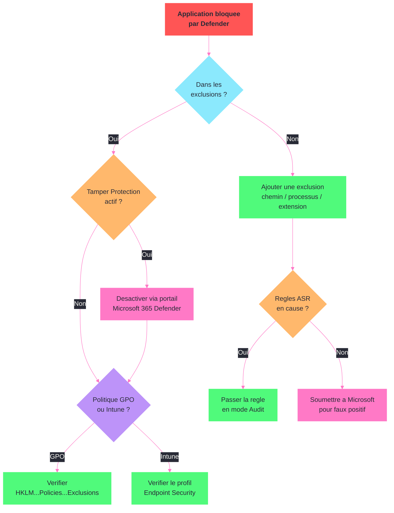
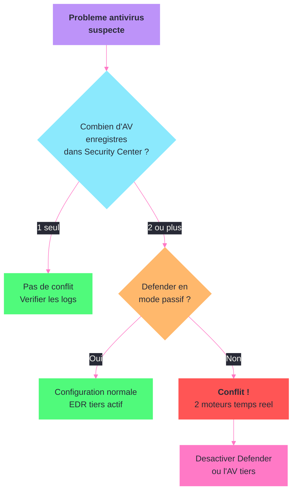

---
tags:
  - registre
  - antivirus
  - defender
  - crowdstrike
  - symantec
  - securite
---

# Antivirus enterprise

!!! abstract "Ce que vous allez apprendre"
    - Les cles de registre de Microsoft Defender ATP et leurs effets sur la protection
    - La gestion des exclusions Defender (chemins, processus, extensions) via le registre
    - Le fonctionnement de Tamper Protection et ses implications sur le registre
    - Les cles de registre de CrowdStrike Falcon pour le diagnostic
    - Les cles de registre de Symantec Endpoint Protection
    - La configuration de la protection temps reel, des scans et de la protection cloud
    - La detection de conflits entre antivirus via le registre
    - Un scenario reel de depannage quand Defender bloque une application legitime

---

## Microsoft Defender ATP : cles de registre



Microsoft Defender Antivirus est gere principalement via GPO ou Intune, mais chaque parametre se traduit en cle de registre sous `HKLM\SOFTWARE\Policies\Microsoft\Windows Defender`. La cle non-politique se trouve sous `HKLM\SOFTWARE\Microsoft\Windows Defender`.

### Explorer la configuration Defender

```powershell
# List all Defender policy subkeys
Get-ChildItem "HKLM:\SOFTWARE\Policies\Microsoft\Windows Defender" -ErrorAction SilentlyContinue |
    Select-Object PSChildName | Sort-Object PSChildName
```

```title="Resultat attendu"
PSChildName
-----------
Exclusions
MpEngine
NIS
Real-Time Protection
Remediation
Reporting
Scan
Signature Updates
SmartScreen
Spynet
Windows Defender Exploit Guard
```

### Cles principales de Defender

| Cle de registre | Role |
|-----------------|------|
| `...\Windows Defender` | Racine locale de Defender ; les surcharges politiques incluent la valeur legacy `DisableAntiSpyware` |
| `...\Windows Defender\Real-Time Protection` | Protection en temps reel |
| `...\Windows Defender\Exclusions` | Exclusions par chemin, processus, extension |
| `...\Windows Defender\Scan` | Parametres de scan programme |
| `...\Windows Defender\Signature Updates` | Mises a jour des signatures |
| `...\Windows Defender\Spynet` | Protection cloud (MAPS) |
| `...\Windows Defender\MpEngine` | Moteur de protection (niveau de cloud) |

### Etat global de Defender

```powershell
# Check Defender operational status via registry
$defPath = "HKLM:\SOFTWARE\Microsoft\Windows Defender"
$polPath = "HKLM:\SOFTWARE\Policies\Microsoft\Windows Defender"

$operational = Get-ItemProperty -Path $defPath -ErrorAction SilentlyContinue
$policy = Get-ItemProperty -Path $polPath -ErrorAction SilentlyContinue

Write-Output "Defender installe       : $(if(Test-Path $defPath){'Oui'}else{'Non'})"
Write-Output "DisableAntiSpyware (legacy pol): $($policy.DisableAntiSpyware)"
Write-Output "ProductStatus           : $($operational.ProductStatus)"
```

```title="Resultat attendu"
Defender installe       : Oui
DisableAntiSpyware (legacy pol):
ProductStatus           : 0
```

!!! note "Interpretez `DisableAntiSpyware` avec prudence"
    La presence de cette valeur est utile pour l'audit et la forensique, mais elle ne suffit plus a conclure que Defender est desactive. Croisez-la toujours avec `Get-MpPreference` ou `Get-MpComputerStatus`.

### Verifier via la commande native

En complement du registre, la cmdlet `Get-MpPreference` donne une vue synthetique :

```powershell
# Cross-reference registry with Get-MpPreference
$prefs = Get-MpPreference
Write-Output "RealTime Protection    : $(-not $prefs.DisableRealtimeMonitoring)"
Write-Output "Cloud Protection       : $($prefs.MAPSReporting -ne 0)"
Write-Output "Exclusion Paths        : $($prefs.ExclusionPath -join '; ')"
Write-Output "Exclusion Processes    : $($prefs.ExclusionProcess -join '; ')"
Write-Output "Exclusion Extensions   : $($prefs.ExclusionExtension -join '; ')"
```

```title="Resultat attendu"
RealTime Protection    : True
Cloud Protection       : True
Exclusion Paths        : C:\AppData\CustomApp; D:\Database
Exclusion Processes    : sqlservr.exe; customapp.exe
Exclusion Extensions   : .mdf; .ldf
```

!!! info "En resume"
    - Les politiques Defender sont sous `HKLM\SOFTWARE\Policies\Microsoft\Windows Defender`
    - L'etat operationnel est sous `HKLM\SOFTWARE\Microsoft\Windows Defender`
    - `Get-MpPreference` offre une vue synthetique qui correspond aux valeurs registre

---

## Exclusions Defender via le registre

Les exclusions sont essentielles en environnement serveur pour eviter que Defender ne ralentisse les applications metier (bases de donnees, serveurs web, etc.).

### Structure des exclusions dans le registre

```powershell
# List all exclusion categories
$exclPath = "HKLM:\SOFTWARE\Policies\Microsoft\Windows Defender\Exclusions"
Get-ChildItem $exclPath -ErrorAction SilentlyContinue |
    Select-Object PSChildName
```

```title="Resultat attendu"
PSChildName
-----------
Extensions
Paths
Processes
```

### Exclusions par chemin

```powershell
# Read path exclusions
$pathExcl = "HKLM:\SOFTWARE\Policies\Microsoft\Windows Defender\Exclusions\Paths"
Get-ItemProperty -Path $pathExcl -ErrorAction SilentlyContinue |
    Select-Object * -ExcludeProperty PS*
```

```title="Resultat attendu"
C:\AppData\CustomApp : 0
D:\Database          : 0
E:\Backups           : 0
```

### Exclusions par processus

```powershell
# Read process exclusions
$procExcl = "HKLM:\SOFTWARE\Policies\Microsoft\Windows Defender\Exclusions\Processes"
Get-ItemProperty -Path $procExcl -ErrorAction SilentlyContinue |
    Select-Object * -ExcludeProperty PS*
```

```title="Resultat attendu"
sqlservr.exe   : 0
w3wp.exe       : 0
customapp.exe  : 0
```

### Exclusions par extension

```powershell
# Read extension exclusions
$extExcl = "HKLM:\SOFTWARE\Policies\Microsoft\Windows Defender\Exclusions\Extensions"
Get-ItemProperty -Path $extExcl -ErrorAction SilentlyContinue |
    Select-Object * -ExcludeProperty PS*
```

```title="Resultat attendu"
.mdf : 0
.ldf : 0
.bak : 0
```

### Ajouter une exclusion via le registre

```powershell
# Add a path exclusion via registry (GPO equivalent)
$pathExcl = "HKLM:\SOFTWARE\Policies\Microsoft\Windows Defender\Exclusions\Paths"
if (-not (Test-Path $pathExcl)) {
    New-Item -Path $pathExcl -Force | Out-Null
}

# Enable exclusions
$exclRoot = "HKLM:\SOFTWARE\Policies\Microsoft\Windows Defender\Exclusions"
Set-ItemProperty -Path $exclRoot -Name "Exclusions_Paths" -Value 1 -Type DWord

# Add the path (value name = path, value data = 0)
New-ItemProperty -Path $pathExcl -Name "C:\MonApp\Data" -Value 0 -PropertyType DWord -Force | Out-Null

# Verify
(Get-ItemProperty $pathExcl)."C:\MonApp\Data"
```

```title="Resultat attendu"
0
```

### Ajouter une exclusion via PowerShell (methode recommandee)

```powershell
# Preferred method: use Add-MpPreference (updates registry automatically)
Add-MpPreference -ExclusionPath "C:\MonApp\Data"
Add-MpPreference -ExclusionProcess "monapp.exe"
Add-MpPreference -ExclusionExtension ".dat"

# Verify
$prefs = Get-MpPreference
Write-Output "Paths     : $($prefs.ExclusionPath -join '; ')"
Write-Output "Processes : $($prefs.ExclusionProcess -join '; ')"
Write-Output "Extensions: $($prefs.ExclusionExtension -join '; ')"
```

```title="Resultat attendu"
Paths     : C:\AppData\CustomApp; D:\Database; C:\MonApp\Data
Processes : sqlservr.exe; customapp.exe; monapp.exe
Extensions: .mdf; .ldf; .dat
```

!!! info "En resume"
    - Les exclusions sont sous `Exclusions\Paths`, `Exclusions\Processes` et `Exclusions\Extensions`
    - Chaque exclusion est une valeur REG_DWORD dont le nom est le chemin/processus/extension et la donnee `0`
    - `Add-MpPreference` est la methode recommandee car elle gere le registre de maniere coherente

---

## Tamper Protection et ses implications

Tamper Protection empeche les modifications non autorisees des parametres Defender, meme par un administrateur local. Cette fonctionnalite a un impact direct sur la capacite a modifier le registre Defender.

### Verifier l'etat de Tamper Protection

```powershell
# Check Tamper Protection status
$tpPath = "HKLM:\SOFTWARE\Microsoft\Windows Defender\Features"
$tp = (Get-ItemProperty -Path $tpPath -Name "TamperProtection" -ErrorAction SilentlyContinue).TamperProtection

$states = @{
    0 = "Desactive"
    1 = "Active (par le systeme)"
    2 = "Active (par la politique cloud)"
    4 = "Active"
    5 = "Active et verrouille"
}

Write-Output "Tamper Protection : $($states[[int]$tp]) (valeur = $tp)"
```

```title="Resultat attendu"
Tamper Protection : Active et verrouille (valeur = 5)
```

### Impact sur les modifications registre

Quand Tamper Protection est active, ces operations sont bloquees :

| Operation bloquee | Cle concernee |
|------------------|---------------|
| Desactiver la protection temps reel | `Real-Time Protection\DisableRealtimeMonitoring` |
| Desactiver la protection cloud | `Spynet\SpyNetReporting` |
| Modifier les exclusions (via registre direct) | `Exclusions\*` |
| Tenter une desactivation legacy de Defender | `DisableAntiSpyware` |

```powershell
# Attempt to disable real-time protection with Tamper Protection ON
try {
    Set-ItemProperty "HKLM:\SOFTWARE\Policies\Microsoft\Windows Defender\Real-Time Protection" `
        -Name "DisableRealtimeMonitoring" -Value 1 -Type DWord -Force
    Write-Output "Modification reussie (Tamper Protection probablement desactive)"
} catch {
    Write-Output "Modification BLOQUEE par Tamper Protection"
}

# Even if the registry write succeeds, Defender ignores the policy value
$status = Get-MpComputerStatus
Write-Output "Protection temps reel effective : $($status.RealTimeProtectionEnabled)"
```

```title="Resultat attendu"
Modification reussie (Tamper Protection probablement desactive)
Protection temps reel effective : True
```

### Contourner Tamper Protection legitimement

Pour les cas de depannage legitimes, il existe des methodes supportees :

```powershell
# Method 1: Disable via Microsoft 365 Defender portal (cloud-managed)
# Endpoint Security > Antivirus > Tamper Protection: Off
# This is the ONLY supported method for cloud-managed devices

# Method 2: For non-cloud devices, use local settings
# Windows Security > Virus & threat protection > Tamper Protection: Off

# Method 3: Check if Tamper Protection allows local admin override
$tpSource = (Get-ItemProperty "HKLM:\SOFTWARE\Microsoft\Windows Defender\Features" `
    -Name "TamperProtectionSource" -ErrorAction SilentlyContinue).TamperProtectionSource
Write-Output "Source de Tamper Protection : $tpSource"
# Values: "Intune" = managed by cloud, "E5" = managed by Defender for Endpoint
```

```title="Resultat attendu"
Source de Tamper Protection : Intune
```

!!! info "En resume"
    - Tamper Protection (valeur `5`) empeche les modifications registre Defender, meme par un administrateur
    - La cle `HKLM\SOFTWARE\Microsoft\Windows Defender\Features\TamperProtection` indique l'etat
    - `DisableAntiSpyware` est une valeur legacy : meme si l'ecriture reussit, elle ne prouve pas que Defender est effectivement desactive
    - Meme si l'ecriture registre reussit, Defender ignore certaines valeurs modifiees quand Tamper Protection est actif
    - La desactivation passe par le portail Microsoft 365 Defender ou les parametres locaux

---

## CrowdStrike Falcon : cles de registre

CrowdStrike Falcon est un EDR (Endpoint Detection and Response) entreprise. Ses cles de registre permettent de verifier l'installation, l'etat de connexion et la configuration du capteur.

### Emplacements principaux

```powershell
# CrowdStrike registry locations
$csLocations = @(
    "HKLM:\SYSTEM\CrowdStrike",
    "HKLM:\SOFTWARE\CrowdStrike"
)

foreach ($loc in $csLocations) {
    Write-Output "=== $loc ==="
    if (Test-Path $loc) {
        Get-ChildItem $loc -ErrorAction SilentlyContinue |
            Select-Object PSChildName | ForEach-Object { Write-Output "  $($_.PSChildName)" }
    } else {
        Write-Output "  (non present)"
    }
}
```

```title="Resultat attendu"
=== HKLM:\SYSTEM\CrowdStrike ===
  {9B03C1D9-3138-44ED-9FAE-D9F4C034B88D}
=== HKLM:\SOFTWARE\CrowdStrike ===
  Falcon
  MainlineSensor
```

### Informations du capteur Falcon

```powershell
# Read Falcon sensor information
$falconPath = "HKLM:\SYSTEM\CrowdStrike\{9B03C1D9-3138-44ED-9FAE-D9F4C034B88D}\{16e0423f-7058-48c9-a204-725362b67639}\Default"
$props = Get-ItemProperty -Path $falconPath -ErrorAction SilentlyContinue

Write-Output "Customer ID (CID) : $($props.CU)"
Write-Output "Agent ID (AID)    : $($props.AG)"
Write-Output "Sensor version    : $($props.adb)"
```

```title="Resultat attendu"
Customer ID (CID) : A1B2C3D4E5F6A1B2C3D4E5F6A1B2C3D4-E5
Agent ID (AID)    : f1e2d3c4b5a6f1e2d3c4b5a6f1e2d3c4
Sensor version    : 7.10.17706.0
```

### Valeurs CrowdStrike importantes

| Valeur | Emplacement | Description |
|--------|-------------|-------------|
| `CU` | `SYSTEM\CrowdStrike\{...}\Default` | Customer ID (CID) |
| `AG` | `SYSTEM\CrowdStrike\{...}\Default` | Agent ID unique du poste |
| `adb` | `SYSTEM\CrowdStrike\{...}\Default` | Version du capteur |
| `InstallDate` | `SOFTWARE\CrowdStrike\Falcon` | Date d'installation |

### Verifier l'etat du service Falcon

```powershell
# Check CrowdStrike service status
$services = @("CSFalconService", "CSAgent")
foreach ($svc in $services) {
    $s = Get-Service $svc -ErrorAction SilentlyContinue
    if ($s) {
        Write-Output "$svc : $($s.Status) (StartType: $($s.StartType))"
    }
}

# Check if the kernel driver is loaded
$driver = Get-Service CSDeviceControl -ErrorAction SilentlyContinue
if ($driver) {
    Write-Output "CSDeviceControl (driver) : $($driver.Status)"
}
```

```title="Resultat attendu"
CSFalconService : Running (StartType: Automatic)
CSDeviceControl (driver) : Running
```

### Verifier la connectivite Falcon

```powershell
# Check Falcon cloud connectivity via registry
$connPath = "HKLM:\SYSTEM\CrowdStrike\{9B03C1D9-3138-44ED-9FAE-D9F4C034B88D}\{16e0423f-7058-48c9-a204-725362b67639}\Default"
$state = Get-ItemProperty -Path $connPath -Name "ProvisionState" -ErrorAction SilentlyContinue

Write-Output "Provision State : $($state.ProvisionState)"
# 0 = Not provisioned, 1 = Provisioned, 2 = Error
```

```title="Resultat attendu"
Provision State : 1
```

!!! info "En resume"
    - CrowdStrike utilise `HKLM\SYSTEM\CrowdStrike` (driver) et `HKLM\SOFTWARE\CrowdStrike` (application)
    - Le CID et l'AID dans le registre identifient le tenant et le poste dans la console Falcon
    - Le service `CSFalconService` et le driver `CSDeviceControl` doivent etre en etat Running

---

## Symantec Endpoint Protection : cles de registre

Symantec Endpoint Protection (SEP) stocke sa configuration dans un emplacement registre distinct.

### Emplacements principaux

```powershell
# Symantec Endpoint Protection registry paths
$sepPaths = @(
    "HKLM:\SOFTWARE\Symantec\Symantec Endpoint Protection\CurrentVersion",
    "HKLM:\SOFTWARE\Symantec\Symantec Endpoint Protection\SMC",
    "HKLM:\SOFTWARE\WOW6432Node\Symantec\Symantec Endpoint Protection\CurrentVersion"
)

foreach ($p in $sepPaths) {
    if (Test-Path $p) {
        Write-Output "=== $($p.Split('\')[-1]) ==="
        Get-ItemProperty -Path $p -ErrorAction SilentlyContinue |
            Select-Object ProductVersion, PRODUCTNAME, InstallDate
    }
}
```

```title="Resultat attendu"
=== CurrentVersion ===
ProductVersion : 14.3.10148.8000
PRODUCTNAME    : Symantec Endpoint Protection
InstallDate    : 2025-08-20
```

### Valeurs SEP importantes

| Valeur | Cle | Description |
|--------|-----|-------------|
| `ProductVersion` | `CurrentVersion` | Version de SEP installee |
| `PRODUCTNAME` | `CurrentVersion` | Nom complet du produit |
| `InstallDate` | `CurrentVersion` | Date d'installation |
| `SMCGuiRunKey` | `SMC` | Executable de la console |
| `ServerName` | `SMC\SYLINK` | Nom du serveur SEPM (management) |

### Verifier la connexion au serveur de management

```powershell
# Check SEPM connection
$sylinkPath = "HKLM:\SOFTWARE\Symantec\Symantec Endpoint Protection\SMC\SYLINK\SyLink"
$props = Get-ItemProperty -Path $sylinkPath -ErrorAction SilentlyContinue

Write-Output "Serveur SEPM    : $($props.ServerName)"
Write-Output "Communication   : $($props.CommunicationStatus)"
Write-Output "Dernier contact : $($props.LastUpdate)"
```

```title="Resultat attendu"
Serveur SEPM    : sepm01.entreprise.com
Communication   : Connected
Dernier contact : 2026-04-03T09:30:00
```

### Service et etat SEP

```powershell
# Check SEP services
$sepServices = @("SepMasterService", "SNAC", "ccSvcHst")
foreach ($svc in $sepServices) {
    $s = Get-Service $svc -ErrorAction SilentlyContinue
    if ($s) {
        Write-Output "$svc : $($s.Status)"
    }
}
```

```title="Resultat attendu"
SepMasterService : Running
SNAC : Running
ccSvcHst : Running
```

!!! info "En resume"
    - SEP utilise `HKLM\SOFTWARE\Symantec\Symantec Endpoint Protection` comme racine
    - La connexion au SEPM est tracee dans `SMC\SYLINK\SyLink`
    - Les services `SepMasterService`, `SNAC` et `ccSvcHst` doivent tous etre en etat Running

---

## Protection temps reel, scans et cloud

Ces trois couches de protection sont controlees par des valeurs registre distinctes.

### Protection temps reel

```powershell
# Real-time protection registry settings
$rtPath = "HKLM:\SOFTWARE\Policies\Microsoft\Windows Defender\Real-Time Protection"
Get-ItemProperty -Path $rtPath -ErrorAction SilentlyContinue |
    Select-Object DisableRealtimeMonitoring, DisableBehaviorMonitoring,
        DisableOnAccessProtection, DisableScanOnRealtimeEnable
```

```title="Resultat attendu"
DisableRealtimeMonitoring    :
DisableBehaviorMonitoring    :
DisableOnAccessProtection    :
DisableScanOnRealtimeEnable  :
```

### Valeurs de protection temps reel

| Valeur | Type | `0` ou absent | `1` |
|--------|------|---------------|-----|
| `DisableRealtimeMonitoring` | `REG_DWORD` | Protection active | Protection desactivee |
| `DisableBehaviorMonitoring` | `REG_DWORD` | Surveillance comportement active | Desactivee |
| `DisableOnAccessProtection` | `REG_DWORD` | Protection a l'acces active | Desactivee |
| `DisableIOAVProtection` | `REG_DWORD` | Analyse des telechargements active | Desactivee |
| `DisableScanOnRealtimeEnable` | `REG_DWORD` | Scan au demarrage de la protection actif | Desactive |

### Planification des scans

```powershell
# Scan schedule settings
$scanPath = "HKLM:\SOFTWARE\Policies\Microsoft\Windows Defender\Scan"
Get-ItemProperty -Path $scanPath -ErrorAction SilentlyContinue |
    Select-Object ScheduleDay, ScheduleTime, ScanParameters, DisableCatchupFullScan
```

```title="Resultat attendu"
ScheduleDay            : 0
ScheduleTime           : 120
ScanParameters         : 1
DisableCatchupFullScan : 0
```

### Valeurs de planification des scans

| Valeur | Description | Valeurs |
|--------|-------------|---------|
| `ScheduleDay` | Jour du scan programme | `0` = tous les jours, `1` = dimanche, ..., `7` = samedi, `8` = jamais |
| `ScheduleTime` | Heure du scan (minutes apres minuit) | `120` = 02h00, `720` = 12h00 |
| `ScanParameters` | Type de scan | `1` = rapide, `2` = complet |
| `DisableCatchupFullScan` | Scan de rattrapage | `0` = actif, `1` = desactive |

### Protection cloud (MAPS)

```powershell
# Cloud protection settings
$cloudPath = "HKLM:\SOFTWARE\Policies\Microsoft\Windows Defender\Spynet"
$enginePath = "HKLM:\SOFTWARE\Policies\Microsoft\Windows Defender\MpEngine"

$spynet = Get-ItemProperty -Path $cloudPath -ErrorAction SilentlyContinue
$engine = Get-ItemProperty -Path $enginePath -ErrorAction SilentlyContinue

Write-Output "SpyNetReporting              : $($spynet.SpyNetReporting)"
Write-Output "SubmitSamplesConsent         : $($spynet.SubmitSamplesConsent)"
Write-Output "MpCloudBlockLevel            : $($engine.MpCloudBlockLevel)"
Write-Output "MpBafsExtendedTimeout        : $($engine.MpBafsExtendedTimeout)"
```

```title="Resultat attendu"
SpyNetReporting              : 2
SubmitSamplesConsent         : 1
MpCloudBlockLevel            : 2
MpBafsExtendedTimeout        : 50
```

### Valeurs de protection cloud

| Valeur | Description | Valeurs |
|--------|-------------|---------|
| `SpyNetReporting` | Niveau MAPS | `0` = desactive, `1` = basique, `2` = avance |
| `SubmitSamplesConsent` | Envoi d'echantillons | `0` = demander, `1` = auto si safe, `2` = jamais, `3` = toujours |
| `MpCloudBlockLevel` | Agressivite du blocage cloud | `0` = defaut, `2` = eleve, `4` = tres eleve, `6` = zero tolerance |
| `MpBafsExtendedTimeout` | Timeout cloud (secondes) | `50` = 50 secondes d'attente de verdict cloud |

!!! info "En resume"
    - La protection temps reel est geree par les valeurs `Disable*` sous `Real-Time Protection`
    - Les scans sont planifies via `ScheduleDay`, `ScheduleTime` et `ScanParameters` sous `Scan`
    - La protection cloud est configuree via `Spynet` (MAPS) et `MpEngine` (niveau de blocage)

---

## Detection de conflits entre antivirus



L'installation de plusieurs antivirus sur un meme poste provoque des conflits. Le registre permet de detecter ces situations.

### Identifier les antivirus installes

```powershell
# Check registered antivirus products via WMI (Windows Security Center)
$avProducts = Get-CimInstance -Namespace "root\SecurityCenter2" -ClassName AntiVirusProduct `
    -ErrorAction SilentlyContinue

$avProducts | ForEach-Object {
    [PSCustomObject]@{
        Product     = $_.displayName
        State       = "0x{0:X}" -f $_.productState
        Path        = $_.pathToSignedProductExe
    }
} | Format-Table -AutoSize
```

```title="Resultat attendu"
Product                         State    Path
-------                         -----    ----
Windows Defender                0x51000  windowsdefender://
CrowdStrike Falcon              0x61100  C:\Program Files\CrowdStrike\CSFalconService.exe
```

### Decoder le productState

```powershell
# Decode antivirus productState
function Decode-AVState {
    param([int]$State)

    $hex = "0x{0:X}" -f $State
    $stateBytes = [BitConverter]::GetBytes($State)

    $enabled = ($stateBytes[1] -band 0x10) -ne 0
    $upToDate = ($stateBytes[1] -band 0x00) -eq 0

    [PSCustomObject]@{
        HexState  = $hex
        Enabled   = $enabled
        UpToDate  = $upToDate
    }
}

$avProducts | ForEach-Object {
    $decoded = Decode-AVState -State $_.productState
    Write-Output "$($_.displayName) : Active=$($decoded.Enabled)"
}
```

```title="Resultat attendu"
Windows Defender : Active=False
CrowdStrike Falcon : Active=True
```

### Verifier le mode passif de Defender

Quand un autre antivirus est installe, Defender doit passer en mode passif :

```powershell
# Check if Defender is in passive mode
$passivePath = "HKLM:\SOFTWARE\Microsoft\Windows Defender"
$passive = (Get-ItemProperty -Path $passivePath -Name "PassiveMode" `
    -ErrorAction SilentlyContinue).PassiveMode

$forcePath = "HKLM:\SOFTWARE\Policies\Microsoft\Windows Defender"
$forcePassive = (Get-ItemProperty -Path $forcePath -Name "ForcePassiveMode" `
    -ErrorAction SilentlyContinue).ForcePassiveMode

Write-Output "Defender PassiveMode  : $passive"
Write-Output "ForcePassiveMode (pol): $forcePassive"
```

```title="Resultat attendu"
Defender PassiveMode  : 1
ForcePassiveMode (pol): 1
```

### Valeurs de coexistence

| Valeur | Cle | Description |
|--------|-----|-------------|
| `PassiveMode` | `SOFTWARE\Microsoft\Windows Defender` | `1` = Defender en mode passif |
| `ForcePassiveMode` | `SOFTWARE\Policies\Microsoft\Windows Defender` | `1` = Forcer le mode passif via politique |
| `DisableAntiSpyware` | `SOFTWARE\Policies\Microsoft\Windows Defender` | Valeur legacy a auditer ; ne pas utiliser comme preuve unique de desactivation |

### Detecter les conflits de pilotes

```powershell
# Check for potential driver conflicts between security products
$filterDrivers = @("CSAgent", "WdFilter", "SymEFASI", "fltMgr")
foreach ($drv in $filterDrivers) {
    $svc = Get-Service $drv -ErrorAction SilentlyContinue
    if ($svc) {
        $regPath = "HKLM:\SYSTEM\CurrentControlSet\Services\$drv"
        $start = (Get-ItemProperty $regPath -Name "Start" -ErrorAction SilentlyContinue).Start
        $group = (Get-ItemProperty $regPath -Name "Group" -ErrorAction SilentlyContinue).Group
        Write-Output "$drv : Status=$($svc.Status), Start=$start, Group=$group"
    }
}
```

```title="Resultat attendu"
CSAgent : Status=Running, Start=1, Group=FSFilter Activity Monitor
WdFilter : Status=Running, Start=0, Group=FSFilter Anti-Virus
SymEFASI : Status=Stopped, Start=4, Group=FSFilter Activity Monitor
```

!!! info "En resume"
    - `Get-CimInstance AntiVirusProduct` liste tous les antivirus enregistres avec leur etat
    - `PassiveMode` et `ForcePassiveMode` controlent la coexistence de Defender avec un autre AV
    - Les pilotes minifilter dans `CurrentControlSet\Services` revelent les conflits au niveau noyau

---

## Scenario reel : depanner Defender qui bloque une application legitime

### Contexte

L'equipe comptabilite ne peut plus lancer leur logiciel metier `ComptaPro.exe`. Defender le detecte comme menace et le met en quarantaine. Le logiciel est legitime et signe par l'editeur. Il faut resoudre le probleme sans compromettre la securite.

### Etape 1 : identifier la detection

```powershell
# Check Defender threat history
$threats = Get-MpThreatDetection | Where-Object {
    $_.InitialDetectionTime -gt (Get-Date).AddDays(-7)
}

$threats | Select-Object ThreatID, @{N="Threat";E={
    (Get-MpThreat -ThreatID $_.ThreatID).ThreatName
}}, InitialDetectionTime, ActionSuccess |
    Format-Table -AutoSize
```

```title="Resultat attendu"
ThreatID Threat                            InitialDetectionTime    ActionSuccess
-------- ------                            ----------------------  -------------
12345    Trojan:Win32/Fuerboos.C!cl        2026-04-03 09:15:22     True
```

### Etape 2 : verifier la legitimite du fichier

```powershell
# Verify the digital signature of the blocked application
$exePath = "C:\Program Files\ComptaPro\ComptaPro.exe"
$sig = Get-AuthenticodeSignature -FilePath $exePath -ErrorAction SilentlyContinue

Write-Output "Fichier     : $exePath"
Write-Output "Statut      : $($sig.Status)"
Write-Output "Signataire  : $($sig.SignerCertificate.Subject)"
Write-Output "Emetteur    : $($sig.SignerCertificate.Issuer)"
Write-Output "Valide      : $($sig.SignerCertificate.NotAfter -gt (Get-Date))"
```

```title="Resultat attendu"
Fichier     : C:\Program Files\ComptaPro\ComptaPro.exe
Statut      : Valid
Signataire  : CN=ComptaPro SAS, O=ComptaPro SAS, C=FR
Emetteur    : CN=DigiCert SHA2 Code Signing CA, O=DigiCert Inc, C=US
Valide      : True
```

### Etape 3 : soumettre un faux positif a Microsoft

Avant d'ajouter une exclusion permanente, il est recommande de soumettre le fichier comme faux positif :

```powershell
# Restore the file from quarantine first
$threats = Get-MpThreat | Where-Object { $_.ThreatName -match "Fuerboos" }
foreach ($t in $threats) {
    Remove-MpThreat -ThreatID $t.ThreatID
}
Write-Output "Menace retiree de la quarantaine."

# The file can also be submitted via:
# https://www.microsoft.com/en-us/wdsi/filesubmission
```

```title="Resultat attendu"
Menace retiree de la quarantaine.
```

### Etape 4 : ajouter les exclusions necessaires

```powershell
# Add targeted exclusions (path + process)
Add-MpPreference -ExclusionPath "C:\Program Files\ComptaPro"
Add-MpPreference -ExclusionProcess "ComptaPro.exe"

# Verify via registry
$pathExcl = Get-ItemProperty "HKLM:\SOFTWARE\Microsoft\Windows Defender\Exclusions\Paths" `
    -ErrorAction SilentlyContinue
$procExcl = Get-ItemProperty "HKLM:\SOFTWARE\Microsoft\Windows Defender\Exclusions\Processes" `
    -ErrorAction SilentlyContinue

Write-Output "Exclusion chemin  : $($pathExcl.'C:\Program Files\ComptaPro')"
Write-Output "Exclusion process : $($procExcl.'ComptaPro.exe')"
```

```title="Resultat attendu"
Exclusion chemin  : 0
Exclusion process : 0
```

### Etape 5 : deployer les exclusions en masse via GPO

Pour proteger tous les postes du service comptabilite :

```powershell
# GPO Registry Preferences to deploy:
# Computer Configuration > Preferences > Windows Settings > Registry

# Path exclusion
$regData = @{
    Hive   = "HKEY_LOCAL_MACHINE"
    Key    = "SOFTWARE\Policies\Microsoft\Windows Defender\Exclusions\Paths"
    Values = @{
        "C:\Program Files\ComptaPro" = @{ Type = "REG_DWORD"; Data = 0 }
    }
}

# Process exclusion
$regData2 = @{
    Hive   = "HKEY_LOCAL_MACHINE"
    Key    = "SOFTWARE\Policies\Microsoft\Windows Defender\Exclusions\Processes"
    Values = @{
        "ComptaPro.exe" = @{ Type = "REG_DWORD"; Data = 0 }
    }
}

# Enable the exclusion policy
$regData3 = @{
    Hive   = "HKEY_LOCAL_MACHINE"
    Key    = "SOFTWARE\Policies\Microsoft\Windows Defender\Exclusions"
    Values = @{
        "Exclusions_Paths"     = @{ Type = "REG_DWORD"; Data = 1 }
        "Exclusions_Processes" = @{ Type = "REG_DWORD"; Data = 1 }
    }
}

Write-Output "GPO Registry Preferences a configurer :"
Write-Output "  1. Paths\C:\Program Files\ComptaPro = 0 (REG_DWORD)"
Write-Output "  2. Processes\ComptaPro.exe = 0 (REG_DWORD)"
Write-Output "  3. Exclusions_Paths = 1, Exclusions_Processes = 1"
```

```title="Resultat attendu"
GPO Registry Preferences a configurer :
  1. Paths\C:\Program Files\ComptaPro = 0 (REG_DWORD)
  2. Processes\ComptaPro.exe = 0 (REG_DWORD)
  3. Exclusions_Paths = 1, Exclusions_Processes = 1
```

### Etape 6 : verification et surveillance

```powershell
# Post-fix verification script
Write-Output "=== Verification post-correction ==="

# Check 1: Application runs
$proc = Start-Process "C:\Program Files\ComptaPro\ComptaPro.exe" -PassThru
Start-Sleep -Seconds 3
$running = -not $proc.HasExited
Write-Output "1. ComptaPro demarre : $running"
if ($running) { Stop-Process $proc -Force }

# Check 2: No new detections
$recentThreats = Get-MpThreatDetection |
    Where-Object {
        $_.InitialDetectionTime -gt (Get-Date).AddMinutes(-5) -and
        $_.Resources -match "ComptaPro"
    }
Write-Output "2. Nouvelles detections : $(if($recentThreats){'OUI (probleme)'}else{'Aucune (OK)'})"

# Check 3: Exclusions in place
$prefs = Get-MpPreference
$pathOk = $prefs.ExclusionPath -contains "C:\Program Files\ComptaPro"
$procOk = $prefs.ExclusionProcess -contains "ComptaPro.exe"
Write-Output "3. Exclusion chemin  : $pathOk"
Write-Output "4. Exclusion process : $procOk"

# Check 4: Real-time protection still active
$status = Get-MpComputerStatus
Write-Output "5. Protection temps reel : $($status.RealTimeProtectionEnabled)"
```

```title="Resultat attendu"
=== Verification post-correction ===
1. ComptaPro demarre : True
2. Nouvelles detections : Aucune (OK)
3. Exclusion chemin  : True
4. Exclusion process : True
5. Protection temps reel : True
```

!!! info "En resume"
    - Identifier la detection via `Get-MpThreatDetection` avant toute action
    - Verifier la signature du fichier pour confirmer sa legitimite
    - Ajouter des exclusions ciblees (chemin + processus) plutot que de desactiver la protection
    - Deployer les exclusions via GPO Registry Preferences pour couvrir tous les postes concernes
    - Soumettre le faux positif a Microsoft pour correction dans les signatures futures
    - Verifier que la protection temps reel reste active apres l'ajout des exclusions
