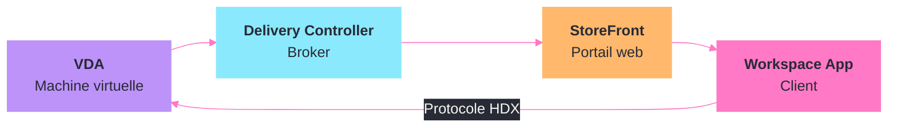
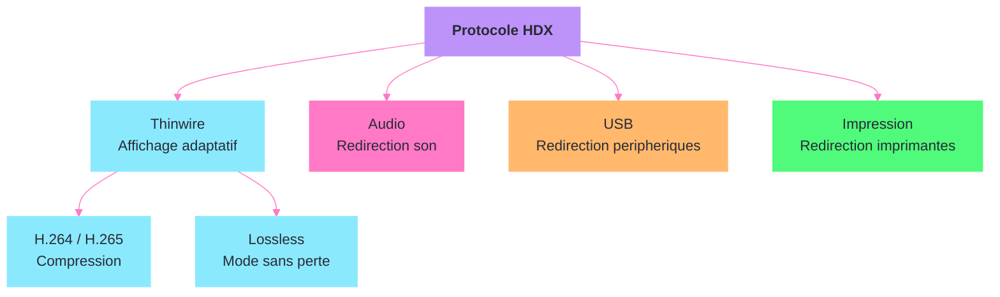

---
tags:
  - registre
  - citrix
  - vdi
  - hdx
---

# Citrix Virtual Apps & Desktops

!!! abstract "Ce que vous allez apprendre"
    - Les cles de registre du VDA (Virtual Delivery Agent) et leur impact sur le comportement de l'agent
    - La configuration de StoreFront cote client via le registre
    - Le tuning fin du protocole HDX : graphisme, audio, redirection USB
    - Les reglages de Citrix Profile Management (UPM) dans le registre
    - La fiabilite de session et la reconnexion automatique
    - La gestion de l'impression dans les environnements Citrix
    - Un scenario reel : optimiser HDX pour un site distant avec une bande passante limitee

---

## Cles du Virtual Delivery Agent (VDA)



Le VDA est le composant installe sur chaque machine virtuelle publiee par Citrix. Sa configuration principale reside sous une cle unique dans le registre.

```
HKLM\SOFTWARE\Citrix\VirtualDesktopAgent
```

Voici comment lire la configuration actuelle du VDA :

```powershell
Get-ItemProperty "HKLM:\SOFTWARE\Citrix\VirtualDesktopAgent"
```

```title="Resultat attendu"
ListOfDDCs            : ddc01.corp.local ddc02.corp.local
RegisteredDdcFqdn     : ddc01.corp.local
EnableAutoUpdate       : 1
SiteGuid               : a1b2c3d4-e5f6-7890-abcd-ef1234567890
```

La valeur `ListOfDDCs` est critique : elle definit les Delivery Controllers auxquels le VDA tente de s'enregistrer. Sans cette valeur correcte, la machine n'apparait pas dans Citrix Studio.

### Valeurs principales du VDA

| Valeur | Type | Description |
|--------|------|-------------|
| `ListOfDDCs` | `REG_SZ` | Liste des Delivery Controllers (separes par des espaces) |
| `RegisteredDdcFqdn` | `REG_SZ` | FQDN du DDC actuellement enregistre (lecture seule) |
| `EnableAutoUpdate` | `REG_DWORD` | 1 = mise a jour automatique de la liste DDC |
| `FarmGUID` | `REG_SZ` | GUID du site Citrix |
| `ControllerRegistrationPort` | `REG_DWORD` | Port de communication avec le DDC (defaut : 80) |
| `ControllerRegistrationIPv6Netmask` | `REG_SZ` | Masque IPv6 pour l'enregistrement |

### Forcer l'enregistrement aupres d'un DDC specifique

En cas de probleme d'enregistrement, on peut forcer le VDA a pointer vers un DDC precis :

```powershell
Set-ItemProperty -Path "HKLM:\SOFTWARE\Citrix\VirtualDesktopAgent" `
    -Name "ListOfDDCs" -Value "ddc01.corp.local ddc02.corp.local"
```

```title="Resultat attendu"
Aucune sortie. Verifier avec :
Get-ItemProperty "HKLM:\SOFTWARE\Citrix\VirtualDesktopAgent" -Name ListOfDDCs
ListOfDDCs : ddc01.corp.local ddc02.corp.local
```

Apres modification, redemarrez le service `BrokerAgent` pour appliquer :

```powershell
Restart-Service BrokerAgent
```

```title="Resultat attendu"
Le service redemarre sans erreur.
```

### Registre de politique du VDA

Les politiques Citrix appliquees par le DDC sont stockees localement dans le registre :

```
HKLM\SOFTWARE\Policies\Citrix
```

Cette cle contient les parametres pousses depuis Citrix Studio ou Workspace Environment Management. Ne modifiez pas ces valeurs manuellement : elles seront ecrasees au prochain rafraichissement de politique.

!!! info "En resume"
    - Le VDA est configure sous `HKLM\SOFTWARE\Citrix\VirtualDesktopAgent`
    - `ListOfDDCs` est la valeur la plus importante : elle determine les Delivery Controllers contactes
    - Les politiques Citrix sont stockees sous `HKLM\SOFTWARE\Policies\Citrix` et sont gerees centralement
    - Redemarrer le service `BrokerAgent` apres toute modification manuelle du VDA

---

## Configuration StoreFront cote client

StoreFront est le portail d'acces aux applications et bureaux Citrix. La configuration du Citrix Workspace App (anciennement Receiver) cote client se gere via le registre.

### Cle principale du Workspace App

```
HKLM\SOFTWARE\WOW6432Node\Citrix\Dazzle
```

Sur les systemes 32 bits ou pour certaines versions :

```
HKLM\SOFTWARE\Citrix\Dazzle
```

### Ajouter un store par defaut

```powershell
$dazzlePath = "HKLM:\SOFTWARE\WOW6432Node\Citrix\Dazzle"
Set-ItemProperty -Path $dazzlePath -Name "CustomURL" `
    -Value "https://storefront.corp.local/Citrix/Store/discovery"
Set-ItemProperty -Path $dazzlePath -Name "PutShortcutsOnDesktop" -Value "true"
```

```title="Resultat attendu"
Aucune sortie. Les raccourcis des applications publiees apparaissent
sur le bureau apres la prochaine ouverture de session Workspace App.
```

### Valeurs de configuration StoreFront

| Valeur | Type | Description |
|--------|------|-------------|
| `CustomURL` | `REG_SZ` | URL de decouverte du store |
| `PutShortcutsOnDesktop` | `REG_SZ` | `true` = creer des raccourcis sur le bureau |
| `PutShortcutsInStartMenu` | `REG_SZ` | `true` = creer des raccourcis dans le menu Demarrer |
| `DesktopDir` | `REG_SZ` | Sous-dossier pour les raccourcis bureau |
| `StartMenuDir` | `REG_SZ` | Sous-dossier pour les raccourcis menu Demarrer |
| `SelfServiceMode` | `REG_SZ` | `true` = mode self-service, `false` = mode raccourci uniquement |
| `UseDifferentPathsForStartMenuAndDesktop` | `REG_SZ` | `true` = chemins distincts pour bureau et menu |

### Configuration du pass-through d'authentification

Pour activer le Single Sign-On (pass-through) du domaine vers StoreFront :

```
HKLM\SOFTWARE\WOW6432Node\Citrix\AuthManager
```

```powershell
$authPath = "HKLM:\SOFTWARE\WOW6432Node\Citrix\AuthManager"
if (-not (Test-Path $authPath)) { New-Item -Path $authPath -Force }
Set-ItemProperty -Path $authPath -Name "ConnectionSecurityMode" -Value "Any"
Set-ItemProperty -Path $authPath -Name "LogonMethod" -Value "sson"
```

```title="Resultat attendu"
Aucune sortie. L'utilisateur sera authentifie automatiquement
a StoreFront avec ses identifiants de session Windows.
```

### Desactiver l'alerte de certificat auto-signe (lab uniquement)

```
HKLM\SOFTWARE\WOW6432Node\Citrix\ICA Client\Engine\Lockdown Profiles\All Regions\Lockdown\Network\SSL
```

```powershell
$sslPath = "HKLM:\SOFTWARE\WOW6432Node\Citrix\ICA Client\Engine\Lockdown Profiles\All Regions\Lockdown\Network\SSL"
if (-not (Test-Path $sslPath)) { New-Item -Path $sslPath -Force }
Set-ItemProperty -Path $sslPath -Name "EnableCertificateRevocationCheckPolicy" `
    -Value "CheckNone" -Type String
```

```title="Resultat attendu"
Aucune sortie. Les avertissements de certificat ne s'affichent plus.
A utiliser UNIQUEMENT en environnement de lab.
```

!!! info "En resume"
    - La configuration StoreFront client se trouve sous `HKLM\SOFTWARE\WOW6432Node\Citrix\Dazzle`
    - `CustomURL` definit l'URL de decouverte du store
    - Le pass-through d'authentification se configure sous `AuthManager`
    - Ne jamais desactiver les verifications de certificat en production

---

## Tuning du protocole HDX



HDX (High Definition eXperience) est le protocole de remoting de Citrix. Son optimisation via le registre permet d'adapter le comportement aux conditions reseau.

### Cle principale HDX

```
HKLM\SOFTWARE\Citrix\HDX3D
HKLM\SOFTWARE\Citrix\Graphics
HKLM\SOFTWARE\Policies\Citrix\MultimediaConf
```

### Optimisation graphique

Le moteur graphique de HDX peut fonctionner en mode Thinwire (par defaut) ou en mode GPU-accelere.

```powershell
# Verifier le mode graphique actuel
Get-ItemProperty "HKLM:\SOFTWARE\Citrix\Graphics" -ErrorAction SilentlyContinue
```

```title="Resultat attendu"
EnableH264           : 1
H264DefaultProfile   : 1
GraphicsStatusLevel  : 0
EnableLossless       : 0
```

### Valeurs cles pour le graphisme

| Cle | Valeur | Type | Description |
|-----|--------|------|-------------|
| `SOFTWARE\Citrix\Graphics` | `EnableH264` | `REG_DWORD` | 1 = codec H.264 actif (defaut), 0 = desactive |
| `SOFTWARE\Citrix\Graphics` | `H264DefaultProfile` | `REG_DWORD` | 0 = High, 1 = Main, 2 = Baseline |
| `SOFTWARE\Citrix\Graphics` | `EnableLossless` | `REG_DWORD` | 1 = mode sans perte (bande passante elevee) |
| `SOFTWARE\Citrix\Graphics` | `EnableH265` | `REG_DWORD` | 1 = codec H.265/HEVC (meilleure compression) |
| `SOFTWARE\Citrix\Graphics` | `TargetedMinimumFramesPerSecond` | `REG_DWORD` | FPS minimum cible (defaut : 10) |
| `SOFTWARE\Citrix\Graphics` | `MaximumFramesPerSecond` | `REG_DWORD` | FPS maximum (defaut : 30) |

### Forcer le codec H.264 avec un profil High

```powershell
$graphicsPath = "HKLM:\SOFTWARE\Citrix\Graphics"
Set-ItemProperty -Path $graphicsPath -Name "EnableH264" -Value 1 -Type DWord
Set-ItemProperty -Path $graphicsPath -Name "H264DefaultProfile" -Value 0 -Type DWord
Set-ItemProperty -Path $graphicsPath -Name "MaximumFramesPerSecond" -Value 30 -Type DWord
```

```title="Resultat attendu"
Aucune sortie. Le codec H.264 est actif avec le profil High.
Redemarrer la session ICA pour appliquer.
```

### Optimisation audio

La qualite audio peut etre ajustee pour economiser la bande passante.

```
HKLM\SOFTWARE\Policies\Citrix\MultimediaConf
```

| Valeur | Type | Description |
|--------|------|-------------|
| `AudioQuality` | `REG_DWORD` | 0 = Low, 1 = Medium (defaut), 2 = High |
| `EnableUDPAudio` | `REG_DWORD` | 1 = transport audio UDP (latence reduite) |
| `UDPAudioPortRange` | `REG_SZ` | Plage de ports UDP (ex : `16500,16509`) |
| `EnableRealTimeTransport` | `REG_DWORD` | 1 = transport temps reel pour VoIP |

```powershell
$audioPath = "HKLM:\SOFTWARE\Policies\Citrix\MultimediaConf"
if (-not (Test-Path $audioPath)) { New-Item -Path $audioPath -Force }
Set-ItemProperty -Path $audioPath -Name "AudioQuality" -Value 0 -Type DWord
Set-ItemProperty -Path $audioPath -Name "EnableUDPAudio" -Value 1 -Type DWord
Set-ItemProperty -Path $audioPath -Name "UDPAudioPortRange" -Value "16500,16509" -Type String
```

```title="Resultat attendu"
Aucune sortie. L'audio passe en qualite basse avec transport UDP.
Ideal pour les connexions a bande passante limitee.
```

### Redirection USB

La redirection USB generique permet de mapper des peripheriques USB locaux vers la session Citrix.

```
HKLM\SOFTWARE\Citrix\USB
```

| Valeur | Type | Description |
|--------|------|-------------|
| `EnableUSBSupport` | `REG_DWORD` | 1 = redirection USB active |
| `AutoRedirectStorage` | `REG_DWORD` | 1 = redirection automatique des cles USB |
| `AutoRedirectPrinters` | `REG_DWORD` | 1 = redirection automatique des imprimantes USB |
| `TransparentKeyPassthrough` | `REG_SZ` | `Remote` = raccourcis clavier envoyes a la session |

```powershell
$usbPath = "HKLM:\SOFTWARE\Citrix\USB"
if (-not (Test-Path $usbPath)) { New-Item -Path $usbPath -Force }
Set-ItemProperty -Path $usbPath -Name "EnableUSBSupport" -Value 1 -Type DWord
```

```title="Resultat attendu"
Aucune sortie. La redirection USB generique est activee.
Les peripheriques USB apparaitront dans la session apres reconnexion.
```

### Regles de filtrage USB

Les regles de filtrage permettent d'autoriser ou bloquer des categories de peripheriques :

```
HKLM\SOFTWARE\Citrix\USB\DeviceRules
```

Le format de chaque regle est : `Action, Class=XX, Subclass=XX, Protocol=XX`

```powershell
$rulesPath = "HKLM:\SOFTWARE\Citrix\USB"
# Autoriser les scanners (classe 0x06) et bloquer le stockage de masse (classe 0x08)
Set-ItemProperty -Path $rulesPath -Name "DeviceRules" -Type MultiString -Value @(
    "Allow, Class=06",
    "Deny, Class=08"
)
```

```title="Resultat attendu"
Aucune sortie. Les scanners USB seront rediriges,
les cles USB et disques externes seront bloques.
```

!!! info "En resume"
    - Le graphisme HDX se configure sous `HKLM\SOFTWARE\Citrix\Graphics`
    - H.264 est le codec par defaut ; H.265 offre une meilleure compression
    - L'audio UDP reduit la latence mais necessite l'ouverture des ports correspondants
    - La redirection USB se gere sous `HKLM\SOFTWARE\Citrix\USB` avec des regles de filtrage par classe

---

## Citrix Profile Management (UPM)

Citrix Profile Management gere les profils utilisateur dans les environnements VDI et publiees. Toute la configuration reside dans le registre.

### Cle principale UPM

```
HKLM\SOFTWARE\Policies\Citrix\UserProfileManager
```

```powershell
Get-ItemProperty "HKLM:\SOFTWARE\Policies\Citrix\UserProfileManager" -ErrorAction SilentlyContinue
```

```title="Resultat attendu"
ServiceActive                    : 1
ProcessedGroups                  :
PathToUserStore                  : \\fileserver\profiles$\%USERNAME%.%USERDOMAIN%\!CTX_OSNAME!!CTX_OSBITNESS!
PSMidSessionWriteBack            : 1
PSMidSessionWriteBackReg         : 1
DeleteCachedCopiesOfProfiles     : 1
ProfileDeleteDelay               : 0
```

### Valeurs essentielles UPM

| Valeur | Type | Description |
|--------|------|-------------|
| `ServiceActive` | `REG_DWORD` | 1 = UPM actif |
| `PathToUserStore` | `REG_SZ` | Chemin UNC du store de profils |
| `ProcessedGroups` | `REG_MULTI_SZ` | Groupes AD dont les profils sont geres |
| `ExcludedGroups` | `REG_MULTI_SZ` | Groupes AD exclus de la gestion |
| `DeleteCachedCopiesOfProfiles` | `REG_DWORD` | 1 = supprimer le profil local a la deconnexion |
| `ProfileDeleteDelay` | `REG_DWORD` | Delai en secondes avant suppression du cache |
| `PSMidSessionWriteBack` | `REG_DWORD` | 1 = synchronisation en cours de session |
| `PSMidSessionWriteBackReg` | `REG_DWORD` | 1 = synchronisation du registre en cours de session |
| `StreamingExclusionList` | `REG_MULTI_SZ` | Dossiers exclus du streaming de profil |
| `MirrorFoldersList` | `REG_MULTI_SZ` | Dossiers a synchroniser en mode miroir (pas de fusion) |
| `LargeFileHandlingList` | `REG_MULTI_SZ` | Fichiers volumineux geres par liens symboliques |

### Configurer UPM pour un environnement VDI

```powershell
$upmPath = "HKLM:\SOFTWARE\Policies\Citrix\UserProfileManager"
if (-not (Test-Path $upmPath)) { New-Item -Path $upmPath -Force }

# Activer UPM
Set-ItemProperty -Path $upmPath -Name "ServiceActive" -Value 1 -Type DWord

# Definir le chemin du store
Set-ItemProperty -Path $upmPath -Name "PathToUserStore" `
    -Value "\\fileserver\profiles$\%USERNAME%.%USERDOMAIN%\!CTX_OSNAME!!CTX_OSBITNESS!" -Type String

# Supprimer le cache local a la deconnexion
Set-ItemProperty -Path $upmPath -Name "DeleteCachedCopiesOfProfiles" -Value 1 -Type DWord

# Activer le write-back en session
Set-ItemProperty -Path $upmPath -Name "PSMidSessionWriteBack" -Value 1 -Type DWord
Set-ItemProperty -Path $upmPath -Name "PSMidSessionWriteBackReg" -Value 1 -Type DWord
```

```title="Resultat attendu"
Aucune sortie. UPM est active avec le store sur \\fileserver\profiles$.
Les profils sont synchronises en temps reel et supprimes localement a la deconnexion.
```

### Exclusions de dossiers

Certains dossiers ne doivent pas etre synchronises (caches, fichiers temporaires). Les exclusions se gerent via des listes dans le registre :

```
HKLM\SOFTWARE\Policies\Citrix\UserProfileManager\SyncExclusionListDir
```

```powershell
$exclusionsPath = "HKLM:\SOFTWARE\Policies\Citrix\UserProfileManager"
Set-ItemProperty -Path $exclusionsPath -Name "SyncExclusionListDir" -Type MultiString -Value @(
    "AppData\Local\Microsoft\Windows\INetCache",
    "AppData\Local\Microsoft\Windows\Temporary Internet Files",
    "AppData\Local\Temp",
    "AppData\Local\Google\Chrome\User Data\Default\Cache",
    "AppData\Local\Microsoft\Edge\User Data\Default\Cache"
)
```

```title="Resultat attendu"
Aucune sortie. Les dossiers de cache navigateur et fichiers
temporaires sont exclus de la synchronisation de profil.
```

### Dossiers en mode miroir

Le mode miroir remplace le contenu du store par le contenu local a chaque deconnexion, au lieu de fusionner. Utile pour les cookies et les fichiers de configuration de navigateur :

```powershell
Set-ItemProperty -Path $exclusionsPath -Name "MirrorFoldersList" -Type MultiString -Value @(
    "AppData\Local\Microsoft\Windows\Cookies",
    "AppData\Roaming\Microsoft\Windows\Cookies"
)
```

```title="Resultat attendu"
Aucune sortie. Les dossiers de cookies sont synchronises
en mode miroir (remplacement au lieu de fusion).
```

!!! info "En resume"
    - UPM se configure entierement sous `HKLM\SOFTWARE\Policies\Citrix\UserProfileManager`
    - `PathToUserStore` definit l'emplacement du store de profils (supporte les variables Citrix)
    - `DeleteCachedCopiesOfProfiles` est essentiel en VDI pour liberer l'espace disque
    - Les exclusions de dossiers et le mode miroir permettent d'optimiser la synchronisation

---

## Fiabilite de session et reconnexion automatique

La fiabilite de session (Session Reliability) et la reconnexion automatique (Auto Client Reconnect) maintiennent les sessions actives lors de coupures reseau.

### Session Reliability

La fiabilite de session garde la session ouverte pendant une coupure reseau temporaire. L'utilisateur voit un ecran grise mais ne perd pas sa session.

```
HKLM\SOFTWARE\Policies\Citrix\ICA\Reliability
```

| Valeur | Type | Description |
|--------|------|-------------|
| `Enabled` | `REG_DWORD` | 1 = fiabilite de session active |
| `Timeout` | `REG_DWORD` | Duree en secondes avant deconnexion (defaut : 180) |
| `Port` | `REG_DWORD` | Port utilise (defaut : 2598) |

```powershell
$reliabilityPath = "HKLM:\SOFTWARE\Policies\Citrix\ICA\Reliability"
if (-not (Test-Path $reliabilityPath)) { New-Item -Path $reliabilityPath -Force }
Set-ItemProperty -Path $reliabilityPath -Name "Enabled" -Value 1 -Type DWord
Set-ItemProperty -Path $reliabilityPath -Name "Timeout" -Value 300 -Type DWord
```

```title="Resultat attendu"
Aucune sortie. La fiabilite de session est active avec un timeout de 5 minutes.
L'utilisateur a 5 minutes pour retrouver la connexion avant la deconnexion.
```

### Auto Client Reconnect

La reconnexion automatique prend le relais apres l'expiration de la fiabilite de session. Elle tente de reconnecter l'utilisateur a sa session existante.

```
HKLM\SOFTWARE\Policies\Citrix\ICA\AutoReconnect
```

| Valeur | Type | Description |
|--------|------|-------------|
| `Enabled` | `REG_DWORD` | 1 = reconnexion automatique active |
| `Timeout` | `REG_DWORD` | Duree max de tentative en secondes (defaut : 120) |
| `RequireAuthentication` | `REG_DWORD` | 1 = demander les identifiants lors de la reconnexion |
| `LoggingEnabled` | `REG_DWORD` | 1 = journaliser les reconnexions |

```powershell
$reconnectPath = "HKLM:\SOFTWARE\Policies\Citrix\ICA\AutoReconnect"
if (-not (Test-Path $reconnectPath)) { New-Item -Path $reconnectPath -Force }
Set-ItemProperty -Path $reconnectPath -Name "Enabled" -Value 1 -Type DWord
Set-ItemProperty -Path $reconnectPath -Name "Timeout" -Value 300 -Type DWord
Set-ItemProperty -Path $reconnectPath -Name "RequireAuthentication" -Value 0 -Type DWord
```

```title="Resultat attendu"
Aucune sortie. La reconnexion automatique est active.
L'utilisateur sera reconnecte sans authentification supplementaire.
```

### Configuration des timeouts de session

Les limites de session controlent la duree maximale et les deconnexions automatiques :

```
HKLM\SOFTWARE\Policies\Citrix\ICA\SessionLimits
```

| Valeur | Type | Description |
|--------|------|-------------|
| `MaxConnectionTime` | `REG_DWORD` | Duree max d'une session active (minutes) |
| `MaxDisconnectionTime` | `REG_DWORD` | Duree max d'une session deconnectee (minutes) |
| `MaxIdleTime` | `REG_DWORD` | Duree max d'inactivite avant deconnexion (minutes) |

```powershell
$limitsPath = "HKLM:\SOFTWARE\Policies\Citrix\ICA\SessionLimits"
if (-not (Test-Path $limitsPath)) { New-Item -Path $limitsPath -Force }
# Deconnecter apres 8h d'inactivite et supprimer les sessions deconnectees apres 2h
Set-ItemProperty -Path $limitsPath -Name "MaxIdleTime" -Value 480 -Type DWord
Set-ItemProperty -Path $limitsPath -Name "MaxDisconnectionTime" -Value 120 -Type DWord
```

```title="Resultat attendu"
Aucune sortie. Les sessions inactives sont deconnectees apres 8 heures.
Les sessions deconnectees sont terminees apres 2 heures.
```

!!! info "En resume"
    - La fiabilite de session (`Reliability`) maintient la session pendant les coupures courtes (port 2598)
    - La reconnexion automatique (`AutoReconnect`) tente de reconnecter apres l'expiration de la fiabilite
    - Les deux mecanismes travaillent en tandem : fiabilite d'abord, puis reconnexion
    - Les limites de session controlent les durees maximales d'activite, d'inactivite et de deconnexion

---

## Impression dans les environnements Citrix

L'impression est l'un des aspects les plus complexes des environnements Citrix. Le registre offre un controle granulaire sur les pilotes, le mappage des imprimantes et le routage.

### Universal Print Driver (UPD)

Le pilote d'impression universel Citrix evite d'installer des pilotes specifiques sur chaque VDA.

```
HKLM\SOFTWARE\Policies\Citrix\UniversalPrintDrivers
```

| Valeur | Type | Description |
|--------|------|-------------|
| `UPDEnable` | `REG_DWORD` | 1 = pilote universel active |
| `UPDPreference` | `REG_DWORD` | 0 = UPD en dernier recours, 1 = UPD prefere, 2 = UPD uniquement |
| `UPDFallbackBehavior` | `REG_DWORD` | 0 = ne pas creer l'imprimante si UPD echoue, 1 = utiliser le pilote natif |
| `DefaultPrinterDriver` | `REG_SZ` | Nom du pilote par defaut (ex : `Citrix Universal Printer`) |

```powershell
$printPath = "HKLM:\SOFTWARE\Policies\Citrix\UniversalPrintDrivers"
if (-not (Test-Path $printPath)) { New-Item -Path $printPath -Force }
Set-ItemProperty -Path $printPath -Name "UPDEnable" -Value 1 -Type DWord
Set-ItemProperty -Path $printPath -Name "UPDPreference" -Value 2 -Type DWord
```

```title="Resultat attendu"
Aucune sortie. Le pilote d'impression universel est le seul pilote utilise.
Aucun pilote tiers ne sera installe sur le VDA.
```

### Mappage des imprimantes client

Le mappage automatique des imprimantes client cree des imprimantes dans la session Citrix correspondant aux imprimantes locales de l'utilisateur.

```
HKLM\SOFTWARE\Policies\Citrix\PrinterMapping
```

| Valeur | Type | Description |
|--------|------|-------------|
| `AutoCreation` | `REG_DWORD` | 0 = aucune, 1 = defaut uniquement, 2 = toutes, 3 = toutes + defaut |
| `WaitForPrintersToBeCreated` | `REG_DWORD` | 1 = attendre la creation des imprimantes avant d'afficher le bureau |
| `DirectConnectionsToPrintServers` | `REG_DWORD` | 1 = connexion directe aux serveurs d'impression |
| `PrinterRetentionEnabled` | `REG_DWORD` | 1 = memoriser l'imprimante par defaut entre les sessions |

```powershell
$mappingPath = "HKLM:\SOFTWARE\Policies\Citrix\PrinterMapping"
if (-not (Test-Path $mappingPath)) { New-Item -Path $mappingPath -Force }
# Creer uniquement l'imprimante par defaut du client
Set-ItemProperty -Path $mappingPath -Name "AutoCreation" -Value 1 -Type DWord
# Activer la retention de l'imprimante par defaut
Set-ItemProperty -Path $mappingPath -Name "PrinterRetentionEnabled" -Value 1 -Type DWord
```

```title="Resultat attendu"
Aucune sortie. Seule l'imprimante par defaut du poste client
est creee dans la session Citrix. L'imprimante par defaut est
memorisee entre les sessions.
```

### Routage d'impression

Le routage determine si le flux d'impression passe par le client ou directement par le reseau :

```
HKLM\SOFTWARE\Policies\Citrix\PrinterRouting
```

| Valeur | Type | Description |
|--------|------|-------------|
| `ClientPrinterRouting` | `REG_DWORD` | 0 = via le serveur, 1 = via le client |

En mode "via le client", le flux d'impression traverse la connexion ICA jusqu'au poste client, puis est envoye a l'imprimante. En mode "via le serveur", le VDA envoie directement le flux au serveur d'impression.

```powershell
$routingPath = "HKLM:\SOFTWARE\Policies\Citrix\PrinterRouting"
if (-not (Test-Path $routingPath)) { New-Item -Path $routingPath -Force }
# Routage via le serveur d'impression (recommande en LAN)
Set-ItemProperty -Path $routingPath -Name "ClientPrinterRouting" -Value 0 -Type DWord
```

```title="Resultat attendu"
Aucune sortie. Le flux d'impression est route directement vers
le serveur d'impression sans passer par la connexion ICA.
```

!!! info "En resume"
    - Le pilote d'impression universel (UPD) simplifie la gestion en evitant les pilotes tiers sur le VDA
    - `AutoCreation` controle quelles imprimantes client sont creees dans la session
    - Le routage d'impression `via le serveur` est preferable en LAN pour les performances
    - Le routage `via le client` est necessaire pour les travailleurs a distance sans acces au serveur d'impression

---

## Scenario : optimiser HDX pour un site distant a faible bande passante

### Le contexte

Un site distant dispose de 50 utilisateurs connectes a des bureaux virtuels Citrix via une liaison WAN de 20 Mbps. Les plaintes sont frequentes : sessions lentes, audio saccade, impressions interminables. Le site principal heberge les VDA et le serveur d'impression.

### Diagnostic

Avant toute modification, collectons les parametres actuels :

```powershell
# Parametres graphiques
Get-ItemProperty "HKLM:\SOFTWARE\Citrix\Graphics" -ErrorAction SilentlyContinue |
    Select-Object EnableH264, H264DefaultProfile, MaximumFramesPerSecond, EnableLossless

# Parametres audio
Get-ItemProperty "HKLM:\SOFTWARE\Policies\Citrix\MultimediaConf" -ErrorAction SilentlyContinue |
    Select-Object AudioQuality, EnableUDPAudio

# Fiabilite de session
Get-ItemProperty "HKLM:\SOFTWARE\Policies\Citrix\ICA\Reliability" -ErrorAction SilentlyContinue |
    Select-Object Enabled, Timeout

# Impression
Get-ItemProperty "HKLM:\SOFTWARE\Policies\Citrix\UniversalPrintDrivers" -ErrorAction SilentlyContinue |
    Select-Object UPDEnable, UPDPreference
```

```title="Resultat attendu"
EnableH264              : 1
H264DefaultProfile      : 1
MaximumFramesPerSecond  : 30
EnableLossless          : 1

AudioQuality            : 2
EnableUDPAudio          : 0

Enabled                 : 1
Timeout                 : 180

UPDEnable               : 1
UPDPreference           : 0
```

Les problemes identifies :

- Le mode sans perte (`EnableLossless`) est actif : il consomme enormement de bande passante
- La qualite audio est en High (`2`) : inutile pour de la bureautique
- L'audio UDP n'est pas active : le TCP augmente la latence audio
- Le pilote d'impression universel n'est pas prefere : les pilotes natifs generent des spools volumineux
- Le FPS maximum est a 30 : trop eleve pour une liaison limitee

### Application des optimisations

```powershell
# --- Graphisme : reduire la consommation de bande passante ---
$graphicsPath = "HKLM:\SOFTWARE\Citrix\Graphics"
# Desactiver le mode sans perte
Set-ItemProperty -Path $graphicsPath -Name "EnableLossless" -Value 0 -Type DWord
# Reduire le FPS maximum a 15 (suffisant pour la bureautique)
Set-ItemProperty -Path $graphicsPath -Name "MaximumFramesPerSecond" -Value 15 -Type DWord
# Utiliser le profil Baseline (plus leger)
Set-ItemProperty -Path $graphicsPath -Name "H264DefaultProfile" -Value 2 -Type DWord
# Activer la compression progressive
Set-ItemProperty -Path $graphicsPath -Name "ProgressiveDisplay" -Value 1 -Type DWord

# --- Audio : reduire la qualite et activer UDP ---
$audioPath = "HKLM:\SOFTWARE\Policies\Citrix\MultimediaConf"
if (-not (Test-Path $audioPath)) { New-Item -Path $audioPath -Force }
Set-ItemProperty -Path $audioPath -Name "AudioQuality" -Value 0 -Type DWord
Set-ItemProperty -Path $audioPath -Name "EnableUDPAudio" -Value 1 -Type DWord
Set-ItemProperty -Path $audioPath -Name "UDPAudioPortRange" -Value "16500,16509" -Type String

# --- Impression : forcer le pilote universel et router via le client ---
$printPath = "HKLM:\SOFTWARE\Policies\Citrix\UniversalPrintDrivers"
if (-not (Test-Path $printPath)) { New-Item -Path $printPath -Force }
Set-ItemProperty -Path $printPath -Name "UPDPreference" -Value 2 -Type DWord

$routingPath = "HKLM:\SOFTWARE\Policies\Citrix\PrinterRouting"
if (-not (Test-Path $routingPath)) { New-Item -Path $routingPath -Force }
# Router via le client pour les sites distants (pas de serveur d'impression local)
Set-ItemProperty -Path $routingPath -Name "ClientPrinterRouting" -Value 1 -Type DWord

# --- Fiabilite de session : augmenter le timeout pour les connexions instables ---
$reliabilityPath = "HKLM:\SOFTWARE\Policies\Citrix\ICA\Reliability"
if (-not (Test-Path $reliabilityPath)) { New-Item -Path $reliabilityPath -Force }
Set-ItemProperty -Path $reliabilityPath -Name "Timeout" -Value 300 -Type DWord
```

```title="Resultat attendu"
Aucune sortie. Toutes les optimisations sont appliquees.
Les sessions existantes ne sont pas affectees ; les nouvelles
sessions beneficieront des parametres optimises.
```

### Verification post-optimisation

```powershell
Write-Host "=== Parametres graphiques ===" -ForegroundColor Cyan
Get-ItemProperty "HKLM:\SOFTWARE\Citrix\Graphics" |
    Select-Object EnableH264, H264DefaultProfile, MaximumFramesPerSecond, EnableLossless, ProgressiveDisplay |
    Format-List

Write-Host "=== Parametres audio ===" -ForegroundColor Cyan
Get-ItemProperty "HKLM:\SOFTWARE\Policies\Citrix\MultimediaConf" |
    Select-Object AudioQuality, EnableUDPAudio, UDPAudioPortRange |
    Format-List

Write-Host "=== Impression ===" -ForegroundColor Cyan
Get-ItemProperty "HKLM:\SOFTWARE\Policies\Citrix\UniversalPrintDrivers" |
    Select-Object UPDEnable, UPDPreference |
    Format-List

Write-Host "=== Fiabilite de session ===" -ForegroundColor Cyan
Get-ItemProperty "HKLM:\SOFTWARE\Policies\Citrix\ICA\Reliability" |
    Select-Object Enabled, Timeout |
    Format-List
```

```title="Resultat attendu"
=== Parametres graphiques ===
EnableH264             : 1
H264DefaultProfile     : 2
MaximumFramesPerSecond : 15
EnableLossless         : 0
ProgressiveDisplay     : 1

=== Parametres audio ===
AudioQuality    : 0
EnableUDPAudio  : 1
UDPAudioPortRange : 16500,16509

=== Impression ===
UPDEnable      : 1
UPDPreference  : 2

=== Fiabilite de session ===
Enabled : 1
Timeout : 300
```

### Resume des gains attendus

| Parametre | Avant | Apres | Impact |
|-----------|-------|-------|--------|
| Mode sans perte | Active | Desactive | Reduction de 40-60% de la bande passante graphique |
| FPS maximum | 30 | 15 | Reduction de 50% du flux video |
| Profil H.264 | Main | Baseline | Compression plus agressive |
| Qualite audio | High | Low | Reduction de 75% du flux audio |
| Transport audio | TCP | UDP | Latence audio reduite de 50-100 ms |
| Pilote impression | Natif | UPD uniquement | Taille des spools reduite de 60-80% |
| Timeout fiabilite | 180s | 300s | Moins de deconnexions sur liaison instable |

### Script de deploiement complet

Pour deployer ces optimisations sur plusieurs VDA via GPO ou SCCM, exportez les cles modifiees :

```powershell
# Exporter les parametres optimises dans un fichier .reg
$exportPaths = @(
    "HKLM\SOFTWARE\Citrix\Graphics",
    "HKLM\SOFTWARE\Policies\Citrix\MultimediaConf",
    "HKLM\SOFTWARE\Policies\Citrix\UniversalPrintDrivers",
    "HKLM\SOFTWARE\Policies\Citrix\PrinterRouting",
    "HKLM\SOFTWARE\Policies\Citrix\ICA\Reliability"
)

foreach ($path in $exportPaths) {
    $fileName = ($path -split '\\')[-1]
    reg export $path "C:\Temp\Citrix_Optimized_$fileName.reg" /y
}
```

```title="Resultat attendu"
The operation completed successfully.
The operation completed successfully.
The operation completed successfully.
The operation completed successfully.
The operation completed successfully.
Cinq fichiers .reg crees dans C:\Temp\ prets pour le deploiement.
```

!!! info "En resume"
    - Un site distant a faible bande passante necessite une approche globale : graphisme, audio, impression et fiabilite
    - Desactiver le mode sans perte et reduire les FPS sont les deux actions a plus fort impact
    - L'audio UDP et le pilote d'impression universel ameliorent respectivement la latence et la taille des spools
    - Augmenter le timeout de fiabilite evite les deconnexions sur les liaisons instables
    - Exporter les parametres en fichiers `.reg` permet un deploiement industrialise via GPO ou SCCM
