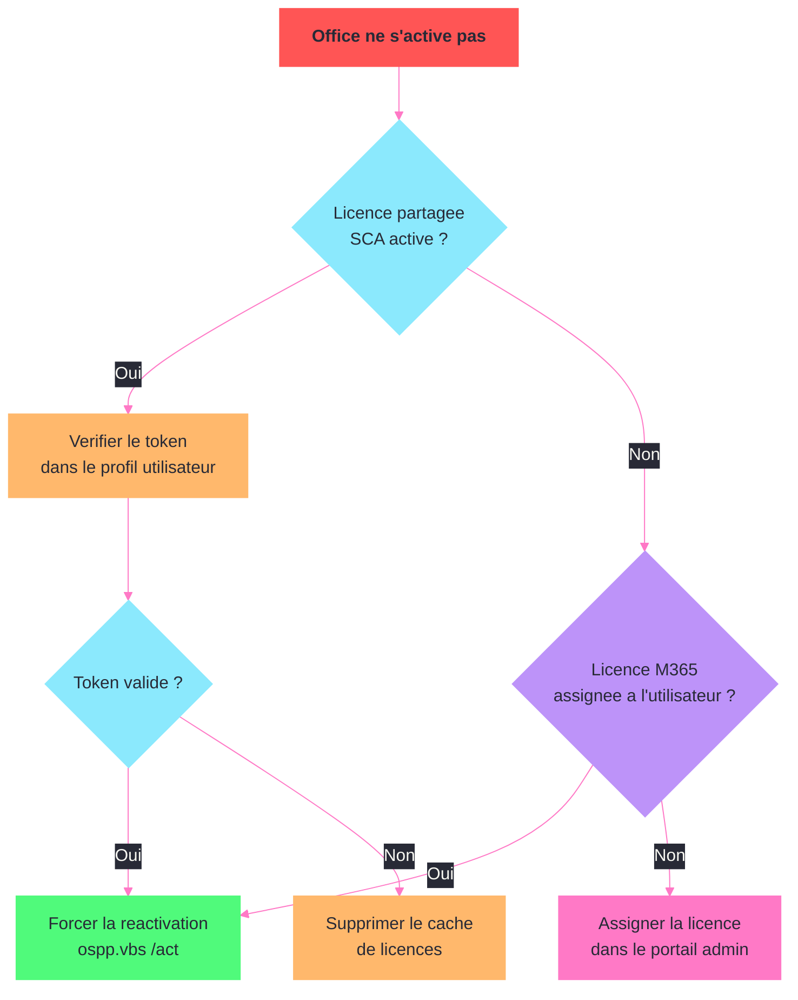

---
tags:
  - registre
  - office
  - microsoft365
  - deploiement
---

# Microsoft 365 Apps (Office)

!!! abstract "Ce que vous allez apprendre"
    - Les cles de registre de deploiement et de configuration de Microsoft 365 Apps (Click-to-Run)
    - La gestion des canaux de mise a jour via le registre
    - Les parametres de securite des macros et le blocage de contenu Internet
    - Les controles de telemetrie et de confidentialite
    - Les cles d'activation et de licence Office
    - La gestion des complements (add-ins) : chargement, resilience et blocage
    - La configuration de OneDrive Known Folder Move via le registre
    - Un scenario reel : migrer 1000 postes du canal Semi-Annual vers Monthly Enterprise

---

## Configuration du deploiement Click-to-Run

Microsoft 365 Apps utilise la technologie Click-to-Run (C2R) pour l'installation et les mises a jour. Toute la configuration C2R est centralisee dans le registre.

### Cle principale Click-to-Run

```
HKLM\SOFTWARE\Microsoft\Office\ClickToRun
```

```powershell
Get-ItemProperty "HKLM:\SOFTWARE\Microsoft\Office\ClickToRun" -ErrorAction SilentlyContinue |
    Select-Object InstallPath, PackageGUID, VersionToReport
```

```title="Resultat attendu"
InstallPath     : C:\Program Files\Microsoft Office
PackageGUID     : {12345678-1234-1234-1234-123456789012}
VersionToReport : 16.0.17928.20114
```

### Sous-cle de configuration

```
HKLM\SOFTWARE\Microsoft\Office\ClickToRun\Configuration
```

Cette sous-cle contient les parametres operationnels du deploiement :

```powershell
Get-ItemProperty "HKLM:\SOFTWARE\Microsoft\Office\ClickToRun\Configuration" -ErrorAction SilentlyContinue |
    Select-Object CDNBaseUrl, UpdateChannel, ClientCulture, Platform, VersionToReport
```

```title="Resultat attendu"
CDNBaseUrl       : http://officecdn.microsoft.com/pr/55336b82-a18d-4dd6-b5f6-9e5095c314a6
UpdateChannel    : http://officecdn.microsoft.com/pr/55336b82-a18d-4dd6-b5f6-9e5095c314a6
ClientCulture    : fr-fr
Platform         : x64
VersionToReport  : 16.0.17928.20114
```

### Valeurs de configuration C2R

| Valeur | Type | Description |
|--------|------|-------------|
| `CDNBaseUrl` | `REG_SZ` | URL du CDN pour les mises a jour |
| `UpdateChannel` | `REG_SZ` | Canal de mise a jour actuel (URL du CDN) |
| `ClientCulture` | `REG_SZ` | Langue principale (ex : `fr-fr`) |
| `Platform` | `REG_SZ` | Architecture : `x86` ou `x64` |
| `VersionToReport` | `REG_SZ` | Version installee |
| `UpdateUrl` | `REG_SZ` | URL de mise a jour personnalisee (partage reseau ou HTTP) |
| `UpdateEnabled` | `REG_SZ` | `True` = mises a jour automatiques actives |
| `UpdateTargetVersion` | `REG_SZ` | Version cible pour les mises a jour (ex : `16.0.17928.20114`) |
| `ProductReleaseIds` | `REG_SZ` | Produits installes (ex : `O365ProPlusRetail,VisioProRetail`) |

### Pointer les mises a jour vers un partage reseau

Pour les environnements qui ne permettent pas l'acces direct au CDN Microsoft :

```powershell
$c2rPath = "HKLM:\SOFTWARE\Microsoft\Office\ClickToRun\Configuration"
Set-ItemProperty -Path $c2rPath -Name "UpdateUrl" `
    -Value "\\fileserver\Office365Updates$" -Type String
Set-ItemProperty -Path $c2rPath -Name "UpdateEnabled" -Value "True" -Type String
```

```title="Resultat attendu"
Aucune sortie. Les mises a jour Office seront telechargees
depuis le partage reseau \\fileserver\Office365Updates$.
```

!!! info "En resume"
    - La configuration C2R est sous `HKLM\SOFTWARE\Microsoft\Office\ClickToRun\Configuration`
    - `CDNBaseUrl` et `UpdateChannel` definissent le canal de mise a jour (identifie par un GUID dans l'URL)
    - `UpdateUrl` permet de rediriger les mises a jour vers un partage reseau local
    - `UpdateTargetVersion` verrouille Office sur une version specifique

---

## Gestion des canaux de mise a jour


Microsoft 365 Apps propose plusieurs canaux de mise a jour. Le canal actif est determine par le registre.

### Les canaux et leurs GUID

| Canal | GUID CDN | Frequence |
|-------|----------|-----------|
| Current Channel | `492350f6-3a01-4f97-b9c0-c7c6ddf67d60` | Mensuel (des que disponible) |
| Monthly Enterprise | `55336b82-a18d-4dd6-b5f6-9e5095c314a6` | Mensuel (2e mardi du mois) |
| Semi-Annual Enterprise (Preview) | `b8f9b850-328d-4355-9145-c59439a0c4cf` | Semestriel (mars et septembre, preview) |
| Semi-Annual Enterprise | `7ffbc6bf-bc32-4f92-8982-f9dd17fd3114` | Semestriel (janvier et juillet) |
| Beta Channel | `5440fd1f-7ecb-4221-8110-145efaa6372f` | Hebdomadaire (non supporte) |

### Verifier le canal actuel

```powershell
$config = Get-ItemProperty "HKLM:\SOFTWARE\Microsoft\Office\ClickToRun\Configuration"
$cdnUrl = $config.CDNBaseUrl

$channels = @{
    "492350f6-3a01-4f97-b9c0-c7c6ddf67d60" = "Current Channel"
    "55336b82-a18d-4dd6-b5f6-9e5095c314a6" = "Monthly Enterprise Channel"
    "b8f9b850-328d-4355-9145-c59439a0c4cf" = "Semi-Annual Enterprise (Preview)"
    "7ffbc6bf-bc32-4f92-8982-f9dd17fd3114" = "Semi-Annual Enterprise Channel"
    "5440fd1f-7ecb-4221-8110-145efaa6372f" = "Beta Channel"
}

$guid = ($cdnUrl -split '/pr/')[-1]
$channelName = $channels[$guid]
Write-Host "Canal actuel : $channelName ($guid)"
Write-Host "Version : $($config.VersionToReport)"
```

```title="Resultat attendu"
Canal actuel : Semi-Annual Enterprise Channel (7ffbc6bf-bc32-4f92-8982-f9dd17fd3114)
Version : 16.0.17928.20114
```

### Changer de canal via le registre

```powershell
$c2rPath = "HKLM:\SOFTWARE\Microsoft\Office\ClickToRun\Configuration"
$monthlyEnterpriseGuid = "55336b82-a18d-4dd6-b5f6-9e5095c314a6"
$newCdnUrl = "http://officecdn.microsoft.com/pr/$monthlyEnterpriseGuid"

Set-ItemProperty -Path $c2rPath -Name "CDNBaseUrl" -Value $newCdnUrl -Type String
Set-ItemProperty -Path $c2rPath -Name "UpdateChannel" -Value $newCdnUrl -Type String
```

```title="Resultat attendu"
Aucune sortie. Le canal est configure sur Monthly Enterprise.
La prochaine mise a jour telechargera la version du canal cible.
```

### Forcer la mise a jour apres changement de canal

Le changement de canal ne prend effet qu'a la prochaine mise a jour. Pour l'appliquer immediatement :

```powershell
$c2rExe = "C:\Program Files\Common Files\Microsoft Shared\ClickToRun\OfficeC2RClient.exe"
Start-Process $c2rExe -ArgumentList "/update user displaylevel=false forceappshutdown=true" -Wait
```

```title="Resultat attendu"
Le processus de mise a jour demarre en arriere-plan.
Les applications Office sont fermees puis mises a jour.
La duree depend de la taille du delta entre les versions.
```

### Via GPO (registre de politique)

Quand les canaux sont geres par GPO, les valeurs sont ecrites sous :

```
HKLM\SOFTWARE\Policies\Microsoft\Office\16.0\Common\OfficeUpdate
```

| Valeur | Type | Description |
|--------|------|-------------|
| `UpdateBranch` | `REG_SZ` | Nom du canal (ex : `MonthlyEnterprise`) |
| `UpdatePath` | `REG_SZ` | URL ou chemin UNC de mise a jour |
| `EnableAutomaticUpdates` | `REG_DWORD` | 1 = mises a jour automatiques |
| `TargetVersion` | `REG_SZ` | Version cible (vide = derniere version du canal) |
| `UpdateDeadline` | `REG_SZ` | Date limite d'installation (format ISO) |
| `HideUpdateNotifications` | `REG_DWORD` | 1 = masquer les notifications de mise a jour |
| `HideEnableDisableUpdates` | `REG_DWORD` | 1 = masquer l'option de desactivation |

```powershell
$policyPath = "HKLM:\SOFTWARE\Policies\Microsoft\Office\16.0\Common\OfficeUpdate"
if (-not (Test-Path $policyPath)) { New-Item -Path $policyPath -Force }
Set-ItemProperty -Path $policyPath -Name "UpdateBranch" `
    -Value "MonthlyEnterprise" -Type String
Set-ItemProperty -Path $policyPath -Name "EnableAutomaticUpdates" -Value 1 -Type DWord
Set-ItemProperty -Path $policyPath -Name "HideEnableDisableUpdates" -Value 1 -Type DWord
```

```title="Resultat attendu"
Aucune sortie. Le canal Monthly Enterprise est impose par GPO.
L'utilisateur ne peut pas desactiver les mises a jour.
```

!!! info "En resume"
    - Chaque canal de mise a jour est identifie par un GUID dans l'URL CDN
    - Changer `CDNBaseUrl` et `UpdateChannel` modifie le canal ; la mise a jour effective necessite un declenchement
    - Les GPO ecrivent sous `HKLM\SOFTWARE\Policies\Microsoft\Office\16.0\Common\OfficeUpdate`
    - `HideEnableDisableUpdates` empeche l'utilisateur de desactiver les mises a jour

---

## Securite des macros

Les macros VBA representent un vecteur d'attaque majeur. Le registre permet un controle granulaire de leur execution.

### Cle de securite VBA

Pour chaque application Office, les parametres de securite sont sous :

```
HKCU\SOFTWARE\Microsoft\Office\16.0\{App}\Security
```

Ou `{App}` est `Word`, `Excel`, `PowerPoint`, `Access` ou `Outlook`.

### Niveaux VBAWarnings

| Valeur | Signification |
|--------|---------------|
| 1 | Toutes les macros sont activees (dangereux) |
| 2 | Desactiver les macros avec notification (defaut) |
| 3 | Desactiver les macros sauf celles signees numeriquement |
| 4 | Desactiver toutes les macros sans notification |

### Appliquer le niveau 3 pour Word et Excel

```powershell
$apps = @("Word", "Excel")
foreach ($app in $apps) {
    $secPath = "HKCU:\SOFTWARE\Microsoft\Office\16.0\$app\Security"
    if (-not (Test-Path $secPath)) { New-Item -Path $secPath -Force }
    # Niveau 3 : macros signees uniquement
    Set-ItemProperty -Path $secPath -Name "VBAWarnings" -Value 3 -Type DWord
}
```

```title="Resultat attendu"
Aucune sortie. Seules les macros signees par un editeur de confiance
sont autorisees dans Word et Excel. Les autres sont bloquees.
```

### Bloquer les macros provenant d'Internet

Depuis Office 2022, Microsoft bloque par defaut les macros dans les fichiers telecharges (attribut Mark of the Web). Le registre permet de controler ce comportement :

```
HKCU\SOFTWARE\Microsoft\Office\16.0\{App}\Security
```

| Valeur | Type | Description |
|--------|------|-------------|
| `BlockContentExecutionFromInternet` | `REG_DWORD` | 1 = bloquer les macros des fichiers telecharges |

```powershell
$apps = @("Word", "Excel", "PowerPoint", "Access")
foreach ($app in $apps) {
    $secPath = "HKCU:\SOFTWARE\Microsoft\Office\16.0\$app\Security"
    if (-not (Test-Path $secPath)) { New-Item -Path $secPath -Force }
    Set-ItemProperty -Path $secPath -Name "BlockContentExecutionFromInternet" `
        -Value 1 -Type DWord
}
```

```title="Resultat attendu"
Aucune sortie. Les macros des fichiers telecharges depuis Internet
sont bloquees dans Word, Excel, PowerPoint et Access.
```

### Emplacements de confiance

Les emplacements de confiance permettent aux macros de s'executer sans restriction depuis des dossiers specifiques :

```
HKCU\SOFTWARE\Microsoft\Office\16.0\{App}\Security\Trusted Locations\Location{N}
```

| Valeur | Type | Description |
|--------|------|-------------|
| `Path` | `REG_SZ` | Chemin du dossier de confiance |
| `AllowSubfolders` | `REG_DWORD` | 1 = inclure les sous-dossiers |
| `Description` | `REG_SZ` | Description de l'emplacement |

```powershell
$trustPath = "HKCU:\SOFTWARE\Microsoft\Office\16.0\Excel\Security\Trusted Locations\Location10"
if (-not (Test-Path $trustPath)) { New-Item -Path $trustPath -Force }
Set-ItemProperty -Path $trustPath -Name "Path" `
    -Value "\\fileserver\macros-approuvees$" -Type String
Set-ItemProperty -Path $trustPath -Name "AllowSubfolders" -Value 1 -Type DWord
Set-ItemProperty -Path $trustPath -Name "Description" `
    -Value "Macros approved by IT department" -Type String
```

```title="Resultat attendu"
Aucune sortie. Le dossier \\fileserver\macros-approuvees$ et ses
sous-dossiers sont de confiance pour Excel. Les macros de ce
dossier s'executent sans avertissement.
```

### Desactiver les emplacements de confiance reseau (durcissement)

Pour les environnements tres securises, interdire les emplacements de confiance sur le reseau :

```powershell
$apps = @("Word", "Excel", "PowerPoint", "Access")
foreach ($app in $apps) {
    $secPath = "HKCU:\SOFTWARE\Microsoft\Office\16.0\$app\Security\Trusted Locations"
    if (-not (Test-Path $secPath)) { New-Item -Path $secPath -Force }
    Set-ItemProperty -Path $secPath -Name "AllowNetworkLocations" -Value 0 -Type DWord
}
```

```title="Resultat attendu"
Aucune sortie. Les emplacements de confiance sur le reseau
sont desactives. Seuls les dossiers locaux sont acceptes.
```

!!! info "En resume"
    - `VBAWarnings` controle le niveau de securite des macros (1 a 4, recommandation : 3 ou 4)
    - `BlockContentExecutionFromInternet` bloque les macros des fichiers telecharges (Mark of the Web)
    - Les emplacements de confiance autorisent les macros sans restriction depuis des dossiers specifiques
    - Desactiver `AllowNetworkLocations` empeche les emplacements de confiance sur le reseau

---

## Telemetrie et controles de confidentialite

Microsoft 365 Apps collecte des donnees de diagnostic. Le registre permet de controler le niveau de collecte et de desactiver certaines fonctionnalites.

### Cle de confidentialite

```
HKCU\SOFTWARE\Policies\Microsoft\Office\16.0\Common\Privacy
```

| Valeur | Type | Description |
|--------|------|-------------|
| `DisconnectedState` | `REG_DWORD` | 1 = experiences connectees desactivees |
| `UserContentDisabled` | `REG_DWORD` | 1 = experiences analysant le contenu desactivees |
| `DownloadContentDisabled` | `REG_DWORD` | 1 = experiences telechargant du contenu desactivees |
| `ControllerConnectedServicesEnabled` | `REG_DWORD` | 0 = services connectes optionnels desactives |

```powershell
$privacyPath = "HKCU:\SOFTWARE\Policies\Microsoft\Office\16.0\Common\Privacy"
if (-not (Test-Path $privacyPath)) { New-Item -Path $privacyPath -Force }

# Desactiver les experiences connectees optionnelles
Set-ItemProperty -Path $privacyPath -Name "ControllerConnectedServicesEnabled" `
    -Value 0 -Type DWord
# Desactiver l'analyse du contenu utilisateur
Set-ItemProperty -Path $privacyPath -Name "UserContentDisabled" -Value 1 -Type DWord
```

```title="Resultat attendu"
Aucune sortie. Les experiences connectees optionnelles et
l'analyse du contenu utilisateur sont desactivees.
```

### Niveau de donnees de diagnostic

```
HKCU\SOFTWARE\Policies\Microsoft\Office\16.0\Common\Privacy
```

| Valeur | Type | Description |
|--------|------|-------------|
| `SendTelemetry` | `REG_DWORD` | 1 = obligatoire uniquement, 2 = optionnel, 3 = aucune |

```powershell
Set-ItemProperty -Path $privacyPath -Name "SendTelemetry" -Value 1 -Type DWord
```

```title="Resultat attendu"
Aucune sortie. Seules les donnees de diagnostic obligatoires
sont envoyees a Microsoft (minimum requis pour les mises a jour).
```

### Desactiver les fonctionnalites alimentees par l'IA

Pour les environnements qui doivent limiter l'envoi de donnees vers les services cloud :

```powershell
$privacyPath = "HKCU:\SOFTWARE\Policies\Microsoft\Office\16.0\Common\Privacy"
# Desactiver toutes les experiences connectees
Set-ItemProperty -Path $privacyPath -Name "DisconnectedState" -Value 1 -Type DWord
# Desactiver le telechargement de contenu en ligne
Set-ItemProperty -Path $privacyPath -Name "DownloadContentDisabled" -Value 1 -Type DWord
```

```title="Resultat attendu"
Aucune sortie. Office fonctionne en mode deconnecte.
Aucune donnee n'est envoyee aux services connectes.
Les modeles en ligne, images Bing et suggestions
alimentees par l'IA ne sont plus disponibles.
```

### Telemetrie Office cote machine

Pour des controles au niveau machine (pas par utilisateur) :

```
HKLM\SOFTWARE\Policies\Microsoft\Office\16.0\OSM
```

| Valeur | Type | Description |
|--------|------|-------------|
| `EnableUpload` | `REG_DWORD` | 0 = desactiver l'envoi de telemetrie |
| `EnableLogging` | `REG_DWORD` | 0 = desactiver la journalisation locale |
| `Tag1` a `Tag4` | `REG_SZ` | Tags personnalises pour identifier les groupes de machines |

```powershell
$osmPath = "HKLM:\SOFTWARE\Policies\Microsoft\Office\16.0\OSM"
if (-not (Test-Path $osmPath)) { New-Item -Path $osmPath -Force }
Set-ItemProperty -Path $osmPath -Name "EnableUpload" -Value 0 -Type DWord
Set-ItemProperty -Path $osmPath -Name "Tag1" -Value "VDI-Pool-A" -Type String
```

```title="Resultat attendu"
Aucune sortie. La telemetrie est desactivee au niveau machine.
Le tag "VDI-Pool-A" identifie les machines dans les rapports locaux.
```

!!! info "En resume"
    - Les controles de confidentialite sont sous `HKCU\SOFTWARE\Policies\Microsoft\Office\16.0\Common\Privacy`
    - `SendTelemetry` = 1 envoie uniquement les donnees obligatoires (minimum recommande)
    - `DisconnectedState` = 1 place Office en mode completement deconnecte
    - La telemetrie machine (OSM) se gere sous `HKLM\SOFTWARE\Policies\Microsoft\Office\16.0\OSM`

---

## Activation et licence Office



Les informations de licence de Microsoft 365 Apps sont stockees dans le registre. Ces cles sont utiles pour le diagnostic et la resolution de problemes d'activation.

### Cles de licence

```
HKLM\SOFTWARE\Microsoft\Office\ClickToRun\Configuration
```

| Valeur | Type | Description |
|--------|------|-------------|
| `ProductReleaseIds` | `REG_SZ` | Identifiants des produits installes |
| `SharedComputerLicensing` | `REG_SZ` | `1` = mode licence partagee (SCA) actif |

Et pour les donnees de licence detaillees :

```
HKLM\SOFTWARE\Microsoft\Office\ClickToRun\Licensing
```

### Verifier l'etat de la licence

```powershell
# Verifier les produits installes
$config = Get-ItemProperty "HKLM:\SOFTWARE\Microsoft\Office\ClickToRun\Configuration"
Write-Host "Produits : $($config.ProductReleaseIds)"

# Verifier le mode de licence
$sca = $config.SharedComputerLicensing
Write-Host "Shared Computer Activation : $(if ($sca -eq '1') {'Active'} else {'Desactive'})"

# Etat de la licence via l'outil OSPP
$osppPath = "C:\Program Files\Microsoft Office\Office16\OSPP.VBS"
if (Test-Path $osppPath) {
    cscript $osppPath /dstatus
}
```

```title="Resultat attendu"
Produits : O365ProPlusRetail
Shared Computer Activation : Desactive
---Processing--------------------------
SKU ID: {12345678-1234-1234-1234-123456789012}
LICENSE NAME: Microsoft 365 Apps for enterprise
LICENSE DESCRIPTION: Subscription
LICENSE STATUS: ---LICENSED---
```

### Activer le mode Shared Computer Activation (VDI/RDS)

Le mode SCA est obligatoire pour les environnements VDI et RDS. Il permet a plusieurs utilisateurs de partager la meme installation Office avec leurs propres licences.

```powershell
$c2rPath = "HKLM:\SOFTWARE\Microsoft\Office\ClickToRun\Configuration"
Set-ItemProperty -Path $c2rPath -Name "SharedComputerLicensing" -Value "1" -Type String
```

```title="Resultat attendu"
Aucune sortie. Le mode Shared Computer Activation est actif.
Chaque utilisateur devra se connecter avec son compte Microsoft 365
pour obtenir un jeton de licence individuel.
```

### Emplacement des jetons de licence SCA

Les jetons de licence SCA sont stockes dans le profil utilisateur :

```
%LOCALAPPDATA%\Microsoft\Office\16.0\Licensing
```

Pour rediriger les jetons vers un emplacement personnalise (utile pour les profils non persistants) :

```
HKLM\SOFTWARE\Microsoft\Office\ClickToRun\Configuration
```

| Valeur | Type | Description |
|--------|------|-------------|
| `SCLCacheOverride` | `REG_DWORD` | 1 = utiliser un emplacement personnalise pour le cache de licence |
| `SCLCacheOverrideDirectory` | `REG_SZ` | Chemin du cache de licence personnalise |

```powershell
$c2rPath = "HKLM:\SOFTWARE\Microsoft\Office\ClickToRun\Configuration"
Set-ItemProperty -Path $c2rPath -Name "SCLCacheOverride" -Value 1 -Type DWord
Set-ItemProperty -Path $c2rPath -Name "SCLCacheOverrideDirectory" `
    -Value "\\fileserver\office-licenses$\%USERNAME%" -Type String
```

```title="Resultat attendu"
Aucune sortie. Les jetons de licence sont stockes sur le partage
reseau. Les utilisateurs n'ont pas besoin de se reconnecter a
chaque ouverture de session sur un VDA different.
```

### Resoudre les problemes d'activation

Quand un poste affiche "Product Activation Required", verifier ces cles :

```powershell
# Verification complete de l'etat de licence
Write-Host "=== Configuration ===" -ForegroundColor Cyan
Get-ItemProperty "HKLM:\SOFTWARE\Microsoft\Office\ClickToRun\Configuration" |
    Select-Object ProductReleaseIds, SharedComputerLicensing, SCLCacheOverride |
    Format-List

Write-Host "=== Licensing ===" -ForegroundColor Cyan
Get-ItemProperty "HKLM:\SOFTWARE\Microsoft\Office\ClickToRun\Licensing" -ErrorAction SilentlyContinue |
    Format-List

Write-Host "=== Identite utilisateur ===" -ForegroundColor Cyan
Get-ItemProperty "HKCU:\SOFTWARE\Microsoft\Office\16.0\Common\Identity" -ErrorAction SilentlyContinue |
    Select-Object FederationProvider, SignedIn, ADAccountName |
    Format-List
```

```title="Resultat attendu"
=== Configuration ===
ProductReleaseIds         : O365ProPlusRetail
SharedComputerLicensing   : 1
SCLCacheOverride          : 1

=== Licensing ===
(Donnees de licence chiffrees)

=== Identite utilisateur ===
FederationProvider : urn:federation:MicrosoftOnline
SignedIn           : 1
ADAccountName      : CORP\jdupont
```

!!! info "En resume"
    - `ProductReleaseIds` liste les produits Office installes
    - `SharedComputerLicensing` = 1 est obligatoire en VDI et RDS
    - `SCLCacheOverride` et `SCLCacheOverrideDirectory` permettent de stocker les jetons sur le reseau
    - Les problemes d'activation se diagnostiquent via les cles `ClickToRun\Configuration` et `ClickToRun\Licensing`

---

## Gestion des complements (add-ins)

Les complements Office peuvent poser des problemes de stabilite et de performance. Le registre offre un controle total sur leur chargement et leur resilience.

### Cles de chargement des add-ins

Les complements COM sont enregistres sous :

```
HKLM\SOFTWARE\Microsoft\Office\{App}\Addins\{ProgID}
HKCU\SOFTWARE\Microsoft\Office\{App}\Addins\{ProgID}
```

Ou `{App}` est `Word`, `Excel`, etc. et `{ProgID}` est l'identifiant programmatique du complement.

### La valeur LoadBehavior

La valeur `LoadBehavior` controle quand et comment le complement est charge :

| Valeur | Signification |
|--------|---------------|
| 0 | Decharge et non charge au demarrage |
| 1 | Charge mais non connecte (disponible mais inactif) |
| 2 | Non charge au demarrage ; charge a la demande |
| 3 | Charge au demarrage et connecte (actif) |
| 8 | Charge a la demande (programme uniquement) |
| 9 | Charge au premier demarrage puis a la demande |
| 16 | Charge la prochaine fois que l'application demarre, puis a la demande |

### Lister tous les complements charges dans Excel

```powershell
$paths = @(
    "HKLM:\SOFTWARE\Microsoft\Office\Excel\Addins",
    "HKLM:\SOFTWARE\WOW6432Node\Microsoft\Office\Excel\Addins",
    "HKCU:\SOFTWARE\Microsoft\Office\Excel\Addins"
)

foreach ($path in $paths) {
    if (Test-Path $path) {
        Get-ChildItem $path | ForEach-Object {
            $props = Get-ItemProperty $_.PSPath
            [PSCustomObject]@{
                Name         = $_.PSChildName
                FriendlyName = $props.FriendlyName
                LoadBehavior = $props.LoadBehavior
                Source       = if ($path -like "HKLM*") { "Machine" } else { "User" }
            }
        }
    }
}
```

```title="Resultat attendu"
Name                              FriendlyName            LoadBehavior Source
----                              ------------            ------------ ------
TeamsMeetingAddin.Connect         Microsoft Teams         3            Machine
UCAddin.UCConnect                 Skype Meeting Add-in    3            Machine
AnalysisToolPak                   Analysis ToolPak        3            User
```

### Desactiver un complement problematique

```powershell
$addinPath = "HKLM:\SOFTWARE\Microsoft\Office\Excel\Addins\ProblematicAddin.Connect"
if (Test-Path $addinPath) {
    # Passer LoadBehavior a 0 (decharge)
    Set-ItemProperty -Path $addinPath -Name "LoadBehavior" -Value 0 -Type DWord
}
```

```title="Resultat attendu"
Aucune sortie. Le complement ne sera plus charge
au prochain demarrage d'Excel.
```

### Mecanisme de resilience

Office desactive automatiquement les complements qui causent des crashs. Les informations de resilience sont stockees sous :

```
HKCU\SOFTWARE\Microsoft\Office\16.0\{App}\Resiliency\DisabledItems
HKCU\SOFTWARE\Microsoft\Office\16.0\{App}\Resiliency\DoNotDisableAddinList
```

Pour voir les complements desactives par la resilience :

```powershell
$resPath = "HKCU:\SOFTWARE\Microsoft\Office\16.0\Excel\Resiliency\DisabledItems"
if (Test-Path $resPath) {
    Get-ItemProperty $resPath | Select-Object * -ExcludeProperty PS*
}
```

```title="Resultat attendu"
Les valeurs sont des donnees binaires contenant les identifiants
des complements desactives. Chaque entree correspond a un complement
qui a cause un crash ou un blocage d'Excel.
```

### Empecher la desactivation automatique d'un complement critique

```powershell
$doNotDisable = "HKCU:\SOFTWARE\Microsoft\Office\16.0\Excel\Resiliency\DoNotDisableAddinList"
if (-not (Test-Path $doNotDisable)) { New-Item -Path $doNotDisable -Force }

# Utiliser le ProgID du complement comme nom de valeur
Set-ItemProperty -Path $doNotDisable -Name "CriticalAddin.Connect" -Value 1 -Type DWord
```

```title="Resultat attendu"
Aucune sortie. Le complement "CriticalAddin.Connect" ne sera
jamais desactive automatiquement par la resilience Office,
meme s'il cause des ralentissements.
```

### Bloquer les complements non approuves via GPO

Pour limiter les complements aux seuls approuves par le service informatique :

```
HKCU\SOFTWARE\Policies\Microsoft\Office\16.0\{App}\Resiliency\AddinList
```

```powershell
$apps = @("Word", "Excel")
foreach ($app in $apps) {
    $addinListPath = "HKCU:\SOFTWARE\Policies\Microsoft\Office\16.0\$app\Resiliency\AddinList"
    if (-not (Test-Path $addinListPath)) { New-Item -Path $addinListPath -Force }

    # Valeur = 1 : toujours actif, 0 : toujours desactive, 2 : configurable par l'utilisateur
    Set-ItemProperty -Path $addinListPath -Name "TeamsMeetingAddin.Connect" -Value 1 -Type DWord
    Set-ItemProperty -Path $addinListPath -Name "UCAddin.UCConnect" -Value 1 -Type DWord
}
```

```title="Resultat attendu"
Aucune sortie. Seuls les complements Teams et Skype sont autorises.
Tous les autres complements sont bloquees pour Word et Excel.
```

!!! info "En resume"
    - `LoadBehavior` controle le chargement des complements (3 = actif au demarrage, 0 = desactive)
    - La resilience desactive automatiquement les complements instables sous `Resiliency\DisabledItems`
    - `DoNotDisableAddinList` protege les complements critiques contre la desactivation automatique
    - La liste GPO `Resiliency\AddinList` permet de n'autoriser que les complements approuves

---

## OneDrive Known Folder Move

Known Folder Move (KFM) redirige les dossiers Bureau, Documents et Images vers OneDrive. Le registre permet de configurer et forcer cette redirection.

### Cle principale KFM

```
HKLM\SOFTWARE\Policies\Microsoft\OneDrive
```

### Valeurs KFM

| Valeur | Type | Description |
|--------|------|-------------|
| `KFMSilentOptIn` | `REG_SZ` | Tenant ID Azure AD pour l'activation silencieuse |
| `KFMSilentOptInWithNotification` | `REG_DWORD` | 1 = afficher une notification apres la redirection |
| `KFMBlockOptIn` | `REG_DWORD` | 0 = autoriser, 1 = bloquer le KFM |
| `KFMBlockOptOut` | `REG_DWORD` | 1 = empecher l'utilisateur de desactiver le KFM |
| `KFMSilentOptInDesktop` | `REG_DWORD` | 1 = inclure le Bureau |
| `KFMSilentOptInDocuments` | `REG_DWORD` | 1 = inclure Documents |
| `KFMSilentOptInPictures` | `REG_DWORD` | 1 = inclure Images |

### Activer le KFM silencieux

```powershell
$onedrivePath = "HKLM:\SOFTWARE\Policies\Microsoft\OneDrive"
if (-not (Test-Path $onedrivePath)) { New-Item -Path $onedrivePath -Force }

# Remplacer par votre Tenant ID Azure AD
$tenantId = "12345678-1234-1234-1234-123456789012"

Set-ItemProperty -Path $onedrivePath -Name "KFMSilentOptIn" -Value $tenantId -Type String
Set-ItemProperty -Path $onedrivePath -Name "KFMSilentOptInWithNotification" -Value 1 -Type DWord
Set-ItemProperty -Path $onedrivePath -Name "KFMBlockOptOut" -Value 1 -Type DWord
```

```title="Resultat attendu"
Aucune sortie. Les dossiers Bureau, Documents et Images sont
rediriges automatiquement vers OneDrive. L'utilisateur recoit
une notification mais ne peut pas desactiver la redirection.
```

### Limiter le KFM a certains dossiers

Si seuls les documents doivent etre rediriges (pas le bureau ni les images) :

```powershell
$onedrivePath = "HKLM:\SOFTWARE\Policies\Microsoft\OneDrive"
Set-ItemProperty -Path $onedrivePath -Name "KFMSilentOptInDesktop" -Value 0 -Type DWord
Set-ItemProperty -Path $onedrivePath -Name "KFMSilentOptInDocuments" -Value 1 -Type DWord
Set-ItemProperty -Path $onedrivePath -Name "KFMSilentOptInPictures" -Value 0 -Type DWord
```

```title="Resultat attendu"
Aucune sortie. Seul le dossier Documents est redirige vers OneDrive.
Le Bureau et les Images restent en local.
```

### Autres parametres OneDrive utiles

```
HKLM\SOFTWARE\Policies\Microsoft\OneDrive
```

| Valeur | Type | Description |
|--------|------|-------------|
| `SilentAccountConfig` | `REG_DWORD` | 1 = configuration automatique du compte OneDrive |
| `FilesOnDemandEnabled` | `REG_DWORD` | 1 = fichiers a la demande actifs |
| `DehydrateSyncedTeamSites` | `REG_DWORD` | 1 = deshydrater les sites SharePoint synchronises |
| `DiskSpaceCheckThresholdMB` | `REG_DWORD` | Seuil d'espace disque minimum pour le KFM |
| `AllowTenantList` | `REG_SZ` | Liste des tenants autorises |
| `BlockTenantList` | `REG_SZ` | Liste des tenants bloques |

```powershell
$onedrivePath = "HKLM:\SOFTWARE\Policies\Microsoft\OneDrive"
# Configuration automatique du compte avec les identifiants Windows
Set-ItemProperty -Path $onedrivePath -Name "SilentAccountConfig" -Value 1 -Type DWord
# Activer les fichiers a la demande (economie d'espace disque)
Set-ItemProperty -Path $onedrivePath -Name "FilesOnDemandEnabled" -Value 1 -Type DWord
```

```title="Resultat attendu"
Aucune sortie. OneDrive se configure automatiquement a l'ouverture
de session et les fichiers sont en mode "a la demande" par defaut.
```

!!! info "En resume"
    - Le KFM se configure sous `HKLM\SOFTWARE\Policies\Microsoft\OneDrive`
    - `KFMSilentOptIn` avec le Tenant ID active la redirection silencieuse
    - `KFMBlockOptOut` empeche l'utilisateur de desactiver la redirection
    - `SilentAccountConfig` et `FilesOnDemandEnabled` completent la configuration de OneDrive en entreprise

---

## Scenario : migrer 1000 postes vers Monthly Enterprise Channel

### Le contexte

L'entreprise utilise Microsoft 365 Apps sur 1000 postes actuellement sur le canal Semi-Annual Enterprise. La direction souhaite passer au canal Monthly Enterprise pour beneficier des nouvelles fonctionnalites plus rapidement, tout en conservant un cycle previsible (2e mardi du mois). La migration doit etre progressive : 50 postes pilotes d'abord, puis le reste du parc.

### Phase 1 : preparation et inventaire

Commencer par auditer les versions actuelles sur le parc :

```powershell
# Script d'inventaire a executer via SCCM ou Intune
$c2rPath = "HKLM:\SOFTWARE\Microsoft\Office\ClickToRun\Configuration"
$config = Get-ItemProperty $c2rPath -ErrorAction SilentlyContinue

if ($config) {
    $cdnUrl = $config.CDNBaseUrl
    $guid = ($cdnUrl -split '/pr/')[-1]

    $channels = @{
        "492350f6-3a01-4f97-b9c0-c7c6ddf67d60" = "Current"
        "55336b82-a18d-4dd6-b5f6-9e5095c314a6" = "MonthlyEnterprise"
        "b8f9b850-328d-4355-9145-c59439a0c4cf" = "SemiAnnualPreview"
        "7ffbc6bf-bc32-4f92-8982-f9dd17fd3114" = "SemiAnnual"
    }

    [PSCustomObject]@{
        ComputerName = $env:COMPUTERNAME
        Channel      = $channels[$guid]
        Version      = $config.VersionToReport
        Platform     = $config.Platform
        Products     = $config.ProductReleaseIds
    }
}
```

```title="Resultat attendu"
ComputerName : WS-001
Channel      : SemiAnnual
Version      : 16.0.17928.20114
Platform     : x64
Products     : O365ProPlusRetail
```

### Phase 2 : deploiement pilote (50 postes)

Creer un script de changement de canal pour le groupe pilote :

```powershell
# Script de migration de canal - deployer via GPO ou SCCM
$c2rPath = "HKLM:\SOFTWARE\Microsoft\Office\ClickToRun\Configuration"
$monthlyEnterpriseGuid = "55336b82-a18d-4dd6-b5f6-9e5095c314a6"
$newCdnUrl = "http://officecdn.microsoft.com/pr/$monthlyEnterpriseGuid"

# Etape 1 : changer le canal dans le registre
Set-ItemProperty -Path $c2rPath -Name "CDNBaseUrl" -Value $newCdnUrl -Type String
Set-ItemProperty -Path $c2rPath -Name "UpdateChannel" -Value $newCdnUrl -Type String

# Etape 2 : supprimer le verrouillage de version s'il existe
$currentTarget = (Get-ItemProperty $c2rPath -Name "UpdateTargetVersion" -ErrorAction SilentlyContinue).UpdateTargetVersion
if ($currentTarget) {
    Remove-ItemProperty -Path $c2rPath -Name "UpdateTargetVersion" -ErrorAction SilentlyContinue
}

# Etape 3 : declencher la mise a jour
$c2rExe = "C:\Program Files\Common Files\Microsoft Shared\ClickToRun\OfficeC2RClient.exe"
if (Test-Path $c2rExe) {
    Start-Process $c2rExe -ArgumentList "/update user displaylevel=false forceappshutdown=false" -Wait
}
```

```title="Resultat attendu"
Aucune sortie du script. La mise a jour demarre en arriere-plan.
Les applications Office seront mises a jour lors de leur
prochaine fermeture par l'utilisateur.
```

### Phase 3 : verification des postes pilotes

Apres une semaine, verifier que les pilotes ont bien migre :

```powershell
# Script de verification a executer sur les postes pilotes
$c2rPath = "HKLM:\SOFTWARE\Microsoft\Office\ClickToRun\Configuration"
$config = Get-ItemProperty $c2rPath

$guid = ($config.CDNBaseUrl -split '/pr/')[-1]
$expectedGuid = "55336b82-a18d-4dd6-b5f6-9e5095c314a6"

$result = [PSCustomObject]@{
    Computer   = $env:COMPUTERNAME
    Channel    = if ($guid -eq $expectedGuid) { "MonthlyEnterprise" } else { "ECHEC - Canal incorrect" }
    Version    = $config.VersionToReport
    UpdateUrl  = $config.CDNBaseUrl
}

$result | Format-List
```

```title="Resultat attendu"
Computer  : WS-PILOT-001
Channel   : MonthlyEnterprise
Version   : 16.0.18025.20160
UpdateUrl : http://officecdn.microsoft.com/pr/55336b82-a18d-4dd6-b5f6-9e5095c314a6
```

### Phase 4 : deploiement de masse via GPO

Pour les 950 postes restants, utiliser une GPO qui ecrit les valeurs de registre :

```powershell
# Parametres GPO a configurer
$policyPath = "HKLM:\SOFTWARE\Policies\Microsoft\Office\16.0\Common\OfficeUpdate"
if (-not (Test-Path $policyPath)) { New-Item -Path $policyPath -Force }

# Forcer le canal Monthly Enterprise
Set-ItemProperty -Path $policyPath -Name "UpdateBranch" `
    -Value "MonthlyEnterprise" -Type String
# Activer les mises a jour automatiques
Set-ItemProperty -Path $policyPath -Name "EnableAutomaticUpdates" -Value 1 -Type DWord
# Masquer les notifications de mise a jour pour ne pas perturber les utilisateurs
Set-ItemProperty -Path $policyPath -Name "HideUpdateNotifications" -Value 1 -Type DWord
# Empecher la desactivation des mises a jour
Set-ItemProperty -Path $policyPath -Name "HideEnableDisableUpdates" -Value 1 -Type DWord
# Date limite d'installation : 7 jours apres la disponibilite
Set-ItemProperty -Path $policyPath -Name "UpdateDeadline" -Value "07:00" -Type String
```

```title="Resultat attendu"
Aucune sortie. La GPO impose le canal Monthly Enterprise.
Les mises a jour s'installent automatiquement dans un delai
de 7 jours apres leur disponibilite.
```

### Phase 5 : supervision post-migration

Creer un script de rapport pour suivre l'avancement de la migration :

```powershell
# Script de rapport a executer depuis un serveur de gestion
# Prerequis : PowerShell Remoting actif sur les postes

$computers = Get-ADComputer -Filter 'OperatingSystem -like "*Windows 10*" -or OperatingSystem -like "*Windows 11*"' |
    Select-Object -ExpandProperty Name

$results = Invoke-Command -ComputerName $computers -ScriptBlock {
    $c2r = Get-ItemProperty "HKLM:\SOFTWARE\Microsoft\Office\ClickToRun\Configuration" -ErrorAction SilentlyContinue
    if ($c2r) {
        $guid = ($c2r.CDNBaseUrl -split '/pr/')[-1]
        [PSCustomObject]@{
            Computer = $env:COMPUTERNAME
            Channel  = switch ($guid) {
                "55336b82-a18d-4dd6-b5f6-9e5095c314a6" { "MonthlyEnterprise" }
                "7ffbc6bf-bc32-4f92-8982-f9dd17fd3114" { "SemiAnnual" }
                default { "Unknown ($guid)" }
            }
            Version  = $c2r.VersionToReport
        }
    }
} -ErrorAction SilentlyContinue

# Resume
$summary = $results | Group-Object Channel | Select-Object Name, Count
Write-Host "`n=== Avancement de la migration ===" -ForegroundColor Cyan
$summary | Format-Table -AutoSize

$total = ($summary | Measure-Object -Property Count -Sum).Sum
$migrated = ($summary | Where-Object { $_.Name -eq "MonthlyEnterprise" }).Count
$percentage = [math]::Round(($migrated / $total) * 100, 1)
Write-Host "Progression : $migrated / $total ($percentage%)" -ForegroundColor Green
```

```title="Resultat attendu"
=== Avancement de la migration ===
Name              Count
----              -----
MonthlyEnterprise   780
SemiAnnual          220

Progression : 780 / 1000 (78.0%)
```

### Rollback en cas de probleme

Si un probleme critique est decouvert sur le canal Monthly Enterprise, le retour au canal Semi-Annual est possible :

```powershell
$c2rPath = "HKLM:\SOFTWARE\Microsoft\Office\ClickToRun\Configuration"
$semiAnnualGuid = "7ffbc6bf-bc32-4f92-8982-f9dd17fd3114"
$rollbackUrl = "http://officecdn.microsoft.com/pr/$semiAnnualGuid"

Set-ItemProperty -Path $c2rPath -Name "CDNBaseUrl" -Value $rollbackUrl -Type String
Set-ItemProperty -Path $c2rPath -Name "UpdateChannel" -Value $rollbackUrl -Type String

# Forcer la mise a jour vers la derniere version Semi-Annual
$c2rExe = "C:\Program Files\Common Files\Microsoft Shared\ClickToRun\OfficeC2RClient.exe"
Start-Process $c2rExe -ArgumentList "/update user displaylevel=false forceappshutdown=true" -Wait
```

```title="Resultat attendu"
Aucune sortie. Le poste revient au canal Semi-Annual Enterprise.
La mise a jour telecharge la derniere version du canal cible.
```

### Chronologie de migration recommandee

| Semaine | Action | Postes concernes |
|---------|--------|-----------------|
| S1 | Deploiement pilote | 50 postes |
| S2 | Verification et correction des pilotes | 50 postes |
| S3 | Vague 1 (service informatique) | 100 postes |
| S4 | Vague 2 (departements non critiques) | 300 postes |
| S5 | Vague 3 (departements critiques) | 300 postes |
| S6 | Vague 4 (reste du parc) | 250 postes |
| S7 | Verification finale et nettoyage | 1000 postes |

!!! info "En resume"
    - La migration de canal se fait en modifiant `CDNBaseUrl` et `UpdateChannel` dans le registre
    - Une approche progressive (pilote puis vagues) minimise les risques
    - La GPO `OfficeUpdate` permet un deploiement centralise avec `UpdateBranch`
    - Le rollback est possible a tout moment en rechangeant le canal et en declenchant une mise a jour
    - Surveiller la progression via des scripts d'inventaire PowerShell Remoting
