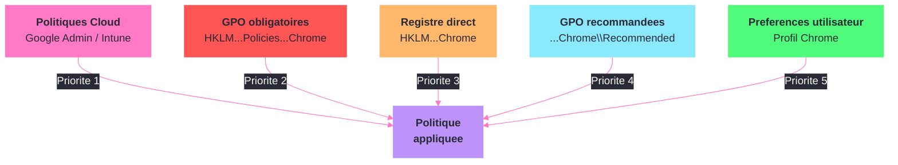
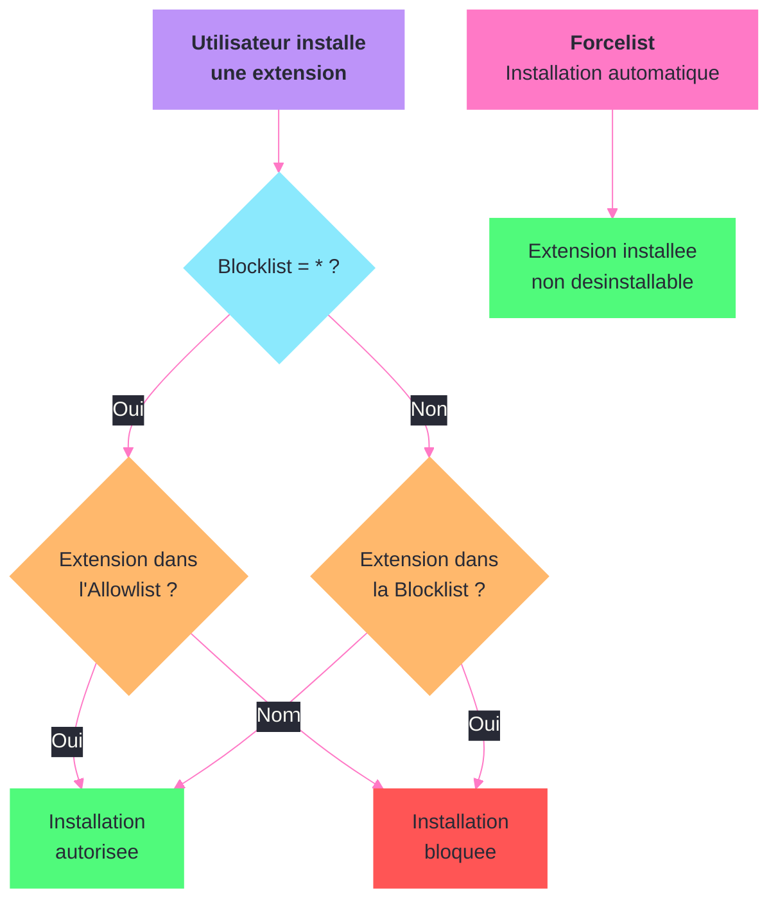

---
tags:
  - registre
  - navigateurs
  - chrome
  - edge
  - gpo
  - entreprise
---

# Navigateurs enterprise

!!! abstract "Ce que vous allez apprendre"
    - Configurer les politiques Google Chrome et Microsoft Edge via le registre
    - Distinguer les politiques obligatoires (Policies) des politiques recommandees (Recommended)
    - Gerer les extensions : installation forcee, liste blanche, liste noire
    - Configurer le proxy, la page d'accueil, le moteur de recherche et les pages de demarrage
    - Controler la synchronisation des donnees et des mots de passe
    - Comparer la gestion ADMX et la manipulation directe du registre
    - Deployer une extension de securite sur l'ensemble du parc

---

## Politiques Chrome : les fondamentaux



Google Chrome lit ses politiques enterprise depuis deux emplacements distincts dans le registre. Le premier est obligatoire, le second est une simple recommandation que l'utilisateur peut ignorer.

```
HKLM\SOFTWARE\Policies\Google\Chrome          ← politiques obligatoires (machine)
HKLM\SOFTWARE\Policies\Google\Chrome\Recommended  ← politiques recommandees
HKCU\SOFTWARE\Policies\Google\Chrome          ← politiques obligatoires (utilisateur)
```

Les politiques sous `HKLM` s'appliquent a tous les utilisateurs de la machine. Celles sous `HKCU` ne s'appliquent qu'a l'utilisateur courant. En cas de conflit, `HKLM` l'emporte toujours.

```powershell
# Verify Chrome policies applied on the machine
reg query "HKLM\SOFTWARE\Policies\Google\Chrome" /s
```

```title="Resultat attendu"
HKEY_LOCAL_MACHINE\SOFTWARE\Policies\Google\Chrome
    HomepageLocation    REG_SZ    https://intranet.corp.local
    HomepageIsNewTabPage    REG_DWORD    0x0
    RestoreOnStartup    REG_DWORD    0x4
...
```

Pour verifier directement dans Chrome, ouvrez `chrome://policy` dans la barre d'adresse. Cette page affiche toutes les politiques actives, leur source (Platform, Cloud, etc.) et leur statut.

```powershell
# List all Chrome policy keys including sub-keys
Get-ChildItem -Path "HKLM:\SOFTWARE\Policies\Google\Chrome" -Recurse | `
    ForEach-Object { Write-Output $_.PSPath }
```

```title="Resultat attendu"
Microsoft.PowerShell.Core\Registry::HKEY_LOCAL_MACHINE\SOFTWARE\Policies\Google\Chrome\ExtensionInstallForcelist
Microsoft.PowerShell.Core\Registry::HKEY_LOCAL_MACHINE\SOFTWARE\Policies\Google\Chrome\Recommended
...
```

!!! info "En resume"
    - Chrome lit ses politiques sous `HKLM\SOFTWARE\Policies\Google\Chrome`
    - La sous-cle `Recommended` contient les politiques que l'utilisateur peut ignorer
    - `HKLM` l'emporte sur `HKCU` en cas de conflit
    - `chrome://policy` permet de verifier les politiques en vigueur

---

## Politiques Edge : les fondamentaux

Microsoft Edge (Chromium) utilise une architecture de politiques quasi identique a Chrome. Les cles sont au meme niveau, seul le chemin du fournisseur change.

```
HKLM\SOFTWARE\Policies\Microsoft\Edge              ← politiques obligatoires (machine)
HKLM\SOFTWARE\Policies\Microsoft\Edge\Recommended   ← politiques recommandees
HKCU\SOFTWARE\Policies\Microsoft\Edge              ← politiques obligatoires (utilisateur)
```

Edge etant le navigateur par defaut de Windows, il herite egalement de certaines politiques Windows globales, notamment pour le proxy et les certificats. Cela evite souvent une double configuration.

```powershell
# Verify Edge policies applied on the machine
reg query "HKLM\SOFTWARE\Policies\Microsoft\Edge" /s
```

```title="Resultat attendu"
HKEY_LOCAL_MACHINE\SOFTWARE\Policies\Microsoft\Edge
    HomepageLocation    REG_SZ    https://intranet.corp.local
    RestoreOnStartup    REG_DWORD    0x4
...
```

Pour verifier dans Edge : ouvrez `edge://policy`. L'interface est identique a celle de Chrome.

```powershell
# Compare Chrome and Edge policy counts
$chromeCount = (Get-ChildItem "HKLM:\SOFTWARE\Policies\Google\Chrome" -ErrorAction SilentlyContinue).Count
$edgeCount = (Get-ChildItem "HKLM:\SOFTWARE\Policies\Microsoft\Edge" -ErrorAction SilentlyContinue).Count
Write-Output "Chrome policies sub-keys: $chromeCount"
Write-Output "Edge policies sub-keys: $edgeCount"
```

```title="Resultat attendu"
Chrome policies sub-keys: 5
Edge policies sub-keys: 7
```

!!! info "En resume"
    - Edge utilise `HKLM\SOFTWARE\Policies\Microsoft\Edge` avec la meme structure que Chrome
    - Edge herite de certaines politiques systeme Windows (proxy, certificats)
    - `edge://policy` affiche les politiques actives

---

## Politiques obligatoires vs recommandees

La distinction entre les deux types de politiques est fondamentale pour l'experience utilisateur. Une politique obligatoire verrouille le parametre : l'utilisateur voit le champ grise dans les options du navigateur. Une politique recommandee definit une valeur par defaut que l'utilisateur peut modifier.

| Type | Emplacement | Comportement | Icone dans le navigateur |
|------|-------------|-------------|--------------------------|
| Obligatoire | `Policies\Google\Chrome` | Verrouille, non modifiable | Cadenas gris |
| Recommandee | `Policies\Google\Chrome\Recommended` | Valeur par defaut, modifiable | Icone "geree par l'entreprise" |

Exemple concret : la page d'accueil. En mode obligatoire, l'utilisateur ne peut pas la changer. En mode recommande, la page est pre-remplie mais modifiable.

```powershell
# Set homepage as mandatory policy (user cannot change it)
New-Item -Path "HKLM:\SOFTWARE\Policies\Google\Chrome" -Force | Out-Null
Set-ItemProperty -Path "HKLM:\SOFTWARE\Policies\Google\Chrome" `
    -Name "HomepageLocation" -Value "https://intranet.corp.local" -Type String
Set-ItemProperty -Path "HKLM:\SOFTWARE\Policies\Google\Chrome" `
    -Name "HomepageIsNewTabPage" -Value 0 -Type DWord
```

```title="Resultat attendu"
Aucune sortie si tout fonctionne. La politique est immediatement active au prochain lancement de Chrome.
```

```powershell
# Set homepage as recommended policy (user can override)
New-Item -Path "HKLM:\SOFTWARE\Policies\Google\Chrome\Recommended" -Force | Out-Null
Set-ItemProperty -Path "HKLM:\SOFTWARE\Policies\Google\Chrome\Recommended" `
    -Name "HomepageLocation" -Value "https://intranet.corp.local" -Type String
```

```title="Resultat attendu"
Aucune sortie. L'utilisateur verra la page d'accueil pre-remplie mais pourra la modifier dans les parametres.
```

!!! warning "Ne pas melanger obligatoire et recommandee pour la meme politique"
    Si une politique apparait a la fois dans `Policies\Google\Chrome` et dans `Policies\Google\Chrome\Recommended`, la version obligatoire l'emporte toujours. La version recommandee sera ignoree.

!!! info "En resume"
    - Les politiques obligatoires verrouillent les parametres (l'utilisateur ne peut pas les modifier)
    - Les politiques recommandees definissent des valeurs par defaut modifiables
    - En cas de doublon, la politique obligatoire l'emporte

---

## Gestion des extensions



La gestion centralisee des extensions est l'un des cas d'usage les plus courants en entreprise. Trois mecanismes existent : l'installation forcee, la liste blanche et la liste noire.

### Installation forcee

L'installation forcee deploie une extension sans intervention de l'utilisateur. L'extension ne peut pas etre desinstallee.

```
HKLM\SOFTWARE\Policies\Google\Chrome\ExtensionInstallForcelist
HKLM\SOFTWARE\Policies\Microsoft\Edge\ExtensionInstallForcelist
```

Chaque valeur est numerotee (`1`, `2`, `3`...) et contient l'ID de l'extension suivi de l'URL de mise a jour.

```powershell
# Force-install uBlock Origin on Chrome
$path = "HKLM:\SOFTWARE\Policies\Google\Chrome\ExtensionInstallForcelist"
New-Item -Path $path -Force | Out-Null
Set-ItemProperty -Path $path -Name "1" `
    -Value "cjpalhdlnbpafiamejdnhcphjbkeiagm;https://clients2.google.com/service/update2/crx"
```

```title="Resultat attendu"
Aucune sortie. L'extension apparaitra au prochain lancement de Chrome avec la mention "Installee par la strategie d'entreprise".
```

```powershell
# Force-install uBlock Origin on Edge
$path = "HKLM:\SOFTWARE\Policies\Microsoft\Edge\ExtensionInstallForcelist"
New-Item -Path $path -Force | Out-Null
Set-ItemProperty -Path $path -Name "1" `
    -Value "odfafepnkmbhccpbejgmiehpchacaeak;https://edge.microsoft.com/extensionwebstorebase/v1/crx"
```

```title="Resultat attendu"
Aucune sortie. L'extension sera installee automatiquement dans Edge.
```

### Liste noire (blocage)

La liste noire empeche l'installation d'extensions specifiques ou de toutes les extensions.

```powershell
# Block all extensions by default on Chrome
$path = "HKLM:\SOFTWARE\Policies\Google\Chrome\ExtensionInstallBlocklist"
New-Item -Path $path -Force | Out-Null
Set-ItemProperty -Path $path -Name "1" -Value "*"
```

```title="Resultat attendu"
Aucune sortie. Toutes les extensions sont bloquees sauf celles explicitement autorisees.
```

### Liste blanche (autorisation)

Utilisee conjointement avec une liste noire globale (`*`), la liste blanche definit les extensions autorisees.

```powershell
# Allow only specific extensions on Chrome (after blocking all with *)
$path = "HKLM:\SOFTWARE\Policies\Google\Chrome\ExtensionInstallAllowlist"
New-Item -Path $path -Force | Out-Null
# uBlock Origin
Set-ItemProperty -Path $path -Name "1" -Value "cjpalhdlnbpafiamejdnhcphjbkeiagm"
# Bitwarden
Set-ItemProperty -Path $path -Name "2" -Value "nngceckbapebfimnlniiiahkandclblb"
```

```title="Resultat attendu"
Aucune sortie. Seules uBlock Origin et Bitwarden pourront etre installees.
```

| Politique | Cle | Effet |
|-----------|-----|-------|
| `ExtensionInstallForcelist` | Liste numerotee | Installation automatique, non desinstallable |
| `ExtensionInstallBlocklist` | `*` ou ID specifiques | Blocage d'extensions |
| `ExtensionInstallAllowlist` | ID specifiques | Autorisation explicite |

!!! tip "Trouver l'ID d'une extension Chrome"
    Ouvrez `chrome://extensions`, activez le **Mode developpeur**. L'ID apparait sous chaque extension. Pour le Chrome Web Store, l'ID est dans l'URL : `https://chromewebstore.google.com/detail/[nom]/[ID]`.

!!! info "En resume"
    - `ExtensionInstallForcelist` installe automatiquement des extensions (non desinstallables)
    - `ExtensionInstallBlocklist` avec `*` bloque toutes les extensions
    - `ExtensionInstallAllowlist` autorise des exceptions a la liste noire
    - Le pattern classique : bloquer tout (`*`) + autoriser les exceptions + forcer les extensions de securite

---

## Configuration du proxy

Les navigateurs Chromium (Chrome et Edge) utilisent par defaut la configuration proxy systeme de Windows. Pour forcer une configuration specifique, les politiques registre permettent de surcharger ce comportement.

```powershell
# Configure proxy via Chrome policy
$path = "HKLM:\SOFTWARE\Policies\Google\Chrome"
New-Item -Path $path -Force | Out-Null
# ProxyMode: fixed_servers, pac_script, auto_detect, system, direct
Set-ItemProperty -Path $path -Name "ProxyMode" -Value "fixed_servers" -Type String
Set-ItemProperty -Path $path -Name "ProxyServer" -Value "proxy.corp.local:8080" -Type String
Set-ItemProperty -Path $path -Name "ProxyBypassList" `
    -Value "*.corp.local;*.internal.net;localhost;127.0.0.1" -Type String
```

```title="Resultat attendu"
Aucune sortie. Chrome utilisera le proxy proxy.corp.local:8080 sauf pour les domaines listes dans ProxyBypassList.
```

| Valeur | Type | Description |
|--------|------|-------------|
| `ProxyMode` | REG_SZ | Mode proxy : `fixed_servers`, `pac_script`, `auto_detect`, `system`, `direct` |
| `ProxyServer` | REG_SZ | Adresse et port du proxy (mode `fixed_servers`) |
| `ProxyBypassList` | REG_SZ | Domaines exclus du proxy (separes par `;`) |
| `ProxyPacUrl` | REG_SZ | URL du fichier PAC (mode `pac_script`) |

Pour Edge, les memes valeurs existent sous `HKLM\SOFTWARE\Policies\Microsoft\Edge`. La syntaxe est identique.

```powershell
# Configure proxy via PAC file on Edge
$path = "HKLM:\SOFTWARE\Policies\Microsoft\Edge"
New-Item -Path $path -Force | Out-Null
Set-ItemProperty -Path $path -Name "ProxyMode" -Value "pac_script" -Type String
Set-ItemProperty -Path $path -Name "ProxyPacUrl" `
    -Value "https://proxy.corp.local/proxy.pac" -Type String
```

```title="Resultat attendu"
Aucune sortie. Edge utilisera le fichier PAC pour determiner quel proxy utiliser selon l'URL demandee.
```

!!! info "En resume"
    - Chrome et Edge utilisent par defaut le proxy systeme Windows
    - `ProxyMode` controle le comportement : serveur fixe, PAC, detection automatique ou direct
    - Les memes valeurs fonctionnent pour Chrome et Edge (sous leurs cles respectives)

---

## Page d'accueil, moteur de recherche et demarrage

### Page d'accueil et bouton Accueil

```powershell
# Configure homepage and show Home button on Chrome
$path = "HKLM:\SOFTWARE\Policies\Google\Chrome"
Set-ItemProperty -Path $path -Name "HomepageLocation" `
    -Value "https://intranet.corp.local" -Type String
Set-ItemProperty -Path $path -Name "HomepageIsNewTabPage" -Value 0 -Type DWord
Set-ItemProperty -Path $path -Name "ShowHomeButton" -Value 1 -Type DWord
```

```title="Resultat attendu"
Aucune sortie. Le bouton Accueil apparait dans la barre d'outils et pointe vers l'intranet.
```

### Moteur de recherche par defaut

Pour forcer un moteur de recherche specifique, plusieurs valeurs doivent etre definies ensemble.

```powershell
# Force default search engine on Chrome
$path = "HKLM:\SOFTWARE\Policies\Google\Chrome"
Set-ItemProperty -Path $path -Name "DefaultSearchProviderEnabled" -Value 1 -Type DWord
Set-ItemProperty -Path $path -Name "DefaultSearchProviderName" `
    -Value "Google" -Type String
Set-ItemProperty -Path $path -Name "DefaultSearchProviderSearchURL" `
    -Value "https://www.google.com/search?q={searchTerms}" -Type String
Set-ItemProperty -Path $path -Name "DefaultSearchProviderKeyword" `
    -Value "google.com" -Type String
```

```title="Resultat attendu"
Aucune sortie. Google est force comme moteur par defaut. L'utilisateur ne peut pas le changer.
```

### Pages de demarrage

La politique `RestoreOnStartup` controle le comportement au lancement du navigateur.

| Valeur | Comportement |
|:------:|-------------|
| `1` | Restaurer la derniere session |
| `4` | Ouvrir une liste d'URL specifiques |
| `5` | Ouvrir le nouvel onglet |

```powershell
# Open specific URLs at startup on Chrome
$path = "HKLM:\SOFTWARE\Policies\Google\Chrome"
Set-ItemProperty -Path $path -Name "RestoreOnStartup" -Value 4 -Type DWord

$urlPath = "HKLM:\SOFTWARE\Policies\Google\Chrome\RestoreOnStartupURLs"
New-Item -Path $urlPath -Force | Out-Null
Set-ItemProperty -Path $urlPath -Name "1" `
    -Value "https://intranet.corp.local" -Type String
Set-ItemProperty -Path $urlPath -Name "2" `
    -Value "https://mail.corp.local" -Type String
```

```title="Resultat attendu"
Aucune sortie. Chrome ouvrira l'intranet et la messagerie a chaque lancement.
```

!!! info "En resume"
    - `HomepageLocation` + `ShowHomeButton` controle le bouton Accueil
    - `DefaultSearchProviderEnabled` + les valeurs associees forcent le moteur de recherche
    - `RestoreOnStartup` = `4` + `RestoreOnStartupURLs` definit les pages de demarrage

---

## Synchronisation des donnees et mots de passe

En environnement enterprise, la synchronisation des donnees personnelles et des mots de passe vers des comptes Google ou Microsoft personnels represente un risque de fuite de donnees. Les politiques registre permettent de controler finement ce comportement.

### Chrome : synchronisation et mots de passe

```powershell
# Disable Chrome Sync entirely
$path = "HKLM:\SOFTWARE\Policies\Google\Chrome"
Set-ItemProperty -Path $path -Name "SyncDisabled" -Value 1 -Type DWord

# Disable the built-in password manager
Set-ItemProperty -Path $path -Name "PasswordManagerEnabled" -Value 0 -Type DWord

# Disable saving passwords
Set-ItemProperty -Path $path -Name "PasswordManagerOnboarding" -Value 0 -Type DWord
```

```title="Resultat attendu"
Aucune sortie. La synchronisation Chrome est desactivee et le gestionnaire de mots de passe integre est verrouille.
```

### Edge : synchronisation et mots de passe

```powershell
# Disable Edge Sync
$path = "HKLM:\SOFTWARE\Policies\Microsoft\Edge"
Set-ItemProperty -Path $path -Name "SyncDisabled" -Value 1 -Type DWord

# Disable password manager
Set-ItemProperty -Path $path -Name "PasswordManagerEnabled" -Value 0 -Type DWord

# Block sign-in with personal Microsoft accounts
Set-ItemProperty -Path $path -Name "BrowserSignin" -Value 0 -Type DWord
```

```title="Resultat attendu"
Aucune sortie. La synchronisation Edge est desactivee et la connexion avec un compte personnel est bloquee.
```

| Politique | Chrome | Edge | Effet |
|-----------|--------|------|-------|
| `SyncDisabled` | Oui | Oui | Desactive la synchronisation cloud |
| `PasswordManagerEnabled` | Oui | Oui | Active/desactive le gestionnaire de mots de passe |
| `BrowserSignin` | Oui | Oui | `0` = desactive, `1` = active, `2` = force |
| `AutofillAddressEnabled` | Oui | Oui | Saisie automatique des adresses |
| `AutofillCreditCardEnabled` | Oui | Oui | Saisie automatique des cartes bancaires |

```powershell
# Disable autofill for sensitive data on both browsers
foreach ($browser in @("Google\Chrome", "Microsoft\Edge")) {
    $path = "HKLM:\SOFTWARE\Policies\$browser"
    New-Item -Path $path -Force | Out-Null
    Set-ItemProperty -Path $path -Name "AutofillAddressEnabled" -Value 0 -Type DWord
    Set-ItemProperty -Path $path -Name "AutofillCreditCardEnabled" -Value 0 -Type DWord
}
```

```title="Resultat attendu"
Aucune sortie. La saisie automatique des adresses et cartes bancaires est desactivee dans les deux navigateurs.
```

!!! info "En resume"
    - `SyncDisabled` = `1` bloque la synchronisation cloud des donnees du navigateur
    - `PasswordManagerEnabled` = `0` desactive le gestionnaire de mots de passe integre
    - `BrowserSignin` = `0` empeche la connexion avec un compte personnel
    - Desactivez `AutofillCreditCardEnabled` pour eviter le stockage de donnees bancaires

---

## ADMX vs registre direct

Les modeles d'administration (ADMX/ADML) fournissent une interface graphique dans l'editeur de strategie de groupe. Derriere le rideau, ils ecrivent exactement les memes cles de registre que celles que nous configurons manuellement.

| Aspect | ADMX (GPO) | Registre direct |
|--------|-----------|-----------------|
| Interface | Console GPMC graphique | PowerShell / reg.exe |
| Deploiement | Automatique via AD | Script ou outil de deploiement |
| Versionnage | Versionne par GPO | A gerer soi-meme |
| Granularite | Par politique pre-definie | Totale (toute valeur) |
| Audit | Journalise via GPO | Necessite un audit registre |
| Vitesse de deploiement | Depend du cycle de rafraichissement GPO | Immediat |

### Telecharger les ADMX

Google et Microsoft publient les fichiers ADMX pour leurs navigateurs respectifs :

- **Chrome** : telecharger depuis `chromeenterprise.google/browser/download/#manage-policies-tab` (fichier `policy_templates.zip`)
- **Edge** : telecharger depuis `microsoft.com/edge/business/download` (fichier de politiques)

```powershell
# Check if Chrome ADMX templates are installed
Test-Path "C:\Windows\PolicyDefinitions\chrome.admx"
```

```title="Resultat attendu"
True
```

```powershell
# Check if Edge ADMX templates are installed
Test-Path "C:\Windows\PolicyDefinitions\msedge.admx"
```

```title="Resultat attendu"
True
```

Les fichiers ADMX doivent etre copies dans `C:\Windows\PolicyDefinitions\` (ou dans le Central Store `\\domaine\SYSVOL\domaine\Policies\PolicyDefinitions\` pour un deploiement AD). Les fichiers ADML (traductions) vont dans le sous-dossier de langue (`fr-FR`, `en-US`).

!!! tip "Quand utiliser le registre direct plutot que les ADMX"
    Le registre direct est preferable pour :

    - Les machines hors domaine (workgroup, Azure AD join sans Intune)
    - Les deploiements urgents (pas le temps d'attendre le cycle GPO)
    - Les politiques non couvertes par les ADMX (certaines politiques experimentales)
    - Les scripts d'automatisation et les pipelines CI/CD

!!! info "En resume"
    - Les ADMX sont une surcouche graphique qui ecrit les memes cles de registre
    - Chrome et Edge publient des fichiers ADMX telechargeables
    - Le registre direct offre plus de flexibilite et de rapidite
    - Les ADMX offrent un meilleur audit et une gestion centralisee via AD

---

## Scenario : deployer une extension de securite sur tout le parc

### Contexte

L'equipe securite demande le deploiement de l'extension **CrowdStrike Falcon Insight** (ou toute extension de securite corporate) sur tous les postes. Les utilisateurs ne doivent pas pouvoir la desinstaller ni installer d'autres extensions non approuvees.

### Strategie

1. Bloquer toutes les extensions par defaut
2. Autoriser une liste blanche d'extensions approuvees
3. Forcer l'installation de l'extension de securite
4. Deployer via GPO ou script PowerShell

### Script de deploiement complet

```powershell
# Deploy browser extension policies for Chrome and Edge
# Target: all workstations in the fleet

$chromeBase = "HKLM:\SOFTWARE\Policies\Google\Chrome"
$edgeBase = "HKLM:\SOFTWARE\Policies\Microsoft\Edge"

# Security extension IDs (replace with your actual IDs)
$securityExtChrome = "exampleidchrome123456789012345678"
$securityExtEdge = "exampleidedge12345678901234567890"

# Approved extensions: uBlock Origin, Bitwarden, corporate security
$approvedChrome = @(
    "cjpalhdlnbpafiamejdnhcphjbkeiagm",   # uBlock Origin
    "nngceckbapebfimnlniiiahkandclblb",     # Bitwarden
    $securityExtChrome                       # Corporate security extension
)

$approvedEdge = @(
    "odfafepnkmbhccpbejgmiehpchacaeak",    # uBlock Origin
    "jbkfoedolllekgbhcbcoahefnbanhhlh",     # Bitwarden
    $securityExtEdge                         # Corporate security extension
)

foreach ($base in @($chromeBase, $edgeBase)) {
    # Create base key
    New-Item -Path $base -Force | Out-Null

    # Step 1: block all extensions
    $blockPath = "$base\ExtensionInstallBlocklist"
    New-Item -Path $blockPath -Force | Out-Null
    Set-ItemProperty -Path $blockPath -Name "1" -Value "*"
}

# Step 2: set allowlist for Chrome
$allowPath = "$chromeBase\ExtensionInstallAllowlist"
New-Item -Path $allowPath -Force | Out-Null
for ($i = 0; $i -lt $approvedChrome.Count; $i++) {
    Set-ItemProperty -Path $allowPath -Name ($i + 1).ToString() -Value $approvedChrome[$i]
}

# Step 2: set allowlist for Edge
$allowPath = "$edgeBase\ExtensionInstallAllowlist"
New-Item -Path $allowPath -Force | Out-Null
for ($i = 0; $i -lt $approvedEdge.Count; $i++) {
    Set-ItemProperty -Path $allowPath -Name ($i + 1).ToString() -Value $approvedEdge[$i]
}

# Step 3: force-install security extension on Chrome
$forcePath = "$chromeBase\ExtensionInstallForcelist"
New-Item -Path $forcePath -Force | Out-Null
Set-ItemProperty -Path $forcePath -Name "1" `
    -Value "$securityExtChrome;https://clients2.google.com/service/update2/crx"

# Step 3: force-install security extension on Edge
$forcePath = "$edgeBase\ExtensionInstallForcelist"
New-Item -Path $forcePath -Force | Out-Null
Set-ItemProperty -Path $forcePath -Name "1" `
    -Value "$securityExtEdge;https://edge.microsoft.com/extensionwebstorebase/v1/crx"

Write-Output "Browser extension policies applied successfully."
```

```title="Resultat attendu"
Browser extension policies applied successfully.
```

### Verification

```powershell
# Verify Chrome extension policies
Write-Output "=== Chrome Blocklist ==="
reg query "HKLM\SOFTWARE\Policies\Google\Chrome\ExtensionInstallBlocklist"
Write-Output "`n=== Chrome Allowlist ==="
reg query "HKLM\SOFTWARE\Policies\Google\Chrome\ExtensionInstallAllowlist"
Write-Output "`n=== Chrome Forcelist ==="
reg query "HKLM\SOFTWARE\Policies\Google\Chrome\ExtensionInstallForcelist"
```

```title="Resultat attendu"
=== Chrome Blocklist ===
HKEY_LOCAL_MACHINE\SOFTWARE\Policies\Google\Chrome\ExtensionInstallBlocklist
    1    REG_SZ    *

=== Chrome Allowlist ===
HKEY_LOCAL_MACHINE\SOFTWARE\Policies\Google\Chrome\ExtensionInstallAllowlist
    1    REG_SZ    cjpalhdlnbpafiamejdnhcphjbkeiagm
    2    REG_SZ    nngceckbapebfimnlniiiahkandclblb
    3    REG_SZ    exampleidchrome123456789012345678

=== Chrome Forcelist ===
HKEY_LOCAL_MACHINE\SOFTWARE\Policies\Google\Chrome\ExtensionInstallForcelist
    1    REG_SZ    exampleidchrome123456789012345678;https://clients2.google.com/service/update2/crx
```

### Deploiement via GPO

Pour deployer ce script sur tout le parc via une GPO :

1. Ouvrez la console **GPMC** (`gpmc.msc`)
2. Creez une nouvelle GPO : `Navigateurs - Politique Extensions`
3. Editez la GPO > **Configuration ordinateur** > **Preferences** > **Parametres Windows** > **Registre**
4. Ajoutez chaque valeur de registre manuellement, ou utilisez un **script de demarrage** :
    - **Configuration ordinateur** > **Strategies** > **Parametres Windows** > **Scripts (demarrage/arret)** > **Demarrage**
    - Ajoutez le script PowerShell ci-dessus

```powershell
# Force immediate GPO refresh on target machines (run from admin workstation)
Invoke-Command -ComputerName (Get-Content "C:\Admin\workstations.txt") -ScriptBlock {
    gpupdate /force /target:computer
}
```

```title="Resultat attendu"
Mise a jour de la strategie en cours...
La mise a jour de la strategie de l'ordinateur a ete effectuee avec succes.
```

!!! danger "Testez toujours sur un groupe pilote"
    Avant de deployer des politiques d'extensions sur tout le parc, testez sur un OU pilote. Une liste blanche trop restrictive peut bloquer des extensions essentielles a certains metiers (outils de design, extensions de traduction, etc.).

!!! info "En resume"
    - La strategie recommandee : bloquer tout (`*`) + autoriser les extensions approuvees + forcer les extensions de securite
    - Le deploiement se fait via GPO (script de demarrage) ou outil de gestion (SCCM, Intune)
    - Verifiez avec `chrome://policy` et `edge://policy` apres deploiement
    - Testez systematiquement sur un groupe pilote avant le deploiement general
