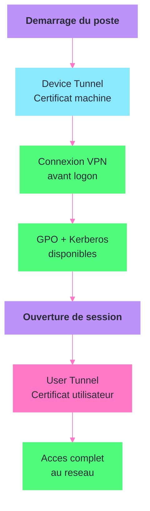

---
tags:
  - registre
  - vpn
  - cisco
  - fortinet
  - wireguard
  - entreprise
---

# VPN clients

!!! abstract "Ce que vous allez apprendre"
    - Localiser et configurer les cles de registre de Cisco AnyConnect
    - Gerer FortiClient VPN via le registre
    - Configurer WireGuard et ses tunnels dans le registre
    - Manipuler les connexions VPN natives Windows (RasMan, RasEntry)
    - Configurer le split tunneling pour chaque client VPN
    - Activer les modes auto-connect et always-on VPN
    - Gerer les certificats et l'authentification VPN
    - Deployer Cisco AnyConnect avec des profils pre-configures via registre et GPO

---

## Cisco AnyConnect


Cisco AnyConnect Secure Mobility Client est l'un des clients VPN les plus deployes en entreprise. Sa configuration registre se repartit entre les parametres du client lui-meme et les profils de connexion.

### Cles principales

```
HKLM\SOFTWARE\Cisco\Cisco AnyConnect Secure Mobility Client
```

| Valeur | Type | Description |
|--------|------|-------------|
| `InstallDir` | REG_SZ | Repertoire d'installation |
| `Version` | REG_SZ | Version installee du client |

```powershell
# Check AnyConnect installation and version
reg query "HKLM\SOFTWARE\Cisco\Cisco AnyConnect Secure Mobility Client" /v Version
```

```title="Resultat attendu"
HKEY_LOCAL_MACHINE\SOFTWARE\Cisco\Cisco AnyConnect Secure Mobility Client
    Version    REG_SZ    5.1.3.62
```

### Preferences utilisateur

Les preferences de connexion de l'utilisateur sont stockees dans `HKCU` :

```
HKCU\SOFTWARE\Cisco\Cisco AnyConnect Secure Mobility Client
```

| Valeur | Type | Description |
|--------|------|-------------|
| `DefaultUser` | REG_SZ | Nom d'utilisateur par defaut |
| `DefaultHostName` | REG_SZ | Serveur VPN par defaut |
| `DefaultHostAddress` | REG_SZ | Adresse IP ou FQDN du serveur |
| `DefaultGroup` | REG_SZ | Groupe de connexion par defaut |

```powershell
# Set default VPN server for the current user
$path = "HKCU:\SOFTWARE\Cisco\Cisco AnyConnect Secure Mobility Client"
New-Item -Path $path -Force | Out-Null
Set-ItemProperty -Path $path -Name "DefaultHostName" -Value "VPN Corporate" -Type String
Set-ItemProperty -Path $path -Name "DefaultHostAddress" -Value "vpn.corp.local" -Type String
```

```title="Resultat attendu"
Aucune sortie. Le client AnyConnect affichera "VPN Corporate" comme serveur par defaut au prochain lancement.
```

### Profils XML

AnyConnect utilise des profils XML pour sa configuration avancee. Le registre pointe vers l'emplacement de ces profils :

```
HKLM\SOFTWARE\Cisco\Cisco AnyConnect Secure Mobility Client\Profile
```

Les profils sont stockes sous forme de fichiers XML dans le repertoire d'installation, generalement :

```
C:\ProgramData\Cisco\Cisco AnyConnect Secure Mobility Client\Profile\
```

```powershell
# List AnyConnect profile files
Get-ChildItem "C:\ProgramData\Cisco\Cisco AnyConnect Secure Mobility Client\Profile\" `
    -Filter "*.xml" -ErrorAction SilentlyContinue
```

```title="Resultat attendu"
    Directory: C:\ProgramData\Cisco\Cisco AnyConnect Secure Mobility Client\Profile

Mode                 LastWriteTime         Length Name
----                 -------------         ------ ----
-a---          2025-03-15    14:22           2048 CorporateVPN.xml
```

### Module de diagnostic

Le module de diagnostic reseau (DART) possede ses propres cles :

```
HKLM\SOFTWARE\Cisco\Cisco AnyConnect Secure Mobility Client\DART
```

```powershell
# Check DART module installation
reg query "HKLM\SOFTWARE\Cisco\Cisco AnyConnect Secure Mobility Client\DART" 2>$null
if ($LASTEXITCODE -eq 0) { Write-Output "DART module installed" }
else { Write-Output "DART module not found" }
```

```title="Resultat attendu"
DART module installed
```

!!! info "En resume"
    - AnyConnect stocke sa configuration sous `HKLM\SOFTWARE\Cisco\Cisco AnyConnect Secure Mobility Client`
    - Les preferences utilisateur sont sous `HKCU` (serveur par defaut, groupe, identifiant)
    - Les profils XML definissent la configuration avancee (split tunneling, auto-connect, etc.)
    - Le module DART fournit des outils de diagnostic reseau

---

## FortiClient VPN

FortiClient de Fortinet stocke sa configuration VPN dans le registre avec une structure hierarchique qui reflete les tunnels configures.

### Cles principales

```
HKLM\SOFTWARE\Fortinet\FortiClient
HKLM\SOFTWARE\Fortinet\FortiClient\Sslvpn\Tunnels
```

```powershell
# Check FortiClient installation
reg query "HKLM\SOFTWARE\Fortinet\FortiClient" /v Version 2>$null
```

```title="Resultat attendu"
HKEY_LOCAL_MACHINE\SOFTWARE\Fortinet\FortiClient
    Version    REG_SZ    7.4.1.1418
```

### Configuration des tunnels SSL VPN

Chaque tunnel VPN est represente par une sous-cle sous `Tunnels`, nommee d'apres le nom du tunnel.

```
HKLM\SOFTWARE\Fortinet\FortiClient\Sslvpn\Tunnels\<NomTunnel>
```

| Valeur | Type | Description |
|--------|------|-------------|
| `Server` | REG_SZ | Adresse du serveur VPN (FQDN ou IP) |
| `ServerPort` | REG_DWORD | Port du serveur (par defaut `443`) |
| `Description` | REG_SZ | Description du tunnel |
| `promptusername` | REG_DWORD | `1` = demander le nom d'utilisateur |
| `promptcertificate` | REG_DWORD | `1` = demander le certificat client |
| `ServerCert` | REG_SZ | Hash SHA1 du certificat serveur attendu |

```powershell
# Create a new FortiClient SSL VPN tunnel
$tunnelPath = "HKLM:\SOFTWARE\Fortinet\FortiClient\Sslvpn\Tunnels\Corporate VPN"
New-Item -Path $tunnelPath -Force | Out-Null
Set-ItemProperty -Path $tunnelPath -Name "Server" -Value "vpn.corp.local" -Type String
Set-ItemProperty -Path $tunnelPath -Name "ServerPort" -Value 443 -Type DWord
Set-ItemProperty -Path $tunnelPath -Name "Description" -Value "Corporate VPN Tunnel" -Type String
Set-ItemProperty -Path $tunnelPath -Name "promptusername" -Value 1 -Type DWord
Set-ItemProperty -Path $tunnelPath -Name "promptcertificate" -Value 0 -Type DWord
```

```title="Resultat attendu"
Aucune sortie. Le tunnel "Corporate VPN" apparaitra dans la liste des connexions FortiClient.
```

### Configuration IPsec

Les tunnels IPsec suivent la meme logique sous `HKLM\SOFTWARE\Fortinet\FortiClient\FA_VPN\Tunnels\<NomTunnel>` avec les valeurs `Server`, `psk` (chiffree), `ike_version` (`1` ou `2`) et `mode` (`aggressive` ou `main`).

```powershell
# List all FortiClient VPN tunnels (SSL and IPsec)
foreach ($type in @("Sslvpn", "FA_VPN")) {
    $path = "HKLM:\SOFTWARE\Fortinet\FortiClient\$type\Tunnels"
    Write-Output "=== $type ==="
    if (Test-Path $path) {
        Get-ChildItem $path | ForEach-Object { Write-Output $_.PSChildName }
    } else { Write-Output "No tunnels configured" }
}
```

```title="Resultat attendu"
=== Sslvpn ===
Corporate VPN
=== FA_VPN ===
Site-to-Site HQ
```

### FortiClient EMS (gestion centralisee)

En environnement manage par FortiClient EMS, la configuration est poussee depuis la console centrale. Le registre conserve les parametres de connexion au serveur EMS :

```
HKLM\SOFTWARE\Fortinet\FortiClient\FA_EMS
```

| Valeur | Type | Description |
|--------|------|-------------|
| `srv_name` | REG_SZ | Nom du serveur EMS |
| `srv_ip` | REG_SZ | Adresse IP du serveur EMS |
| `managed` | REG_DWORD | `1` = gere par EMS |

```powershell
# Check FortiClient EMS management status
$emsPath = "HKLM:\SOFTWARE\Fortinet\FortiClient\FA_EMS"
if (Test-Path $emsPath) {
    $managed = Get-ItemProperty -Path $emsPath -Name "managed" -ErrorAction SilentlyContinue
    $server = Get-ItemProperty -Path $emsPath -Name "srv_name" -ErrorAction SilentlyContinue
    Write-Output "Managed by EMS: $($managed.managed)"
    Write-Output "EMS Server: $($server.srv_name)"
} else {
    Write-Output "FortiClient is not managed by EMS"
}
```

```title="Resultat attendu"
Managed by EMS: 1
EMS Server: ems.corp.local
```

!!! info "En resume"
    - FortiClient stocke les tunnels SSL sous `Sslvpn\Tunnels\<NomTunnel>` et IPsec sous `FA_VPN\Tunnels\<NomTunnel>`
    - Chaque tunnel est une sous-cle avec ses propres valeurs (serveur, port, authentification)
    - La gestion centralisee FortiClient EMS est configuree sous `FA_EMS`
    - Les tunnels peuvent etre pre-configures via le registre pour un deploiement silencieux

---

## WireGuard

WireGuard adopte une approche minimaliste. Sa configuration reside principalement dans des fichiers `.conf`, mais le service Windows et les tunnels sont references dans le registre.

### Service et tunnels

WireGuard cree un service Windows distinct par tunnel actif. Le nom du service suit le format `WireGuardTunnel$NomDuTunnel`. Les fichiers de configuration sont chiffres par DPAPI dans `C:\Program Files\WireGuard\Data\Configurations\`.

```
HKLM\SYSTEM\CurrentControlSet\Services\WireGuardTunnel$<NomTunnel>
```

| Valeur | Type | Description |
|--------|------|-------------|
| `ImagePath` | REG_EXPAND_SZ | Chemin vers l'executable avec le nom du tunnel |
| `Start` | REG_DWORD | `2` = automatique, `3` = manuel, `4` = desactive |

```powershell
# List WireGuard tunnel services
Get-Service -Name "WireGuardTunnel$*" -ErrorAction SilentlyContinue |
    Select-Object Name, Status, StartType
```

```title="Resultat attendu"
Name                          Status StartType
----                          ------ ---------
WireGuardTunnel$Corporate     Running Automatic
WireGuardTunnel$Backup        Stopped    Manual
```

```powershell
# Set WireGuard tunnel to start automatically
Set-ItemProperty `
    -Path "HKLM:\SYSTEM\CurrentControlSet\Services\WireGuardTunnel`$Corporate" `
    -Name "Start" -Value 2 -Type DWord
```

```title="Resultat attendu"
Aucune sortie. Le tunnel "Corporate" demarrera automatiquement au boot.
```

### Import d'un tunnel via ligne de commande

```batch
rem Import a WireGuard tunnel configuration
"C:\Program Files\WireGuard\wireguard.exe" /installtunnelservice "C:\Deploy\Corporate.conf"
```

```title="Resultat attendu"
Aucune sortie si l'import reussit. Le service WireGuardTunnel$Corporate est cree et demarre.
```

!!! info "En resume"
    - WireGuard cree un service Windows par tunnel : `WireGuardTunnel$<Nom>`
    - Les fichiers de configuration sont chiffres par DPAPI dans `C:\Program Files\WireGuard\Data\Configurations\`
    - Le type de demarrage du service controle le comportement auto-connect
    - L'import de tunnels se fait via `wireguard.exe /installtunnelservice`

---

## VPN natif Windows (RasMan)

Windows integre un client VPN natif qui supporte PPTP, L2TP/IPsec, SSTP et IKEv2. La configuration est geree par le service **Remote Access Service Manager** (RasMan).

### Cles principales

```
HKLM\SYSTEM\CurrentControlSet\Services\RasMan\Parameters
HKCU\Software\Microsoft\Windows\CurrentVersion\Internet Settings\Connections
```

### Parametres RasMan

```
HKLM\SYSTEM\CurrentControlSet\Services\RasMan\Parameters
```

| Valeur | Type | Description |
|--------|------|-------------|
| `ProhibitIpSec` | REG_DWORD | `1` = desactive la couche IPsec pour L2TP |
| `NegotiateDH2048_AES256` | REG_DWORD | `1` = force DH-2048 et AES-256 pour IKEv2 |
| `AllowL2TPWeakCrypto` | REG_DWORD | `0` = interdit le chiffrement faible pour L2TP |

```powershell
# Force strong crypto for IKEv2 connections
$path = "HKLM:\SYSTEM\CurrentControlSet\Services\RasMan\Parameters"
Set-ItemProperty -Path $path -Name "NegotiateDH2048_AES256" -Value 1 -Type DWord
```

```title="Resultat attendu"
Aucune sortie. Les connexions IKEv2 utiliseront DH-2048 et AES-256.
```

### Phonebook (rasphone.pbk)

Les connexions VPN Windows sont stockees dans des fichiers "phonebook" (`.pbk`). Deux emplacements existent :

| Emplacement | Portee | Chemin |
|-------------|--------|--------|
| Utilisateur | Session courante | `%APPDATA%\Microsoft\Network\Connections\Pbk\rasphone.pbk` |
| Machine | Tous les utilisateurs | `C:\ProgramData\Microsoft\Network\Connections\Pbk\rasphone.pbk` |

```powershell
# List VPN connections for the current user
Get-VpnConnection | Select-Object Name, ServerAddress, TunnelType, AuthenticationMethod
```

```title="Resultat attendu"
Name            ServerAddress      TunnelType AuthenticationMethod
----            -------------      ---------- --------------------
Corporate VPN   vpn.corp.local     Ikev2      {MachineCertificate}
Backup VPN      vpn-backup.corp    Sstp       {MsChapv2}
```

### Creer une connexion VPN via PowerShell

```powershell
# Create an IKEv2 VPN connection for all users
Add-VpnConnection -Name "Corporate VPN" `
    -ServerAddress "vpn.corp.local" `
    -TunnelType Ikev2 `
    -AuthenticationMethod MachineCertificate `
    -EncryptionLevel Required `
    -AllUserConnection `
    -SplitTunneling
```

```title="Resultat attendu"
Aucune sortie. La connexion "Corporate VPN" apparait dans les parametres reseau pour tous les utilisateurs.
```

Les protocoles d'authentification PPP sont configures sous `HKLM\SYSTEM\CurrentControlSet\Services\RasMan\PPP\ControlProtocols` (sous-cles `Eap`, `Chap`, `Pap`). Les profils IKEv2 avances sont sous `RasMan\IKEv2\Profile`.

!!! info "En resume"
    - Le VPN natif Windows est gere par le service RasMan et stocke dans des fichiers phonebook (`.pbk`)
    - `NegotiateDH2048_AES256` force le chiffrement fort pour IKEv2
    - `Add-VpnConnection` cree des connexions via PowerShell (plus fiable que le registre direct)
    - L'option `-AllUserConnection` deploie la connexion pour tous les utilisateurs

---

## Split tunneling

Le split tunneling permet de router uniquement le trafic destine au reseau d'entreprise via le VPN. Le reste du trafic passe par la connexion Internet locale. Chaque client VPN gere cette fonctionnalite differemment.

### VPN natif Windows

```powershell
# Enable split tunneling on an existing VPN connection
Set-VpnConnection -Name "Corporate VPN" -SplitTunneling $true

# Add specific routes to the VPN tunnel
Add-VpnConnectionRoute -ConnectionName "Corporate VPN" `
    -DestinationPrefix "10.0.0.0/8"
Add-VpnConnectionRoute -ConnectionName "Corporate VPN" `
    -DestinationPrefix "172.16.0.0/12"
```

```title="Resultat attendu"
Aucune sortie. Seul le trafic vers 10.0.0.0/8 et 172.16.0.0/12 passera par le VPN.
```

### Cisco AnyConnect

Le split tunneling AnyConnect est configure cote serveur (ASA/FTD), mais le comportement cote client peut etre verifie dans le registre :

```
HKLM\SOFTWARE\Cisco\Cisco AnyConnect Secure Mobility Client\SplitTunnelRoutes
```

Les routes sont poussees par le concentrateur VPN et stockees temporairement dans le registre pendant la session.

```powershell
# Check AnyConnect split tunnel routes during active session
reg query "HKLM\SOFTWARE\Cisco\Cisco AnyConnect Secure Mobility Client" /s | `
    Select-String -Pattern "SplitTunnel|Route"
```

```title="Resultat attendu"
    SplitTunnelRoutes    REG_SZ    10.0.0.0/255.0.0.0, 172.16.0.0/255.240.0.0
```

### FortiClient

Le split tunneling FortiClient peut etre pre-configure dans le registre pour chaque tunnel :

```powershell
# Check FortiClient tunnel split tunneling configuration
$tunnelPath = "HKLM:\SOFTWARE\Fortinet\FortiClient\Sslvpn\Tunnels\Corporate VPN"
Get-ItemProperty -Path $tunnelPath -Name "SplitTunnel" -ErrorAction SilentlyContinue
```

```title="Resultat attendu"
SplitTunnel : 1
```

| Valeur `SplitTunnel` | Comportement |
|:--------------------:|-------------|
| `0` | Tout le trafic passe par le VPN (full tunnel) |
| `1` | Seul le trafic vers les reseaux configures passe par le VPN |

!!! warning "Split tunneling et securite"
    Le split tunneling ameliore les performances mais cree un risque de securite : le poste est simultanement connecte au reseau d'entreprise et a Internet sans passer par le firewall corporate. Certaines politiques de securite l'interdisent formellement.

!!! info "En resume"
    - Le VPN natif Windows configure le split tunneling via `Set-VpnConnection -SplitTunneling` et `Add-VpnConnectionRoute`
    - AnyConnect recoit ses routes de split tunneling depuis le serveur VPN
    - FortiClient supporte la pre-configuration du split tunneling dans le registre
    - Le split tunneling est un compromis entre performance et securite

---

## Auto-connect et always-on VPN



### Always On VPN (Windows natif)

La fonctionnalite Always On VPN de Windows remplace DirectAccess. Elle utilise le profil VPN natif avec des parametres supplementaires.

```
HKLM\SYSTEM\CurrentControlSet\Services\RasMan\Parameters
```

| Valeur | Type | Description |
|--------|------|-------------|
| `AutoTriggerDisabledProfilesList` | REG_MULTI_SZ | Profils VPN pour lesquels le declenchement automatique est desactive |

```powershell
# Create an Always On VPN connection (device tunnel)
Add-VpnConnection -Name "AlwaysOn-Device" `
    -ServerAddress "vpn.corp.local" `
    -TunnelType Ikev2 `
    -AuthenticationMethod MachineCertificate `
    -AllUserConnection `
    -DeviceTunnel

# Enable auto-trigger for specific applications
Add-VpnConnectionTriggerApplication -Name "AlwaysOn-Device" `
    -ApplicationID "C:\Windows\System32\outlook.exe"
```

```title="Resultat attendu"
Aucune sortie. Le tunnel VPN se connectera automatiquement lorsque Outlook sera lance.
```

Le Device Tunnel se connecte au niveau de la machine, avant meme l'ouverture de session utilisateur. Cela permet l'application des GPO et l'authentification Kerberos des le demarrage.

### AnyConnect auto-connect

L'auto-connect AnyConnect se configure dans le profil XML. La cle de registre suivante reference le profil actif :

```
HKLM\SOFTWARE\Cisco\Cisco AnyConnect Secure Mobility Client\Profile
```

Le parametre `AutoConnectOnStart` dans le profil XML controle la connexion automatique :

```xml
<!-- AnyConnect profile excerpt for auto-connect -->
<AnyConnectProfile>
    <AutoConnectOnStart UserControllable="false">true</AutoConnectOnStart>
    <AutoReconnect UserControllable="false">true</AutoReconnect>
    <AutoReconnectBehavior>ReconnectAfterResume</AutoReconnectBehavior>
    <AutoUpdate UserControllable="false">true</AutoUpdate>
</AnyConnectProfile>
```

### FortiClient auto-connect

```powershell
# Enable auto-connect on FortiClient tunnel
$tunnelPath = "HKLM:\SOFTWARE\Fortinet\FortiClient\Sslvpn\Tunnels\Corporate VPN"
Set-ItemProperty -Path $tunnelPath -Name "AutoConnect" -Value 1 -Type DWord
```

```title="Resultat attendu"
Aucune sortie. FortiClient tentera de se connecter automatiquement a ce tunnel au demarrage.
```

!!! info "En resume"
    - Always On VPN Windows utilise le Device Tunnel (`-DeviceTunnel`) pour une connexion avant l'ouverture de session
    - AnyConnect gere l'auto-connect via le profil XML (`AutoConnectOnStart`)
    - FortiClient supporte `AutoConnect` directement dans le registre
    - Le Device Tunnel est essentiel pour les GPO et l'authentification Kerberos au demarrage

---

## Certificats et authentification VPN

L'authentification par certificat est la methode la plus securisee pour les connexions VPN enterprise. Les certificats sont stockes dans le magasin de certificats Windows, accessible via le registre.

### Magasin de certificats

```
HKLM\SOFTWARE\Microsoft\SystemCertificates\My\Certificates
HKCU\SOFTWARE\Microsoft\SystemCertificates\My\Certificates
```

Chaque certificat est identifie par son empreinte SHA1 (thumbprint). Les sous-cles contiennent le blob binaire du certificat.

```powershell
# List machine certificates suitable for VPN authentication
Get-ChildItem Cert:\LocalMachine\My |
    Where-Object { $_.EnhancedKeyUsageList.FriendlyName -contains "Client Authentication" } |
    Select-Object Thumbprint, Subject, NotAfter |
    Format-Table -AutoSize
```

```title="Resultat attendu"
Thumbprint                               Subject                          NotAfter
----------                               -------                          --------
A1B2C3D4E5F6A1B2C3D4E5F6A1B2C3D4E5F6A1B2 CN=WORKSTATION01.corp.local      2026-06-15 00:00:00
F6E5D4C3B2A1F6E5D4C3B2A1F6E5D4C3B2A1F6E5 CN=VPN-Client-Corp               2026-12-31 00:00:00
```

Le certificat du serveur VPN doit etre emis par une CA presente dans le magasin des racines de confiance (`HKLM\SOFTWARE\Microsoft\SystemCertificates\Root\Certificates`). La configuration EAP est sous `RasMan\PPP\ControlProtocols\Eap` (sous-cles `13` = EAP-TLS, `25` = PEAP, `26` = MS-CHAPv2).

```powershell
# Configure IKEv2 VPN with machine certificate and verify
Set-VpnConnection -Name "Corporate VPN" -AuthenticationMethod MachineCertificate
Get-VpnConnection -Name "Corporate VPN" | Select-Object Name, AuthenticationMethod
```

```title="Resultat attendu"
Name            AuthenticationMethod
----            --------------------
Corporate VPN   {MachineCertificate}
```

!!! info "En resume"
    - Les certificats VPN sont dans le magasin Windows (`Cert:\LocalMachine\My`)
    - L'authentification `MachineCertificate` pour IKEv2 est la plus securisee
    - La CA racine du serveur VPN doit etre dans le magasin des racines de confiance
    - La configuration EAP est sous `RasMan\PPP\ControlProtocols\Eap`

---

## Scenario : deployer Cisco AnyConnect avec profils pre-configures

### Contexte

L'equipe infrastructure doit deployer Cisco AnyConnect sur 200 postes avec un profil pre-configure qui inclut le serveur VPN, le split tunneling et l'auto-connect. Le deploiement doit etre silencieux et fonctionne via GPO.

### Etape 1 : preparer le profil XML

Creez le profil XML qui sera deploye sur chaque poste :

```xml
<?xml version="1.0" encoding="UTF-8"?>
<!-- AnyConnect VPN profile for corporate deployment -->
<AnyConnectProfile xmlns="http://schemas.xmlsoap.org/encoding/">
    <ServerList>
        <HostEntry>
            <HostName>VPN Corporate</HostName>
            <HostAddress>vpn.corp.local</HostAddress>
            <UserGroup>OU=Employees</UserGroup>
        </HostEntry>
        <HostEntry>
            <HostName>VPN Backup</HostName>
            <HostAddress>vpn-backup.corp.local</HostAddress>
            <UserGroup>OU=Employees</UserGroup>
        </HostEntry>
    </ServerList>
    <AutoConnectOnStart UserControllable="false">true</AutoConnectOnStart>
    <AutoReconnect UserControllable="false">true</AutoReconnect>
    <AutoReconnectBehavior>ReconnectAfterResume</AutoReconnectBehavior>
    <AutoUpdate UserControllable="false">true</AutoUpdate>
    <LocalLanAccess UserControllable="true">true</LocalLanAccess>
    <BlockUntrustedServers>true</BlockUntrustedServers>
</AnyConnectProfile>
```

### Etape 2 : creer le script de deploiement

```powershell
# AnyConnect silent deployment script
# Run as SYSTEM via GPO startup script or SCCM

param(
    [string]$InstallerPath = "\\fileserver\deploy$\AnyConnect\anyconnect-win-5.1.3.62-predeploy-k9.msi",
    [string]$ProfileSource = "\\fileserver\deploy$\AnyConnect\CorporateVPN.xml"
)

$profileDest = "C:\ProgramData\Cisco\Cisco AnyConnect Secure Mobility Client\Profile"
$logPath = "C:\Windows\Temp\AnyConnect-Install.log"

# Step 1: install AnyConnect silently
$installArgs = @(
    "/i", $InstallerPath,
    "/qn",
    "/norestart",
    "PRE_DEPLOY_DISABLE_VPN=0",
    "/l*v", $logPath
)
Start-Process "msiexec.exe" -ArgumentList $installArgs -Wait -NoNewWindow

# Step 2: create profile directory and copy profile
if (-not (Test-Path $profileDest)) {
    New-Item -Path $profileDest -ItemType Directory -Force | Out-Null
}
Copy-Item -Path $ProfileSource -Destination "$profileDest\CorporateVPN.xml" -Force

# Step 3: configure registry defaults
$regPath = "HKLM:\SOFTWARE\Cisco\Cisco AnyConnect Secure Mobility Client"
if (-not (Test-Path $regPath)) {
    New-Item -Path $regPath -Force | Out-Null
}

# Step 4: verify installation
$version = Get-ItemProperty -Path $regPath -Name "Version" -ErrorAction SilentlyContinue
if ($version) {
    Write-Output "AnyConnect $($version.Version) installed successfully"
    Write-Output "Profile deployed to $profileDest\CorporateVPN.xml"
} else {
    Write-Error "AnyConnect installation failed. Check log: $logPath"
}
```

```title="Resultat attendu"
AnyConnect 5.1.3.62 installed successfully
Profile deployed to C:\ProgramData\Cisco\Cisco AnyConnect Secure Mobility Client\Profile\CorporateVPN.xml
```

### Etape 3 : deployer via GPO

1. Ouvrez la console **GPMC** (`gpmc.msc`)
2. Creez une GPO : `VPN - Deploiement AnyConnect`
3. Liez la GPO a l'OU des postes de travail cibles
4. Editez la GPO :
    - **Configuration ordinateur** > **Strategies** > **Parametres Windows** > **Scripts (demarrage/arret)** > **Demarrage**
    - Onglet **Scripts PowerShell** > Ajoutez le script ci-dessus
    - Definissez les parametres : `-InstallerPath` et `-ProfileSource`

### Etape 4 : verification a distance

```powershell
# Verify AnyConnect deployment across multiple machines
$machines = Get-Content "C:\Admin\target-workstations.txt"
$results = Invoke-Command -ComputerName $machines -ScriptBlock {
    $version = (Get-ItemProperty `
        "HKLM:\SOFTWARE\Cisco\Cisco AnyConnect Secure Mobility Client" `
        -Name "Version" -ErrorAction SilentlyContinue).Version
    $profileExists = Test-Path `
        "C:\ProgramData\Cisco\Cisco AnyConnect Secure Mobility Client\Profile\CorporateVPN.xml"
    [PSCustomObject]@{
        Computer = $env:COMPUTERNAME
        Version  = if ($version) { $version } else { "Not installed" }
        Profile  = $profileExists
    }
}
$results | Sort-Object Computer | Format-Table -AutoSize
```

```title="Resultat attendu"
Computer      Version     Profile
--------      -------     -------
WORKSTATION01 5.1.3.62    True
WORKSTATION02 5.1.3.62    True
WORKSTATION03 Not installed False
WORKSTATION04 5.1.3.62    True
```

!!! danger "Pre-requis reseau"
    Le partage `\\fileserver\deploy$` doit etre accessible par le compte SYSTEM des machines cibles. Verifiez les permissions NTFS et de partage. En cas d'echec, verifiez les logs dans `C:\Windows\Temp\AnyConnect-Install.log`.

!!! info "En resume"
    - Le deploiement AnyConnect combine une installation MSI silencieuse et un profil XML pre-configure
    - Le profil XML definit les serveurs, l'auto-connect, l'auto-reconnect et le comportement utilisateur
    - Le deploiement via GPO utilise un script de demarrage PowerShell
    - La verification a distance avec `Invoke-Command` permet de valider le deploiement sur tout le parc
