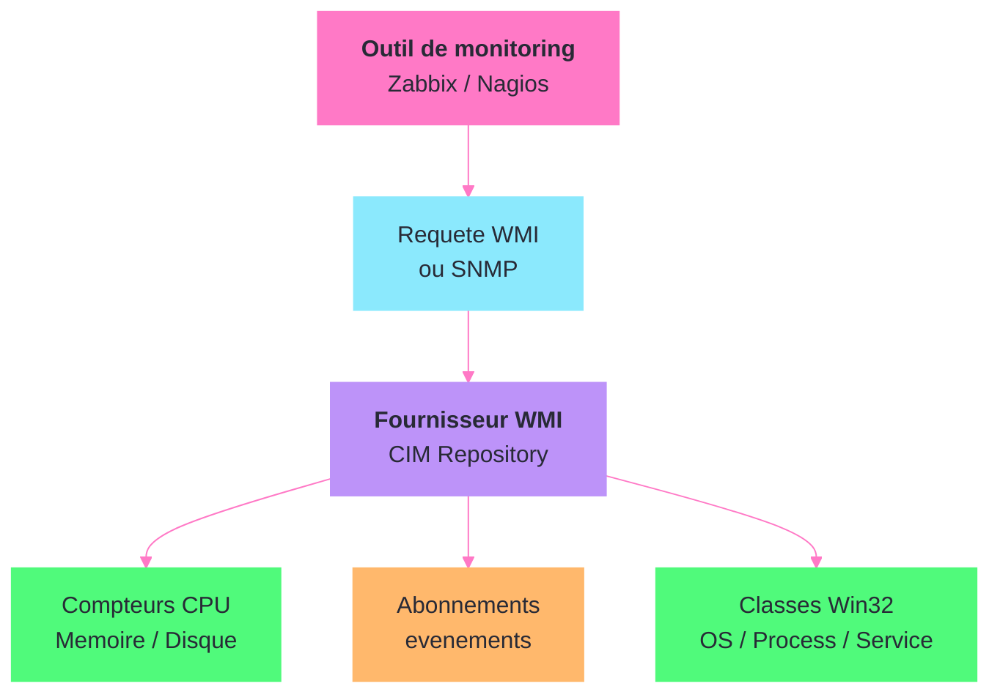
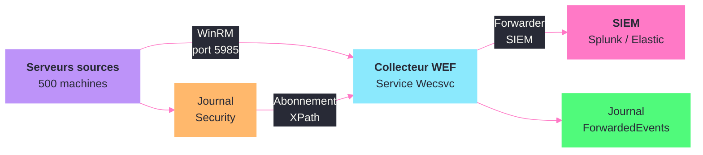

---
tags:
  - registre
  - backup
  - monitoring
  - veeam
  - zabbix
  - snmp
  - siem
---

# Backup et monitoring

!!! abstract "Ce que vous allez apprendre"
    - Localiser et configurer les cles de registre Veeam Agent et Veeam Backup
    - Gerer la configuration de Windows Server Backup via le registre
    - Configurer l'agent Zabbix 2 depuis le registre
    - Manipuler les parametres SNMP du service Windows natif
    - Exploiter les fournisseurs WMI pour le monitoring (compteurs de performance, abonnements d'evenements)
    - Configurer l'agent Nagios/NRPE via le registre
    - Deployer le Windows Event Forwarding (WEF) pour centraliser les journaux
    - Mettre en place la collecte d'evenements centralisee vers un SIEM

---

## Veeam Agent et Veeam Backup

Veeam est l'une des solutions de sauvegarde les plus deployees en environnement Windows. Les produits Veeam utilisent le registre pour stocker leurs parametres de configuration, les informations de licence et les options de performance.

### Cles principales Veeam Backup & Replication

```
HKLM\SOFTWARE\Veeam\Veeam Backup and Replication
```

| Valeur | Type | Description |
|--------|------|-------------|
| `CorePath` | REG_SZ | Repertoire d'installation |
| `SqlServerName` | REG_SZ | Instance SQL Server utilisee |
| `SqlDatabaseName` | REG_SZ | Nom de la base de donnees Veeam |
| `SqlLogin` | REG_SZ | Compte SQL (si authentification SQL) |
| `LogDirectory` | REG_SZ | Repertoire des journaux |

```powershell
# Check Veeam Backup & Replication installation
reg query "HKLM\SOFTWARE\Veeam\Veeam Backup and Replication" 2>$null
```

```title="Resultat attendu"
HKEY_LOCAL_MACHINE\SOFTWARE\Veeam\Veeam Backup and Replication
    CorePath          REG_SZ    C:\Program Files\Veeam\Backup and Replication\Backup\
    SqlServerName     REG_SZ    VEEAM-SRV\VEEAMSQL2016
    SqlDatabaseName   REG_SZ    VeeamBackup
    LogDirectory      REG_SZ    C:\ProgramData\Veeam\Backup\
```

### Parametres de performance

Veeam propose des cles de registre avancees pour optimiser les performances de sauvegarde. Ces valeurs ne sont pas exposees dans l'interface graphique.

```
HKLM\SOFTWARE\Veeam\Veeam Backup and Replication
```

| Valeur | Type | Description | Defaut |
|--------|------|-------------|--------|
| `MaxSnapshotsCount` | REG_DWORD | Nombre maximal de snapshots simultanees par datastore | 4 |
| `BackupCopyLookAheadInterval` | REG_DWORD | Intervalle de pre-lecture pour les Backup Copy Jobs (minutes) | 60 |
| `LoggingLevel` | REG_DWORD | Niveau de journalisation : `0`-`6` | 4 |
| `EnableSqlTempDbThrottling` | REG_DWORD | Active le throttling de la base TempDB | 0 |

```powershell
# Increase max simultaneous snapshots for VMware environments
Set-ItemProperty -Path "HKLM:\SOFTWARE\Veeam\Veeam Backup and Replication" `
    -Name "MaxSnapshotsCount" -Value 8 -Type DWord

# Set verbose logging for troubleshooting
Set-ItemProperty -Path "HKLM:\SOFTWARE\Veeam\Veeam Backup and Replication" `
    -Name "LoggingLevel" -Value 6 -Type DWord
```

```title="Resultat attendu"
Aucune sortie. Les modifications prennent effet au prochain demarrage du service Veeam Backup Service.
```

!!! warning "Redemarrer le service apres modification"
    Les parametres de performance necessitent un redemarrage du service `VeeamBackupSvc` pour prendre effet :
    ```powershell
    Restart-Service -Name "VeeamBackupSvc"
    ```

### Veeam Agent for Windows

L'agent Veeam pour les postes de travail et serveurs physiques utilise ses propres cles :

```
HKLM\SOFTWARE\Veeam\Veeam Agent for Microsoft Windows
```

| Valeur | Type | Description |
|--------|------|-------------|
| `InstallationPath` | REG_SZ | Repertoire d'installation de l'agent |
| `LicenseType` | REG_SZ | Type de licence (Free, Workstation, Server) |

```powershell
# Check Veeam Agent installation and license
$agentPath = "HKLM:\SOFTWARE\Veeam\Veeam Agent for Microsoft Windows"
if (Test-Path $agentPath) {
    Get-ItemProperty -Path $agentPath |
        Select-Object InstallationPath, LicenseType
} else {
    Write-Output "Veeam Agent is not installed"
}
```

```title="Resultat attendu"
InstallationPath                                      LicenseType
----------------                                      -----------
C:\Program Files\Veeam\Agent for Microsoft Windows\   Server
```

!!! info "En resume"
    - Veeam Backup & Replication stocke sa configuration sous `HKLM\SOFTWARE\Veeam\Veeam Backup and Replication`
    - Les parametres de performance avances (`MaxSnapshotsCount`, `LoggingLevel`) ne sont accessibles que via le registre
    - Veeam Agent for Windows utilise une cle separee sous `Veeam Agent for Microsoft Windows`
    - Tout changement de registre Veeam necessite un redemarrage du service correspondant

---

## Windows Server Backup

Windows Server Backup (wbadmin) est la solution de sauvegarde integree a Windows Server. Sa configuration registre est plus limitee que celle de Veeam, mais quelques cles sont utiles pour le depannage et la configuration avancee.

### Cles principales

```
HKLM\SOFTWARE\Microsoft\Windows\CurrentVersion\WindowsServerBackup
HKLM\SYSTEM\CurrentControlSet\Services\wbengine
```

### Service wbengine

Le service **Block Level Backup Engine** (`wbengine`) est le moteur de sauvegarde.

```
HKLM\SYSTEM\CurrentControlSet\Services\wbengine
```

| Valeur | Type | Description |
|--------|------|-------------|
| `Start` | REG_DWORD | `2` = automatique, `3` = manuel, `4` = desactive |
| `ImagePath` | REG_EXPAND_SZ | Chemin de l'executable |
| `DependOnService` | REG_MULTI_SZ | Services dont wbengine depend |

```powershell
# Check wbengine service status and configuration
Get-Service -Name wbengine | Select-Object Name, Status, StartType
```

```title="Resultat attendu"
Name     Status StartType
----     ------ ---------
wbengine Stopped    Manual
```

### Planification et historique

La planification des sauvegardes est geree par une tache planifiee (pas par le registre directement). L'historique est accessible via `wbadmin get versions`.

```powershell
# Check backup schedule and recent history
Get-ScheduledTask -TaskPath "\Microsoft\Windows\Backup\" -ErrorAction SilentlyContinue |
    Select-Object TaskName, State
wbadmin get versions 2>$null | Select-Object -First 5
```

```title="Resultat attendu"
TaskName                           State
--------                           -----
Microsoft-Windows-WindowsBackup    Ready

Version identifier: 04/03/2025-02:00
  Can recover: Volume(s), File(s), Application(s), Bare Metal Recovery, System State
```

### VSS et registre

Windows Server Backup depend de VSS. Les fournisseurs VSS sont enregistres sous `HKLM\SYSTEM\CurrentControlSet\Services\VSS\Providers`. Verifiez-les avec `vssadmin list providers`.

!!! info "En resume"
    - Windows Server Backup utilise le service `wbengine` (demarrage manuel par defaut)
    - La planification passe par les taches planifiees, pas par le registre
    - VSS est essentiel pour les sauvegardes : ses fournisseurs sont sous `Services\VSS\Providers`
    - `wbadmin get versions` affiche l'historique des sauvegardes

---

## Zabbix Agent 2

Zabbix Agent 2 est l'agent de monitoring nouvelle generation de Zabbix, ecrit en Go. Sur Windows, il s'installe comme service et stocke ses parametres dans le registre.

### Cles principales

```
HKLM\SOFTWARE\Zabbix SIA\Zabbix Agent 2
```

| Valeur | Type | Description |
|--------|------|-------------|
| `ConfigFile` | REG_SZ | Chemin du fichier de configuration |
| `InstallDir` | REG_SZ | Repertoire d'installation |
| `LogFile` | REG_SZ | Chemin du fichier journal |

```powershell
# Check Zabbix Agent 2 installation
reg query "HKLM\SOFTWARE\Zabbix SIA\Zabbix Agent 2" 2>$null
```

```title="Resultat attendu"
HKEY_LOCAL_MACHINE\SOFTWARE\Zabbix SIA\Zabbix Agent 2
    ConfigFile    REG_SZ    C:\Program Files\Zabbix Agent 2\zabbix_agent2.conf
    InstallDir    REG_SZ    C:\Program Files\Zabbix Agent 2\
    LogFile       REG_SZ    C:\Program Files\Zabbix Agent 2\zabbix_agent2.log
```

### Service Zabbix Agent 2

```
HKLM\SYSTEM\CurrentControlSet\Services\Zabbix Agent 2
```

| Valeur | Type | Description |
|--------|------|-------------|
| `Start` | REG_DWORD | `2` = automatique |
| `ImagePath` | REG_EXPAND_SZ | Chemin avec les parametres de lancement |
| `Description` | REG_SZ | Description du service |

```powershell
# Check Zabbix Agent 2 service
Get-Service -Name "Zabbix Agent 2" -ErrorAction SilentlyContinue |
    Select-Object Name, Status, StartType
```

```title="Resultat attendu"
Name            Status StartType
----            ------ ---------
Zabbix Agent 2  Running Automatic
```

### Configuration par le registre

Bien que la configuration principale soit dans le fichier `zabbix_agent2.conf`, certains parametres de deploiement sont passes via le registre lors de l'installation :

```powershell
# Deploy Zabbix Agent 2 with custom parameters via MSI
$msiArgs = @(
    "/i", "\\fileserver\deploy$\zabbix_agent2-7.0.0-windows-amd64.msi",
    "/qn",
    "SERVER=zabbix.corp.local",
    "SERVERACTIVE=zabbix.corp.local",
    "HOSTNAME=$env:COMPUTERNAME",
    "LISTENPORT=10050",
    "ENABLEPATH=1",
    "INSTALLFOLDER=`"C:\Program Files\Zabbix Agent 2`""
)
Start-Process "msiexec.exe" -ArgumentList $msiArgs -Wait -NoNewWindow
```

```title="Resultat attendu"
Aucune sortie. L'agent Zabbix 2 est installe et configure avec le serveur zabbix.corp.local.
```

### Verification de la connectivite

```powershell
# Test Zabbix agent connectivity from the server
# Run this on the Zabbix server or proxy
zabbix_get -s 10.0.1.50 -k "agent.version"
```

```title="Resultat attendu"
7.0.0
```

```powershell
# Check Zabbix Agent 2 log for errors
Get-Content "C:\Program Files\Zabbix Agent 2\zabbix_agent2.log" -Tail 20 |
    Select-String -Pattern "error|cannot|failed" -CaseSensitive:$false
```

```title="Resultat attendu"
Aucune sortie si tout fonctionne. Les erreurs de connexion au serveur ou de permissions apparaissent ici.
```

!!! info "En resume"
    - Zabbix Agent 2 stocke ses parametres d'installation sous `HKLM\SOFTWARE\Zabbix SIA\Zabbix Agent 2`
    - Le fichier `zabbix_agent2.conf` reste le point central de configuration
    - Le deploiement MSI accepte les parametres `SERVER`, `SERVERACTIVE` et `HOSTNAME`
    - Le service `Zabbix Agent 2` doit etre en demarrage automatique

---

## Service SNMP

Le service SNMP natif de Windows permet aux outils de monitoring de collecter des informations sur la machine. Sa configuration est entierement dans le registre.

### Cles principales

```
HKLM\SYSTEM\CurrentControlSet\Services\SNMP\Parameters
```

### Communautes SNMP

```
HKLM\SYSTEM\CurrentControlSet\Services\SNMP\Parameters\ValidCommunities
```

Chaque valeur represente un nom de communaute. Le type (REG_DWORD) definit le niveau d'acces.

| Valeur DWORD | Niveau d'acces |
|:------------:|----------------|
| `1` | NONE |
| `2` | NOTIFY |
| `4` | READ ONLY |
| `8` | READ WRITE |
| `16` | READ CREATE |

```powershell
# Configure SNMP community strings
$commPath = "HKLM:\SYSTEM\CurrentControlSet\Services\SNMP\Parameters\ValidCommunities"
if (-not (Test-Path $commPath)) {
    New-Item -Path $commPath -Force | Out-Null
}
# Set read-only community
Set-ItemProperty -Path $commPath -Name "monitoring-corp" -Value 4 -Type DWord
# Remove default "public" community if it exists
Remove-ItemProperty -Path $commPath -Name "public" -ErrorAction SilentlyContinue
```

```title="Resultat attendu"
Aucune sortie. La communaute "monitoring-corp" est configuree en lecture seule et "public" est supprimee.
```

### Hotes autorises

```
HKLM\SYSTEM\CurrentControlSet\Services\SNMP\Parameters\PermittedManagers
```

Chaque valeur numerotee (`1`, `2`, `3`...) contient l'adresse IP ou le nom d'hote d'un serveur de monitoring autorise.

```powershell
# Configure permitted SNMP managers
$mgrPath = "HKLM:\SYSTEM\CurrentControlSet\Services\SNMP\Parameters\PermittedManagers"
if (-not (Test-Path $mgrPath)) {
    New-Item -Path $mgrPath -Force | Out-Null
}
Set-ItemProperty -Path $mgrPath -Name "1" -Value "zabbix.corp.local" -Type String
Set-ItemProperty -Path $mgrPath -Name "2" -Value "nagios.corp.local" -Type String
```

```title="Resultat attendu"
Aucune sortie. Seuls zabbix.corp.local et nagios.corp.local peuvent interroger le service SNMP.
```

### Destinations de traps

```
HKLM\SYSTEM\CurrentControlSet\Services\SNMP\Parameters\TrapConfiguration
```

Sous chaque sous-cle (nommee d'apres la communaute), les valeurs numerotees definissent les destinations des traps SNMP.

```powershell
# Configure SNMP trap destinations
$trapPath = "HKLM:\SYSTEM\CurrentControlSet\Services\SNMP\Parameters\TrapConfiguration\monitoring-corp"
New-Item -Path $trapPath -Force | Out-Null
Set-ItemProperty -Path $trapPath -Name "1" -Value "zabbix.corp.local" -Type String
```

```title="Resultat attendu"
Aucune sortie. Les traps SNMP seront envoyes a zabbix.corp.local avec la communaute "monitoring-corp".
```

### Informations de contact et localisation

Les informations RFC 1156 (`sysContact`, `sysLocation`, `sysServices`) sont sous `HKLM\SYSTEM\CurrentControlSet\Services\SNMP\Parameters\RFC1156Agent`.

```powershell
# Set SNMP contact/location and restart service
$rfcPath = "HKLM:\SYSTEM\CurrentControlSet\Services\SNMP\Parameters\RFC1156Agent"
Set-ItemProperty -Path $rfcPath -Name "sysContact" -Value "infra@corp.local" -Type String
Set-ItemProperty -Path $rfcPath -Name "sysLocation" -Value "Datacenter Paris - Rack A12" -Type String
Restart-Service -Name "SNMP"
```

```title="Resultat attendu"
Aucune sortie. Les informations de contact sont actives apres le redemarrage du service.
```

!!! danger "Securite SNMP"
    N'utilisez jamais la communaute par defaut `public` en production. Preferez SNMPv3 avec authentification et chiffrement quand c'est possible. Si vous devez rester en SNMPv2c, utilisez un nom de communaute complexe et restreignez les `PermittedManagers`.

!!! info "En resume"
    - Les communautes SNMP sont sous `Parameters\ValidCommunities` avec un niveau d'acces en DWORD
    - Les hotes autorises sont sous `Parameters\PermittedManagers`
    - Les traps sont configures sous `Parameters\TrapConfiguration\<communaute>`
    - Supprimez la communaute `public` et restreignez les managers autorises

---

## Fournisseurs WMI et compteurs de performance



WMI (Windows Management Instrumentation) est le socle du monitoring Windows. Les outils de supervision interrogent les classes WMI pour collecter des metriques. Les fournisseurs WMI et les compteurs de performance sont references dans le registre.

### Fournisseurs WMI

La configuration WMI est sous `HKLM\SOFTWARE\Microsoft\Wbem\CIMOM`. Verifiez la coherence du repository avec `winmgmt /verifyrepository`. Les fournisseurs enregistres sont listables via `Get-CimInstance -ClassName __Win32Provider`.

### Compteurs de performance

Les compteurs sont enregistres sous `HKLM\SOFTWARE\Microsoft\Windows NT\CurrentVersion\Perflib` et par service sous `HKLM\SYSTEM\CurrentControlSet\Services\<NomService>\Performance`.

```powershell
# Query key performance counters for monitoring
$counters = @(
    "\Processor(_Total)\% Processor Time",
    "\Memory\Available MBytes",
    "\PhysicalDisk(_Total)\Avg. Disk Queue Length"
)
Get-Counter -Counter $counters -SampleInterval 2 -MaxSamples 1 |
    Select-Object -ExpandProperty CounterSamples |
    Select-Object Path, CookedValue
```

```title="Resultat attendu"
Path                                                      CookedValue
----                                                      -----------
\\workstation01\processor(_total)\% processor time        12.345
\\workstation01\memory\available mbytes                   8192
\\workstation01\physicaldisk(_total)\avg. disk queue length 0.002
```

### Abonnements WMI permanents

Les abonnements WMI permanents declenchent des actions sur des evenements systeme. Leurs fournisseurs sont sous `HKLM\SOFTWARE\Microsoft\Wbem\ESS`.

```powershell
# Audit permanent WMI event subscriptions (security concern)
Get-CimInstance -Namespace "root\subscription" -ClassName __EventFilter -ErrorAction SilentlyContinue |
    Select-Object Name, Query
```

```title="Resultat attendu"
Name                            Query
----                            -----
SCM Event Log Filter            SELECT * FROM MSFT_SCMEventLogEvent
```

!!! warning "Abonnements WMI et securite"
    Les abonnements WMI permanents sont une technique courante de persistance pour les malwares. Auditez regulierement avec la commande ci-dessus. Tout abonnement inconnu doit etre investigue.

!!! info "En resume"
    - Les fournisseurs WMI sont sous `HKLM\SOFTWARE\Microsoft\Wbem\CIMOM`
    - Les compteurs de performance sont par service sous `Services\<Nom>\Performance`
    - `Get-Counter` collecte les metriques en temps reel
    - Les abonnements WMI permanents doivent etre audites regulierement

---

## Nagios/NRPE Agent

NSClient++ est l'agent le plus utilise pour integrer Windows dans un environnement Nagios/Icinga. Ses cles de registre sont sous `HKLM\SOFTWARE\NSClient++` (`InstallPath`, `ConfigFile`) et le service `nscp` est sous `HKLM\SYSTEM\CurrentControlSet\Services\nscp`.

```powershell
# Check NSClient++ installation and service
reg query "HKLM\SOFTWARE\NSClient++" 2>$null
Get-Service -Name "nscp" -ErrorAction SilentlyContinue | Select-Object Name, Status, StartType
```

```title="Resultat attendu"
HKEY_LOCAL_MACHINE\SOFTWARE\NSClient++
    InstallPath    REG_SZ    C:\Program Files\NSClient++\
    ConfigFile     REG_SZ    C:\Program Files\NSClient++\nsclient.ini

Name Status  StartType
---- ------  ---------
nscp Running Automatic
```

### Deploiement automatise

```powershell
# Silent installation of NSClient++ with NRPE enabled
$msiArgs = @(
    "/i", "\\fileserver\deploy$\NSCP-0.5.2-x64.msi",
    "/qn",
    "ALLOWED_HOSTS=nagios.corp.local,icinga.corp.local",
    "PASSWORD=SecureMonitoringKey2025",
    "CONF_NRPE=1", "CONF_NSCA=0", "CONF_WEB=0", "NRPEMODE=LEGACY"
)
Start-Process "msiexec.exe" -ArgumentList $msiArgs -Wait -NoNewWindow
```

```title="Resultat attendu"
Aucune sortie. NSClient++ est installe avec NRPE active et les hotes autorises configures.
```

!!! info "En resume"
    - NSClient++ stocke son chemin et sa configuration sous `HKLM\SOFTWARE\NSClient++`
    - Le deploiement MSI supporte les parametres `ALLOWED_HOSTS` et `PASSWORD`
    - NRPE ecoute sur le port 5666 par defaut

---

## Windows Event Forwarding (WEF)



Windows Event Forwarding permet de centraliser les journaux d'evenements de multiples machines vers un collecteur. C'est une fonctionnalite native de Windows, sans agent supplementaire.

### Architecture

WEF fonctionne en mode **source-initiated** (push) ou **collector-initiated** (pull). Le mode source-initiated est recommande pour les grands parcs : chaque machine envoie ses evenements au collecteur.

| Composant | Role |
|-----------|------|
| Source (client) | Envoie les evenements via WinRM |
| Collecteur (serveur) | Recoit et stocke les evenements |
| Abonnement | Definit quels evenements collecter |

### Configuration du collecteur

```
HKLM\SOFTWARE\Policies\Microsoft\Windows\EventLog\EventForwarding\SubscriptionManager
```

Sur le serveur collecteur, activez le service collecteur d'evenements :

```powershell
# Enable the Windows Event Collector service
wecutil qc /q
```

```title="Resultat attendu"
Windows Event Collector service is already configured.
```

```powershell
# Verify WEC service status
Get-Service -Name Wecsvc | Select-Object Name, Status, StartType
```

```title="Resultat attendu"
Name   Status  StartType
----   ------  ---------
Wecsvc Running Automatic
```

### Configuration des sources (clients)

Sur chaque machine source, configurez WinRM et le serveur de collecte :

```
HKLM\SOFTWARE\Policies\Microsoft\Windows\EventLog\EventForwarding\SubscriptionManager
```

| Valeur | Type | Description |
|--------|------|-------------|
| `1` | REG_SZ | URL du collecteur avec options de livraison |

Le format de la valeur est :

```
Server=https://<collecteur>:5986/wsman/SubscriptionManager/WEC,Refresh=<intervalle>
```

```powershell
# Configure event forwarding subscription manager via registry
$wefPath = "HKLM:\SOFTWARE\Policies\Microsoft\Windows\EventLog\EventForwarding\SubscriptionManager"
New-Item -Path $wefPath -Force | Out-Null
Set-ItemProperty -Path $wefPath -Name "1" `
    -Value "Server=https://wec.corp.local:5986/wsman/SubscriptionManager/WEC,Refresh=60" `
    -Type String
```

```title="Resultat attendu"
Aucune sortie. La machine enverra ses evenements au collecteur wec.corp.local toutes les 60 secondes.
```

### WinRM sur les sources

```powershell
# Enable and configure WinRM on source machines
winrm quickconfig /q

# Verify WinRM listener
winrm enumerate winrm/config/listener
```

```title="Resultat attendu"
Listener
    Address = *
    Transport = HTTP
    Port = 5985
    Hostname
    Enabled = true
    URLPrefix = wsman
    CertificateThumbprint
```

### Creer un abonnement et deployer via GPO

Les abonnements sont definis en XML et importes avec `wecutil cs fichier.xml`. Les parametres essentiels : `SubscriptionType` (SourceInitiated), `Query` (filtre XPath sur les EventID), `MaxLatencyTime` (delai maximal de livraison). Un exemple complet est presente dans le scenario ci-dessous.

Pour deployer la configuration WEF sur les sources via GPO : **Configuration ordinateur** > **Modeles d'administration** > **Composants Windows** > **Transfert d'evenements** > **Configurer le Gestionnaire d'abonnements cible**. La GPO ecrit la cle `SubscriptionManager`.

!!! info "En resume"
    - WEF est natif a Windows : pas d'agent supplementaire a installer
    - Le collecteur utilise le service `Wecsvc` et la commande `wecutil`
    - Les sources sont configurees via `SubscriptionManager` dans le registre (ou via GPO)
    - WinRM doit etre active sur toutes les sources

---

## Scenario : centraliser les evenements de 500 serveurs vers un SIEM

### Contexte

L'equipe SOC (Security Operations Center) doit centraliser les evenements de securite de 500 serveurs Windows vers un SIEM (Splunk, Elastic, QRadar). L'architecture retenue utilise WEF comme premiere couche de collecte, puis un forwarder SIEM sur le collecteur WEF.

### Architecture cible

```
500 serveurs sources ──WinRM──> Collecteur WEF ──Forwarder──> SIEM
                                (Windows Server)              (Splunk/Elastic)
```

### Etape 1 : preparer le collecteur WEF

```powershell
# Configure WEF collector server
# Run on the designated WEF collector

# Enable WEC service
wecutil qc /q

# Increase the Forwarded Events log size (default 20 MB is too small)
$logPath = "HKLM:\SYSTEM\CurrentControlSet\Services\EventLog\ForwardedEvents"
Set-ItemProperty -Path $logPath -Name "MaxSize" -Value 4294967296 -Type DWord  # 4 GB
Set-ItemProperty -Path $logPath -Name "Retention" -Value 0 -Type DWord         # Overwrite as needed

# Verify the configuration
Get-ItemProperty -Path $logPath | Select-Object MaxSize, Retention
```

```title="Resultat attendu"
MaxSize   Retention
-------   ---------
4294967296         0
```

### Etape 2 : creer les abonnements specialises

Trois abonnements couvrent les besoins du SOC. Voici le premier (authentification) en detail ; les deux autres suivent la meme structure XML avec des filtres differents.

```powershell
# Subscription 1: Authentication events
$authXml = @"
<Subscription xmlns="http://schemas.microsoft.com/2006/03/windows/events/subscription">
    <SubscriptionId>Auth-Events</SubscriptionId>
    <SubscriptionType>SourceInitiated</SubscriptionType>
    <Description>Authentication events from all servers</Description>
    <Enabled>true</Enabled>
    <Uri>http://schemas.microsoft.com/wbem/wsman/1/windows/EventLog</Uri>
    <ConfigurationMode>Custom</ConfigurationMode>
    <Delivery Mode="Push">
        <Batching><MaxLatencyTime>300000</MaxLatencyTime></Batching>
    </Delivery>
    <Query><![CDATA[
        <QueryList><Query Id="0" Path="Security">
            <Select Path="Security">*[System[(EventID=4624 or EventID=4625 or EventID=4648 or EventID=4672 or EventID=4768 or EventID=4771 or EventID=4776)]]</Select>
        </Query></QueryList>
    ]]></Query>
    <ReadExistingEvents>false</ReadExistingEvents>
    <TransportName>HTTP</TransportName>
    <AllowedSourceDomainComputers>O:NSG:BAD:P(A;;GA;;;DC)S:</AllowedSourceDomainComputers>
</Subscription>
"@
$authXml | Out-File "C:\WEF\Auth-Events.xml" -Encoding UTF8
wecutil cs "C:\WEF\Auth-Events.xml"
```

```title="Resultat attendu"
Aucune sortie si l'abonnement est cree avec succes.
```

Les deux abonnements suivants reprennent la meme structure. Seuls le `SubscriptionId` et le filtre XPath changent :

| Abonnement | SubscriptionId | Filtre XPath (Security) |
|-----------|----------------|-------------------------|
| Gestion des comptes | `Account-Mgmt` | `EventID=4720 or 4722 or 4724 or 4726 or 4732 or 4756 or 4757` |
| Evenements critiques | `Critical-System` | Journaux System et Application : `Level=1 or Level=2` |

```powershell
# Create all three subscriptions and verify
foreach ($sub in @("Auth-Events", "Account-Mgmt", "Critical-System")) {
    wecutil cs "C:\WEF\$sub.xml"
}
Write-Output "All subscriptions created successfully."
```

```title="Resultat attendu"
All subscriptions created successfully.
```

### Etape 3 : deployer la configuration source via GPO

Deployez un script de demarrage GPO sur l'OU des 500 serveurs. Le script configure le `SubscriptionManager`, active WinRM et ouvre le pare-feu :

```powershell
# GPO startup script: configure WEF source on each server
$wefPath = "HKLM:\SOFTWARE\Policies\Microsoft\Windows\EventLog\EventForwarding\SubscriptionManager"
New-Item -Path $wefPath -Force | Out-Null
Set-ItemProperty -Path $wefPath -Name "1" `
    -Value "Server=https://wec.corp.local:5986/wsman/SubscriptionManager/WEC,Refresh=60" `
    -Type String

# Enable WinRM and open firewall
Set-Service -Name WinRM -StartupType Automatic
Start-Service -Name WinRM -ErrorAction SilentlyContinue
if (-not (Get-NetFirewallRule -Name "WINRM-HTTP-In-TCP" -ErrorAction SilentlyContinue)) {
    New-NetFirewallRule -Name "WINRM-HTTP-In-TCP" `
        -DisplayName "Windows Remote Management (HTTP-In)" `
        -Protocol TCP -LocalPort 5985 -Action Allow -Profile Domain
}
Write-Output "WEF source configured on $env:COMPUTERNAME"
```

```title="Resultat attendu"
WEF source configured on SERVER042
```

### Etape 4 : surveiller la sante et connecter le SIEM

```powershell
# Monitor WEF subscription health on the collector
foreach ($sub in @("Auth-Events", "Account-Mgmt", "Critical-System")) {
    $runtime = wecutil gr $sub 2>&1
    $sourceCount = ($runtime | Select-String -Pattern "RunTimeStatus").Count
    Write-Output "$sub : $sourceCount sources actives"
}

# Check ForwardedEvents log size
$log = Get-WinEvent -ListLog "ForwardedEvents"
Write-Output "Journal: $([math]::Round($log.FileSize / 1MB, 2)) MB / $([math]::Round($log.MaximumSizeInBytes / 1MB, 2)) MB"
```

```title="Resultat attendu"
Auth-Events : 487 sources actives
Account-Mgmt : 492 sources actives
Critical-System : 489 sources actives
Journal: 1245.67 MB / 4096.00 MB
```

Le forwarder SIEM (Splunk Universal Forwarder, Elastic Winlogbeat, etc.) lit le journal `ForwardedEvents` sur le collecteur et l'envoie au SIEM. Exemple Splunk :

```
# inputs.conf on the WEF collector
[WinEventLog://ForwardedEvents]
disabled = 0
index = wineventlog
sourcetype = WinEventLog:ForwardedEvents
renderXml = true
```

### EventID essentiels pour le SOC

| EventID | Description | Interet |
|:-------:|-------------|---------|
| 4624/4625 | Ouverture/echec de session | Brute force, cartographie |
| 4648 | Identifiants explicites | Lateral movement |
| 4672 | Privileges speciaux | Comptes privilegies |
| 4720/4726 | Creation/suppression de compte | Comptes rogue |
| 4732/4756 | Ajout a un groupe | Escalade de privileges |
| 4768/4771 | TGT Kerberos / Pre-auth echouee | Kerberoasting |

!!! danger "Dimensionnement du collecteur"
    Pour 500 serveurs : minimum 16 Go RAM, 4 vCPU, stockage SSD. Journal `ForwardedEvents` dimensionne a 4-16 Go.

!!! info "En resume"
    - Architecture : sources (500 serveurs) > collecteur WEF > forwarder SIEM
    - Les abonnements filtrent par EventID pour eviter la surcharge
    - Le forwarder SIEM lit le journal `ForwardedEvents` sur le collecteur
