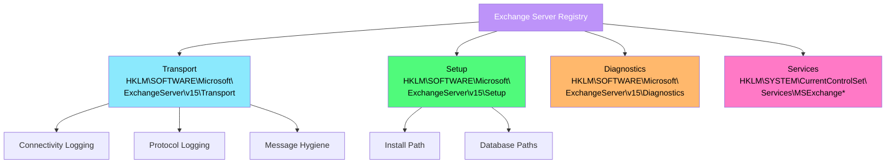

---
tags:
  - registre
  - exchange
  - messagerie
  - transport
  - owa
  - tls
---

# Exchange Server

!!! abstract "Ce que vous allez apprendre"
    - Configurer le transport Exchange Server via les cles de registre (HKLM\SOFTWARE\Microsoft\ExchangeServer\v15\Transport)
    - Gerer les repertoires virtuels OWA et ECP dans le registre
    - Localiser et modifier les chemins des bases de donnees et journaux de transactions
    - Identifier les cles specifiques aux serveurs Edge Transport
    - Configurer les parametres anti-spam et d'hygiene des messages
    - Activer et exploiter la journalisation de connectivite et de protocole
    - Gerer les certificats et les parametres TLS pour le flux de messagerie
    - Diagnostiquer des problemes de flux de courrier par analyse du registre

---

## Architecture registre d'Exchange Server

Exchange Server 2016/2019 stocke une partie significative de sa configuration dans le registre Windows. Bien que la majorite des parametres applicatifs soient geres via l'Exchange Management Shell (EMS) et la base de donnees Active Directory, le registre reste le point de controle pour le transport, les chemins systeme, les parametres de performance et les options de depannage non exposees dans l'interface.



### Cle racine Exchange

```
HKLM\SOFTWARE\Microsoft\ExchangeServer\v15
```

| Sous-cle | Description |
|----------|-------------|
| `Setup` | Informations d'installation (chemin, version, roles) |
| `Transport` | Configuration du pipeline de transport |
| `Diagnostics` | Niveaux de journalisation par composant |
| `Search` | Configuration du service de recherche |

```powershell
# Check Exchange Server installation details
$setupPath = "HKLM:\SOFTWARE\Microsoft\ExchangeServer\v15\Setup"
Get-ItemProperty $setupPath |
    Select-Object MsiInstallPath, MsiProductMajor, MsiProductMinor, MsiBuildMajor, MsiBuildMinor
```

```title="Resultat attendu"
MsiInstallPath  : C:\Program Files\Microsoft\Exchange Server\V15\
MsiProductMajor : 15
MsiProductMinor : 2
MsiBuildMajor   : 1544
MsiBuildMinor   : 4
```

### Identifier les roles installes

```powershell
# Determine which Exchange roles are installed on modern versions
$setupPath = "HKLM:\SOFTWARE\Microsoft\ExchangeServer\v15\Setup"
$roles = @("MBXRoleIsInstalled", "EdgeRoleIsInstalled")

foreach ($role in $roles) {
    $val = Get-ItemProperty $setupPath -Name $role -ErrorAction SilentlyContinue
    if ($val.$role -eq 1) {
        Write-Output "$role : Installed"
    } else {
        Write-Output "$role : Not installed"
    }
}
```

```title="Resultat attendu"
MBXRoleIsInstalled : Installed
EdgeRoleIsInstalled : Not installed
```

!!! note "Exchange 2016+"
    Depuis Exchange 2016, le role **Client Access Server (CAS)** n'existe plus comme role separe : ses fonctions sont integrees au role **Mailbox**. Si vous croisez encore `CASRoleIsInstalled` dans d'anciens scripts ou sorties historiques, traitez-le comme un vestige de compatibilite, pas comme un role deployable independamment.

!!! info "En resume"
    - La configuration Exchange est sous `HKLM\SOFTWARE\Microsoft\ExchangeServer\v15`
    - La sous-cle `Setup` contient le chemin d'installation, la version et les roles deployes
    - Exchange 2016/2019 combinent les roles Mailbox et CAS sur le meme serveur
    - Le role Edge Transport est installe sur un serveur dedie en DMZ

---

## Configuration du transport

Le pipeline de transport est le coeur du flux de messagerie Exchange. Sa configuration registre controle le comportement des files d'attente, les seuils de performance et les options de routage.

### Cles principales du transport

```
HKLM\SOFTWARE\Microsoft\ExchangeServer\v15\Transport
```

| Valeur | Type | Description | Defaut |
|--------|------|-------------|--------|
| `QueueDatabasePath` | REG_SZ | Chemin de la base de donnees des files d'attente | `%ExchangeInstallPath%TransportRoles\data\Queue` |
| `QueueDatabaseLoggingPath` | REG_SZ | Chemin des journaux de la base Queue | Meme repertoire |
| `TemporaryStoragePath` | REG_SZ | Stockage temporaire pendant le traitement | `%ExchangeInstallPath%TransportRoles\data\Temp` |
| `MaxConcurrentMailboxDeliveries` | REG_DWORD | Livraisons simultanees vers les boites aux lettres | 20 |
| `MaxConcurrentMailboxSubmissions` | REG_DWORD | Soumissions simultanees depuis les boites | 20 |

```powershell
# Read transport configuration from registry
$transportPath = "HKLM:\SOFTWARE\Microsoft\ExchangeServer\v15\Transport"
Get-ItemProperty $transportPath |
    Select-Object QueueDatabasePath, QueueDatabaseLoggingPath, TemporaryStoragePath
```

```title="Resultat attendu"
QueueDatabasePath        : C:\Program Files\Microsoft\Exchange Server\V15\TransportRoles\data\Queue
QueueDatabaseLoggingPath : C:\Program Files\Microsoft\Exchange Server\V15\TransportRoles\data\Queue
TemporaryStoragePath     : C:\Program Files\Microsoft\Exchange Server\V15\TransportRoles\data\Temp
```

### Deplacer la base de donnees des files d'attente

Pour les serveurs a fort trafic, deplacer la base Queue sur un disque SSD dedie ameliore significativement les performances de transport.

```powershell
# Move queue database to a dedicated SSD volume
$transportPath = "HKLM:\SOFTWARE\Microsoft\ExchangeServer\v15\Transport"
$newQueuePath = "D:\ExchangeQueue\Data"
$newQueueLogPath = "D:\ExchangeQueue\Logs"

# Create target directories
New-Item -Path $newQueuePath -ItemType Directory -Force | Out-Null
New-Item -Path $newQueueLogPath -ItemType Directory -Force | Out-Null

# Update registry
Set-ItemProperty -Path $transportPath -Name "QueueDatabasePath" -Value $newQueuePath -Type String
Set-ItemProperty -Path $transportPath -Name "QueueDatabaseLoggingPath" -Value $newQueueLogPath -Type String

# Restart the transport service
Restart-Service MSExchangeTransport
```

```title="Resultat attendu"
Aucune sortie. Le service de transport redemarrera avec les nouveaux chemins.
```

!!! warning "Arret du flux de messagerie"
    Le redemarrage du service `MSExchangeTransport` interrompt temporairement le traitement des messages. Planifiez cette operation en dehors des heures de pointe.

### Parametres de Back Pressure

Le mecanisme de Back Pressure protege Exchange contre la surcharge en ralentissant ou en refusant les messages entrants quand les ressources sont insuffisantes.

```
HKLM\SOFTWARE\Microsoft\ExchangeServer\v15\Transport\ResourceManager
```

| Valeur | Type | Description |
|--------|------|-------------|
| `DatabaseUsedSpace[%ExchangeInstallPath%TransportRoles\data\Queue\mail.que]` | REG_SZ | Seuils d'utilisation disque pour la base Queue |
| `PrivateBytes` | REG_SZ | Seuils de memoire privee du processus EdgeTransport.exe |
| `VersionBuckets` | REG_SZ | Seuils de buckets de version JET |

```powershell
# Check current back pressure state
Get-ExchangeDiagnosticInfo -Process EdgeTransport -Component ResourceThrottling |
    Select-Object -ExpandProperty Diagnostics
```

```title="Resultat attendu"
ResourceUtilization : Normal
DatabaseUsedSpace   : Normal (15% used)
PrivateBytes        : Normal (1.2 GB / 4 GB)
```

!!! info "En resume"
    - Le transport Exchange stocke ses chemins de base Queue et fichiers temporaires dans le registre
    - Deplacer `QueueDatabasePath` sur un SSD dedie ameliore les performances de transport
    - Le mecanisme de Back Pressure protege le serveur contre la surcharge
    - Tout changement de chemin necessite un redemarrage du service `MSExchangeTransport`

---

## Repertoires virtuels OWA et ECP

Outlook Web App (OWA) et Exchange Control Panel (ECP) sont les interfaces web d'Exchange. Leurs parametres registre controlent les chemins physiques, les options d'authentification et les parametres de performance.

### Cles registre OWA

```
HKLM\SOFTWARE\Microsoft\ExchangeServer\v15\OwaVDir
```

Les proprietes detaillees des repertoires virtuels sont dans la configuration IIS (`applicationHost.config`), mais le registre stocke les surcharges et parametres avances.

```powershell
# Check OWA virtual directory configuration via Exchange cmdlet
Get-OwaVirtualDirectory -Server (hostname) |
    Select-Object Name, InternalUrl, ExternalUrl, FormsAuthentication
```

```title="Resultat attendu"
Name                InternalUrl                              ExternalUrl                              FormsAuthentication
----                -----------                              -----------                              -------------------
owa (Default Web... https://mail.corp.local/owa               https://mail.corp.com/owa                True
```

### Parametres d'authentification dans le registre

Le mode d'authentification OWA est stocke dans le registre IIS et dans la configuration Exchange. Pour forcer l'authentification par formulaire :

```powershell
# Verify OWA authentication settings in IIS
$owaSitePath = "IIS:\Sites\Default Web Site\owa"
Get-WebConfigurationProperty -Filter "system.webServer/security/authentication/windowsAuthentication" `
    -PSPath $owaSitePath -Name "enabled"
Get-WebConfigurationProperty -Filter "system.webServer/security/authentication/basicAuthentication" `
    -PSPath $owaSitePath -Name "enabled"
```

```title="Resultat attendu"
False
False
```

### Parametres de performance OWA

```
HKLM\SOFTWARE\Microsoft\ExchangeServer\v15\OwaVDir\<guid>
```

| Valeur | Type | Description |
|--------|------|-------------|
| `LogonPagePublicPrivateSelectionEnabled` | REG_DWORD | Afficher le choix public/prive sur la page de connexion |
| `RedirectToOptimalOWAServer` | REG_DWORD | Rediriger vers le serveur CAS optimal |
| `InstantMessagingEnabled` | REG_DWORD | Activer la messagerie instantanee dans OWA |

### Configuration ECP

```powershell
# Check ECP virtual directory
Get-EcpVirtualDirectory -Server (hostname) |
    Select-Object Name, InternalUrl, ExternalUrl
```

```title="Resultat attendu"
Name                InternalUrl                              ExternalUrl
----                -----------                              -----------
ecp (Default Web... https://mail.corp.local/ecp               https://mail.corp.com/ecp
```

!!! info "En resume"
    - OWA et ECP sont configures via les repertoires virtuels IIS et les cmdlets Exchange
    - Le registre stocke les surcharges de configuration et les parametres avances
    - L'authentification OWA est geree dans la configuration IIS du site
    - `Get-OwaVirtualDirectory` et `Get-EcpVirtualDirectory` sont les cmdlets de reference

---

## Bases de donnees et chemins des journaux

Les bases de donnees de boites aux lettres et leurs journaux de transactions constituent le stockage critique d'Exchange. Le registre reference les chemins configures lors de la creation de chaque base.

### Cles de base de donnees

```
HKLM\SOFTWARE\Microsoft\ExchangeServer\v15\Replay\State\<GUID>
```

Chaque base de donnees a un GUID unique. Les chemins sont egalement stockes dans Active Directory, mais le registre local est utilise au demarrage du service.

```powershell
# List all mailbox databases with their paths
Get-MailboxDatabase -Server (hostname) -Status |
    Select-Object Name, EdbFilePath, LogFolderPath, DatabaseSize, AvailableNewMailboxSpace
```

```title="Resultat attendu"
Name             EdbFilePath                               LogFolderPath                  DatabaseSize       AvailableNewMailboxSpace
----             -----------                               -------------                  ------------       ------------------------
MBX-DB01         D:\ExchangeDatabases\MBX-DB01\MBX-DB01.edb D:\ExchangeDatabases\MBX-DB01\Logs 85.25 GB (...)   12.34 GB (...)
MBX-DB02         D:\ExchangeDatabases\MBX-DB02\MBX-DB02.edb D:\ExchangeDatabases\MBX-DB02\Logs 62.18 GB (...)   8.56 GB (...)
```

### Verifier les chemins dans le registre

```powershell
# Read database paths from registry (used at service startup)
$replayPath = "HKLM:\SOFTWARE\Microsoft\ExchangeServer\v15\Replay\State"
Get-ChildItem $replayPath -ErrorAction SilentlyContinue |
    ForEach-Object {
        $props = Get-ItemProperty $_.PSPath
        [PSCustomObject]@{
            DatabaseGuid  = $_.PSChildName
            DatabasePath  = $props.DatabasePath
            LogPath       = $props.LogPath
            SystemPath    = $props.SystemPath
        }
    }
```

```title="Resultat attendu"
DatabaseGuid                         DatabasePath                                      LogPath                                  SystemPath
------------                         ------------                                      -------                                  ----------
a1b2c3d4-e5f6-7890-abcd-ef1234567890 D:\ExchangeDatabases\MBX-DB01\MBX-DB01.edb       D:\ExchangeDatabases\MBX-DB01\Logs       D:\ExchangeDatabases\MBX-DB01\Logs
```

### Recommandations de placement

| Composant | Disque recommande | IOPS typiques |
|-----------|-------------------|:-------------:|
| Base de donnees (.edb) | SSD dedie, RAID 10 | 50-100 par boite |
| Journaux de transactions (.log) | SSD dedie, separe du .edb | 10-20 par boite |
| Base Queue (transport) | SSD dedie | Variable |
| Systeme d'exploitation | SSD systeme | Standard |

```powershell
# Verify disk performance for Exchange database volumes
Get-Counter -Counter "\PhysicalDisk(1 D:)\Avg. Disk sec/Read", `
    "\PhysicalDisk(1 D:)\Avg. Disk sec/Write" -SampleInterval 5 -MaxSamples 3 |
    Select-Object -ExpandProperty CounterSamples |
    Select-Object Path, CookedValue
```

```title="Resultat attendu"
Path                                               CookedValue
----                                               -----------
\\exch01\physicaldisk(1 d:)\avg. disk sec/read     0.00045
\\exch01\physicaldisk(1 d:)\avg. disk sec/write    0.00082
```

!!! tip "Seuils de latence disque"
    Pour Exchange : latence lecture < 20 ms, latence ecriture < 10 ms. Au-dela, les utilisateurs Outlook ressentiront des lenteurs.

!!! info "En resume"
    - Chaque base de donnees a un GUID unique avec ses chemins dans le registre sous `Replay\State`
    - Les fichiers .edb et les journaux de transactions doivent etre sur des volumes SSD separes
    - `Get-MailboxDatabase -Status` est la commande principale pour auditer les bases
    - Les latences disque doivent rester sous 20 ms en lecture et 10 ms en ecriture

---

## Edge Transport Server

Le serveur Edge Transport est deploye en DMZ pour filtrer le courrier entrant avant qu'il n'atteigne les serveurs Mailbox internes. Sa configuration registre est specifique car il n'est pas joint au domaine Active Directory.

### Cles specifiques Edge Transport

```
HKLM\SOFTWARE\Microsoft\ExchangeServer\v15\EdgeTransportRole
```

| Valeur | Type | Description |
|--------|------|-------------|
| `AdamLdapPort` | REG_DWORD | Port LDAP de l'instance AD LDS (ADAM) | 
| `AdamSslPort` | REG_DWORD | Port LDAPS de l'instance AD LDS |
| `ConfigDCHostName` | REG_SZ | Nom d'hote du serveur Mailbox pour EdgeSync |

```powershell
# Check Edge Transport specific registry keys
$edgePath = "HKLM:\SOFTWARE\Microsoft\ExchangeServer\v15\EdgeTransportRole"
Get-ItemProperty $edgePath -ErrorAction SilentlyContinue |
    Select-Object AdamLdapPort, AdamSslPort, ConfigDCHostName
```

```title="Resultat attendu"
AdamLdapPort   : 50389
AdamSslPort    : 50636
ConfigDCHostName : exch-mbx01.corp.local
```

### Service EdgeSync

EdgeSync synchronise les donnees de destinataires et de configuration entre les serveurs Mailbox internes et le serveur Edge Transport. La synchronisation utilise AD LDS (Active Directory Lightweight Directory Services) sur le serveur Edge.

```powershell
# Verify EdgeSync subscription status
Get-EdgeSubscription | Select-Object Name, Domain, EffectiveDate, Duration, Status
```

```title="Resultat attendu"
Name          Domain         EffectiveDate        Duration       Status
----          ------         -------------        --------       ------
EDGE01        corp.local     04/01/2026 08:00:00  365.00:00:00   Normal
```

### Instance AD LDS (ADAM)

```
HKLM\SYSTEM\CurrentControlSet\Services\ADAM_MSExchange
```

| Valeur | Type | Description |
|--------|------|-------------|
| `Start` | REG_DWORD | `2` = automatique |
| `ImagePath` | REG_EXPAND_SZ | Chemin de l'executable AD LDS |
| `DependOnService` | REG_MULTI_SZ | Services requis |

```powershell
# Check AD LDS instance for Edge Transport
Get-Service ADAM_MSExchange -ErrorAction SilentlyContinue |
    Select-Object Name, Status, StartType
```

```title="Resultat attendu"
Name              Status  StartType
----              ------  ---------
ADAM_MSExchange   Running Automatic
```

!!! info "En resume"
    - Le serveur Edge Transport utilise AD LDS (ADAM) au lieu d'Active Directory standard
    - Les ports LDAP par defaut sont 50389 (LDAP) et 50636 (LDAPS)
    - EdgeSync synchronise les donnees de destinataires depuis les serveurs Mailbox
    - Le service `ADAM_MSExchange` doit etre en demarrage automatique

---

## Anti-spam et hygiene des messages

Exchange propose un ensemble d'agents anti-spam integres. Leur configuration est stockee dans le registre et dans les fichiers XML de configuration du transport.

### Agents anti-spam dans le registre

```
HKLM\SOFTWARE\Microsoft\ExchangeServer\v15\Transport\Agents
```

Les agents de transport sont charges dans un ordre precis. Chaque agent a une priorite et un etat (actif/inactif).

```powershell
# List all transport agents and their status
Get-TransportAgent | Select-Object Identity, Enabled, Priority | Format-Table -AutoSize
```

```title="Resultat attendu"
Identity                                  Enabled Priority
--------                                  ------- --------
Connection Filtering Agent                True    1
Address Rewriting Inbound Agent           True    2
Edge Rule Agent                           True    3
Content Filter Agent                      True    4
Sender Id Agent                           True    5
Sender Filter Agent                       True    6
Recipient Filter Agent                    True    7
Protocol Analysis Agent                   True    8
```

### Configuration du filtrage de contenu

```
HKLM\SOFTWARE\Microsoft\ExchangeServer\v15\Transport\ContentFilter
```

| Valeur | Type | Description |
|--------|------|-------------|
| `SCLRejectThreshold` | REG_DWORD | Score SCL de rejet (defaut : 7) |
| `SCLDeleteThreshold` | REG_DWORD | Score SCL de suppression (defaut : 9) |
| `SCLQuarantineThreshold` | REG_DWORD | Score SCL de mise en quarantaine (defaut : 5) |

```powershell
# Check content filter configuration
Get-ContentFilterConfig | Select-Object Enabled, SCLRejectEnabled, SCLRejectThreshold, `
    SCLDeleteEnabled, SCLDeleteThreshold, SCLQuarantineEnabled, SCLQuarantineThreshold
```

```title="Resultat attendu"
Enabled              : True
SCLRejectEnabled     : True
SCLRejectThreshold   : 7
SCLDeleteEnabled     : False
SCLDeleteThreshold   : 9
SCLQuarantineEnabled : True
SCLQuarantineThreshold : 5
```

### Listes d'autorisation et de blocage IP

```powershell
# Manage IP Allow/Block lists (Edge or Hub with anti-spam enabled)
# View current IP Allow List
Get-IPAllowListEntry | Select-Object IPRange, ExpirationTime

# Add a trusted partner mail server
Add-IPAllowListEntry -IPRange 203.0.113.50

# View IP Block List
Get-IPBlockListEntry | Select-Object IPRange, ExpirationTime
```

```title="Resultat attendu"
IPRange         ExpirationTime
-------         --------------
203.0.113.50/32
10.0.0.0/8
```

### Filtrage des expediteurs et destinataires

```powershell
# Check sender filter configuration
Get-SenderFilterConfig | Select-Object Enabled, BlankSenderBlockingEnabled, BlockedSenders

# Check recipient filter configuration
Get-RecipientFilterConfig | Select-Object Enabled, BlockListEnabled, RecipientValidationEnabled
```

```title="Resultat attendu"
Enabled                    : True
BlankSenderBlockingEnabled : True
BlockedSenders             : {spam@malicious.com, noreply@phishing.net}

Enabled                    : True
BlockListEnabled           : True
RecipientValidationEnabled : True
```

!!! info "En resume"
    - Les agents anti-spam sont charges par priorite dans le pipeline de transport
    - Le Content Filter utilise un score SCL (Spam Confidence Level) pour filtrer les messages
    - Les listes IP Allow/Block sont gerees via `Get-IPAllowListEntry` et `Get-IPBlockListEntry`
    - Le filtrage des destinataires rejette les messages vers des adresses inexistantes

---

## Journalisation de connectivite et de protocole

Exchange propose plusieurs niveaux de journalisation pour le diagnostic des problemes de flux de messagerie. Ces journaux sont configures via le registre et les cmdlets Exchange.

### Journalisation de connectivite

La journalisation de connectivite enregistre toutes les connexions SMTP entrantes et sortantes. Elle est essentielle pour diagnostiquer les problemes de livraison.

```
HKLM\SOFTWARE\Microsoft\ExchangeServer\v15\Transport\ConnectivityLog
```

| Valeur | Type | Description |
|--------|------|-------------|
| `ConnectivityLogPath` | REG_SZ | Repertoire des journaux de connectivite |
| `ConnectivityLogMaxAge` | REG_SZ | Duree de retention des journaux |
| `ConnectivityLogMaxDirectorySize` | REG_SZ | Taille maximale du repertoire |
| `ConnectivityLogEnabled` | REG_DWORD | Activer/desactiver la journalisation |

```powershell
# Check connectivity logging configuration
Get-TransportService -Identity (hostname) |
    Select-Object ConnectivityLogEnabled, ConnectivityLogPath, ConnectivityLogMaxAge, `
    ConnectivityLogMaxDirectorySize
```

```title="Resultat attendu"
ConnectivityLogEnabled          : True
ConnectivityLogPath             : C:\Program Files\Microsoft\Exchange Server\V15\TransportRoles\Logs\Hub\Connectivity
ConnectivityLogMaxAge           : 30.00:00:00
ConnectivityLogMaxDirectorySize : 1000 MB (1,048,576,000 bytes)
```

### Journalisation de protocole SMTP

La journalisation de protocole capture les conversations SMTP completes (commandes EHLO, MAIL FROM, RCPT TO, DATA, etc.). Indispensable pour diagnostiquer les erreurs de livraison.

```powershell
# Enable protocol logging on Send and Receive connectors
Get-SendConnector | Set-SendConnector -ProtocolLoggingLevel Verbose
Get-ReceiveConnector -Server (hostname) | Set-ReceiveConnector -ProtocolLoggingLevel Verbose
```

```title="Resultat attendu"
Aucune sortie. La journalisation de protocole est activee sur tous les connecteurs.
```

```powershell
# Check protocol log paths
Get-TransportService -Identity (hostname) |
    Select-Object SendProtocolLogPath, ReceiveProtocolLogPath
```

```title="Resultat attendu"
SendProtocolLogPath    : C:\Program Files\Microsoft\Exchange Server\V15\TransportRoles\Logs\Hub\ProtocolLog\SmtpSend
ReceiveProtocolLogPath : C:\Program Files\Microsoft\Exchange Server\V15\TransportRoles\Logs\Hub\ProtocolLog\SmtpReceive
```

### Analyser les journaux de protocole

```powershell
# Search protocol logs for delivery failures to a specific domain
$logPath = "C:\Program Files\Microsoft\Exchange Server\V15\TransportRoles\Logs\Hub\ProtocolLog\SmtpSend"
Get-ChildItem $logPath -Filter "*.LOG" |
    Sort-Object LastWriteTime -Descending |
    Select-Object -First 5 |
    ForEach-Object {
        Select-String -Path $_.FullName -Pattern "partner\.com" -SimpleMatch |
            Select-Object -First 10
    }
```

```title="Resultat attendu"
SEND.LOG:2026-04-04T10:15:32.456Z,SMTP,SEND,>,220 mail.partner.com ESMTP
SEND.LOG:2026-04-04T10:15:32.567Z,SMTP,SEND,<,EHLO exch01.corp.local
SEND.LOG:2026-04-04T10:15:33.789Z,SMTP,SEND,>,250-STARTTLS
```

!!! info "En resume"
    - La journalisation de connectivite enregistre toutes les connexions SMTP (entrant/sortant)
    - La journalisation de protocole capture les conversations SMTP completes
    - Les chemins des journaux sont dans le registre et modifiables via `Set-TransportService`
    - `ProtocolLoggingLevel Verbose` doit etre active sur les connecteurs pour le depannage

---

## Certificats et parametres TLS

La securite du flux de messagerie repose sur TLS pour chiffrer les conversations SMTP entre serveurs. Exchange stocke les references de certificats dans le registre et dans la configuration des connecteurs.

### Certificats Exchange dans le registre

```
HKLM\SOFTWARE\Microsoft\ExchangeServer\v15\Security
```

```powershell
# List all Exchange certificates
Get-ExchangeCertificate | Select-Object Thumbprint, Subject, Services, NotAfter, Status |
    Format-Table -AutoSize
```

```title="Resultat attendu"
Thumbprint                               Subject                    Services  NotAfter             Status
----------                               -------                    --------  --------             ------
A1B2C3D4E5F6A1B2C3D4E5F6A1B2C3D4E5F6A1B2 CN=mail.corp.com           IMAP, POP, IIS, SMTP 04/01/2027 Valid
C3D4E5F6A1B2C3D4E5F6A1B2C3D4E5F6A1B2C3D4 CN=EXCH01                  SMTP     04/01/2028 Valid
```

### Assigner un certificat aux services Exchange

```powershell
# Assign a certificate to Exchange services
$thumbprint = "A1B2C3D4E5F6A1B2C3D4E5F6A1B2C3D4E5F6A1B2"
Enable-ExchangeCertificate -Thumbprint $thumbprint -Services IIS,SMTP,POP,IMAP -Force
```

```title="Resultat attendu"
Aucune sortie. Le certificat est assigne aux services IIS, SMTP, POP et IMAP.
```

### Configuration TLS sur les connecteurs

```powershell
# Check TLS settings on Send Connectors
Get-SendConnector | Select-Object Name, RequireTLS, TlsAuthLevel, TlsDomain

# Check TLS settings on Receive Connectors
Get-ReceiveConnector -Server (hostname) |
    Select-Object Name, RequireTLS, TlsCertificateName
```

```title="Resultat attendu"
Name                RequireTLS TlsAuthLevel TlsDomain
----                ---------- ------------ ---------
To Internet         False
To Partner          True       DomainValidation partner.com

Name                           RequireTLS TlsCertificateName
----                           ---------- ------------------
Default EXCH01                 False
Client Frontend EXCH01         True       <I>CN=DigiCert...<S>CN=mail.corp.com
```

### Forcer TLS opportuniste

```powershell
# Enable opportunistic TLS on the Internet Send Connector
Set-SendConnector -Identity "To Internet" -RequireTLS $false
# TLS will be used when the remote server supports STARTTLS

# Force TLS for a specific partner domain
Set-SendConnector -Identity "To Partner" -RequireTLS $true `
    -TlsAuthLevel DomainValidation -TlsDomain "partner.com"
```

```title="Resultat attendu"
Aucune sortie. Le connecteur "To Partner" exigera TLS avec validation du domaine.
```

!!! warning "Certificat expire et flux de messagerie"
    Un certificat expire assigne au service SMTP provoque des echecs TLS. Les serveurs distants qui exigent TLS refuseront la connexion. Surveillez les dates d'expiration avec `Get-ExchangeCertificate`.

!!! info "En resume"
    - Les certificats Exchange sont geres via `Get-ExchangeCertificate` et `Enable-ExchangeCertificate`
    - Les connecteurs SMTP supportent TLS opportuniste (defaut) ou TLS obligatoire
    - `TlsAuthLevel DomainValidation` verifie que le certificat correspond au domaine cible
    - Les certificats expires causent des echecs de livraison vers les partenaires qui exigent TLS

---

## Scenario reel : diagnostiquer un probleme de flux de messagerie

### Contexte

Le service informatique recoit des signalements : les emails vers le domaine `partner.com` sont bloques depuis ce matin. Les messages internes fonctionnent normalement. Le connecteur d'envoi "To Internet" est configure en TLS opportuniste. Les utilisateurs recoivent un NDR (Non-Delivery Report) avec le code `4.4.1 Connection timed out`.

### Etape 1 : verifier les files d'attente

```powershell
# Check transport queues for stuck messages
Get-Queue -Server (hostname) | Where-Object { $_.MessageCount -gt 0 } |
    Select-Object Identity, DeliveryType, Status, MessageCount, NextHopDomain, LastError |
    Format-Table -AutoSize
```

```title="Resultat attendu"
Identity               DeliveryType   Status MessageCount NextHopDomain  LastError
--------               ------------   ------ ------------ -------------  ---------
EXCH01\354             SmtpDelivery   Retry  47           partner.com    451 4.4.1 Connection timed out
EXCH01\Submission      Undefined      Ready  0
```

```mermaid
sequenceDiagram
    participant Outlook as Outlook Client
    participant Hub as Transport Hub
    participant Queue as Queue Database
    participant DNS as DNS Server
    participant Remote as mail.partner.com
    Outlook->>Hub: Submit message
    Hub->>Queue: Store in delivery queue
    Hub->>DNS: Query MX for partner.com
    DNS-->>Hub: mail.partner.com (10.50.1.100)
    Hub->>Remote: SMTP CONNECT port 25
    Remote-->>Hub: Connection timed out
    Hub->>Queue: Retry (increment count)
    Queue-->>Outlook: NDR after max retries
    style Hub fill:#bd93f9,color:#fff
    style Queue fill:#ff5555,color:#fff
    style Remote fill:#ffb86c,color:#000
```

### Etape 2 : verifier la resolution DNS et la connectivite

```powershell
# Resolve MX record for the target domain
Resolve-DnsName -Name partner.com -Type MX | Select-Object NameExchange, Preference

# Test SMTP connectivity to the remote server
Test-NetConnection -ComputerName mail.partner.com -Port 25
```

```title="Resultat attendu"
NameExchange       Preference
------------       ----------
mail.partner.com   10

ComputerName     : mail.partner.com
RemoteAddress    : 203.0.113.50
RemotePort       : 25
TcpTestSucceeded : True
```

La resolution DNS fonctionne et le port 25 repond. Le probleme n'est pas un blocage reseau.

### Etape 3 : analyser les journaux de protocole SMTP

```powershell
# Enable verbose protocol logging if not already active
Set-SendConnector -Identity "To Internet" -ProtocolLoggingLevel Verbose

# Search recent SMTP Send logs for partner.com transactions
$logPath = "C:\Program Files\Microsoft\Exchange Server\V15\TransportRoles\Logs\Hub\ProtocolLog\SmtpSend"
$recentLogs = Get-ChildItem $logPath -Filter "SEND*.LOG" |
    Sort-Object LastWriteTime -Descending | Select-Object -First 3

foreach ($log in $recentLogs) {
    Select-String -Path $log.FullName -Pattern "partner\.com" |
        Select-Object -First 20 Line
}
```

```title="Resultat attendu"
2026-04-04T08:12:45.123Z,EXCH01\354,SMTP,SEND,<,220 mail.partner.com ESMTP
2026-04-04T08:12:45.234Z,EXCH01\354,SMTP,SEND,>,EHLO exch01.corp.local
2026-04-04T08:12:45.345Z,EXCH01\354,SMTP,SEND,<,250-STARTTLS
2026-04-04T08:12:45.456Z,EXCH01\354,SMTP,SEND,>,STARTTLS
2026-04-04T08:12:45.567Z,EXCH01\354,SMTP,SEND,*,TLS negotiation failed with error: CertificateExpired
```

Le journal revele le probleme : la negociation TLS echoue car le certificat est expire.

### Etape 4 : verifier le certificat Exchange

```powershell
# Check Exchange certificates for expiration
Get-ExchangeCertificate | Where-Object { $_.Services -match "SMTP" } |
    Select-Object Thumbprint, Subject, NotAfter, Status
```

```title="Resultat attendu"
Thumbprint                               Subject            NotAfter             Status
----------                               -------            --------             ------
A1B2C3D4E5F6A1B2C3D4E5F6A1B2C3D4E5F6A1B2 CN=mail.corp.com   04/01/2026 00:00:00  DateInvalid
```

Le certificat SSL a expire le 1er avril. Cela provoque l'echec TLS.

### Etape 5 : corriger le probleme

```powershell
# Import the renewed certificate (PFX file)
$certPassword = ConvertTo-SecureString -String "P@ssw0rd2026" -AsPlainText -Force
Import-ExchangeCertificate -FileData ([System.IO.File]::ReadAllBytes("\\fileserver\certs$\mail-corp-com-2026.pfx")) `
    -Password $certPassword

# Get the new certificate thumbprint
$newCert = Get-ExchangeCertificate | Where-Object {
    $_.Subject -match "mail.corp.com" -and $_.Status -eq "Valid"
} | Sort-Object NotAfter -Descending | Select-Object -First 1

# Assign the new certificate to Exchange services
Enable-ExchangeCertificate -Thumbprint $newCert.Thumbprint -Services IIS,SMTP,POP,IMAP -Force

Write-Output "New certificate assigned: $($newCert.Thumbprint), expires: $($newCert.NotAfter)"
```

```title="Resultat attendu"
New certificate assigned: B2C3D4E5F6A1B2C3D4E5F6A1B2C3D4E5F6A1B2C3, expires: 04/01/2028 00:00:00
```

### Etape 6 : vider les files d'attente et valider

```powershell
# Retry all messages in the stuck queue
Get-Queue -Server (hostname) | Where-Object { $_.NextHopDomain -eq "partner.com" } |
    Retry-Queue -Confirm:$false

# Monitor queue drainage
Start-Sleep -Seconds 30
Get-Queue -Server (hostname) | Where-Object { $_.NextHopDomain -eq "partner.com" } |
    Select-Object Identity, Status, MessageCount
```

```title="Resultat attendu"
Identity        Status MessageCount
--------        ------ ------------
EXCH01\354      Active 12
```

Le compteur de messages diminue. Apres quelques minutes, la file doit se vider completement.

```powershell
# Verify TLS is now working in protocol logs
Start-Sleep -Seconds 60
$logPath = "C:\Program Files\Microsoft\Exchange Server\V15\TransportRoles\Logs\Hub\ProtocolLog\SmtpSend"
Get-ChildItem $logPath -Filter "SEND*.LOG" |
    Sort-Object LastWriteTime -Descending |
    Select-Object -First 1 |
    ForEach-Object { Select-String -Path $_.FullName -Pattern "TLS" | Select-Object -Last 5 Line }
```

```title="Resultat attendu"
2026-04-04T11:05:12.789Z,EXCH01\354,SMTP,SEND,*,TLS negotiation succeeded: TLS_ECDHE_RSA_WITH_AES_256_GCM_SHA384
```

!!! tip "Prevention : alertes d'expiration de certificat"
    Configurez une alerte dans votre outil de monitoring (Zabbix, Nagios, SCOM) pour detecter les certificats Exchange qui expirent dans les 30 prochains jours :
    ```powershell
    Get-ExchangeCertificate | Where-Object {
        $_.NotAfter -lt (Get-Date).AddDays(30) -and $_.Services -ne "None"
    }
    ```

!!! info "En resume"
    - Les files d'attente Exchange revelent immediatement les domaines en erreur
    - Les journaux de protocole SMTP montrent la cause exacte (ici : certificat expire)
    - Le remplacement du certificat et la relance des files resolvent le probleme
    - Mettez en place des alertes d'expiration pour eviter la recurrence
