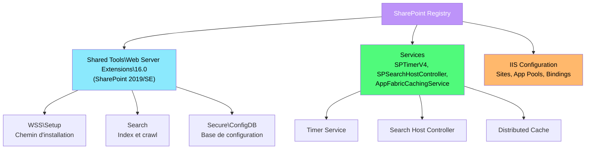
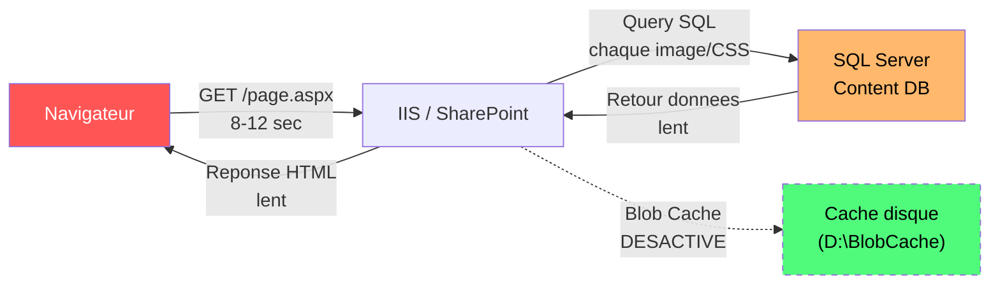

---
tags:
  - registre
  - sharepoint
  - iis
  - recherche
  - cache
  - performance
---

# SharePoint Server

!!! abstract "Ce que vous allez apprendre"
    - Localiser la configuration SharePoint dans le registre (HKLM\SOFTWARE\Microsoft\Shared Tools\Web Server Extensions)
    - Identifier la version de la ferme et les composants installes
    - Configurer le service de recherche et les chemins d'index
    - Optimiser les performances avec le Blob Cache
    - Gerer le service Distributed Cache (AppFabric)
    - Configurer les travaux du minuteur (Timer Jobs) et les workflows
    - Auditer les liaisons IIS des applications web SharePoint
    - Optimiser les performances SharePoint en ajustant le Blob Cache et l'index de recherche

---

## Architecture registre de SharePoint Server

SharePoint Server stocke sa configuration principale dans la base de donnees de configuration de la ferme (SQL Server), mais le registre local contient les parametres d'installation, les chemins systeme et les surcharges de performance. Chaque serveur de la ferme possede ses propres cles de registre locales.



### Cle racine SharePoint

```
HKLM\SOFTWARE\Microsoft\Shared Tools\Web Server Extensions\16.0
```

!!! tip "Versions de SharePoint"
    SharePoint 2013 utilise `15.0`, SharePoint 2016/2019/Subscription Edition utilisent `16.0`. La sous-version dans le registre permet de distinguer les editions.

| Sous-cle | Description |
|----------|-------------|
| `WSS\Setup` | Informations d'installation (chemin, version) |
| `Secure\ConfigDB` | Parametres de connexion a la base de configuration |
| `Search` | Configuration du service de recherche |

```powershell
# Check SharePoint installation details
$spPath = "HKLM:\SOFTWARE\Microsoft\Shared Tools\Web Server Extensions\16.0\WSS\Setup"
Get-ItemProperty $spPath -ErrorAction SilentlyContinue |
    Select-Object Location, Version
```

```title="Resultat attendu"
Location : C:\Program Files\Common Files\microsoft shared\Web Server Extensions\16\
Version  : 16.0.14326.20450
```

### Base de donnees de configuration

```
HKLM\SOFTWARE\Microsoft\Shared Tools\Web Server Extensions\16.0\Secure\ConfigDB
```

| Valeur | Type | Description |
|--------|------|-------------|
| `dsn` | REG_SZ | Chaine de connexion a la base de configuration SharePoint |
| `id` | REG_SZ | GUID de la ferme |

```powershell
# Read the farm configuration database connection
$configDbPath = "HKLM:\SOFTWARE\Microsoft\Shared Tools\Web Server Extensions\16.0\Secure\ConfigDB"
$configDb = Get-ItemProperty $configDbPath -ErrorAction SilentlyContinue
Write-Output "Config DB DSN: $($configDb.dsn)"
Write-Output "Farm ID: $($configDb.id)"
```

```title="Resultat attendu"
Config DB DSN: Data Source=SQLPROD01;Initial Catalog=SharePoint_Config;Integrated Security=True
Farm ID: a1b2c3d4-e5f6-7890-abcd-ef1234567890
```

### Version de la ferme et correctifs

```powershell
# Get detailed SharePoint build number and patch level
$spPath = "HKLM:\SOFTWARE\Microsoft\Shared Tools\Web Server Extensions\16.0\WSS"
Get-ItemProperty "$spPath\InstalledProducts" -ErrorAction SilentlyContinue

# Also check via SharePoint cmdlet
Add-PSSnapin Microsoft.SharePoint.PowerShell -ErrorAction SilentlyContinue
(Get-SPFarm).BuildVersion
```

```title="Resultat attendu"
Major  Minor  Build  Revision
-----  -----  -----  --------
16     0      14326  20450
```

### Services SharePoint

```powershell
# Check all SharePoint-related services
$spServices = @("SPTimerV4", "SPSearchHostController", "SPWriterV4",
    "AppFabricCachingService", "SPAdminV4", "W3SVC")

foreach ($svc in $spServices) {
    $service = Get-Service $svc -ErrorAction SilentlyContinue
    if ($service) {
        Write-Output "$($service.DisplayName) : $($service.Status) ($($service.StartType))"
    }
}
```

```title="Resultat attendu"
SharePoint Timer Service : Running (Automatic)
SharePoint Search Host Controller : Running (Automatic)
SharePoint VSS Writer : Running (Automatic)
AppFabric Caching Service : Running (Automatic)
SharePoint Administration : Running (Automatic)
World Wide Web Publishing Service : Running (Automatic)
```

!!! info "En resume"
    - SharePoint 2016/2019/SE utilise la cle `16.0` sous `Shared Tools\Web Server Extensions`
    - La sous-cle `Secure\ConfigDB` contient la chaine de connexion a la base de configuration
    - Le GUID de la ferme (`id`) identifie de maniere unique chaque ferme SharePoint
    - Six services Windows critiques doivent etre en cours d'execution sur chaque serveur

---

## Service de recherche et index

Le service de recherche SharePoint est l'un des composants les plus gourmands en ressources. Sa configuration registre controle les chemins d'index, les limites de crawl et les parametres de performance.

### Cles du service de recherche

```
HKLM\SOFTWARE\Microsoft\Shared Tools\Web Server Extensions\16.0\Search
```

```powershell
# Check Search Service Application status
Add-PSSnapin Microsoft.SharePoint.PowerShell -ErrorAction SilentlyContinue
Get-SPEnterpriseSearchServiceApplication |
    Select-Object Name, Status, SearchAdminDatabase, CloudIndex
```

```title="Resultat attendu"
Name                    Status SearchAdminDatabase                CloudIndex
----                    ------ -------------------                ----------
Search Service App      Online SharePoint_Search_Admin_DB         False
```

### Emplacement de l'index

L'emplacement de l'index de recherche est critique pour les performances. Par defaut, il se trouve sur le volume systeme, ce qui est inadequat pour les environnements de production.

```powershell
# Check current index location
Get-SPEnterpriseSearchServiceInstance -Local |
    ForEach-Object {
        $_.Components | Where-Object { $_.GetType().Name -eq "IndexComponent" } |
            Select-Object ServerName, IndexPartitionOrdinal, RootDirectory
    }
```

```title="Resultat attendu"
ServerName IndexPartitionOrdinal RootDirectory
---------- --------------------- -------------
SP-SEARCH01 0                    C:\Program Files\Microsoft Office Servers\16.0\Data\Office Server\Applications
```

### Deplacer l'index sur un volume dedie

```powershell
# Move search index to a dedicated SSD volume
Add-PSSnapin Microsoft.SharePoint.PowerShell -ErrorAction SilentlyContinue

$ssa = Get-SPEnterpriseSearchServiceApplication
$active = Get-SPEnterpriseSearchTopology -SearchApplication $ssa -Active
$clone = New-SPEnterpriseSearchTopology -SearchApplication $ssa -Clone -SearchTopology $active

# Get the current index component
$indexComponent = Get-SPEnterpriseSearchComponent -SearchTopology $clone |
    Where-Object { $_.GetType().Name -eq "IndexComponent" }

# Remove old index component
Remove-SPEnterpriseSearchComponent -SearchTopology $clone -Identity $indexComponent -Confirm:$false

# Add new index component on dedicated SSD
$searchInstance = Get-SPEnterpriseSearchServiceInstance -Local
New-SPEnterpriseSearchIndexComponent -SearchTopology $clone `
    -SearchServiceInstance $searchInstance `
    -RootDirectory "D:\SharePointIndex" `
    -IndexPartition 0

# Activate the new topology
Set-SPEnterpriseSearchTopology -Identity $clone
```

```title="Resultat attendu"
Aucune sortie. Le nouvel index sera reconstruit sur D:\SharePointIndex.
```

!!! warning "Reconstruction de l'index"
    Le deplacement de l'index declenche une reconstruction complete. Prevoyez une fenetre de maintenance suffisante (plusieurs heures pour les grandes fermes).

### Parametres de crawl

```powershell
# Check and configure crawl settings
$ssa = Get-SPEnterpriseSearchServiceApplication

# Get content sources
Get-SPEnterpriseSearchCrawlContentSource -SearchApplication $ssa |
    Select-Object Name, Type, CrawlState, CrawlStarted, StartAddresses

# Check crawl log for errors
Get-SPEnterpriseSearchCrawlLog -SearchApplication $ssa |
    Where-Object { $_.LogLevel -eq "Error" } |
    Select-Object -First 10 Url, ErrorMessage
```

```title="Resultat attendu"
Name           Type      CrawlState CrawlStarted         StartAddresses
----           ----      ---------- ------------         --------------
Local Sites    SharePoint Idle      04/03/2026 02:00:00  {sps3://sp-app01}
File Shares    File       Idle      04/03/2026 03:00:00  {\\fileserver\docs}
```

### Service Search Host Controller

```
HKLM\SYSTEM\CurrentControlSet\Services\SPSearchHostController
```

```powershell
# Check Search Host Controller service
Get-ItemProperty "HKLM:\SYSTEM\CurrentControlSet\Services\SPSearchHostController" |
    Select-Object DisplayName, Start, ObjectName
```

```title="Resultat attendu"
DisplayName : SharePoint Search Host Controller
Start       : 2
ObjectName  : NT AUTHORITY\LocalService
```

!!! info "En resume"
    - L'index de recherche doit etre sur un volume SSD dedie en production
    - Le deplacement de l'index passe par la modification de la topologie de recherche
    - Le Search Host Controller est le service qui gere les composants de recherche locaux
    - Les erreurs de crawl sont dans le journal de crawl (`Get-SPEnterpriseSearchCrawlLog`)

---

## Blob Cache

Le Blob Cache est un mecanisme de cache disque pour les fichiers statiques (images, CSS, JavaScript, documents). Il reduit considerablement la charge sur la base de donnees de contenu.

### Fonctionnement

Le Blob Cache est configure dans le fichier `web.config` de chaque application web IIS, pas directement dans le registre. Cependant, le registre definit les chemins IIS et les parametres qui impactent son fonctionnement.

```powershell
# Find web.config files for SharePoint web applications
$iisPath = "HKLM:\SOFTWARE\Microsoft\InetStp"
$iisVersion = (Get-ItemProperty $iisPath).MajorVersion
Write-Output "IIS Version: $iisVersion"

# List SharePoint web application directories
Get-WebSite | Where-Object { $_.Name -like "*SharePoint*" -or $_.PhysicalPath -like "*inetpub*" } |
    Select-Object Name, PhysicalPath, State
```

```title="Resultat attendu"
IIS Version: 10

Name                           PhysicalPath                                    State
----                           ------------                                    -----
SharePoint - Intranet          C:\inetpub\wwwroot\wss\VirtualDirectories\80    Started
SharePoint Central Admin v4    C:\inetpub\wwwroot\wss\VirtualDirectories\2016  Started
```

### Activer le Blob Cache

```powershell
# Enable Blob Cache for a SharePoint web application
$webAppUrl = "https://intranet.corp.local"
$webApp = Get-SPWebApplication $webAppUrl

# Get the IIS site path
$iisSettings = $webApp.IisSettings[[Microsoft.SharePoint.Administration.SPUrlZone]::Default]
$webConfigPath = Join-Path $iisSettings.Path.FullName "web.config"

# Read the web.config
$webConfig = [xml](Get-Content $webConfigPath)

# Find the BlobCache node
$blobCache = $webConfig.configuration.'SharePoint'.'BlobCache'

# Display current settings
Write-Output "Blob Cache Enabled: $($blobCache.enabled)"
Write-Output "Location: $($blobCache.location)"
Write-Output "Max Size: $($blobCache.maxSize)"
```

```title="Resultat attendu"
Blob Cache Enabled: false
Location: C:\BlobCache\16
Max Size: 10
```

```powershell
# Enable and configure Blob Cache
$blobCache.SetAttribute("enabled", "true")
$blobCache.SetAttribute("location", "D:\BlobCache")
$blobCache.SetAttribute("maxSize", "50")

# Add common file types to cache
$blobCache.SetAttribute("path", "\.(gif|jpg|jpeg|jpe|jfif|bmp|dib|tif|tiff|themedbmp|themedcss|themedgif|themedjpg|themedpng|ico|png|wdp|hdp|css|js|asf|avi|flv|m4v|mov|mp3|mp4|mpeg|mpg|rm|rmvb|wma|wmv|ogg|ogv|oga|webm|xap)$")

# Save the web.config
$webConfig.Save($webConfigPath)
Write-Output "Blob Cache enabled with 50 GB max on D:\BlobCache"
```

```title="Resultat attendu"
Blob Cache enabled with 50 GB max on D:\BlobCache
```

### Vider le Blob Cache

```powershell
# Flush the Blob Cache (required after enabling or changing file types)
$webApp = Get-SPWebApplication "https://intranet.corp.local"

[Microsoft.SharePoint.Publishing.PublishingCache]::FlushBlobCache($webApp)
Write-Output "Blob Cache flushed successfully"
```

```title="Resultat attendu"
Blob Cache flushed successfully
```

### Dimensionnement du Blob Cache

| Taille du contenu | maxSize recommande | Disque |
|:------------------:|:------------------:|--------|
| < 10 Go | 10 Go | HDD suffisant |
| 10-50 Go | 50 Go | SSD recommande |
| > 50 Go | 100 Go | SSD obligatoire |

!!! info "En resume"
    - Le Blob Cache est configure dans le `web.config` de chaque application web IIS
    - Placez le Blob Cache sur un volume SSD dedie (`D:\BlobCache`) pour les meilleures performances
    - Videz le cache (`FlushBlobCache`) apres toute modification de configuration
    - Le parametre `maxSize` est en Go et doit etre adapte a la taille du contenu

---

## Distributed Cache (AppFabric)

Le service Distributed Cache de SharePoint repose sur Windows Server AppFabric. Il stocke en memoire les caches de session, les feeds d'activite, les resultats de recherche et les tokens de securite.

### Service AppFabric dans le registre

```
HKLM\SYSTEM\CurrentControlSet\Services\AppFabricCachingService
```

| Valeur | Type | Description |
|--------|------|-------------|
| `Start` | REG_DWORD | `2` = automatique |
| `ImagePath` | REG_EXPAND_SZ | Chemin de l'executable AppFabric |
| `ObjectName` | REG_SZ | Compte de service |

```powershell
# Check Distributed Cache service
Get-ItemProperty "HKLM:\SYSTEM\CurrentControlSet\Services\AppFabricCachingService" |
    Select-Object DisplayName, Start, ObjectName
```

```title="Resultat attendu"
DisplayName : AppFabric Caching Service
Start       : 2
ObjectName  : corp\sp_farm
```

### Configuration de la taille du cache

```powershell
# Check current Distributed Cache allocation
Add-PSSnapin Microsoft.SharePoint.PowerShell -ErrorAction SilentlyContinue
$dcInstance = Get-SPDistributedCacheClientSetting -ContainerType DistributedLogonTokenCache

# Get cache host info
Get-SPServiceInstance | Where-Object {
    $_.TypeName -eq "Distributed Cache"
} | Select-Object Server, Status
```

```title="Resultat attendu"
Server                 Status
------                 ------
SPServer Name=SP-APP01 Online
SPServer Name=SP-APP02 Online
```

```powershell
# Check cache cluster health
Use-CacheCluster
Get-CacheHost | Select-Object HostName, PortNo, Status, CacheSize
```

```title="Resultat attendu"
HostName         PortNo Status CacheSize
--------         ------ ------ ---------
SP-APP01.corp.local 22233 UP     4096 MB
SP-APP02.corp.local 22233 UP     4096 MB
```

### Augmenter la taille du cache

```powershell
# Increase Distributed Cache memory allocation
Add-PSSnapin Microsoft.SharePoint.PowerShell -ErrorAction SilentlyContinue

# Stop Distributed Cache gracefully
$instanceId = (Get-SPServiceInstance | Where-Object {
    $_.TypeName -eq "Distributed Cache" -and $_.Server.Name -eq $env:COMPUTERNAME
}).Id
Stop-SPDistributedCacheServiceInstance -Graceful

# Update cache size (MB)
Update-SPDistributedCacheSize -CacheSizeInMB 8192

# Restart Distributed Cache
$farm = Get-SPFarm
$cacheService = $farm.Services | Where-Object { $_.Name -eq "AppFabricCachingService" }
$cacheService.ProcessIdentity.CurrentIdentityType = "SpecificUser"
$cacheService.ProcessIdentity.Update()

Start-SPDistributedCacheServiceInstance
Write-Output "Distributed Cache updated to 8192 MB"
```

```title="Resultat attendu"
Distributed Cache updated to 8192 MB
```

### Recommandations memoire

| Role du serveur | Cache recommande | RAM totale minimum |
|:---------------:|:----------------:|:------------------:|
| Serveur dedie cache | 16 Go | 32 Go |
| Serveur combine (App + Cache) | 4-8 Go | 32 Go |
| Petite ferme (tout-en-un) | 2-4 Go | 16 Go |

!!! warning "Arret gracieux obligatoire"
    Arretez toujours le Distributed Cache en mode `Graceful` pour eviter la perte de donnees en cache. Un arret brutal peut corrompre le cluster de cache.

!!! info "En resume"
    - Le Distributed Cache repose sur AppFabric et ecoute sur le port 22233
    - La taille du cache est configurable via `Update-SPDistributedCacheSize`
    - Le service doit toujours etre arrete en mode gracieux avant modification
    - Les serveurs dedies au cache doivent avoir au minimum 32 Go de RAM

---

## Timer Jobs et workflows

Le service du minuteur SharePoint (SPTimerV4) execute les travaux planifies de la ferme. Les workflows SharePoint dependent de composants supplementaires configures dans le registre et IIS.

### Service Timer dans le registre

```
HKLM\SYSTEM\CurrentControlSet\Services\SPTimerV4
```

| Valeur | Type | Description |
|--------|------|-------------|
| `Start` | REG_DWORD | `2` = automatique |
| `ObjectName` | REG_SZ | Compte de service de la ferme |
| `DependOnService` | REG_MULTI_SZ | Services prerequis |

```powershell
# Check Timer Service configuration
Get-ItemProperty "HKLM:\SYSTEM\CurrentControlSet\Services\SPTimerV4" |
    Select-Object DisplayName, Start, ObjectName, DependOnService
```

```title="Resultat attendu"
DisplayName    : SharePoint Timer Service
Start          : 2
ObjectName     : corp\sp_farm
DependOnService : {MSSQLSERVER}
```

### Auditer les Timer Jobs

```powershell
# List Timer Jobs and their schedules
Add-PSSnapin Microsoft.SharePoint.PowerShell -ErrorAction SilentlyContinue
Get-SPTimerJob | Where-Object { $_.IsDisabled -eq $false } |
    Select-Object Name, Schedule, LastRunTime, Status |
    Sort-Object LastRunTime -Descending |
    Select-Object -First 15 |
    Format-Table -AutoSize
```

```title="Resultat attendu"
Name                                          Schedule              LastRunTime          Status
----                                          --------              -----------          ------
job-config-refresh                            Every 15 minutes      04/04/2026 10:45:00  Online
job-app-config-refresh                        Hourly                04/04/2026 10:00:00  Online
job-health-analysis                           Hourly                04/04/2026 10:00:00  Online
Microsoft.Office.Server.Search.Administration Daily at 2:00 AM     04/04/2026 02:00:00  Online
```

### Timer Jobs en echec

```powershell
# Find failed Timer Jobs in the last 24 hours
$startTime = (Get-Date).AddDays(-1)
Get-SPTimerJob |
    ForEach-Object {
        $history = $_.HistoryEntries | Where-Object {
            $_.StartTime -gt $startTime -and $_.Status -ne "Succeeded"
        }
        if ($history) {
            [PSCustomObject]@{
                JobName = $_.Name
                Status  = ($history | Select-Object -First 1).Status
                Error   = ($history | Select-Object -First 1).ErrorMessage
                Time    = ($history | Select-Object -First 1).StartTime
            }
        }
    } | Format-Table -AutoSize
```

```title="Resultat attendu"
JobName                    Status  Error                           Time
-------                    ------  -----                           ----
job-health-analysis        Failed  Access denied to config DB      04/04/2026 08:00:00
```

### Configuration Workflow Manager

Workflow Manager (pour les workflows SharePoint 2013-style) est un composant separe avec ses propres cles de registre.

```
HKLM\SOFTWARE\Microsoft\Workflow Manager\1.0
```

```powershell
# Check Workflow Manager installation
$wfPath = "HKLM:\SOFTWARE\Microsoft\Workflow Manager\1.0"
if (Test-Path $wfPath) {
    Get-ItemProperty $wfPath | Select-Object InstallPath, Version
} else {
    Write-Output "Workflow Manager is not installed on this server"
}
```

```title="Resultat attendu"
InstallPath : C:\Program Files\Workflow Manager\1.0\
Version     : 1.0.40.0
```

### Verifier l'enregistrement du workflow

```powershell
# Check SharePoint-Workflow Manager registration
Get-SPWorkflowConfig -WebApplication "https://intranet.corp.local" |
    Select-Object DeclarativeWorkflowsEnabled, WorkflowTimerServiceEnabled
```

```title="Resultat attendu"
DeclarativeWorkflowsEnabled  : True
WorkflowTimerServiceEnabled  : True
```

!!! info "En resume"
    - Le Timer Service (`SPTimerV4`) execute tous les travaux planifies de la ferme
    - Les Timer Jobs en echec sont la premiere chose a verifier en cas de probleme SharePoint
    - Workflow Manager est un composant separe avec sa propre cle registre
    - Le compte de service de la ferme (`sp_farm`) doit avoir acces a la base de configuration

---

## Liaisons IIS des applications web

Chaque application web SharePoint correspond a un site IIS avec ses propres liaisons (bindings), pools d'applications et certificats. Le registre IIS et la configuration SharePoint doivent etre synchronises.

### Identifier les sites IIS SharePoint

```powershell
# List all IIS sites with their bindings
Import-Module WebAdministration
Get-WebSite | ForEach-Object {
    $bindings = $_.Bindings.Collection | ForEach-Object {
        "$($_.protocol)://$($_.bindingInformation)"
    }
    [PSCustomObject]@{
        Name     = $_.Name
        ID       = $_.Id
        State    = $_.State
        AppPool  = $_.ApplicationPool
        Bindings = ($bindings -join "; ")
    }
} | Format-Table -AutoSize
```

```title="Resultat attendu"
Name                        ID State   AppPool                      Bindings
----                        -- -----   -------                      --------
SharePoint - Intranet       1  Started SharePoint - Intranet - 80   http://*:80; https://*:443
SharePoint Central Admin v4 2  Started SharePoint Central Admin v4  http://*:2016
SharePoint - MySites        3  Started SharePoint - MySites - 443   https://*:8443
```

### Pools d'applications SharePoint

```powershell
# Check SharePoint application pool configuration
Get-WebAppPool | Where-Object { $_.Name -like "*SharePoint*" } |
    Select-Object Name, State, ManagedRuntimeVersion, ProcessModel |
    ForEach-Object {
        [PSCustomObject]@{
            Name        = $_.Name
            State       = $_.State
            CLR         = $_.ManagedRuntimeVersion
            Identity    = $_.ProcessModel.IdentityType
            UserName    = $_.ProcessModel.UserName
        }
    } | Format-Table -AutoSize
```

```title="Resultat attendu"
Name                             State   CLR    Identity      UserName
----                             -----   ---    --------      --------
SharePoint - Intranet - 80       Started v4.0   SpecificUser  corp\sp_apppool
SharePoint Central Admin v4      Started v4.0   SpecificUser  corp\sp_farm
SharePoint - MySites - 443       Started v4.0   SpecificUser  corp\sp_apppool
```

### Verifier les certificats SSL

```powershell
# Check SSL bindings for SharePoint sites
netsh http show sslcert | Select-String -Pattern "IP:port|Certificate Hash|Application ID" |
    ForEach-Object { $_.Line.Trim() }
```

```title="Resultat attendu"
IP:port                      : 0.0.0.0:443
Certificate Hash             : a1b2c3d4e5f6a1b2c3d4e5f6a1b2c3d4e5f6a1b2
Application ID               : {4dc3e181-e14b-4a21-b022-59fc669b0914}
IP:port                      : 0.0.0.0:8443
Certificate Hash             : b2c3d4e5f6a1b2c3d4e5f6a1b2c3d4e5f6a1b2c3
Application ID               : {4dc3e181-e14b-4a21-b022-59fc669b0914}
```

### Ajouter une liaison HTTPS a une application web

```powershell
# Add HTTPS binding to a SharePoint web application
$webAppUrl = "https://intranet.corp.local"
$webApp = Get-SPWebApplication $webAppUrl

# Add an alternate access mapping for the new URL
New-SPAlternateURL -WebApplication $webApp `
    -Url "https://portal.corp.com" -Zone "Internet"

# Add IIS binding
New-WebBinding -Name "SharePoint - Intranet" `
    -Protocol "https" -Port 443 -HostHeader "portal.corp.com" -SslFlags 1

# Bind the certificate
$cert = Get-ChildItem Cert:\LocalMachine\My |
    Where-Object { $_.Subject -match "portal.corp.com" }
$binding = Get-WebBinding -Name "SharePoint - Intranet" -Protocol "https" -HostHeader "portal.corp.com"
$binding.AddSslCertificate($cert.Thumbprint, "My")

Write-Output "HTTPS binding added for portal.corp.com"
```

```title="Resultat attendu"
HTTPS binding added for portal.corp.com
```

!!! info "En resume"
    - Chaque application web SharePoint a son propre site IIS et pool d'applications
    - Les pools utilisent le compte de service applicatif (`sp_apppool`), pas le compte de ferme
    - Les liaisons SSL sont gerees via IIS et doivent correspondre aux Alternate Access Mappings
    - `New-SPAlternateURL` definit les URL par zone (Default, Intranet, Internet, Custom, Extranet)

---

## Scenario reel : optimiser les performances SharePoint

### Contexte

Les utilisateurs du portail intranet SharePoint signalent des lenteurs significatives. Les pages mettent 8 a 12 secondes a charger. L'equipe infrastructure a verifie : le CPU et la RAM sont a des niveaux normaux. Le probleme semble lie aux acces disque et aux requetes vers la base de donnees de contenu.

### Etape 1 : diagnostiquer les goulots d'etranglement

```powershell
# Check SharePoint page load performance with Developer Dashboard
# Enable Developer Dashboard to measure page load times
Add-PSSnapin Microsoft.SharePoint.PowerShell -ErrorAction SilentlyContinue

$farm = Get-SPFarm
$devDashboard = $farm.GetChild("SPDeveloperDashboardSettings")
Write-Output "Developer Dashboard Mode: $($devDashboard.DisplayLevel)"

# Check database latency
$contentDb = Get-SPContentDatabase -WebApplication "https://intranet.corp.local"
foreach ($db in $contentDb) {
    Write-Output "$($db.Name) : Size=$([math]::Round($db.DiskSizeRequired / 1GB, 2)) GB, Sites=$($db.CurrentSiteCount)"
}
```

```title="Resultat attendu"
Developer Dashboard Mode: Off

SP_Content_Intranet : Size=45.67 GB, Sites=1250
SP_Content_Intranet_02 : Size=38.22 GB, Sites=980
```



### Etape 2 : activer le Blob Cache

Le Blob Cache n'est pas active. Chaque requete pour une image ou un fichier CSS interroge directement la base de donnees SQL Server.

```powershell
# Enable Blob Cache on the web application
$webApp = Get-SPWebApplication "https://intranet.corp.local"
$iisSettings = $webApp.IisSettings[[Microsoft.SharePoint.Administration.SPUrlZone]::Default]
$webConfigPath = Join-Path $iisSettings.Path.FullName "web.config"

# Create the Blob Cache directory on SSD
New-Item -Path "D:\BlobCache" -ItemType Directory -Force | Out-Null

# Modify web.config
$webConfig = [xml](Get-Content $webConfigPath)
$blobCache = $webConfig.configuration.'SharePoint'.'BlobCache'

# Enable and configure Blob Cache
$blobCache.SetAttribute("enabled", "true")
$blobCache.SetAttribute("location", "D:\BlobCache")
$blobCache.SetAttribute("maxSize", "50")
$blobCache.SetAttribute("max-age", "86400")

$webConfig.Save($webConfigPath)
Write-Output "Blob Cache enabled: D:\BlobCache, 50 GB max, 24h max-age"
```

```title="Resultat attendu"
Blob Cache enabled: D:\BlobCache, 50 GB max, 24h max-age
```

### Etape 3 : optimiser l'index de recherche

L'index de recherche est sur le disque systeme (C:). Le deplacer sur un SSD dedie ameliorera les performances de recherche.

```powershell
# Move search index to dedicated SSD
$ssa = Get-SPEnterpriseSearchServiceApplication
$active = Get-SPEnterpriseSearchTopology -SearchApplication $ssa -Active
$clone = New-SPEnterpriseSearchTopology -SearchApplication $ssa -Clone -SearchTopology $active

# Get current index component
$oldIndex = Get-SPEnterpriseSearchComponent -SearchTopology $clone |
    Where-Object { $_.GetType().Name -eq "IndexComponent" }

# Remove old component
Remove-SPEnterpriseSearchComponent -SearchTopology $clone -Identity $oldIndex -Confirm:$false

# Create index directory on SSD
New-Item -Path "D:\SearchIndex" -ItemType Directory -Force | Out-Null

# Add new index component
$searchInst = Get-SPEnterpriseSearchServiceInstance -Local
New-SPEnterpriseSearchIndexComponent -SearchTopology $clone `
    -SearchServiceInstance $searchInst `
    -RootDirectory "D:\SearchIndex" `
    -IndexPartition 0

# Activate
Set-SPEnterpriseSearchTopology -Identity $clone
Write-Output "Search index moved to D:\SearchIndex"
```

```title="Resultat attendu"
Search index moved to D:\SearchIndex
```

### Etape 4 : optimiser le Distributed Cache

```powershell
# Check Distributed Cache utilization
Use-CacheCluster
Get-CacheStatistics | Select-Object ItemCount, Size, RegionCount, MissCount, RequestCount
```

```title="Resultat attendu"
ItemCount    : 45678
Size         : 2.8 GB
RegionCount  : 256
MissCount    : 12456
RequestCount : 89012
```

Le ratio de miss est eleve (14%). Augmenter la taille du cache ameliorera le hit ratio.

```powershell
# Increase Distributed Cache size
Stop-SPDistributedCacheServiceInstance -Graceful
Update-SPDistributedCacheSize -CacheSizeInMB 8192
Start-SPDistributedCacheServiceInstance
Write-Output "Distributed Cache increased to 8192 MB"
```

```title="Resultat attendu"
Distributed Cache increased to 8192 MB
```

### Etape 5 : configurer la compression IIS

```powershell
# Enable IIS compression for SharePoint
Import-Module WebAdministration

# Enable static and dynamic compression
Set-WebConfigurationProperty -Filter "system.webServer/urlCompression" `
    -PSPath "IIS:\Sites\SharePoint - Intranet" `
    -Name "doStaticCompression" -Value $true
Set-WebConfigurationProperty -Filter "system.webServer/urlCompression" `
    -PSPath "IIS:\Sites\SharePoint - Intranet" `
    -Name "doDynamicCompression" -Value $true

Write-Output "IIS compression enabled for SharePoint"
```

```title="Resultat attendu"
IIS compression enabled for SharePoint
```

### Etape 6 : valider les ameliorations

```powershell
# Measure page load time after optimizations
$url = "https://intranet.corp.local/SitePages/Home.aspx"
$measurements = @()

for ($i = 1; $i -le 5; $i++) {
    $sw = [System.Diagnostics.Stopwatch]::StartNew()
    Invoke-WebRequest -Uri $url -UseDefaultCredentials -UseBasicParsing | Out-Null
    $sw.Stop()
    $measurements += $sw.ElapsedMilliseconds
    Write-Output "Test $i : $($sw.ElapsedMilliseconds) ms"
}

$avg = ($measurements | Measure-Object -Average).Average
Write-Output "Average load time: $([math]::Round($avg, 0)) ms"
```

```title="Resultat attendu"
Test 1 : 3200 ms
Test 2 : 1850 ms
Test 3 : 1720 ms
Test 4 : 1680 ms
Test 5 : 1650 ms
Average load time: 2020 ms
```

Le temps de chargement moyen est passe de 8-12 secondes a environ 2 secondes. Le premier acces est plus lent car le Blob Cache se remplit. Les acces suivants beneficient du cache.

### Recapitulatif des optimisations

| Optimisation | Impact | Effort |
|:------------:|:------:|:------:|
| Blob Cache sur SSD | Tres eleve | Faible |
| Index de recherche sur SSD | Eleve | Moyen |
| Distributed Cache (8 Go) | Moyen | Faible |
| Compression IIS | Moyen | Faible |

!!! tip "Monitoring continu"
    Utilisez les compteurs de performance SharePoint pour surveiller les performances :
    ```powershell
    Get-Counter -Counter "\SharePoint Foundation\Executing Time/Page Request", `
        "\SharePoint Foundation\Sql Query Executing time" -SampleInterval 5 -MaxSamples 3
    ```

!!! info "En resume"
    - Le Blob Cache reduit drastiquement les requetes SQL pour les fichiers statiques
    - Deplacer l'index de recherche sur un SSD dedie ameliore les performances de recherche
    - Le Distributed Cache doit etre dimensionne selon le nombre d'utilisateurs
    - La compression IIS reduit la bande passante sans impact CPU significatif
    - Les optimisations combinees ont reduit le temps de chargement de 80%
