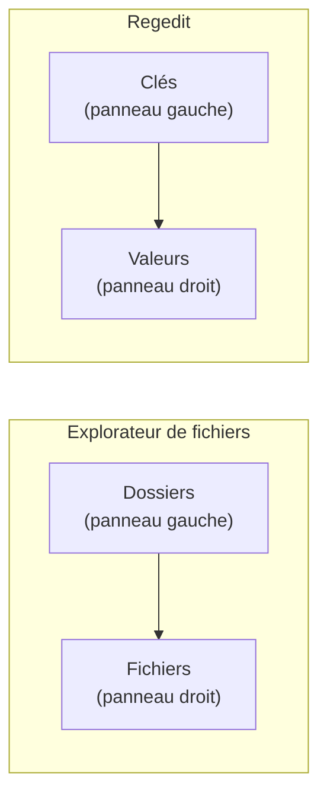

---
tags:
  - registre
  - débutant
  - regedit
---

# Premiers pas avec Regedit

!!! abstract "Ce que vous allez apprendre"
    - Comment ouvrir Regedit (deux methodes)
    - Comprendre l'interface : panneau gauche, panneau droit
    - Naviguer dans l'arborescence
    - Lire les differents types de valeurs
    - Utiliser la barre d'adresse et les favoris
    - Votre premier exercice : observer sans toucher

---

## Lancer Regedit

### Methode 1 : la plus rapide

1. Appuyer sur ++win+r++ (la touche Windows + la lettre R)
2. Taper `regedit`
3. Appuyer sur ++enter++
4. Cliquer **Oui** sur la demande d'autorisation administrateur

Vous devriez voir apparaitre cette fenetre :

```
┌─────────────────────────────────────────────────────────────────┐
│  Éditeur du Registre                                            │
│  Fichier  Édition  Affichage  Favoris  ?                        │
├──────────────────────────┬──────────────────────────────────────┤
│  ▶ Ordinateur            │  (rien pour l'instant)               │
│    ▶ HKEY_CLASSES_ROOT   │                                      │
│    ▶ HKEY_CURRENT_USER   │                                      │
│    ▶ HKEY_LOCAL_MACHINE  │                                      │
│    ▶ HKEY_USERS          │                                      │
│    ▶ HKEY_CURRENT_CONFIG │                                      │
└──────────────────────────┴──────────────────────────────────────┘
```

### Methode 2 : via la recherche

1. Cliquer sur la barre de recherche dans la barre des taches
2. Taper `regedit`
3. Cliquer sur **Editeur du Registre**
4. Confirmer l'autorisation administrateur

!!! info "Pourquoi une demande d'autorisation ?"
    Regedit peut modifier des parametres critiques du systeme. Windows vous demande de confirmer que c'est bien **vous** qui l'avez lance, et non un programme malveillant. C'est comme un vigile qui verifie votre badge avant de vous laisser entrer dans la salle des serveurs.

!!! quote "En resume"
    - Pour ouvrir Regedit : ++win+r++ puis tapez `regedit` et confirmez l'autorisation administrateur.
    - Vous pouvez aussi passer par la barre de recherche du menu Demarrer.

---

## Decouvrir l'interface

L'editeur du registre ressemble beaucoup a l'**explorateur de fichiers**. Et ce n'est pas un hasard : la logique est la meme !



| Explorateur de fichiers | Regedit |
|:-----------------------:|:-------:|
| Dossiers | Cles |
| Fichiers | Valeurs |
| Contenu d'un fichier | Donnees d'une valeur |

- **Panneau de gauche** : l'arborescence des cles (comme les dossiers)
- **Panneau de droite** : les valeurs contenues dans la cle selectionnee (comme les fichiers dans un dossier)

!!! quote "En resume"
    - Regedit fonctionne comme l'Explorateur de fichiers : les cles (gauche) sont les dossiers, les valeurs (droite) sont les fichiers.
    - Chaque valeur a un **nom**, un **type** et des **donnees**.

---

## Naviguer dans l'arborescence

### Les 5 branches principales

L'arborescence commence par 5 grandes branches. Pas besoin de toutes les retenir pour l'instant !

Voici les **deux seules** que vous utiliserez 90 % du temps :

| Branche | Abreviation | Ce qu'elle contient | Analogie |
|---------|:-----------:|-------------------|----------|
| `HKEY_CURRENT_USER` | HKCU | **Vos** reglages personnels | Votre casier personnel |
| `HKEY_LOCAL_MACHINE` | HKLM | Les reglages de **la machine** | Le tableau de bord commun |

!!! note "Et les trois autres ?"
    `HKEY_CLASSES_ROOT`, `HKEY_USERS` et `HKEY_CURRENT_CONFIG` sont plus techniques et rarement modifiees directement. On les detaillera au chapitre suivant.

### Se deplacer dans l'arbre

Trois facons de naviguer :

| Action | Comment faire |
|--------|---------------|
| Ouvrir une cle | Cliquer sur la fleche `▶` a gauche |
| Developper rapidement | Double-cliquer sur le nom de la cle |
| Navigation au clavier | Fleches ++arrow-up++ ++arrow-down++ pour monter/descendre, ++arrow-right++ pour ouvrir, ++arrow-left++ pour fermer |

### La barre d'adresse (votre meilleure amie)

Depuis Windows 10, Regedit possede une **barre d'adresse** en haut de la fenetre.

Vous pouvez y coller directement un chemin copie depuis un tutoriel :

```
HKEY_CURRENT_USER\Software\Microsoft\Windows\CurrentVersion\Explorer\Advanced
```

!!! tip "Astuce du pro"
    Quand un tutoriel vous indique un chemin de registre, **copiez-le** et collez-le dans la barre d'adresse de Regedit. C'est beaucoup plus rapide (et moins risque) que de naviguer clic par clic.

!!! quote "En resume"
    - Vous utiliserez surtout **HKCU** (vos reglages perso) et **HKLM** (reglages machine).
    - La **barre d'adresse** en haut de Regedit permet de coller directement un chemin copie depuis un tutoriel.

---

## Comprendre ce qu'on voit

Quand vous cliquez sur une cle dans le panneau de gauche, le panneau de droite affiche ses **valeurs**. Chaque ligne a trois colonnes :

| Colonne | Signification | Analogie |
|---------|--------------|----------|
| **Nom** | Le nom du reglage | L'etiquette sur un bouton |
| **Type** | Le format des donnees | Est-ce un interrupteur ? Un curseur ? Un champ texte ? |
| **Donnees** | La valeur actuelle | La position du bouton ou le texte saisi |

### Les 3 types les plus courants

Pour un debutant, seuls trois types comptent vraiment :

| Type affiche | En langage humain | Exemple concret |
|:------------:|:-----------------:|:---------------:|
| `REG_SZ` | Du texte | `C:\Program Files\MonApp` |
| `REG_DWORD` | Un nombre | `0x00000001` (= 1) |
| `REG_EXPAND_SZ` | Du texte avec des variables | `%USERPROFILE%\Documents` |

!!! tip "Les nombres dans Regedit"
    Regedit affiche les DWORD en **hexadecimal** (base 16). Pas de panique ! Quand vous modifiez une valeur DWORD, vous pouvez choisir **Decimal** pour utiliser des nombres normaux (1, 2, 3...).

    Pour les valeurs simples comme `0` et `1`, c'est identique dans les deux bases. Ouf !

!!! quote "En resume"
    - Les trois types de valeurs les plus courants sont : `REG_SZ` (texte), `REG_DWORD` (nombre) et `REG_EXPAND_SZ` (texte avec variables).
    - Les DWORD sont affiches en hexadecimal, mais vous pouvez choisir **Decimal** lors de la modification.

---

## Premier exercice : regarder sans toucher

!!! example "Essayez vous-meme"
    Decouvrons des informations sur votre installation de Windows.

**Etape 1** : Ouvrez Regedit (++win+r++ puis `regedit`).

**Etape 2** : Copiez ce chemin et collez-le dans la barre d'adresse :

```
HKEY_LOCAL_MACHINE\SOFTWARE\Microsoft\Windows NT\CurrentVersion
```

**Etape 3** : Appuyez sur ++enter++.

**Ce que vous devriez voir** dans le panneau de droite :

| Valeur | Ce qu'elle indique | Exemple de resultat |
|--------|-------------------|---------------------|
| `ProductName` | Le nom de votre Windows | `Windows 10 Pro` |
| `CurrentBuildNumber` | Le numero de build | `19045` |
| `RegisteredOwner` | Le proprietaire enregistre | `Jean Dupont` |
| `InstallDate` | La date d'installation | Un nombre technique (secondes depuis 1970) |

!!! warning "Observer uniquement !"
    Pour ce premier exercice, contentez-vous de **regarder**. Ne modifiez rien. On apprendra a faire des modifications en toute securite dans les chapitres suivants.

Bravo, vous venez de lire votre premiere cle de registre ! :material-party-popper:

!!! quote "En resume"
    - La cle `HKLM\SOFTWARE\Microsoft\Windows NT\CurrentVersion` contient des informations sur votre installation de Windows : nom du produit, numero de build, proprietaire.
    - Pour ce premier exercice, on se contente de **regarder** sans rien modifier.

---

## Les favoris : votre carnet d'adresses

Si vous revenez souvent au meme endroit dans le registre, ajoutez-le aux favoris. C'est comme un marque-page dans un navigateur web.

**Pour ajouter un favori** :

1. Naviguer vers la cle souhaitee
2. Menu **Favoris** > **Ajouter aux favoris**
3. Donner un nom descriptif (ex. : `Reglages Explorateur`)

**Pour y retourner** :

1. Menu **Favoris** > cliquer sur le nom enregistre

!!! tip "Astuce"
    Ajoutez des maintenant la cle de l'exercice ci-dessus en favori. Vous la retrouverez facilement plus tard.

!!! quote "En resume"
    - Les **favoris** de Regedit fonctionnent comme des marque-pages : menu **Favoris** > **Ajouter aux favoris** pour sauvegarder une cle, puis cliquer sur son nom pour y retourner.
    - Donnez un nom descriptif a vos favoris pour les retrouver facilement.

---

!!! quote "En resume"
    | Concept | Ce qu'il faut retenir |
    |---------|----------------------|
    | Ouvrir Regedit | ++win+r++ puis `regedit` |
    | Panneau gauche | Les cles (= dossiers de reglages) |
    | Panneau droit | Les valeurs (= les reglages eux-memes) |
    | Barre d'adresse | Collez-y un chemin pour y aller directement |
    | `REG_SZ` | Du texte |
    | `REG_DWORD` | Un nombre |
    | Favoris | Marque-pages pour vos cles frequentes |
