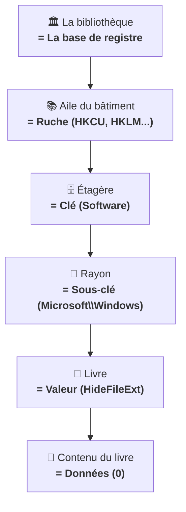

---
tags:
  - registre
  - débutant
  - structure
---

# Comprendre la structure

!!! abstract "Ce que vous allez apprendre"
    - Comment le registre est organise (avec une analogie simple)
    - Le role de chacune des 5 branches principales
    - La difference entre cles, sous-cles, valeurs et donnees
    - Comment lire un chemin de registre trouve dans un tutoriel

---

## Voyons d'abord un exemple concret

Ouvrez Regedit et collez ce chemin dans la barre d'adresse :

```
HKEY_CURRENT_USER\Software\Microsoft\Windows\CurrentVersion\Explorer\Advanced
```

Ce que vous voyez :

- **A gauche** : une arborescence de "dossiers" imbriques (`Software` > `Microsoft` > `Windows` > ...)
- **A droite** : une liste de reglages avec des noms comme `Hidden`, `HideFileExt`, `LaunchTo`

Voila, vous etes en train de regarder la **structure** du registre. Demystifions tout ca.

!!! quote "En resume"
    - En ouvrant Regedit, vous voyez une arborescence de "dossiers" a gauche (les cles) et une liste de reglages a droite (les valeurs).
    - C'est la **structure** du registre, que l'on va detailler dans ce chapitre.

---

## L'analogie de la bibliotheque

Pour bien comprendre l'organisation, imaginez une **bibliotheque municipale** :



| Dans la bibliotheque | Dans le registre | Exemple |
|:--------------------:|:----------------:|:-------:|
| Aile du batiment | Ruche (branche racine) | `HKEY_CURRENT_USER` |
| Etagere | Cle | `Software` |
| Rayon | Sous-cle | `Microsoft\Windows` |
| Livre | Valeur | `HideFileExt` |
| Contenu du livre | Donnees | `0` (= afficher les extensions) |

!!! quote "En resume"
    - Le registre est organise comme une bibliotheque : ruches (ailes), cles (etageres), sous-cles (rayons), valeurs (livres) et donnees (contenu).
    - Chaque element s'imbrique dans le precedent, formant une arborescence navigable.

---

## Les 5 branches en detail

### HKEY_CURRENT_USER (HKCU) -- Votre espace perso

C'est **votre** espace. Tout ce qui concerne **vos** preferences :

- :material-image: Votre fond d'ecran
- :material-weather-night: Votre theme (sombre ou clair)
- :material-rocket-launch: Vos programmes au demarrage
- :material-keyboard: La disposition de votre clavier
- :material-cog: Les reglages de vos logiciels

!!! tip "Bonne nouvelle"
    Modifier quelque chose dans `HKCU` n'affecte que **votre** compte. Les autres utilisateurs du meme PC ne sont pas impactes. C'est l'endroit le plus sur pour experimenter.

---

### HKEY_LOCAL_MACHINE (HKLM) -- Le tableau de bord du PC

Les reglages qui s'appliquent a **tout le PC**, quel que soit l'utilisateur connecte :

- :material-package-variant: Les logiciels installes pour tous les utilisateurs
- :material-chip: Les pilotes materiels
- :material-cog-transfer: Les services Windows
- :material-lan: La configuration reseau
- :material-shield-lock: Les parametres de securite

!!! warning "Droits administrateur requis"
    Modifier des cles dans `HKLM` necessite des droits administrateur. C'est normal : ces reglages affectent **tout le monde** sur le PC. Pensez-y comme au compteur electrique de l'immeuble : seul le gardien a la cle.

---

### HKEY_CLASSES_ROOT (HKCR) -- Qui ouvre quoi ?

Cette branche determine **quel programme ouvre quel type de fichier** :

| Extension | Programme associe |
|:---------:|:-----------------:|
| `.pdf` | Adobe Reader (ou un autre lecteur PDF) |
| `.jpg` | Visionneuse de photos |
| `.docx` | Microsoft Word |

Elle gere aussi les **menus contextuels** (le menu qui apparait quand vous faites un clic droit sur un fichier).

---

### HKEY_USERS (HKU) -- Tous les utilisateurs

Contient les reglages de **tous** les comptes utilisateurs actuellement connectes.

!!! note "En pratique"
    Vous utiliserez plutot `HKCU` qui pointe automatiquement vers **votre** profil. `HKU` est surtout utile aux administrateurs systeme qui gerent plusieurs comptes.

---

### HKEY_CURRENT_CONFIG (HKCC) -- Le materiel actuel

Contient le profil materiel en cours d'utilisation.

Rarement utilise directement. Passons.

!!! quote "En resume"
    - **HKCU** contient vos preferences personnelles (sans risque pour les autres utilisateurs), **HKLM** contient les reglages machine (necessite les droits admin).
    - **HKCR** gere les associations de fichiers, **HKU** regroupe tous les profils, et **HKCC** concerne le materiel actuel.

---

## Cles et sous-cles : les dossiers du registre

Les cles fonctionnent **exactement** comme des dossiers et sous-dossiers sur votre disque dur :

```
HKEY_CURRENT_USER                              ← Ruche (la racine)
└── Software                                   ← Clé
    └── Microsoft                              ← Sous-clé
        └── Windows                            ← Sous-sous-clé
            └── CurrentVersion                 ← Encore une sous-clé
                └── Explorer                   ← ...
                    └── Advanced               ← Et encore une !
```

Le **chemin complet** se lit de haut en bas, separe par des anti-slashs `\` :

```
HKEY_CURRENT_USER\Software\Microsoft\Windows\CurrentVersion\Explorer\Advanced
```

C'est comme un chemin de fichier (`C:\Users\Jean\Documents\Factures`), mais pour les reglages.

!!! quote "En resume"
    - Les cles fonctionnent comme des dossiers et sous-dossiers, imbriques les uns dans les autres.
    - Le chemin complet se lit de haut en bas, separe par des `\`, comme un chemin de fichier.

---

## Les valeurs et leurs donnees

Chaque cle peut contenir des **valeurs**. Une valeur, c'est un reglage individuel compose de trois elements :


### Exemple concret

!!! example "Essayez vous-meme"
    Naviguez vers `HKCU\Software\Microsoft\Windows\CurrentVersion\Explorer\Advanced` et reperez ces valeurs dans le panneau de droite :

| Nom | Type | Donnees | Ce que ca fait en vrai |
|-----|:----:|:-------:|------------------------|
| `Hidden` | REG_DWORD | `1` | Affiche les fichiers caches |
| `HideFileExt` | REG_DWORD | `0` | Affiche les extensions de fichiers |
| `LaunchTo` | REG_DWORD | `1` | Ouvre l'explorateur sur "Ce PC" |

Vous voyez ? Chaque reglage a un **nom**, un **type** et des **donnees**. Rien de sorcier.

### La valeur "(Par defaut)"

Chaque cle possede automatiquement une valeur speciale appelee **(Par defaut)**.

Elle est souvent vide et rarement utilisee directement. Ne vous en preoccupez pas pour l'instant : elle sert principalement pour les associations de fichiers dans `HKCR`.

!!! quote "En resume"
    - Chaque valeur est composee de trois elements : un **nom**, un **type** (REG_SZ, REG_DWORD...) et des **donnees**.
    - La valeur "(Par defaut)" est presente dans chaque cle mais rarement utilisee directement.

---

## Lire un chemin de registre (pas a pas)

Quand un tutoriel vous dit d'aller a :

```
HKEY_CURRENT_USER\Control Panel\Desktop
```

Voici comment le decomposer :

| Morceau | Signification | Action |
|---------|---------------|--------|
| `HKEY_CURRENT_USER` | La branche | Vos reglages personnels |
| `Control Panel` | La premiere cle | Cliquer pour ouvrir |
| `Desktop` | La sous-cle | C'est ici que se trouve le reglage |

**Deux facons d'y aller** :

1. **Clic par clic** : ouvrir chaque niveau dans le panneau de gauche
2. **Copier-coller** : coller le chemin entier dans la barre d'adresse (recommande !)

!!! tip "La methode express"
    Copiez toujours le chemin complet et collez-le dans la barre d'adresse. C'est plus rapide, et surtout vous ne risquez pas de vous tromper de cle.

!!! quote "En resume"
    - Un chemin de registre se decompose en branche (`HKEY_CURRENT_USER`), cle (`Control Panel`) et sous-cle (`Desktop`).
    - La methode la plus rapide et la plus sure : **copier-coller** le chemin complet dans la barre d'adresse de Regedit.

---

!!! quote "En resume"

    ```mermaid
    graph TD
        A["Base de registre"] --> B["HKCU<br>Vos réglages perso"]
        A --> C["HKLM<br>Réglages machine"]
        A --> D["HKCR<br>Associations fichiers"]
        A --> E["HKU<br>Tous les utilisateurs"]
        A --> F["HKCC<br>Matériel actuel"]
        B --> G["Clés = dossiers"]
        G --> H["Sous-clés = sous-dossiers"]
        H --> I["Valeurs = réglages"]
        I --> J["Données = la valeur effective"]
    ```

    - Le registre est organise en **5 branches** (ruches)
    - Vous utiliserez surtout **HKCU** (vos reglages) et **HKLM** (reglages machine)
    - Les **cles** sont comme des dossiers, les **valeurs** sont comme des fichiers
    - Chaque valeur a un **nom**, un **type** et des **donnees**
    - On navigue par **copier-coller** dans la barre d'adresse (c'est le plus simple !)

---

!!! tip "Pour aller plus loin"
    L'architecture interne des ruches (cellules, bacs, en-tetes binaires) est detaillee dans [La Bible — Architecture et structure](../bible-registre-windows/02-architecture.md).
