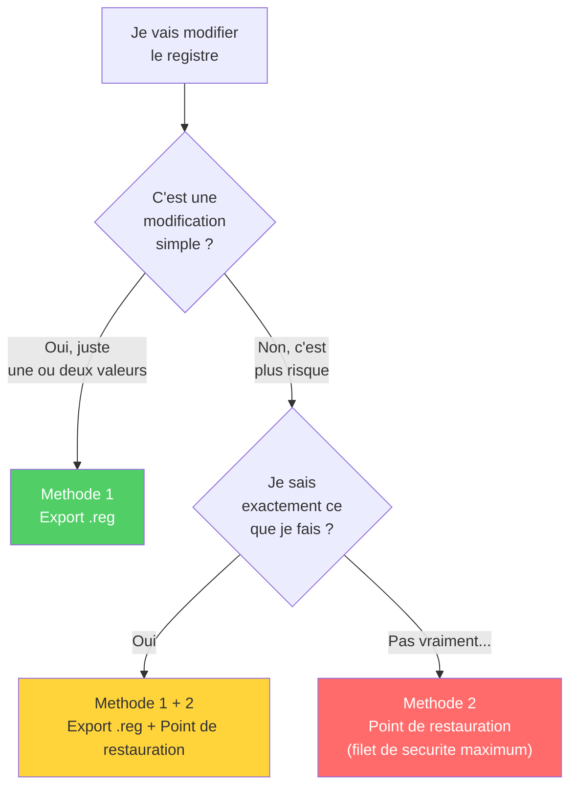

---
tags:
  - registre
  - débutant
  - sauvegarde
---

# Sauvegarder avant de toucher

!!! abstract "Ce que vous allez apprendre"
    - Pourquoi la sauvegarde est indispensable (spoiler : il n'y a pas de Ctrl+Z)
    - 3 methodes de sauvegarde, de la plus simple a la plus complete
    - Comment restaurer en cas de probleme
    - Quelle methode choisir selon la situation

---

## Pourquoi c'est indispensable

La base de registre n'a **pas de bouton "Annuler"**.

Quand vous modifiez ou supprimez quelque chose, c'est **immediat et definitif**. Pas de Ctrl+Z, pas de corbeille, pas de "Voulez-vous enregistrer les modifications ?".

La seule protection, c'est d'avoir fait une copie **avant**.

!!! danger "Sans sauvegarde, pas de filet de securite"
    Traitez la sauvegarde du registre comme la ceinture de securite en voiture : on la met **avant** de partir, pas apres l'accident.

!!! quote "En resume"
    - Le registre n'a **pas de Ctrl+Z** : toute modification est immediate et definitive.
    - La seule protection est d'avoir fait une copie **avant** de toucher a quoi que ce soit.

---

## Methode 1 : exporter une branche (la plus courante)

C'est la methode a utiliser **avant chaque modification**. Elle prend 10 secondes.

### Sauvegarder

!!! example "Pas a pas"
    1. Ouvrir Regedit
    2. Naviguer vers la cle que vous allez modifier
    3. **Clic droit** sur la cle > **Exporter**
    4. Choisir un emplacement facile a retrouver (le Bureau, par exemple)
    5. Donner un nom explicite, par exemple :
       ```
       sauvegarde_explorer_advanced_2026-04-02.reg
       ```
    6. Verifier que **Branche selectionnee** est bien coche
    7. Cliquer **Enregistrer**

    **Resultat** : un fichier `.reg` apparait sur votre Bureau. Il contient une copie complete de la cle et de toutes ses sous-cles et valeurs.

!!! tip "Nommez intelligemment"
    Incluez **la date** et **le nom de la cle** dans le nom du fichier. Dans 3 jours, vous ne vous souviendrez plus de ce que contient `backup.reg`.

    Bons exemples :

    - `sauvegarde_explorer_advanced_2026-04-02.reg`
    - `avant_modif_theme_sombre_2026-04-02.reg`

---

### Restaurer depuis un fichier .reg

Si quelque chose ne va pas apres votre modification :

1. **Double-cliquer** sur le fichier `.reg` sauvegarde
2. Cliquer **Oui** pour confirmer l'import
3. Les valeurs sont restaurees a leur etat d'origine

**Ce que vous voyez** :

```
┌──────────────────────────────────────────────────┐
│  Éditeur du Registre                             │
│                                                  │
│  Voulez-vous vraiment ajouter les informations   │
│  contenues dans [...].reg au Registre ?          │
│                                                  │
│              [ Oui ]  [ Non ]                    │
└──────────────────────────────────────────────────┘
```

Puis :

```
┌──────────────────────────────────────────────────┐
│  Les clés et valeurs contenues dans              │
│  [...].reg ont été ajoutées au Registre.         │
│                                                  │
│              [ OK ]                              │
└──────────────────────────────────────────────────┘
```

!!! info "Ce que ca restaure et ce que ca ne restaure pas"
    L'import d'un fichier `.reg` :

    - :material-check: **Remet les valeurs** modifiees a leur ancienne valeur
    - :material-check: **Recree les cles** que vous auriez supprimees
    - :material-close: **Ne supprime pas** les nouvelles cles ou valeurs ajoutees entre-temps

    Pour un retour **complet** : supprimez d'abord la cle modifiee, puis importez la sauvegarde.

!!! quote "En resume"
    - L'export `.reg` (clic droit > Exporter) est la methode la plus rapide : 10 secondes avant chaque modification.
    - Pour restaurer, il suffit de double-cliquer sur le fichier `.reg` sauvegarde ; cela remet les valeurs a leur etat d'origine.

---

## Methode 2 : creer un point de restauration systeme

Un point de restauration, c'est une **photo** de l'etat complet de votre systeme : le registre, les fichiers systeme, les pilotes... tout.

C'est la methode "ceinture ET bretelles" avant une operation risquee.

### Creer un point de restauration

!!! example "Pas a pas"
    1. Appuyer sur ++win++ et taper `point de restauration`
    2. Cliquer sur **Creer un point de restauration**
    3. Dans la fenetre qui s'ouvre, cliquer sur le bouton **Creer...**
    4. Donner un nom descriptif : `Avant modification registre`
    5. Cliquer **Creer** et attendre la confirmation

    ```title="Resultat attendu"

    ```

    ```
    ┌──────────────────────────────────────────────────┐
    │  Le point de restauration a ete cree.            │
    │                                                  │
    │              [ Fermer ]                          │
    └──────────────────────────────────────────────────┘
    ```

### Restaurer depuis un point de restauration

1. Appuyer sur ++win++ et taper `point de restauration`
2. Cliquer sur **Restauration du systeme...**
3. Selectionner le point de restauration souhaite
4. Suivre l'assistant (le PC redemarrera)

!!! warning "Plus radical qu'un simple .reg"
    Un point de restauration restaure bien plus que le registre. Il peut aussi **annuler des installations de logiciels** ou des mises a jour effectuees apres le point de restauration. Utilisez-le uniquement pour les cas serieux.

!!! quote "En resume"
    - Un point de restauration est une photo complete de l'etat du systeme (registre, fichiers systeme, pilotes).
    - C'est la methode "ceinture et bretelles" avant une operation risquee, mais elle restaure bien plus que le registre seul.

---

## Methode 3 : sauvegarder une ruche complete (avance)

Cette methode sauvegarde une **ruche entiere** au format binaire. Elle conserve les permissions et est plus adaptee aux sauvegardes completes.

!!! example "Pas a pas"
    1. Ouvrir une invite de commandes **en tant qu'administrateur** :
        - ++win+r++ > taper `cmd`
        - Appuyer sur ++ctrl+shift+enter++ (au lieu de juste Entree)
        - Confirmer l'autorisation
    2. Taper la commande suivante :

    ```batch
    reg save "HKLM\SOFTWARE" "%USERPROFILE%\Desktop\SOFTWARE_backup.hiv" /y
    ```

    ```title="Resultat attendu"

    ```

    ```
    L'operation a reussi.
    ```

    Un fichier `SOFTWARE_backup.hiv` apparait sur votre Bureau.

!!! note "Pour les techniciens"
    Cette methode est surtout utile quand un technicien vous demande une copie du registre, ou pour des sauvegardes automatisees. Pour une utilisation quotidienne, la methode 1 suffit largement.

!!! quote "En resume"
    - La commande `reg save` exporte une ruche entiere au format binaire, en conservant les permissions.
    - Cette methode est surtout utile pour les techniciens ou les sauvegardes automatisees.

---

## Quelle methode choisir ?



| Situation | Methode recommandee |
|-----------|:-------------------:|
| Modifier une cle precise | Methode 1 (export `.reg`) |
| Avant une operation risquee | Methode 2 (point de restauration) |
| Sauvegarde complete pour un technicien | Methode 3 (sauvegarde binaire) |
| Avant de suivre un tutoriel trouve en ligne | Methode 1 **+** Methode 2 par precaution |

!!! quote "En resume"
    - Pour une modification simple : l'export `.reg` (methode 1) suffit. Pour une operation risquee : ajoutez un point de restauration (methode 2).
    - En cas de doute, combinez les deux methodes pour un maximum de securite.

---

## Bonnes pratiques

!!! tip "Les 4 regles d'or de la sauvegarde"
    1. **Nommer clairement** les fichiers avec la date et la cle concernee
    2. **Conserver les sauvegardes** au moins quelques jours apres la modification
    3. **Tester** apres chaque modification (redemarrer si necessaire)
    4. **Une modification a la fois** : ne changez pas 10 choses d'un coup, sinon vous ne saurez pas laquelle pose probleme

!!! quote "En resume"
    - Les 4 regles d'or : nommer clairement les sauvegardes (avec la date), les conserver quelques jours, tester apres chaque modification, et ne changer qu'**une seule chose a la fois**.

---

!!! quote "En resume"
    - Le registre n'a **pas de Ctrl+Z** : sauvegardez toujours avant
    - **Methode 1** (export `.reg`) : rapide, pour les modifications simples, 10 secondes
    - **Methode 2** (point de restauration) : complete, pour les cas risques
    - **Methode 3** (sauvegarde binaire) : technique, pour les experts
    - Nommez vos sauvegardes avec **la date** et **la cle concernee**
    - En cas de probleme : double-cliquez sur le `.reg` pour restaurer
