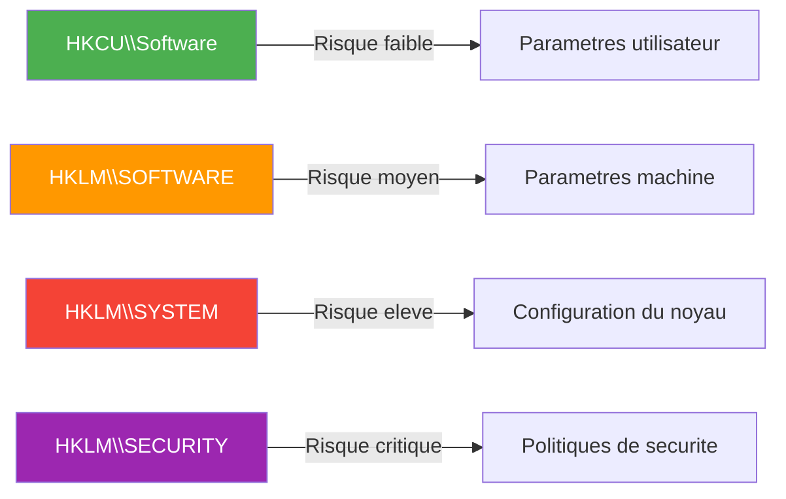

---
tags:
  - registre
  - débutant
  - tutoriels
  - sécurité
---

# Evaluer les tutoriels en ligne

!!! abstract "Ce que vous allez apprendre"
    - Reconnaitre un bon tutoriel d'un mauvais (ou dangereux)
    - Les drapeaux rouges qui doivent vous alerter immediatement
    - Les signes de qualite d'un tutoriel fiable
    - Comment verifier une modification avant de l'appliquer
    - La liste des sources de confiance
    - Que faire si vous avez suivi un mauvais tutoriel

---

## Le probleme

Internet regorge de tutoriels sur le registre Windows. Certains sont excellents. D'autres sont dangereux. Et le plus inquietant : les deux se ressemblent souvent.

!!! info "L'analogie"
    C'est comme les recettes de cuisine en ligne. Certaines vous donnent un plat delicieux. D'autres oublient de preciser que l'ingredient X est allergene, que la cuisson Y met le feu a votre cuisine, ou que la recette ne marche que pour un four specifique.

    La difference ? En cuisine, vous risquez un mauvais plat. Avec le registre, vous risquez un **PC inutilisable**.

!!! quote "En resume"
    - Internet regorge de tutoriels sur le registre, mais certains sont dangereux et ressemblent a des tutoriels fiables.
    - Une mauvaise modification peut rendre votre PC inutilisable : il faut apprendre a distinguer les bons tutoriels des mauvais.

---

## Les drapeaux rouges

### 1. Les promesses exagerees

!!! danger "Si ca semble trop beau pour etre vrai... c'est le cas"
    Ces titres doivent declencher votre alarme :

    - "Accelerez votre PC de 200 %"
    - "Debloquez les fonctions cachees de Windows"
    - "Ce truc que Microsoft ne veut pas que vous sachiez"
    - "Optimisation ultime en 1 minute"
    - "Boostez votre SSD / votre RAM / votre FPS"

Le registre ne contient pas de "bouton magique" cache. Les gains de performance via le registre sont **marginaux** (quelques millisecondes au mieux). Quiconque promet des gains spectaculaires vous ment ou ne sait pas de quoi il parle.

---

### 2. Aucune instruction de sauvegarde

Un tutoriel serieux **commence toujours** par une etape de sauvegarde :

| Tutoriel de qualite | Tutoriel suspect |
|:-------------------:|:----------------:|
| "Avant de commencer, creez un point de restauration" | Aucune mention de sauvegarde |
| "Exportez la cle avant de la modifier" | Passe directement a la modification |
| "Si quelque chose ne va pas, voici comment revenir en arriere" | Aucune marche arriere prevue |

!!! warning "Regle absolue"
    Si un tutoriel ne mentionne **jamais** la sauvegarde ou le point de restauration, fermez la page. L'auteur ne se soucie pas de votre securite.

---

### 3. Modification de ruches critiques sans explication

Les ruches `SYSTEM`, `SECURITY` et `SAM` sont le coeur du systeme d'exploitation. Toute modification dans ces zones est **a haut risque**.



Un bon tutoriel qui touche `HKLM\SYSTEM` explique **pourquoi** c'est necessaire et **quels sont les risques**. Un mauvais tutoriel dit juste "collez ce chemin et changez la valeur".

---

### 4. Desactivation de fonctions de securite

!!! danger "Drapeau rouge critique"
    Fuyez tout tutoriel qui vous demande de :

    - Desactiver Windows Defender ou Tamper Protection
    - Desactiver le pare-feu Windows
    - Desactiver le Controle de Compte Utilisateur (UAC)
    - Desactiver SmartScreen
    - Desactiver les mises a jour de securite
    - Autoriser l'execution de macros dans Office

    Ces modifications ouvrent des **failles de securite** dans votre systeme. Aucun gain de performance ne justifie de rendre votre PC vulnerable.

---

### 5. "Copiez ceci sans poser de questions"

Certains tutoriels (surtout les videos YouTube) montrent des manipulations sans **aucune explication** :

- "Allez la, changez ca, c'est tout"
- "Copiez ce fichier .reg et importez-le"
- "Faites confiance, ca marche"

!!! warning "Comprendre avant d'appliquer"
    Si vous ne comprenez pas ce qu'une modification fait, **ne l'appliquez pas**. Chaque valeur du registre a un effet specifique. Modifier a l'aveugle, c'est comme avaler un medicament inconnu parce que quelqu'un sur internet a dit que c'etait bien.

---

### 6. Aucune mention de la version de Windows

Le registre change d'une version a l'autre. Une cle qui existe dans Windows 10 peut ne pas exister dans Windows 11, ou avoir un comportement different.

| Situation | Risque |
|-----------|--------|
| Le tutoriel date de 2015 (Windows 7/8) | Eleve -- beaucoup de cles ont change |
| Le tutoriel ne mentionne aucune version | Moyen -- impossible de verifier |
| Le tutoriel precise "Teste sur Windows 11 23H2" | Faible -- vous pouvez verifier |

!!! quote "En resume"
    - Les 6 drapeaux rouges : promesses exagerees, aucune instruction de sauvegarde, modification de ruches critiques sans explication, desactivation de fonctions de securite, "copiez sans comprendre", et aucune mention de version Windows.
    - Si un tutoriel presente au moins deux de ces signes, cherchez un autre tutoriel.

---

## Les signes de qualite

### Un bon tutoriel...

| Critere | Exemple |
|---------|---------|
| Explique ce que fait chaque modification | "Cette valeur controle le delai d'affichage des sous-menus" |
| Precise la version de Windows | "Teste sur Windows 11 22H2 et 23H2" |
| Inclut une etape de sauvegarde | "Exportez la cle d'abord" |
| Donne la valeur par defaut | "La valeur d'origine est 400, notez-la" |
| Explique comment revenir en arriere | "Pour annuler, remettez la valeur a 400" |
| Cite ses sources | "Documente sur Microsoft Learn : [lien]" |
| Mentionne les effets secondaires | "Attention : cela desactive aussi X" |

!!! tip "Le test en 10 secondes"
    Avant de suivre un tutoriel, posez-vous ces 3 questions :

    1. Est-ce que l'auteur explique **pourquoi** ca marche ?
    2. Est-ce que l'auteur mentionne **comment revenir en arriere** ?
    3. Est-ce que l'auteur precise **quelle version de Windows** est concernee ?

    Si la reponse est non a au moins 2 de ces questions, cherchez un autre tutoriel.

!!! quote "En resume"
    - Un bon tutoriel explique ce que fait chaque modification, precise la version de Windows, inclut une etape de sauvegarde et donne la valeur par defaut.
    - Le test en 10 secondes : l'auteur explique-t-il le **pourquoi**, le **retour en arriere** et la **version de Windows** ?

---

## Verifier avant d'appliquer

### Etape 1 : verifier que le chemin existe

Avant de modifier une cle, verifiez qu'elle existe sur **votre** PC :

```powershell
# Check if a registry key exists
reg query "HKCU\Software\Microsoft\Windows\CurrentVersion\Explorer\Advanced" /v HideFileExt
```

```title="Resultat attendu"
HKEY_CURRENT_USER\Software\Microsoft\Windows\CurrentVersion\Explorer\Advanced
    HideFileExt    REG_DWORD    0x1
```

Sortie si la cle **n'existe pas** :

```
ERREUR : le nom ou la valeur specifie est introuvable.
```

!!! tip "Si la cle n'existe pas"
    Ce n'est pas forcement un probleme. Certains tutoriels demandent de **creer** une nouvelle valeur. Mais si le tutoriel dit "modifiez cette valeur" et qu'elle n'existe pas, c'est un signe que le tutoriel n'est peut-etre pas adapte a votre version de Windows.

---

### Etape 2 : chercher la cle sur Google

Avant de modifier une cle, recherchez-la sur Google :

```
"HideFileExt" registry site:microsoft.com
```

ou

```
"HideFileExt" registry Windows 11
```

Si vous trouvez la cle sur Microsoft Learn ou dans un article de support Microsoft, c'est bon signe. Si vous ne trouvez la cle que sur des sites obscurs, mefiance.

---

### Etape 3 : verifier un fichier .reg avant import

!!! danger "Ne double-cliquez JAMAIS sur un fichier .reg sans le lire d'abord"
    1. Clic droit sur le fichier `.reg`
    2. **Ouvrir avec** > **Bloc-notes**
    3. Lisez chaque ligne

Voici ce que vous devriez verifier :

```ini
Windows Registry Editor Version 5.00

; Example: a suspicious .reg file
[HKEY_LOCAL_MACHINE\SOFTWARE\Policies\Microsoft\Windows Defender]
"DisableAntiSpyware"=dword:00000001

[HKEY_LOCAL_MACHINE\SYSTEM\CurrentControlSet\Services\WinDefend]
"Start"=dword:00000004
```

!!! danger "Ce fichier est DANGEREUX"
    - `DisableAntiSpyware` = `1` desactive Windows Defender
    - `Start` = `4` empeche le service Defender de demarrer

    Un fichier `.reg` "d'optimisation" qui desactive votre antivirus est **malveillant**.

Comparez avec un fichier `.reg` inoffensif :

```ini
Windows Registry Editor Version 5.00

; Show file extensions
[HKEY_CURRENT_USER\Software\Microsoft\Windows\CurrentVersion\Explorer\Advanced]
"HideFileExt"=dword:00000000
```

Ce fichier ne modifie qu'un parametre d'affichage dans l'espace utilisateur (`HKCU`). Aucun risque.

---

### Etape 4 : creer un point de restauration

Avant d'appliquer **toute** modification trouvee en ligne :

1. Tapez "point de restauration" dans la barre de recherche Windows
2. Cliquez sur **Creer un point de restauration**
3. Selectionnez votre disque systeme > **Creer**
4. Donnez un nom descriptif : "Avant modification registre - date"
5. Attendez la confirmation

!!! tip "Ca prend 30 secondes et ca peut sauver votre PC"
    Un point de restauration, c'est comme une photo de votre systeme a un instant T. Si quelque chose ne va pas, vous revenez a cette photo.

!!! quote "En resume"
    - Avant d'appliquer une modification : verifiez que la cle existe sur votre PC, recherchez-la sur Google/Microsoft Learn, lisez les fichiers `.reg` avec le Bloc-notes et creez un point de restauration.
    - Ces 4 etapes prennent quelques minutes et peuvent eviter des heures de depannage.

---

## Sources de confiance

### Tier 1 : sources officielles

| Source | URL | Pourquoi c'est fiable |
|--------|-----|----------------------|
| Microsoft Learn | `learn.microsoft.com` | Documentation officielle de Microsoft |
| Microsoft Support | `support.microsoft.com` | Articles de support et KB |
| Sysinternals | `learn.microsoft.com/sysinternals` | Outils et documentation de Mark Russinovich |

---

### Tier 2 : sources communautaires reconnues

| Source | URL | Specialite |
|--------|-----|------------|
| Bleeping Computer | `bleepingcomputer.com` | Tutoriels Windows, securite |
| How-To Geek | `howtogeek.com` | Tutoriels accessibles et verifies |
| Windows Central | `windowscentral.com` | Actualite et guides Windows |
| Neowin | `neowin.net` | Actualite technique |
| NirSoft | `nirsoft.net` | Outils utilitaires fiables |
| Winaero | `winaero.com` | Tweaks Windows documentes |

---

### Tier 3 : a utiliser avec precaution

| Source | Precautions |
|--------|-------------|
| Forums generiques (Reddit, Stack Overflow) | Verifiez les votes et les reponses acceptees |
| Videos YouTube | Verifiez les commentaires, la date, et la chaine |
| Blogs personnels | Croisez avec une deuxieme source |

!!! warning "YouTube : la prudence absolue"
    Les videos YouTube sont le format le plus risque pour les tutoriels de registre :

    - Impossible de copier-coller pour verifier les chemins
    - Les erreurs de frappe sont invisibles dans une video
    - Pas de mise a jour : une video obsolete reste en ligne des annees
    - Les commentaires sont souvent desactives

    Si vous suivez une video YouTube, **verifiez chaque chemin de cle** manuellement dans Regedit avant de modifier quoi que ce soit.

!!! quote "En resume"
    - Les sources les plus fiables sont Microsoft Learn, Microsoft Support et Sysinternals (Tier 1), suivies de sites reconnus comme Bleeping Computer et How-To Geek (Tier 2).
    - Les videos YouTube sont le format le plus risque : impossible de copier-coller, pas de mise a jour, erreurs invisibles.

---

## La regle d'or : "If it sounds too good to be true..."

!!! danger "La regle ultime"
    **Si une modification du registre promet des gains spectaculaires, c'est faux.**

    Le registre est une base de donnees de configuration. Changer une valeur, c'est comme tourner un bouton sur un tableau de bord. Ca peut affiner un reglage, mais ca ne peut pas transformer une voiture de 50 chevaux en Formule 1.

    Les vrais gains de performance viennent de :

    - Plus de RAM
    - Un SSD au lieu d'un disque dur
    - Une reinstallation propre de Windows
    - La desinstallation des logiciels inutiles

    Pas d'une valeur magique dans `HKLM\SYSTEM`.

!!! quote "En resume"
    - Si une modification du registre promet des gains spectaculaires, c'est faux. Le registre peut affiner un reglage, pas transformer les performances.
    - Les vrais gains viennent de plus de RAM, d'un SSD, d'une reinstallation propre ou de la desinstallation de logiciels inutiles.

---

## Que faire si vous avez suivi un mauvais tutoriel

### Situation 1 : le PC fonctionne encore

!!! tip "Vous avez de la chance. Agissez vite."
    1. **Restaurez un point de restauration** si vous en avez cree un
    2. Sinon, **refaites les modifications a l'envers** (remettez les valeurs d'origine)
    3. Si vous avez exporte les cles avant, **importez le fichier .reg de sauvegarde**
    4. **Redemarrez** et verifiez que tout fonctionne

---

### Situation 2 : le PC fonctionne mais quelque chose est bizarre

Des symptomes comme :

- Windows Defender est desactive et refuse de se reactiver
- Les mises a jour ne fonctionnent plus
- Le PC est plus lent qu'avant

**Solution** :

1. Ouvrez PowerShell en administrateur
2. Lancez un scan d'integrite :

```powershell
# Check system integrity
sfc /scannow
```

```title="Resultat attendu"
Le programme de protection des ressources Windows a trouve des fichiers
endommages et les a repares avec succes.
```

3. Si `sfc` ne suffit pas :

```powershell
# Repair the Windows image
DISM /Online /Cleanup-Image /RestoreHealth
```

```title="Resultat attendu"
L'outil analyse l'image Windows et lance la reparation. L'operation peut prendre plusieurs minutes.
```

---

### Situation 3 : le PC ne demarre plus normalement

1. Demarrez en **mode sans echec** (maintenez ++shift++ pendant Redemarrer)
2. Utilisez la **restauration du systeme** :
    - Depannage > Options avancees > Restauration du systeme
3. Si aucun point de restauration n'existe :
    - Depannage > Options avancees > Invite de commandes
    - Tentez de restaurer manuellement les fichiers `.reg` de sauvegarde

!!! danger "En dernier recours"
    Si rien ne fonctionne, la **reinitialisation de Windows** (avec conservation des fichiers) est la solution ultime. Vous perdrez vos applications installees mais pas vos documents.

    Depannage > Reinitialiser ce PC > Conserver mes fichiers

!!! quote "En resume"
    - Si le PC fonctionne encore : restaurez un point de restauration ou importez la sauvegarde `.reg`. Si le PC a des problemes : lancez `sfc /scannow` et `DISM /RestoreHealth`.
    - Si le PC ne demarre plus : utilisez le mode sans echec et la restauration du systeme. En dernier recours, reinitialiser Windows en conservant les fichiers.

---

## Comment tester en securite

La meilleure facon de tester un tutoriel sans risquer votre PC principal :

### Option 1 : machine virtuelle

Installez une machine virtuelle avec VirtualBox ou Hyper-V. Testez les modifications dans la VM d'abord. Si tout va bien, appliquez sur votre vrai PC.

### Option 2 : point de restauration + une seule modification a la fois

1. Creez un point de restauration
2. Appliquez **une seule** modification
3. Testez pendant quelques heures
4. Si tout va bien, passez a la suivante
5. Si ca pose probleme, restaurez le point

!!! tip "Patience = securite"
    N'appliquez jamais 10 modifications d'un coup. Si quelque chose casse, vous ne saurez pas laquelle est responsable. Une a la fois, toujours.

!!! quote "En resume"
    - La methode la plus sure pour tester un tutoriel est d'utiliser une **machine virtuelle** (VirtualBox ou Hyper-V).
    - Sinon, creez un point de restauration et appliquez **une seule modification a la fois**, en testant entre chaque changement.

---

!!! quote "En resume"

    **Drapeaux rouges** (fuyez) :

    - Promesses de gains spectaculaires
    - Aucune instruction de sauvegarde
    - Desactivation de fonctions de securite
    - "Copiez sans comprendre"
    - Aucune mention de version Windows

    **Signes de qualite** (fiable) :

    - Explication de chaque modification
    - Etape de sauvegarde incluse
    - Version de Windows precisee
    - Valeur par defaut mentionnee
    - Methode pour revenir en arriere

    **Avant d'appliquer** :

    - Verifiez que la cle existe sur votre PC
    - Recherchez la cle sur Google/Microsoft Learn
    - Lisez les fichiers `.reg` avec le Bloc-notes
    - Creez un point de restauration
    - Testez une modification a la fois
