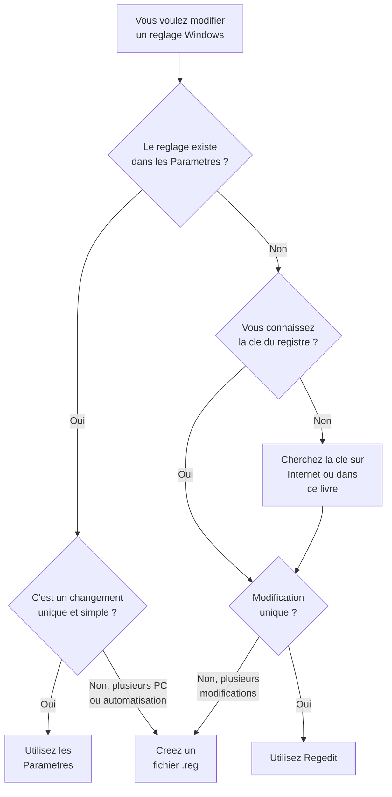

---
tags:
  - registre
  - débutant
  - paramètres
  - correspondances
  - Regedit
---

# Parametres Windows vs Registre

!!! abstract "Ce que vous allez apprendre"
    - Pourquoi l'application Parametres est juste une facade devant le registre
    - Plus de 20 correspondances entre les Parametres et les cles du registre
    - Quand utiliser les Parametres, quand utiliser Regedit, quand utiliser un fichier `.reg`
    - Ou l'application Parametres ecrit dans le registre
    - Comment verifier qu'un reglage des Parametres correspond bien a une valeur du registre

!!! warning "Rappel essentiel"
    Avant **chaque** modification dans Regedit, exportez la cle concernee (clic droit > Exporter). Meme si vous avez vu le reglage dans les Parametres, toucher au registre directement reste une operation sans Ctrl+Z. Relisez le chapitre 5 si besoin.

---

## L'application Parametres : une interface, le registre derriere

### L'analogie du restaurant

Imaginez un **restaurant**. Quand vous vous installez a table, vous voyez une salle agreable, un menu clair, un serveur souriant. Vous commandez, et votre plat arrive tout pret.

Mais derriere la porte battante, il y a la **cuisine**. C'est la que le vrai travail se fait : les ingredients sont coupes, les casseroles chauffent, les recettes sont suivies a la lettre. La salle du restaurant, c'est juste la **facade** qui rend l'experience agreable.

L'application **Parametres** de Windows, c'est la salle du restaurant. Elle est jolie, bien organisee, facile a utiliser. Mais quand vous basculez un interrupteur ou changez une option, Windows ne fait qu'une chose : il va dans la **cuisine** (le registre) et modifie une valeur.

!!! info "Ce que ca veut dire concretement"
    Quand vous activez le mode sombre dans Parametres > Personnalisation > Couleurs, Windows ecrit la valeur `0` dans `AppsUseLightTheme` sous la cle `HKCU\Software\Microsoft\Windows\CurrentVersion\Themes\Personalize`.

    L'interrupteur dans les Parametres et la valeur dans le registre, c'est **la meme chose vue de deux cotes differents**.

### Les Parametres ne couvrent pas tout

Le menu du restaurant ne propose que les plats du jour. Mais la cuisine peut preparer bien d'autres choses. De la meme maniere, l'application Parametres ne montre qu'une **fraction** de ce que le registre permet de configurer.

Certains reglages n'existent **que** dans le registre. Pas d'interrupteur, pas de case a cocher, pas de menu deroulant. La seule facon de les modifier, c'est d'aller directement dans la cuisine avec Regedit.

!!! quote "En resume"
    - L'application Parametres est une **facade** : chaque interrupteur ou option ecrit une valeur dans le registre en coulisses.
    - Certains reglages n'existent **que** dans le registre et ne sont pas accessibles depuis les Parametres.

---

## Correspondances : Parametres → Registre

Voici un tableau de reference. Pour chaque reglage des Parametres, vous trouverez la cle et la valeur correspondante dans le registre.

!!! tip "Comment utiliser ce tableau"
    - **Chemin Parametres** : ou trouver le reglage dans l'application Parametres (++win+i++)
    - **Cle du registre** : le chemin a coller dans la barre d'adresse de Regedit
    - **Valeur** : le nom de la valeur a modifier dans le panneau de droite
    - **Notes** : les donnees attendues et leur signification

### Systeme

| Chemin Parametres | Cle du registre | Valeur | Notes |
|-------------------|-----------------|--------|-------|
| Systeme > Ecran > Eclairage nocturne | `HKCU\Software\Microsoft\Windows\CurrentVersion\CloudStore\Store\DefaultAccount\Current\default$windows.data.bluelightreduction.bluelightreductionstate` | *(donnees binaires)* | Structure binaire complexe ; preferer les Parametres pour ce reglage |
| Systeme > Notifications | `HKCU\Software\Microsoft\Windows\CurrentVersion\Notifications\Settings` | *(sous-cles par appli)* | Chaque application a sa propre sous-cle avec `Enabled` = `0` ou `1` |
| Systeme > Alimentation | `HKLM\SYSTEM\CurrentControlSet\Control\Power` | `CsEnabled` | `1` = veille moderne activee, `0` = desactivee |
| Systeme > A propos > Nom du PC | `HKLM\SYSTEM\CurrentControlSet\Control\ComputerName\ActiveComputerName` | `ComputerName` | Chaine de texte contenant le nom de l'ordinateur |

### Personnalisation

| Chemin Parametres | Cle du registre | Valeur | Notes |
|-------------------|-----------------|--------|-------|
| Personnalisation > Couleurs > Mode sombre (applis) | `HKCU\Software\Microsoft\Windows\CurrentVersion\Themes\Personalize` | `AppsUseLightTheme` | `0` = sombre, `1` = clair |
| Personnalisation > Couleurs > Mode sombre (systeme) | `HKCU\Software\Microsoft\Windows\CurrentVersion\Themes\Personalize` | `SystemUsesLightTheme` | `0` = sombre, `1` = clair |
| Personnalisation > Ecran de verrouillage | `HKLM\SOFTWARE\Policies\Microsoft\Windows\Personalization` | `NoLockScreen` | `1` = desactive l'ecran de verrouillage (GPO) |
| Personnalisation > Barre des taches > Rechercher | `HKCU\Software\Microsoft\Windows\CurrentVersion\Search` | `SearchboxTaskbarMode` | `0` = masque, `1` = icone, `2` = barre |

### Confidentialite et securite

| Chemin Parametres | Cle du registre | Valeur | Notes |
|-------------------|-----------------|--------|-------|
| Confidentialite > Generale > Identifiant publicitaire | `HKCU\Software\Microsoft\Windows\CurrentVersion\AdvertisingInfo` | `Enabled` | `0` = desactive, `1` = active |
| Confidentialite > Historique d'activites | `HKLM\SOFTWARE\Policies\Microsoft\Windows\System` | `PublishUserActivities` | `0` = desactive l'envoi de l'historique |
| Confidentialite > Diagnostics et commentaires | `HKLM\SOFTWARE\Policies\Microsoft\Windows\DataCollection` | `AllowTelemetry` | `0` = securite uniquement, `1` = de base, `3` = complet |

!!! note "Edition Windows"
    `AllowTelemetry = 0` n'est pris en charge que sur les editions **Enterprise** et **Education**. Sur Home et Pro, la valeur minimale effective reste `1`.

### Applications

| Chemin Parametres | Cle du registre | Valeur | Notes |
|-------------------|-----------------|--------|-------|
| Applications > Applications par defaut | `HKCU\Software\Microsoft\Windows\CurrentVersion\Explorer\FileExts` | *(sous-cles par extension)* | Chaque extension (`.txt`, `.pdf`...) a sa propre sous-cle `UserChoice` |
| Applications > Demarrage | `HKCU\Software\Microsoft\Windows\CurrentVersion\Run` | *(une valeur par appli)* | Le nom de la valeur est libre, la donnee est le chemin de l'executable |

### Reseau et Internet

| Chemin Parametres | Cle du registre | Valeur | Notes |
|-------------------|-----------------|--------|-------|
| Reseau > Proxy | `HKCU\Software\Microsoft\Windows\CurrentVersion\Internet Settings` | `ProxyEnable` | `0` = pas de proxy, `1` = proxy active |
| Reseau > Proxy > Adresse | `HKCU\Software\Microsoft\Windows\CurrentVersion\Internet Settings` | `ProxyServer` | Chaine au format `adresse:port` |

### Heure et langue

| Chemin Parametres | Cle du registre | Valeur | Notes |
|-------------------|-----------------|--------|-------|
| Heure et langue > Region | `HKCU\Control Panel\International` | `LocaleName` | Code region comme `fr-FR`, `en-US` |
| Heure et langue > Region > Format de date | `HKCU\Control Panel\International` | `sShortDate` | Format comme `dd/MM/yyyy` |

### Comptes

| Chemin Parametres | Cle du registre | Valeur | Notes |
|-------------------|-----------------|--------|-------|
| Comptes > Options de connexion > Exiger la connexion | `HKLM\SOFTWARE\Microsoft\Windows\CurrentVersion\Policies\System` | `DisableAutomaticRestartSignOn` | `1` = desactive la connexion automatique apres une mise a jour |

### Mise a jour et securite

| Chemin Parametres | Cle du registre | Valeur | Notes |
|-------------------|-----------------|--------|-------|
| Mise a jour > Windows Update | `HKLM\SOFTWARE\Policies\Microsoft\Windows\WindowsUpdate\AU` | `NoAutoUpdate` | `1` = desactive les mises a jour automatiques |
| Mise a jour > Optimisation de la livraison | `HKLM\SOFTWARE\Policies\Microsoft\Windows\DeliveryOptimization` | `DODownloadMode` | `0` = desactive, `1` = LAN uniquement |

### Jeux

| Chemin Parametres | Cle du registre | Valeur | Notes |
|-------------------|-----------------|--------|-------|
| Jeux > Mode jeu | `HKCU\Software\Microsoft\GameBar` | `AllowAutoGameMode` | `0` = desactive, `1` = active |
| Jeux > Game Bar | `HKCU\Software\Microsoft\GameBar` | `UseNexusForGameBarEnabled` | `0` = desactive la barre de jeu |

### Accessibilite

| Chemin Parametres | Cle du registre | Valeur | Notes |
|-------------------|-----------------|--------|-------|
| Accessibilite > Pointeur de souris | `HKCU\Control Panel\Cursors` | *(plusieurs valeurs)* | `Arrow`, `Hand`, `Wait`... chacune contient un chemin vers un fichier `.cur` |
| Accessibilite > Taille du texte | `HKCU\Control Panel\Desktop` | `LogPixels` | Valeur DWORD, `96` = 100%, `120` = 125% |

### Peripheriques

| Chemin Parametres | Cle du registre | Valeur | Notes |
|-------------------|-----------------|--------|-------|
| Bluetooth et appareils > Lecture automatique | `HKCU\Software\Microsoft\Windows\CurrentVersion\Explorer\AutoplayHandlers` | `DisableAutoplay` | `0` = active, `1` = desactive |

!!! quote "En resume"
    - Plus de 20 correspondances sont documentees : mode sombre, notifications, proxy, identifiant publicitaire, programmes au demarrage, mode jeu, et bien d'autres.
    - Pour chaque reglage, le chemin dans les Parametres et la cle du registre correspondante sont fournis.

---

## Quand utiliser Parametres vs Regedit

Ce n'est pas une competition entre les deux outils. Chacun a son terrain de jeu.

### Utilisez les Parametres quand...

- :material-check: L'option **existe** dans l'interface des Parametres
- :material-check: Vous voulez changer **un seul reglage** rapidement
- :material-check: Vous n'etes pas sur de la valeur exacte a ecrire dans le registre
- :material-check: Vous debutez et voulez rester dans une zone de confort

### Utilisez Regedit quand...

- :material-wrench: L'option **n'existe pas** dans les Parametres
- :material-wrench: Vous voulez un controle **plus precis** (valeurs numeriques exactes)
- :material-wrench: Vous devez verifier ce qu'un reglage a **reellement** ecrit
- :material-wrench: Le reglage est **cache** ou reserve aux administrateurs

### Utilisez un fichier .reg quand...

- :material-file-document: Vous voulez **partager** une modification avec quelqu'un
- :material-file-document: Vous voulez **appliquer plusieurs modifications** en un seul clic
- :material-file-document: Vous voulez **sauvegarder** vos reglages pour les re-appliquer apres une reinstallation
- :material-file-document: Vous gerez **plusieurs PC** et voulez la meme configuration partout

### Arbre de decision



!!! quote "En resume"
    - Utilisez les **Parametres** pour la simplicite (un reglage rapide), **Regedit** pour le controle (reglages caches ou precis), et les **fichiers `.reg`** pour l'automatisation (plusieurs PC ou reinstallation).
    - L'arbre de decision : si le reglage existe dans les Parametres et que c'est un changement unique, utilisez les Parametres. Sinon, Regedit ou un fichier `.reg`.

---

## L'application Parametres ecrit ou ?

Si vous etes curieux de savoir ou atterrissent vos reglages, voici les grandes zones du registre utilisees par les Parametres.

### Les reglages "anciens" (herites du Panneau de configuration)

Le Panneau de configuration existait bien avant l'application Parametres. Ses reglages sont stockes dans des endroits "classiques" du registre :

| Zone | Cle du registre | Exemples |
|------|-----------------|----------|
| Affichage, souris, clavier | `HKCU\Control Panel\` | Couleurs, pointeurs, repetition des touches |
| Parametres regionaux | `HKCU\Control Panel\International` | Format de date, separateur decimal |
| Reseau et Internet | `HKCU\Software\Microsoft\Windows\CurrentVersion\Internet Settings` | Proxy, securite |
| Logiciels installes | `HKLM\SOFTWARE\Microsoft\Windows\CurrentVersion\Uninstall` | Liste des programmes |

### Les reglages "modernes" (application Parametres)

L'application Parametres utilise des cles plus recentes, souvent sous `CurrentVersion` :

| Zone | Cle du registre | Exemples |
|------|-----------------|----------|
| Themes et personnalisation | `HKCU\Software\Microsoft\Windows\CurrentVersion\Themes\` | Mode sombre, couleur d'accentuation |
| Recherche | `HKCU\Software\Microsoft\Windows\CurrentVersion\Search` | Barre de recherche, indexation |
| Jeux | `HKCU\Software\Microsoft\GameBar` | Mode jeu, barre de jeu |
| Notifications | `HKCU\Software\Microsoft\Windows\CurrentVersion\Notifications\` | Reglages par application |
| Demarrage des applis | `HKCU\Software\Microsoft\Windows\CurrentVersion\Run` | Programmes au demarrage |

### Les reglages de strategie (via GPO ou administrateur)

Certains reglages des Parametres sont en fait controles par des **strategies de groupe** (GPO). Ils sont stockes sous les cles `Policies` :

| Zone | Cle du registre | Exemples |
|------|-----------------|----------|
| Windows Update | `HKLM\SOFTWARE\Policies\Microsoft\Windows\WindowsUpdate` | Reports de mises a jour |
| Telemetrie | `HKLM\SOFTWARE\Policies\Microsoft\Windows\DataCollection` | Niveau de diagnostic |
| Ecran de verrouillage | `HKLM\SOFTWARE\Policies\Microsoft\Windows\Personalization` | Image, publicites |

### Certains reglages vivent dans deux endroits

Pour des raisons de compatibilite, certains reglages existent **a la fois** dans une cle ancienne et une cle moderne. Windows verifie les deux, avec generalement une priorite pour la cle de strategie (GPO) sur la cle utilisateur.

!!! example "Exemple : les mises a jour automatiques"
    - **Cle utilisateur** : `HKCU\Software\Microsoft\Windows\CurrentVersion\WindowsUpdate` — vos preferences personnelles
    - **Cle GPO** : `HKLM\SOFTWARE\Policies\Microsoft\Windows\WindowsUpdate\AU` — la politique imposee par l'administrateur

    Si la cle GPO existe, elle **ecrase** la cle utilisateur. C'est comme ca qu'un administrateur d'entreprise peut imposer les mises a jour meme si vous les avez desactivees dans vos Parametres.

!!! quote "En resume"
    - Les reglages des Parametres sont stockes dans trois zones : les cles classiques (`Control Panel`), les cles modernes (`CurrentVersion`), et les cles de strategie (`Policies`).
    - Certains reglages existent a deux endroits ; la cle `Policies` (GPO) a toujours **priorite** sur la cle utilisateur.

---

## Exercice pratique

!!! example "Essayez vous-meme"

    ### Etape 1 : Verifier le mode sombre dans le registre

    1. Ouvrez les **Parametres** (++win+i++) > **Personnalisation** > **Couleurs**
    2. Notez si le mode sombre est active ou non pour les applications
    3. Ouvrez **Regedit** (++win+r++, tapez `regedit`, ++enter++)
    4. Collez ce chemin dans la barre d'adresse :
       ```
       HKEY_CURRENT_USER\Software\Microsoft\Windows\CurrentVersion\Themes\Personalize
       ```
    5. Regardez la valeur `AppsUseLightTheme` dans le panneau de droite

    ```title="Resultat attendu"

    - Si le mode sombre est active dans les Parametres → la valeur est `0`

    ```
    - Si le mode clair est active → la valeur est `1`

    ---

    ### Etape 2 : Trouver un reglage cache

    Certains reglages n'apparaissent pas dans les Parametres. Essayez celui-ci :

    1. Dans Regedit, naviguez vers :
       ```
       HKEY_CURRENT_USER\Software\Microsoft\Windows\CurrentVersion\Explorer\Advanced
       ```
    2. Cherchez la valeur `TaskbarSi` (taille de la barre des taches, Windows 11 uniquement)
    3. Si elle n'existe pas, creez-la :
        - Clic droit dans le panneau de droite > **Nouveau** > **Valeur DWORD (32 bits)**
        - Nommez-la `TaskbarSi`
        - Double-cliquez et mettez `0` (petite), `1` (moyenne, defaut) ou `2` (grande)
    4. Redemarrez l'Explorateur ou deconnectez-vous pour voir le changement

    Ce reglage a longtemps ete un bon exemple de parametre expose uniquement par le registre.

!!! warning "Windows 11 23H2 et versions ulterieures"
    `TaskbarSi` est devenu **obsolete** sur les versions recentes de Windows 11, notamment 23H2 et suivantes. Selon la build, la valeur peut etre ignoree completement. Gardez cet exercice comme illustration historique du registre, pas comme un reglage fiable en production.

    ---

    ### Etape 3 : Modifier le registre, verifier dans les Parametres

    1. Dans Regedit, naviguez vers :
       ```
       HKEY_CURRENT_USER\Software\Microsoft\Windows\CurrentVersion\Themes\Personalize
       ```
    2. Double-cliquez sur `AppsUseLightTheme`
    3. Changez la valeur : si c'est `0`, mettez `1` (ou inversement)
    4. Cliquez **OK**
    5. Ouvrez les **Parametres** > **Personnalisation** > **Couleurs**

    ```title="Resultat attendu"

    le mode d'application a change ! Le registre et les Parametres sont synchronises. Modifier l'un modifie l'autre.

    ```

!!! quote "En resume"
    - L'exercice montre que le registre et les Parametres sont **synchronises** : modifier l'un modifie l'autre instantanement.
    - Certains reglages avances ont longtemps existe uniquement dans le registre, mais leur prise en charge peut disparaitre au fil des versions.

---

!!! quote "En resume"
    L'application Parametres est une **facade agreable** devant le registre. Chaque interrupteur, chaque case a cocher, chaque menu deroulant correspond a une valeur dans une cle du registre. Utilisez les Parametres pour la simplicite, Regedit pour le controle, et les fichiers `.reg` pour l'automatisation. Et quand un reglage n'apparait pas dans les Parametres, le registre est souvent la seule porte d'entree.
